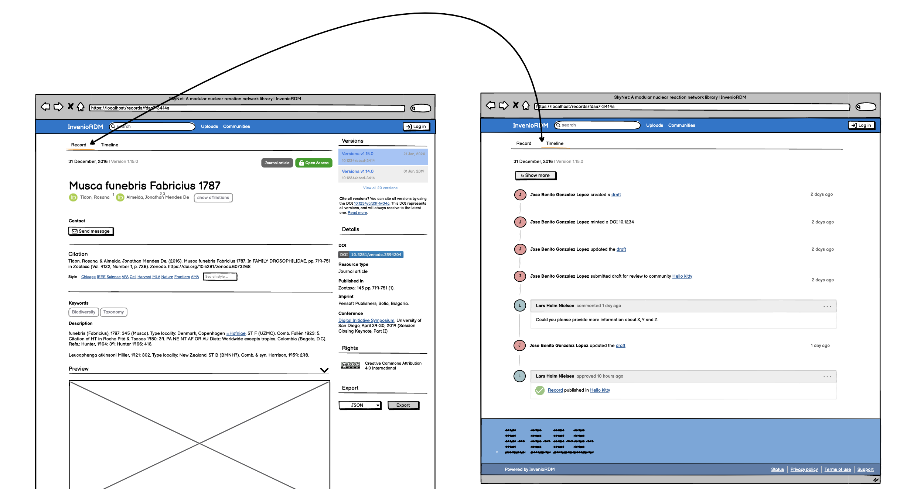
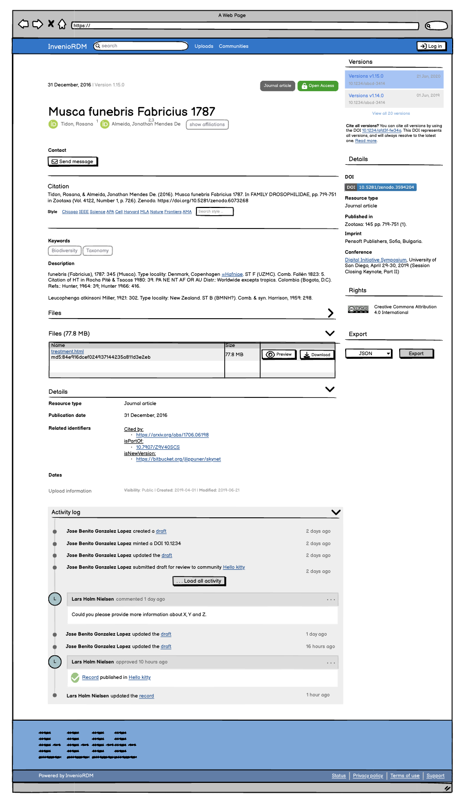
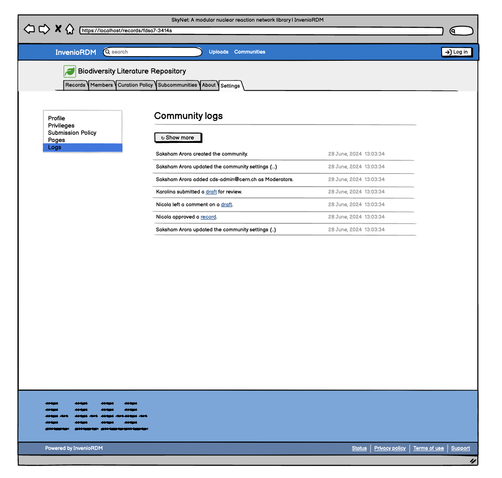
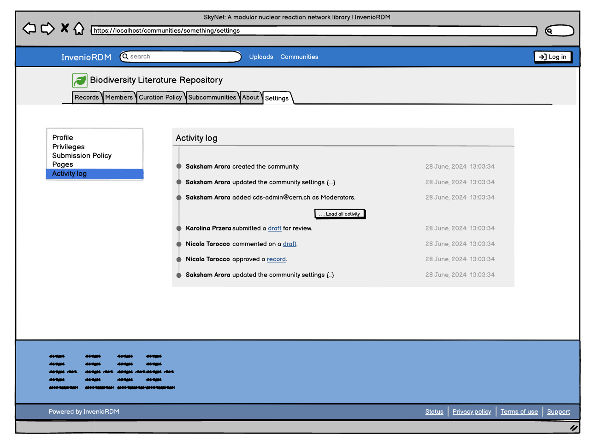
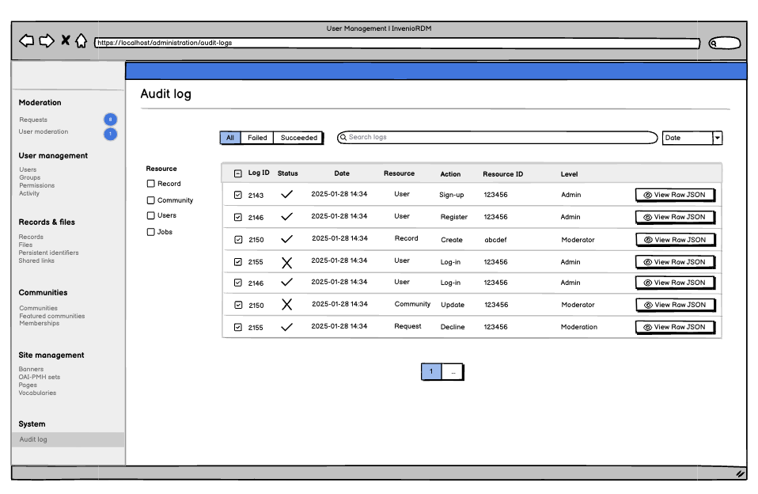
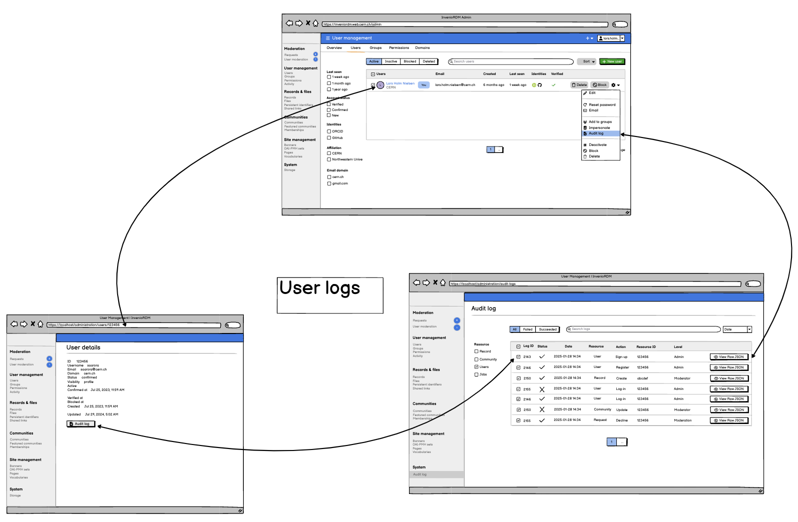
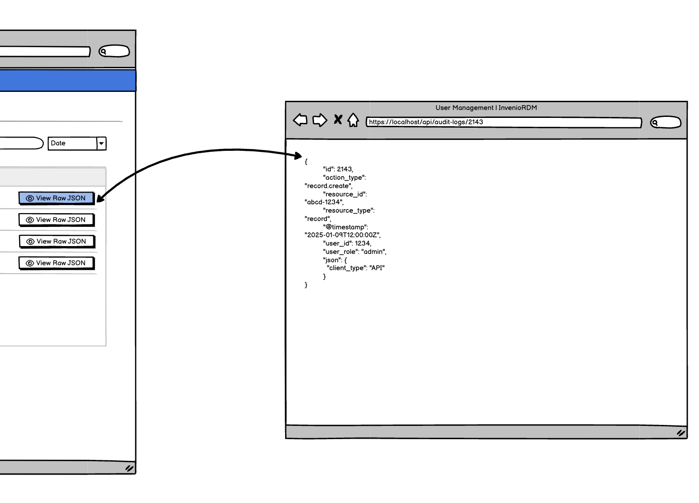
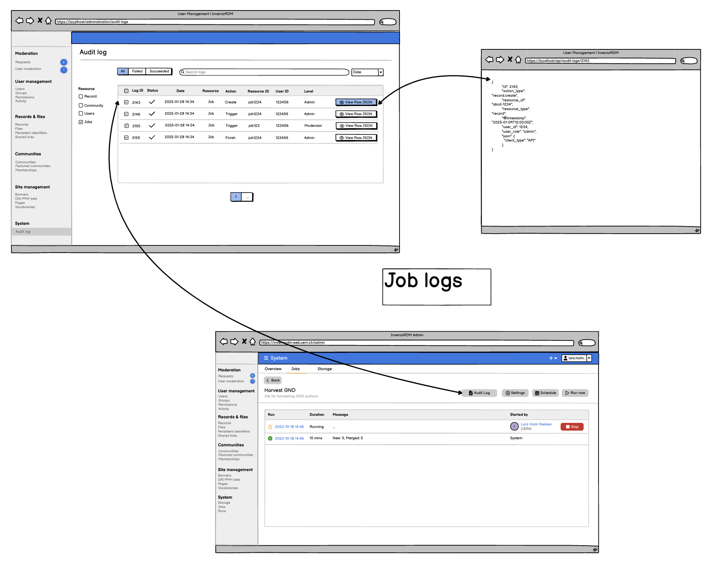

# Audit logging RFC

- Start Date: 2025-01-09
- Authors: Saksham Arora
- RFC PR: [#95](https://github.com/inveniosoftware/rfcs/pull/95)
- State: DRAFT

## Summary

This RFC proposes the use cases and design implementation for an audit logging system in InvenioRDM. The goal is to log actions performed on various resources and enable retrieval of these logs for debugging, support and legal purposes(made known us to by members of RDM community).
The module should be scalable, extensible and require minimal modifications to integrate into existing codebase.

**The Audit logging feature's main focus is to log events performed by a user/system that affects a resource.**

**What even is an Audit log?**

It is to log events performed by a user/system that affects a resource specifically track who did what, when, and where in a system. This means:

- User actions that change state (e.g., login, creating a record, submitting a community request)
- Admin actions that impact permissions or settings
- System actions that affect data integrity (e.g., embargo lifts, automatic deletions)

**What’s NOT an Audit log?**

- API request traces
- Job progress logs
- Anything that doesn’t track a meaningful action performed by a user or system on actual data

## Motivation

### Why are we doing this?
- Log significant actions performed on records, users, communities, jobs, etc.
- Enable querying and analysis of audit logs efficiently, facilitating retrieval of curation statistics.
- Showing a timeline of activities to have more context for a resource.
- Aiding debugging and support monitoring by tracking actions such as record creation, updates, submissions, and job executions.

### User stories

- As a community moderator, I want to track global changes (e.g. members, settings, metadata) within my community so that I can oversee what goes on in my community and curate.
- As an admin, I want to monitor all activities performed by users, including failed attempts of any kind, record-related actions to enable me to investigate various incidents on my application. Also, track job related-events to troubleshoot errors if any.
- As a researcher, I want to view the history of a record to track the evolution of my work or someone else's.
- As a curator, I want to track record-related, identifier-related and community-related events.

### Not in scope
- Tracking server events like server start, stop and errors as it is covered by sentry.

## Detailed Design

The following resources are the ones in scope for the initial implementation of this feature.

### Resources
1. Community: Track actions like change of members (add, remove, change of visibility/role), change of settings or metadata (e.g. change of grant value).
2. User: Track what all activities happened on an account (Account creation, successful and unsuccessful login/logout operations, etc.). Actions performed by admin as impersonator. Various admin actions (user activation, blocking, confirming, etc., change of quota).
3. Record: Actions such as creation, update, submission, new version, draft deletes, access to restricted content, removal from a community, changing embargo settings, changes to the sharing permissions.
4. Job: Actions such as who created the job, who initiated/re-initiated/cancelled. The audit logs will not take care of the progress reports or anything from inside the job run itself (out of scope).

### UI Mockups
This section contains some ideas for how the specific views would look like. It is open to change upon discussion.

#### Record logs

- Idea 1
- 

- Idea 2
- 

#### Community logs

> :warning: Community settings are available only for the community owner and managers, not the curators.**

- Idea 1
- 

- Idea 2
- 

#### Admin panel for all logs
- 

#### User logs
- Redirect to the main admin panel for audit logs

- 
- 

- The **View Raw JSON** button can also put up a json dialog box [like in CDS-ILS](https://github.com/CERNDocumentServer/cds-ils/blob/master/ui/src/importer/JsonViewModal/JsonViewModal.js)

#### Job logs

- 

### Data Model

#### Common Parameters
- id of the entry
- timestamp: Time of the action

#### Resource Parameters
- resource_id: ID of the record, user/account, community, or job, etc.
- resource_type: Type of resource: (Make sure they are extensible by using the entrypoint system. (More on this in the detailed design)
   1. record
   2. user/account
   3. community
   4. job
- status: an optional status of the resource

#### Action Parameters
- action: Action performed by user/system_user **(More actions will probably be added during integration into the service methods)**

##### User & Account Actions
| **Action**      | **action name**        |
| --------------- | ---------------------- |
| User Login      | `user.login`           |
| User Logout     | `user.logout`          |
| Password Change | `user.password_change` |
| Account Created | `user.account_created` |
| Account Deleted | `user.account_deleted` |
| User Signup     | `user.signup`          |

##### Admin actions
| **Action**          | **action name**             |
| ------------------- | --------------------------- |
| Impersonator Login  | `admin.impersonator_login`  |
| Impersonator Logout | `admin.impersonator_logout` |
| Role change         | `admin.role_change`         |

##### Record actions
| **Action**                       | **action name**              |
|:-------------------------------- |:---------------------------- |
| Draft Created                    | `draft.create`               |
| Draft Updated                    | `draft.update`               |
| Draft Submitted                  | `draft.submit`               |
| Record Created (1st publish)     | `record.create`              |
| Record Updated (re-published)    | `record.update`              |
| Record Deleted                   | `record.delete`              |
| Record New Version (1st publish) | `record.version_create`      |
| Restricted record viewed         | `record.viewed_restricted`   |
| Restricted file viewed           | `file.viewed_restricted`     |
| Record included in community     | `record.community_inclusion` |
| Record removed in community      | `record.community_removal`   |
| Share users change               | `record.share_user`          |
| Share groups change              | `record.share_group`         |
| Share links change               | `record.share_link`          |
| Sharing options change           |                              |

##### Community actions
| **Action**                            | **action name**               |
| ------------------------------------- | ----------------------------- |
| Community Created                     | `community.create`            |
| Community Updated (metadata/settings) | `community.update`            |
| Community Deleted                     | `community.delete`            |
| Member Added                          | `community.member_add`        |
| Member Removed                        | `community.member_remove`     |
| Member Role Changed                   | `community.role_change`       |
| Member Visibility Changed             | `community.visibility_change` |

##### Jobs actions
| **Action**    | **action**   |
| ------------- | ------------ |
| Job Submitted | `job.create` |
| Job Deleted   | `job.delete` |
| Job Started   | `job.start`  |
| Job Canceled  | `job.cancel` |

#### User Parameters
- user_id: ID of the user performing the action. **(This is 'who' of any action/log and it will always be present)**
- user_role: Role of the user
    - Admin
    - Impersonator
    - Resource type `community`: current community's role
    - Resource type `record`: when owner
    - Otherwise `no role` (or similar)

#### Context Parameters
- user_username: username at the time of performing the action
- user_email: email at the time of performing the action
- user_name: name at the time of performing the action
- ip_address
- session_id
- verbosity (optional, see below)
- json (or similar name, see below)

#### JSON Parameters
- affected_resource_id (optional)
- affected_resource_type (optional)

The json field won't have any defined structure as it will vary for each action. For example, an admin performs an action, the user_id will be the admin's id and the json will store the user_id of the affected user.

### Permissions

Some audit logs should be accessible only to a specific set of users. For example, only admins (and possibly the user themselves) should be able to retrieve login/logout logs.

As a first iteration, and to keep things simple, we assume that the owner(s) of a specific resource can always access all audit logs related to that resource. For instance, record owners (including all community members when a record is part of a community) will be able to retrieve logs related to restricted record and file access, while other users will not.

To enforce this, we propose flagging sensitive logs with an additional JSON parameter (e.g., `"only_owners": true`) that can be used to apply extra permission checks. In the example above, this flag would be added to logs with actions such as `record.viewed_restricted` and `files.viewed_restricted`.

The exact details of resource-specific actions and access rules will be refined during implementation.

### Configurability

We propose the following configuration options.

#### Toggleable by Resource Type
It should be possible to enable or disable auditing for specific resources.

#### Verbosity
Different verbosity levels could help filter logs more effectively. However, defining clear and self-explanatory criteria for each level is challenging, as developers may struggle to determine when to apply them.

For example, two possible levels could be:
- **Minimal**: Logs only major actions (e.g., creation, submission).
- **Verbose**: Logs all actions (e.g., read queries, resource views, etc.).

For now, we propose omitting this option.

### Retention period
Logs should optionally have a retention period. See the [Retention-strategy](#Retention-strategy) section for more details.

### Storage considerations

Key challenges include:

- Storage: Choosing between a relational database, OpenSearch, and/or files for efficient querying and retention.
- Performance: Ensuring logging does not slow down core operations, with support for asynchronous processing.
- Security & Visibility: Enforcing access control based on user roles and log levels.
- Extensibility: Allowing new resource types to be added dynamically without requiring code changes.
- Privacy: Take into account configurable retention periods.

#### Storage solutions

The key question in this area is the required level of persistence. Traditionally, in Invenio, the database serves as the primary storage and the source of truth, while the OpenSearch cluster is used to provide powerful search capabilities. A notable exception to this approach is the storage of view and download statistics.

The discussion should explore whether storing audit logs in the database is necessary for data integrity and safety, or if relying on OpenSearch with appropriate backup strategies is sufficient.

**Solution 1: OpenSearch - Datastreams with tagging**

- Use a single datastream for all audit trails/logs, with fields to tag resources (e.g., resource_type, resource_id, user_id).
- Make use of Index backing feature of the datastreams to manage storage.
- Pros: Centralized logging, with simple queries and optimized storage.
- Cons: Search query might be slow since all the logs are on a single index.

**Solution 2: OpenSearch - Resource-wise Datastreams**

- Separate datastreams for different resources (e.g., user-logs, record-logs, community-logs, job-logs, etc.).
- Pros: Partition based on timestamps to ensure scalability and efficient querying.
- Cons: Complex queries for multi-resource searches. Lower data cardinality than single ds.

**Solution 3: OpenSearch + LogStash**

- Emit logs as structured JSON to files/stdout, which Logstash can process and forward to Elasticsearch or other storage backends.
- Pros: Decouples logging from application, making it async.
- Cons: Extra management required.

**Solution 4: OpenSearch + RabbitMQ**

- Instead of logging directly, events are pushed to a RabbitMQ queue, then a separate consumer processes and writes them to OpenSearch.
- Pros: Fully async, prevents logging from slowing down the main app, easy to scale and already existing.
- Cons: Potential queue overflow if not monitored.

**Solution 5: Database - Single table with tagging**

- Store logs in a single database table, with a tagging system to differentiate between resource types.
- Pros: Simple integration.
- Cons: Slower for huge amounts of data.

**Solution 6: Database - Resource-wise tables**

- Maintain separate tables for each resource (e.g., user-logs, record-logs, community-logs, job-logs, etc.).
- Pros: Faster since each table is optimized for a specific resource type.
- Cons: Schema changes required when adding new resource types, cross-resource querying is complex.

**Solution 7: Temporal Tables (DISCARDED)**

https://learn.microsoft.com/en-us/sql/relational-databases/tables/temporal-tables?view=sql-server-ver16
- Immutable data storage in SQL format
- Optimized for versioned data
- Scalibility is still limited because of SQL

---

| Solutions                 | Pros                                   | Cons                                          |
|:------------------------- |:-------------------------------------- |:--------------------------------------------- |
| Datastreams with Tagging  | single logging storage, easy querying  | slow querying                                 |
| Resource-Wise Datastreams | better performance                     | Complex cross resource querying               |
| OpenSearch DS + LogStash  | async, auto-retries                    | extra management needed                       |
| OpenSearch DS + RabbitMQ  | async, very reliable                   | extra management needed                       |
| Single Table with Tagging | simple integration                     | Requires index management to prevent bloating |
| Resource-Wise Tables      | efficient for single resource querying | High cardinality                              |

### Privacy considerations

- Audit logs should have configurable retention periods based instance-specific needs (e.g. regional legal constraints, GDPR compliance).
- A dedicated configuration will control the retention period per resource type, and optional per action. For eg. record events, community events, user login/logout, etc.
- An automatic mechanism will delete or anonymize audit logs based on the retention period.

#### Proposed default configuration

| **Resource Type**              | **Retention Policy** | Default Retention | **Description**                                                                                           |
| ------------------------------ | -------------------- | ----------------- | --------------------------------------------------------------------------------------------------------- |
| **Record, Community**          | Configurable         | Indefinite        | Ensures full historical traceability of record modifications. |
| **Job**                        | Configurable         | Indefinite        | Critical for traceability.                                                                                |
| **User**                       | Configurable         | Indefinite        | Critical for traceability.                                                                                |
| **User: Login/logout actions** | Configurable         | 13 months         | Only needed for security reasons, not for long term archiving.                                            |

#### Retention strategy

#### Solution 1: Scheduled Cleanup with Cron/Celery
- A periodic task/job will ensure cleanup

#### Solution 2: OpenSearch Index LifecycleManagement
OpenSearch provides built-in ILM policies, which allow us to define when logs should be:
- Rolled over into new indices.
- Archived (moved to a cold storage tier).
- Assumption: OpenSearch is the only storage for Audit Logs.
- Pros: Fully automated, no need for manual cleanup.
- Cons: Requires setting up lifecycle policies in OpenSearch. To consider looking into how this can be made configurable.

### Technical implementation

The following code snippets are references for a possible implementation.

```python
from opensearchpy import OpenSearch
from datetime import datetime

# Data model
class AuditEvent:
    id: UUID
    timestamp: datetime
    resource_id: str
    resource_type: Enum
    status: Optional[Enum]
    action: str
    user_id: str
    user_role: Optional[Enum]
    json: Optional[dict]
    verbosity: str
    user_*: str
    ip_address: str
    session_id: str

class AuditLogger:
    def __init__(self, host, datastream_name):
        self.client = OpenSearch(host)
        self.datastream_name = datastream_name

    def log(self, event: AuditEvent):
        audit_log = event.to_dict().update({
            "@timestamp": datetime.utcnow().isoformat(),
            "json": {}
        })

        response = self.client.index(
            index=self.datastream_name,
            body=audit_log
        )
        return response

    def search(self, query):
        """Generic/base search method"""
        response = self.client.search(
            index=self.datastream_name,
            body={"query": query}
        )
        return response

audit_logger = AuditLogger()
```

#### Async behaviour
Logging should not slow down core operations. To ensure performance, we propose:

- Option 1: Create a shared task using celery
    - Pros: Celery's retry mechanism ensures logs are not lost
    - Cons: High number of tasks can create backlog.
- Option 2: Emit logs as JSON and bulk update the index later using logstash

#### Personal Information Masking
If needed, OpenSearch allows masking certain field (see doc [here](https://opensearch.org/docs/latest/security/access-control/field-masking/)):

```
field_masking:
  index_patterns: ["audit-logs-*"]
  allowed_actions: ["read"]
  masked_fields:
    - "user_id"
    - "ip_address"

```

Search results:
```
{
  "action": "login",
  "user_id": "******",
  "ip_address": "192.168.***.***",
  "timestamp": "2025-01-01T12:00:00Z",
  ...{other fields}
}
```

## How we teach this
The next release of Invenio/InvenioRDM will contain documentation on how to use and configure this feature.

## Discussion worthy questions
- Consensus on the mockups.
- How would the retention strategy work out? Because there is a tradeoff:
    - Single Index
        - Single retention policy or
        - Cleaning logs by resource_id
    - Resource-wise Indices with cleaning rolled over old indices partitions
- Should community logs include record specific logs?
    - As a community's curator, where can I see if a record was removed from my community? (Idea: the community logs will also show entries where the community is in the `affected_resource_id`)
- Should we track record changes at level of the parent, or each record? (see all activity cross-versions, or activity per version?)
