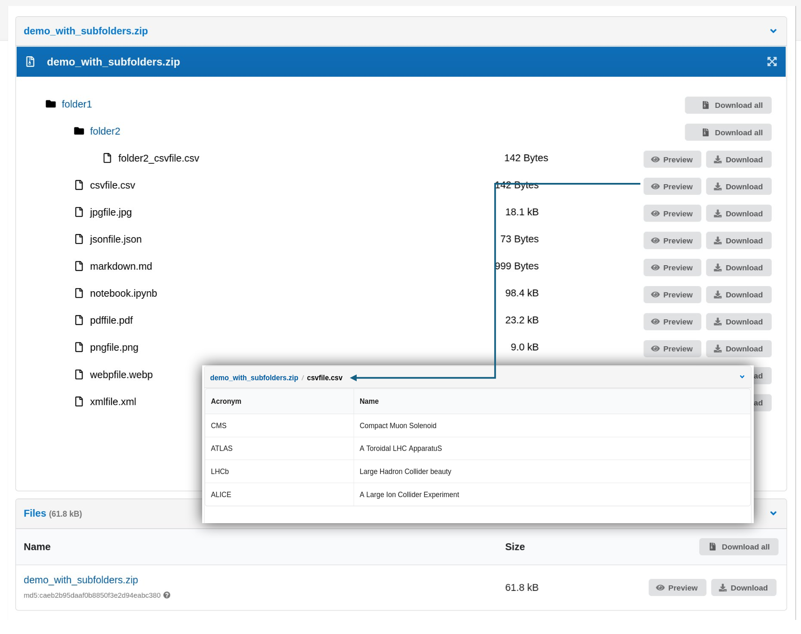
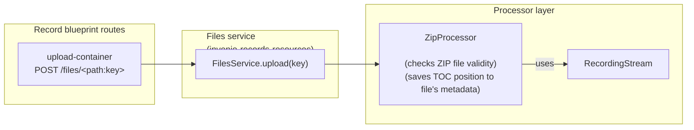
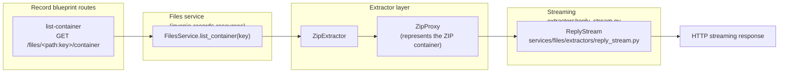

# Support for ZIP and other container formats

- Start Date: 2025-10-01
- RFC PR: https://github.com/inveniosoftware/rfcs/pull/106
- Authors: Mirek Simek, Arsenii Pogodin, Martin Čorovčák, Ondřej Ruml
- State: IMPLEMENTED

## Summary

This RFC describes the implementation of support for ZIP files in Invenio, as well as an extensible framework for other container formats. The feature enables users to list archive contents via API and UI, preview files inside ZIP archives, and extract individual files or folders from an archive. The implementation spans four packages: `invenio-records-resources` (base framework and ZIP-specific functionality), `invenio-rdm-records` (registration of container item links), `invenio-app-rdm` (UI integration), and `invenio-previewer` (container previewer support).

To avoid confusion in the following text, we define _file_ to mean the ZIP archive itself and _container item_ to mean a file or directory inside that ZIP.

The current high-level workflow is:

1. A user uploads ZIP files to a record.
2. The system preprocesses the archive and stores the required metadata.
3. The user publishes the record.
4. The ZIP previewer lets the user browse the archive and preview supported container items.

#### Video demonstration

- [Watch video demonstration](./0099/demo.webm) - Browsing ZIP contents and previewing different file types.

## Motivation

ZIP archives and other container formats (e.g., NetCDF) are commonly used to bundle multiple files for distribution and storage. Currently, the Invenio API does not support listing or extracting the contents of these files. Adding this functionality will enhance the user experience by allowing users to browse and access archive contents directly within the Invenio platform.

This feature is commonly requested by users.

### User stories

#### Border stones dataset

A user submitted a dataset with thousands of images of border stones packaged as a single ZIP file. The archive contains a hierarchy of folders named after the regions where the stones were found. The user wants to preview images in the UI and download individual images or folders.

#### Multidimensional data

A user submitted a multidimensional dataset packaged as a NetCDF file. The user wants to browse its logical parts and preview some of them as plots/maps.

## User interface

The UI implementation provides a hierarchical tree view of ZIP file contents with both preview and download capabilities.

### Features

- Hierarchical tree display showing folders and container items within the ZIP archive (originally based on `invenio-previewer`)
- Individual file operations:
  - Preview button for supported container items (images, PDFs, text files, notebooks, video, audio)
  - Download button for extracting individual container items
- Folder operations:
  - Download button for extracting entire folders as a new ZIP archive

Example of the user interface showing the contents of a ZIP file:



### Preview functionality

Container items within ZIP archives can be previewed directly in the browser. When a user clicks the preview button:

1. A message is sent via the BroadcastChannel API to the landing page.
2. The preview iframe updates to show the selected container item.
3. Breadcrumb navigation displays: `archive.zip / path/to/file`.
4. Users can navigate back to the ZIP file tree view using the breadcrumb.

The preview functionality supports all container item formats that are supported by previewers in `invenio-previewer`. These include:

- Images (PNG, JPG, GIF)
- PDFs
- Jupyter notebooks (ipynb)
- Text files (txt, md, csv, json, xml)
- Video/audio files (MP4, MP3)

## Configuration

The `PREVIEWER_PREFERENCE` configuration variable has been updated with the new ZIP previewer `previewable_zip`, which replaces the original ZIP previewer `zip`.

A new configuration variable, `CONTAINER_ITEM_PREVIEWER_PREFERENCE`, has been introduced. This variable holds previewers that work for items contained inside ZIP files. Currently, all previewers except IIIF are supported. IIIF is not supported because it requires additional links that are not present on container items.

```python
# We replace original zip previewer with our zip previewer
PREVIEWER_PREFERENCE = [
    "csv_papaparsejs",
    "pdfjs",
    "iiif",
    "simple_image",
    "json_prismjs",
    "xml_prismjs",
    "mistune",
    "video_videojs",
    "audio_videojs",
    "ipynb",
    "previewable_zip",
    "txt",
]

# We keep the original zip previewer here and remove IIIF
CONTAINER_ITEM_PREVIEWER_PREFERENCE = [
    "csv_papaparsejs",
    "pdfjs",
    "simple_image",
    "json_prismjs",
    "xml_prismjs",
    "mistune",
    "video_videojs",
    "audio_videojs",
    "ipynb",
    "zip",
    "txt",
]
```

In `invenio-records-resources`, new configuration variables have been added to configure ZIP formats and provide defaults for ZIP validity checks, maximum listing entries, maximum header size, and extracted-stream chunk size.

```python
# invenio-records-resources
RECORDS_RESOURCES_EXTRACTED_STREAM_CHUNK_SIZE = 64 * 1024
"""Chunk size of extracted stream used in ContainerItemResult.send_file()."""

RECORDS_RESOURCES_ZIP_FORMATS = [".zip"]
"""File extensions interpreted as ZIP files."""

RECORDS_RESOURCES_ZIP_MAX_LISTING_ENTRIES = 1000
"""Max entries returned by the container listing API."""

RECORDS_RESOURCES_ZIP_MAX_HEADER_SIZE = 64 * 1024
"""Max header size of ZIP file that can be preloaded."""

RECORDS_RESOURCES_ZIP_MAX_TOTAL_UNCOMPRESSED = 500 * 1024 * 1024  # 500 MB
"""Max allowed uncompressed size of ZIP."""

RECORDS_RESOURCES_ZIP_MAX_RATIO = 200.0
"""Max allowed compression ratio of an entry inside ZIP file."""

RECORDS_RESOURCES_ZIP_MAX_ENTRIES = 10000
"""Max allowed entries inside ZIP file."""
```

## Detailed design

### REST API

The API has been extended to support the following operations (HTTP method: GET unless otherwise noted):

- List contents: List the contents of a file (ZIP or other supported formats). Returns a hierarchical structure of container items (files/directories).

- Extract container items: Retrieve specific container items from the archive. Enables downloading individual files or groups of files without downloading the entire archive.

| Endpoint                                | Description                               |
| --------------------------------------- | ----------------------------------------- |
| `<record>/files/<key>/container`        | List archive contents                     |
| `<record>/files/<key>/container/<path>` | Retrieve a container item as a ZIP stream |

### File metadata

The implementation uses file extensions to determine if a file is a supported container format. Files with extensions listed in the `RECORDS_RESOURCES_ZIP_FORMATS` configuration (default: `[".zip"]`) are automatically processed as ZIP containers.

#### List operation

The list operation is a GET request to `/api/records/<pid_value>/files/<key>/container`. The user must have the `get_content_files` permission to call the API. The API returns a JSON response with the following structure:

```json5
{
  "entries": [
    {
      // saved path inside the ZIP archive (used as container item key)
      "key": "test_zip/test1.txt",
      // other metadata fields can be added here and should be ignored by clients if not recognized
      // fields below come from the Python zipfile library
      "size": 12,
      "compressed_size": 14,
      "mimetype": "text/plain",
      "checksum": "crc:2962613731",
    },
  ],
  "folders": [
    {
      "key": "test_zip",
      "links": {
        "content": ".../api/records/abc123-yz89/files/demo_with_subfolders.zip/container/test_zip",
      },
      "entries": [
        "test_zip/test1.txt",
      ],
    },
  ],
  "total": 1, // total number of entries
  "truncated": false, // true if the listing was truncated (e.g., too many entries)
}

```

Note: The listing operation does not support pagination. The entire structure is returned in a single response. The extractor returns the total number of entries and a flag indicating whether the listing was truncated.

#### Extract operation

The extract operation is a GET request to `/api/records/<pid_value>/files/<key>/container/<path>`. The user must have the `get_content_files` permission. If `<path>` points to a single container item, the API streams the container item content. If `<path>` points to a container item that is a directory, the API streams a ZIP archive of that directory.

### Internal API

The implementation is divided across four packages:

1. **invenio-records-resources**: Base framework for extensible extractors and processors, implementation for ZIP files
2. **invenio-rdm-records**: Links for files with container items
3. **invenio-app-rdm**: UI integration
4. **invenio-previewer**: Support for container item previewers

#### Base framework (invenio-records-resources)

**PR**: https://github.com/inveniosoftware/invenio-records-resources/pull/666

#### Summary

Following the same pattern as file processors, `FileServiceConfig` defines a new class property, `file_extractors`. We add three new methods (`list_container`, `extract_container_item`, `open_container_item`) to `FileService`. Each method finds the first suitable extractor (where `can_process()` returns `True`) and returns that extractor's result. If no suitable extractor is found, a new `NoExtractorFoundError` exception is raised.

To follow the same pattern as other service methods, two new result classes are added and configured via `FileServiceConfig`.

The ZIP implementation uses Python's standard `zipfile` library.

Unlike the standard ZIP previewer, which opens and seeks within the ZIP file on each preview, this implementation improves performance by reducing the number of seeks needed to read the table of contents and extract container items. To do so, after the file is uploaded we store the starting position of the table of contents in the file's metadata.

When listing or extracting, we use the file's metadata to start reading from the table of contents position and avoid unnecessary reads. During container item preview/extraction, we use the cached information to get the position of each container item inside the ZIP file, which reduces the number of seeks required (typically to one).

To keep using the standard ZIP implementation, we achieve this by wrapping the input stream with our own TOC-aware wrapper.

#### Implementation details

The base module defines the extractor interface:

```python
# invenio_records_resources.services.files.extractors.base

import io
from abc import ABC, abstractmethod


class FileExtractor(ABC):
    """Base class for file extractors."""

    @abstractmethod
    def can_process(self, file_record):
        """Determine if this extractor can process a given file record.

        :param file_record: FileRecord object to be processed"""

    @abstractmethod
    def list(self, file_record):
        """Return a listing of the file.

        :param file_record: FileRecord object to be listed
        :returns: dict

        example: {
            "entries": [  # all entries inside the container
                {
                    "key": "texts_folder/test1.txt",
                    "size": 12,
                    "compressed_size": 14,
                    "mimetype": "text/plain",
                    "checksum": "crc:2962613731",
                    "links": {  # links are added automatically by the service (not by the extractor)
                        "content": ".../api/records/abc123-yz89/files/demo.zip/container/texts_folder/test1.txt"
                    },
                },
                {
                    "key": "texts_folder/texts_subfolder/test2.txt",
                    "size": 12,
                    "compressed_size": 14,
                    "mimetype": "text/plain",
                    "checksum": "crc:2962613731",
                    "links": {
                        "content": ".../api/records/abc123-yz89/files/demo.zip/container/texts_folder/texts_subfolder/test2.txt"
                    },
                },
            ],
            "folders": [  # all folders inside the container
                {
                    "key": "texts_folder",
                    "links": {
                        "content": ".../api/records/abc123-yz89/files/demo.zip/container/texts_folder"
                    },
                    "entries": [  # paths of direct children (files or folders)
                        "texts_folder/test1.txt",
                        "texts_folder/texts_subfolder",
                    ],
                },
                {
                    "key": "texts_folder/texts_subfolder",
                    "links": {
                        "content": ".../api/records/abc123-yz89/files/demo.zip/container/texts_folder/texts_subfolder"
                    },
                    "entries": [
                        "texts_folder/texts_subfolder/test2.txt",
                    ],
                },
            ],
            "total": 2,  # total number of entries
            "truncated": False,  # True if the listing was truncated (e.g., too many entries)
        }
        """

    @abstractmethod
    def open(self, file_record, path) -> io.IOBase:
        """Open a specific file from the file record."""
        pass
```

##### Service methods

The `FileService` class provides three methods for container operations. Each method first iterates through configured extractors until one extractor's `can_process()` returns `True`.

- `list_container(identity, id_, file_key)`: Lists archive contents by calling the extractor's `list()` method. The result is wrapped with `ContainerListResult`.
- `open_container_item(identity, id_, file_key, path)`: Opens a container item stream by calling the extractor's `open()` method.
- `extract_container_item(identity, id_, file_key, path)`: Behaves the same as `open_container_item`, but wraps the extracted container item returned by `open()` with `ContainerItemResult`.

##### API endpoints

Two endpoints are added to `FileResource`:

- `GET /files/<path:key>/container`: Calls `list_container()` and returns JSON
- `GET /files/<path:key>/container/<path:path>`: Calls `extract_container_item()` and streams the result

##### Configuration

Extractors and result classes are registered via service configuration:

```python
class FileServiceConfig:
    file_extractors = []  # List of FileExtractor instances

    file_result_container_list_cls = ContainerListResult    # Listing result
    file_result_container_item_cls = ContainerItemResult    # Specific extracted container item result

    container_item_links_item = {}  # Template for links expansion
```

##### Result classes

The base framework defines two result classes for container operations:

**ContainerListResult** (in `invenio_records_resources.services.files.results`):

- Wraps the listing dictionary returned by `FileExtractor.list()`
- Expands links for each container item (e.g., download) in the structure
- `to_dict()` method returns the complete listing with expanded links
- `items` property yields individual container items for iteration
- Link expansion uses the `container_item_links_item` configuration

**ContainerItemResult** (in `invenio_records_resources.services.files.results`):

- Wraps the extracted container item returned by `FileExtractor.open()`
- Stores the file_record, extracted container item (implementing SendFileProtocol), and parent record
- `send_file()` method delegates to the extracted object's `send_file()` implementation
- Provides `open_stream()` and `get_stream()` methods for accessing container item content
- Enables consistent handling of extracted container item content across different extractor implementations

#### ZIP implementation (invenio-records-resources)

##### File preprocessing phase


The preprocessing phase happens in the `ZipProcessor` class (defined in `invenio_records_resources.services.files.processors.zip`), which is invoked by the standard Invenio upload flow.

When a ZIP file is uploaded:
1. `ZipProcessor` is called to process the ZIP file.
2. Inside `ZipProcessor`, the ZIP file is opened with Python's standard library `zipfile.ZipFile`. To track byte ranges, the underlying stream is wrapped with `RecordingStream`.
3. After reading the table of contents, the processor stores the starting position in the file's metadata.

##### ZIP listing and container item extraction

A new class, `ZipExtractor`, based on the `FileExtractor` interface defined in `invenio_records_resources`, handles both listing and container item extraction operations. It uses `ZipProxy` and `ZipFileProxy` to efficiently serve the content of ZIP files.

##### Listing archive contents



Listing is performed using Python's standard `zipfile.ZipFile`. To minimize seeks, the `zip_toc_position` stored in the file's metadata is used.

##### Container item extraction

```mermaid
flowchart LR
  %% Endpoints (record blueprint)
  subgraph EP["Record blueprint routes"]
    X["container-item-extract<br/>GET /files/&lt;path:key&gt;/container/&lt;path:path&gt;"]
  end

  %% Service layer
  subgraph SVC["Files service<br/>(invenio-records-resources)"]
    S2["FilesService.extract_container_item(key, path)"]
  end

  %% Extractor layer
  subgraph EXT["Extractor layer<br/>services/extractors/files/zip.py"]
    ZE["ZipExtractor"]
    ZP["ZipProxy<br/>(represents the ZIP container)"]
    ZFP["ZipFileProxy<br/>(represents an item in the ZIP)"]
  end

  %% Processor + streaming
  subgraph PROC["Processing + streaming<br/>processors/zip.py + extractors/reply_stream.py"]
    RS["ReplyStream<br/>services/files/extractors/reply_stream.py"]
  end

  %% Wiring
  X --> S2 --> ZE --> ZP --> ZFP --> RS
  RS --> OUT["HTTP streaming response"]
```



We use Python's standard `zipfile` library for extraction. To minimize seeks, the `zip_toc_position` stored in the file's metadata is used.

#### Implementation details

The implementation uses several components for efficient streaming:

**RecordingStream**: A wrapper around a file stream that records the byte ranges accessed:

- Created in the preprocessing phase
- When seeking, it updates `zip_toc_position` if needed
- When reading, delegates to the underlying stream

**ReplyStream**: A seekable stream wrapper that:

- Optimizes reads of the table of contents
- Delegates other reads to the underlying storage
- Enables efficient ZIP reading without multiple seeks to remote storage

**ZipExtractor.open**: Returns extractable content:

- Extractor for ZIP files that leverages the cached TOC position created by `ZipProcessor`.
- Calling `ZipExtractor.open()` returns extractable content for files and folders:
  - For files: Streams decompressed content directly
  - For directories: Creates a new ZIP on-the-fly using the `zipstream-ng` library
  - Implements `send_file()` returning a Flask `Response`

**ZipFileProxy**: Creates a proxy around an opened ZIP member:

- Automatically closes both the ZIP member stream and the parent ZIP proxy.

**ZipProxy**: Creates a proxy around a ZIP archive with optional TOC-aware optimization:

- Uses ReplyStream for TOC-aware optimization
- Caches ZIP infolist for quick lookups

This architecture enables extracting container items from large ZIP archives without loading the entire archive into memory.

#### Links (invenio-rdm-records)

**PR**: https://github.com/inveniosoftware/invenio-rdm-records/pull/2222

The invenio-rdm-records package was extended to generate links for container item operations.

The service result class expands container item entries with links defined in a template when the listing method is called. Currently, there is:

1. Content link: Serves the content of that ZIP container item.

Below is the example of one container item entry with expanded links from that listing:

```json5
{
  "entries": [
    {
      "key": "document.pdf",
      // ... same fields as in listing example above
      "links": {
        "content": ".../api/records/abc123-yz89/files/previewer_test_files.zip/container/document.pdf",
      },
    },
  ],
}
```

##### Link generation

Links for container item operations are dynamically generated in the service configuration:

**Link configuration** (in `invenio_rdm_records.services.config.WithFileLinks` metaclass):

```python
cls.container_item_links_item = {
    "content": EndpointLink(
        "record_files.extract_container_item",
        params=["pid_value", "key", "path"],
        vars=lambda container_item_metadata, variables: variables.update(
            {"path": container_item_metadata["key"]}
        ),
    ),
}
```

#### Previewer extension (invenio-previewer)

**PR**: https://github.com/inveniosoftware/invenio-previewer/pull/243

The invenio-previewer package was extended to support different previewer configurations for container items versus regular files.

##### Motivation

When previewing container items (files inside ZIP archives), different preview capabilities may be desired:

- Nested ZIP files should use the simple tree previewer (not the enhanced `previewable_zip`)
- IIIF previewer requires metadata links that are only generated for top-level files
- Some previewers may not be suitable for extracted content

##### Configuration system

**New configuration variable: `CONTAINER_ITEM_PREVIEWER_PREFERENCE`**

This configuration controls which previewers are available for container items.

##### Implementation details

**Extended `_InvenioPreviewerState` class** (in `invenio_previewer/ext.py`):

New properties and methods:

- `container_item_previewable_extensions`: Set of file extensions that can be previewed inside containers
- `previewer_preference`: Cached property that retrieves the preference list for previewers with fallback
- `container_item_previewer_preference`: Cached property that retrieves the preference list of previewers for container items, with fallback
- `iter_container_item_previewers()`: Returns previewers ordered by container item preference

**Previewer registration logic**:
When a previewer is registered, the system now:

1. Checks if the previewer appears in `PREVIEWER_PREFERENCE`
   - If yes: adds its extensions to `previewable_extensions`
2. Checks if the previewer appears in `CONTAINER_ITEM_PREVIEWER_PREFERENCE`
   - If yes: adds its extensions to `container_item_previewable_extensions`

This ensures that only enabled previewers have their extensions registered, preventing preview buttons from appearing for disabled previewers.

**Template integration**:

New Jinja2 template test:

```python
@blueprint.app_template_test("container_item_previewable")
def is_container_item_previewable(extension):
    """Check if extension is previewable for container items."""
    return extension in current_previewer.container_item_previewable_extensions
```

Templates can use: ``

##### Key differences from regular previewing

| Aspect          | Regular Files              | Container Items                         |
| --------------- | -------------------------- | --------------------------------------- |
| Configuration   | `PREVIEWER_PREFERENCE`     | `CONTAINER_ITEM_PREVIEWER_PREFERENCE`   |
| Extension set   | `previewable_extensions`   | `container_item_previewable_extensions` |
| Iterator method | `iter_previewers()`        | `iter_container_item_previewers()`      |
| Template test   | `is previewable`           | `is container_item_previewable`         |
| IIIF support    | Enabled                    | Disabled (no metadata links)            |
| ZIP previewer   | Enhanced (`previewable_zip`) | Original (`zip` tree view)              |

##### Design rationale

The dual-configuration approach provides:

- **Flexibility**: Different preview capabilities for nested vs top-level files
- **Backward compatibility**: Automatic fallback to existing configuration
- **Clean separation**: Container item logic isolated from regular file logic
- **Performance**: Extension sets computed once during registration

#### UI integration (invenio-app-rdm)

**PR**: https://github.com/inveniosoftware/invenio-app-rdm/pull/3266

To enable previewing and downloading container items in the UI, two new functions were created in `invenio_app_rdm/records_ui/views/records.py`. The preview function follows the same patterns as normal previewing, but wraps the file object in a custom class. The download function follows the same patterns as the original download flow, but uses a new decorator to pass the correct object into the function arguments.

A new HTML template was created, based on the ZIP template from `invenio-previewer`.

#### Implementation details

##### Previewers

The `previewable_zip` previewer module integrates ZIP browsing into the record landing page:

**PreviewableZipPreviewer**: Registered as an Invenio previewer plugin

- `can_preview(file)`: Checks whether the file is a ZIP file
- `preview(file)`: Calls the backend `list_container()` API and transforms the tree structure for frontend rendering
- Generates preview and download URLs for each container item

**PreviewContainerItem**: A wrapper class that enables existing previewers to work with extracted container items

- Follows the same logic as the original `PreviewFile` class with different `open()` and `has_extension()` methods
- It holds an additional `container_item_filename` to select the appropriate previewer for the extracted item.
- `open()` calls `file_service.open_container_item()` to get a stream
- Enables transparent previewing of container items within archives

##### UI routes

Two new routes are added:

- `GET /records/<pid_value>/preview/<filename>/container/<path>`: Preview extracted container item
- `GET /records/<pid_value>/files/<filename>/container/<path>`: Download extracted container item

The preview route:

1. Opens the container file as a readable stream.
2. Creates a `PreviewContainerItem` wrapper.
3. Routes to the appropriate previewer (image, PDF, text, etc.).

##### Templates and JavaScript

**Template** (`previewable_zip.html`):

- Displays hierarchical tree of ZIP contents using Semantic UI
- Shows container item metadata (name, size, type)
- Provides preview and download buttons for each container item
- Supports folder downloads when configured

**JavaScript** (`previewable_zip.js` and `theme.js`):

- Uses the BroadcastChannel API for communication between the iframe and the record landing page window.
- Sends container item metadata when preview button is clicked
- Updates main preview iframe to show selected container item
- Creates breadcrumb navigation showing path within archive

## Dependencies

The implementation adds one new dependency:

**psutil**: Used only in testing. Allows us to check memory consumption.

## Invenio demo server

If you would like to try these changes, there is an Invenio demo server repository: https://github.com/oarepo/test-zip-extract-repository

## Testing

- Unit tests for ZIP listing and extraction
- Resource/API endpoint tests
- Memory efficiency test with large ZIP files
- Directory extraction tests with nested structures

## Future extensions

The extractor framework is designed to support additional container formats:

- TAR archives (.tar, .tar.gz, .tar.bz2)
- RAR archives (.rar)
- NetCDF files (.nc)
- HDF5 files (.h5, .hdf5)

Each format can be added by implementing `FileExtractor` and optionally `FileProcessor` classes and registering them in the service configuration.
