- Start Date: 2021-10-15
- RFC PR: [#52>](https://github.com/inveniosoftware/rfcs/pull/52)
- Authors: Alex Ioannidis, Zach Zacharodimos, Lars Holm Nielsen, Max Moser, Guillaume Viger, Jenny Bonsak
- State: DRAFT

# Communities: Requests UX

## Summary

This RFC covers the overall user experience for submitting a new record to a community as well accepting/decling the record into the community.

The RFC lays the foundation for the technical design of communities. It provides overall guidiance of how communties should be implemented. It is however expected that several aspects needs to be revised as the technical design is made.

## Design

Following is an overview over pages and changes needed.

### Overall focus

Only the following use case is covered in the RFC:

- New submission: An uploader submits an unpublished record to one  community. The curator should be able to accept/decline the request, and if accepted the record is published.

Following use cases are NOT covered in this RFC:

- Claiming: A curator should be able to claim records into their community. The uploader should be sent a request to approve the claim.
- Inclusion: An uploader should be able to request their **published** record to be added to one or more communities. Each community curator should be sent a request for their communtiy.

### Header

- Menu:
    - Remove of "Uploads"
    - Add "My dashboard"
    - Add inbox icon (My requests)
    - Change "+" dropdown menu to include:
        - New upload
        - New community

### My dashboard

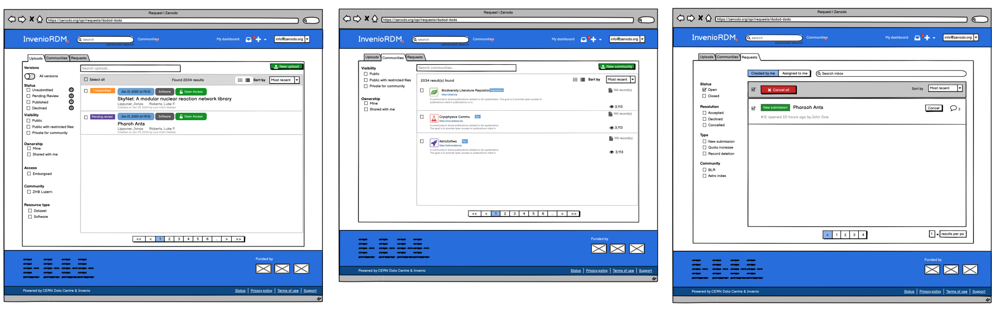

"My dashboard" intends to replace the current "List of uploads" page by collecting three different lists of objects that belongs ot a given user:

- List of uploads
- List of communites
- List of requests

Mockup notes:
- The visual design is not final (the tabs in particular need proper design)
- All 3 lists should be as identical as possible.

#### List my uploads

The list of uploads should show:

- List all uploads that a user can edit.
- Default to apply a filter to show only records that the user uploaded themselves.

From the page, the following actions are possible:

- View the record
- Edit a published record
- Create a new draft
- Delete a draft

In addition, the submission status should be clearly visible in the overview and the user should be able to filter by the different statuses.

#### List my communities

The list of uploads should show:

- List all communities that a user is a member of.
- Allow to filter list of communities to only those a user owns.

From the page, the following actions are possible:

- Create a new community
- View a community
- Edit a community

#### List my requests

The list of uploads should show

- All requests that a user have created or is assigned to them.
- Default to show requests that a user have created.

From the page, the following actions are possible:

- Cancel, accept or decline a single request
- Bulk cancel, accept or decline multiple requests
- See number of comments per request
- Filter by requests created by the user (can be cancelled), and assigned to user (can accept/reject)
- View a request

#### Discussions

- Created by vs assigned to. All three list are able to show records that 1) a user have created themselves and 2) objects that they have permissions on (e.g. can edit because it was shared with them, because they are curator of a community, or because they are a member of a community). A user test is likely required to figure out what is the best way to present this to a user as it's not clear if they understand the difference.

### Request detail

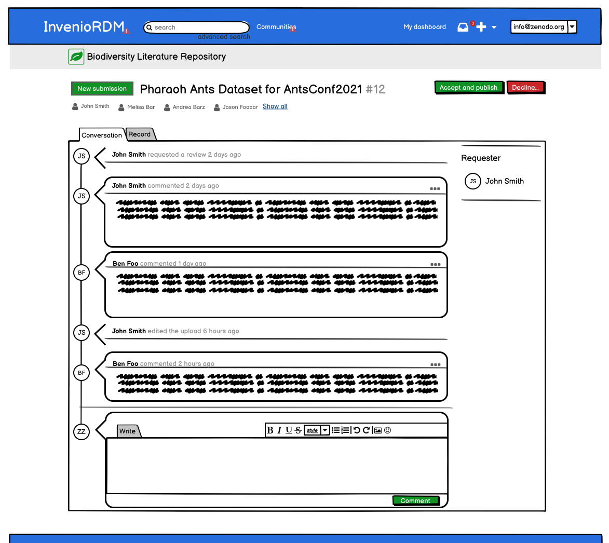

The request detail page feautres the following areas:

- Type/title/summary: To show the most important information and to allow users to easily identify the request
- Actions buttons: Cancel, Decline, Accept and publish (the accept button likley need to be customizable per request)
- Combined timeline/conversation (a la GitHub).
- A tab to preview the request's associated object (e.g. a record.)

#### Future extensions:

The idea is that requests detail page in the future can be extended with features such as:

- Assignees
- Automatic status checks
- Labels and more

#### Action: Cancel

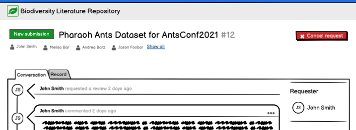

#### Action: Accept

The accept button should be customizable per request type to ensure users understand what is happening. E.g. "Accept and publish", clearly states that a record is published once accepted vs a text that just says "Accept".

#### Action: Decline

The decline action should allow for writing a comment while declining the request at the same time, to ensure that users are informed why a given decision was taken.

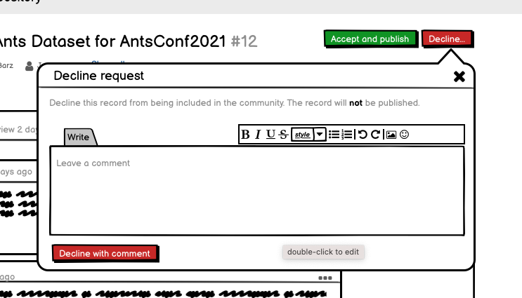

#### Timeline/Conversations

One of the key features of a request is that the
creator and receiver of the request can communicate together.

The timeline/conversations is modelled over GitHub issues/pull requests. In below mockup, only comments are shown, but the intention is that the timeline can show events such as

- Record was edited by person X (since it's intended that a record can continue to be edited by both uploader and curator).
- Person assigned/unassigned
- Upload accepted/declined
- Status changes: open -> closed -> reopened

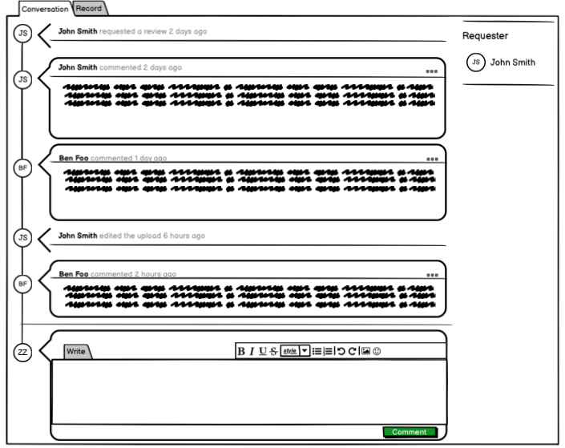

#### Comments

A user should be able to submit comments to a request.

Once a comment is submited it should be possible to edit a comment, and see if the comment was edited.

The comment editor we should detmerine if we support e.g. Markdown or we do HTML (with CKEditor as we already have in the deposit form). Or both in the future?

If we use Markdown, a preview comment feature would also be needed.

#### Preview

The preview tab once selected, will render a preview of the landing page of the record. This preview is specific to a request that wants to include a record in a community. Other types of requests may have other tabs.

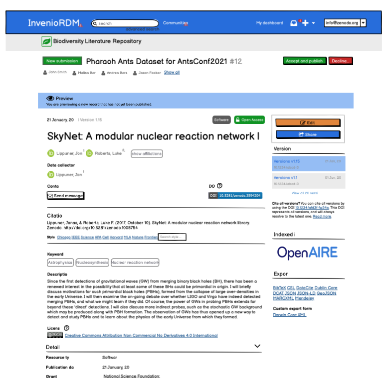

### Deposit form

A new upload can be started from:

- Header plus button > New upload
- Button on My dashboard / List uploads
- Button on community header

#### Step 1: Select community

In the case the upload is not initiated from a community header, the first step is to select a community.

The list of communities should focus on the communites that the uploader is a member of. In addition it should show recently used communities. In addition only communites that a user can submit to should be displayed (or perhaps grey out once that the user don't have permissiosn to see).

The step can be skipped in case an uploader do not want to select a community.

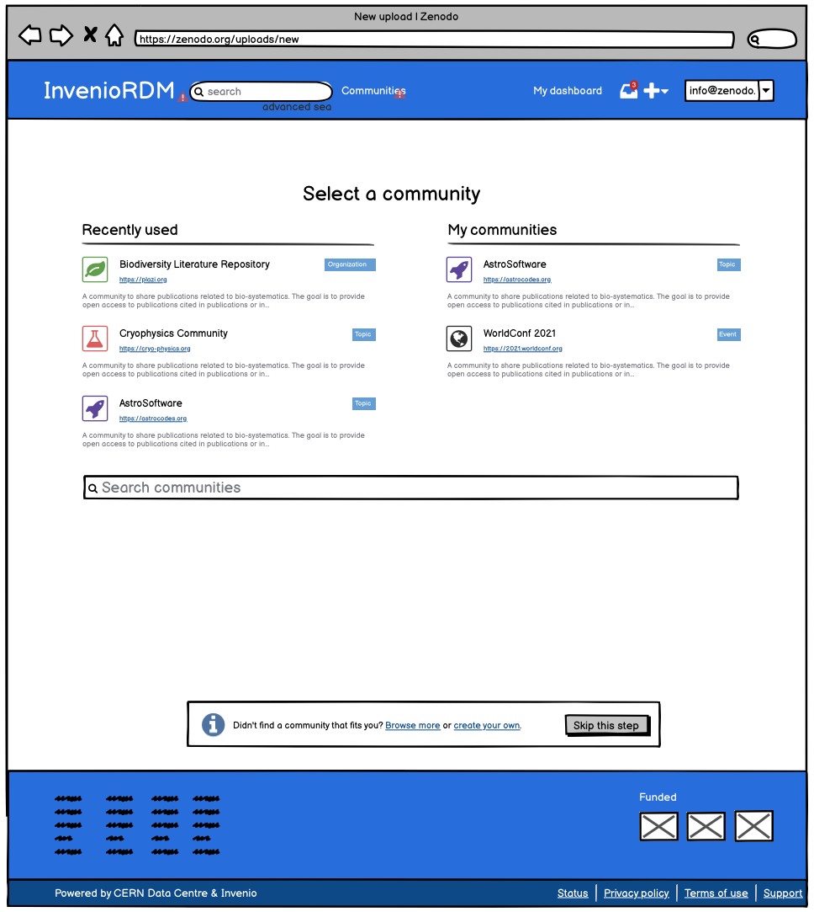

Mockup NOT FINAL:
- The skip step should be more visible.

#### Step 2: Form header

The deposit form should now display the selected community as a header. The header shows a "cog wheel" icon which can be used to change the community (basically go back to step 1).

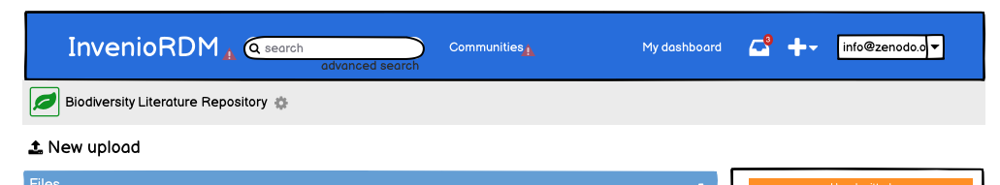

### Step 2: Submitting for review

The deposit form is extended with a submission status that can show the following states:

- Unsubmitted (orange) - no request exist.
- Pending review (purple) - an open request exist.
- Published (green) - an closed acceptted request exists
- Declined (red) - an closed declined request exists.

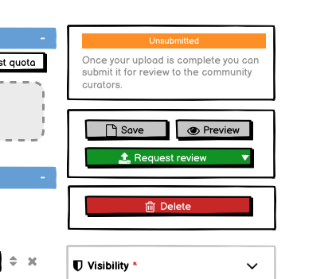

When a user clicks the "request review" button, a dialog ask the users to confirm:

- You grant curators edit access.
- Once accepted, the upload is published.
- TODO: What if uploader is also community curator? Do they have to confirm?

In addition the user can write an optional comment to the curators, as well as a short cut to remove the community if they want to publish immediately.

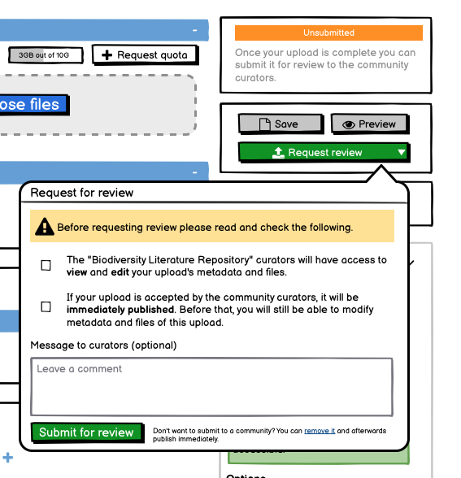

#### Step 3: Request detail page.

If the user decides to submit for review, they are redirected to the request detail page for the newly created request.

#### Deposit form: Pending review

The uploader and curators can now both edit the record. If they decide to edit the upload, the form now shows the "pending review" status, and the submit button has been disable.  The default request
actions (view, cancel, decline, accept) are shown if the user has permissions (uploader, community curator).

Only the uploader should be able to delete the upload.

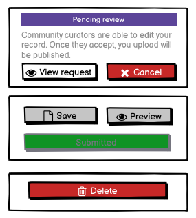

Same record seen by a curator:

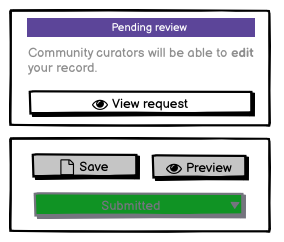

TODO:

- What if no community was selected? How does everything above look like? What is the status?

### Landing page

A record that was added to a community displays a small community header version.

In addition the existing manage menu, is redesigned to not collide with the community header.

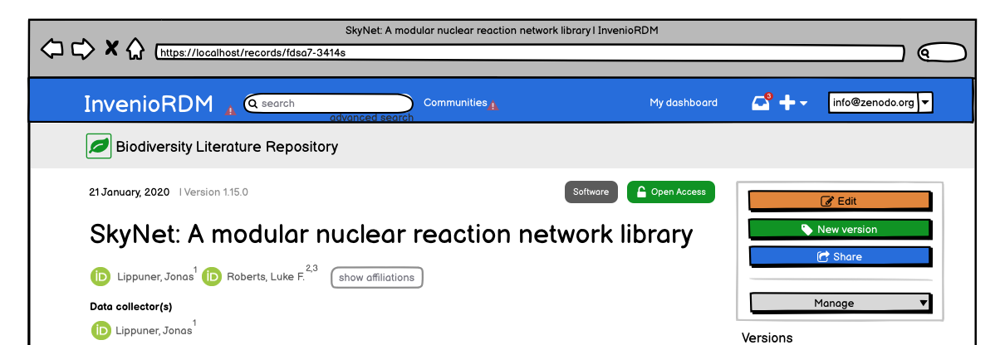

### Community requests

Similar to the "My dashboard - list requests", a community has a page of all the requests for a given community.

The page allows to to bulk accept/decline, filter by type, open/close status.

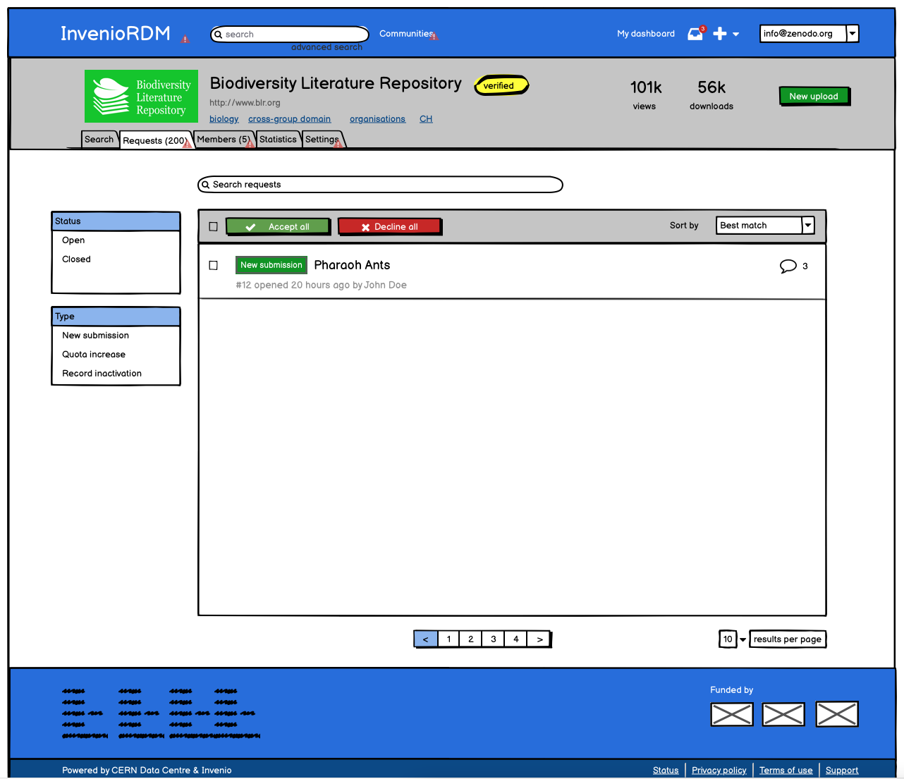

## How we teach this

## Drawbacks

## Alternatives

## Unresolved questions and other comments

- Can a curator change files during review or only metadata ?
- UX submitting to multiple communities?
- UX of claiming records to a community (bulk ops vs single op)

- Should resolution and status be one or two properties? open/closed accepted/declined/cancelled.
- Do we need a list of users?
- Unsubmitted -> Unpublished? or Draft?
- Visibility: Add "Restricted"

Missing pages:

- List records in a community

### Northwestern University feedback

#### --Dashboard--
**Uploads**
Status: Draft (or "Unsubmitted" but choose 1 and be consistent), Pending Review, Published, Declined
    Should there also be a "In Review"?
Visibility: Open Access (Public), Public with restricted files, Private for community
    Should there also be "Metadata-only" to really just mimic the tag
    Should there also be "Restricted" to really just mimic the tag
    Should "embargoed" just be placed here?

**Communities**
Visibility: Not sure this applies, unless some communities can be private/restricted themselves
Ownership: Can you own a community?
Only display communities you are part of right?

A: Some communities are invisible. You don't discover them they discover you.

**Requests**
Use "Ownership" facets to incorporate "Created by me" | "Assigned to me" ?
Use same UI as preceding tabs
Merge Status and Resolution together: "Status: Opened, Accepted, Declined, Cancelled"

Given that there is only 1 community per record for now. How would transferring 1 community to another work?
    does the former community owner need to confirm? (I am thinking only the new one)

The idea of a feed of activity for a community was brought up. Not necessarily to manage, but just be aware of
events happening in the community. Much like the feed for a Request.

#### --Request Detail--
**Discussion tab**
New submission looks like a button to create a new submission (à-la GitHub new issue)
but this is the type of request. The styling should be different.

Sidebar:
 - "Participants" and then "requester" would be small label next to that participant's name
 - if sidebar at all

Skip the avatar and left side timeline UI

Discussions are archived after record acceptance to the community, but not a visible as part of the record  UX. Or is there a link back to the request from the record?

_internal_: ConversationItem/ConversationEvent model that has fields
    type (request review, comment, edit, acceptance),
    content (html text, even if not used),
    timestamp,
    user

To clarify:
    Actions as Requester: Cancel (no request extraneous text)
    Actions as Reviewer: Accept and publish, Decline

What happens when the Requester is also a potential reviewer? Either allow or force another reviewer...

Decline modal: Just "Decline" as action word

_internal_: time and type based algorithm to compact events

**Preview tab**
Reuse the same management banner as with edit records
    -> actually no more management banner and just side bar
    -> put community management in there so that record with no community can be assigned one nevertheless
Reduce the author/reviewer clutter

#### --Deposit process--
Now that the deposit process starts by selecting a community, would it make sense to explode it in 3 steps:
1- Community (Should we have a default community, e.g., ‘Northwestern University’?)
2- Files + Metadata
3- Preview and publish/submit for review

Only deposits that request addition to a community are reviewed. If we have a default community, can we have deposits accepted automatically to it? We need a way for depositors to make deposits quickly without review.

A: mainly internal (skip could put it in default)
        approval direct

Cog to "Change" text?

Place the request status with the community banner
    saves up space / modifications on the sidebar

The request review dialog should be the same UI as the publication confirmation.
    The message is the first comment, right?

A: yes message is first comment

Pending review triggered by edit... could it be pending review right away?

We favor the choice of community to be done after publication always:
1- Files + Metadata
2- Preview and publish/submit for review
3- Community

