- Start Date: 2022-01-17
- RFC PR: [#55](https://github.com/inveniosoftware/rfcs/pull/55)
- Authors: Lars Holm Nielsen, Alex Ioannidis, Camelia Ignat, Guillaume Viger, Jose Benito Gonzalez Lopez, Laura Henze, Martin Fenner, Max Moser
- State: DRAFT

# Community Members UX

## Summary

The current RFC lays out the high-level requirements for how the community membership integration should be. It has an overall impact on how requests are handleded.

## Motivation

The requirements have been collected from InvenioRDM partners and by collecting experience from other systems managing groups such as GitHub, GitLab and Indico.

Overall, InvenioRDM have two distinct uses related to members:

1. Zenodo-like repository
2. Institutional repository

In a Zenodo-like repository you do not have groups information from an authentication provider, and also you usually require consent from all users.

In an institutional repository you usually have groups information from an external identity provider, and often the trust is higher so that you might not need consent for e.g. adding a user to a repository.

We have tried to harmonize both approaches, and only allow disabling certain features.

## Design

For reference, the current page for a single community is displayed below.

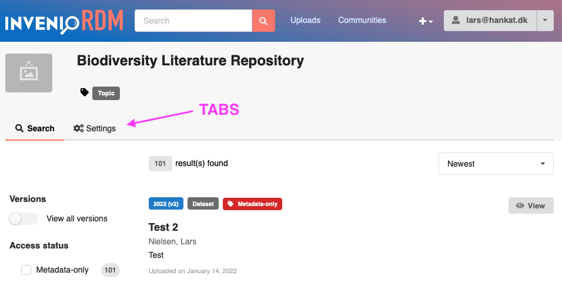

### Left hand menu

Overall, we're adding a new tab ``Members`` to the communities view.

The left hand menu will be consistent across all subpages of the member tab.

- The left hand menu has two menu item:
    - "Members" are displayed to all users.
    - "Invitations" are only displayed to owners/managers of a community.

The default page show for everyone is the "list members" page (see next section).

### List of members

The list members page exists in three versions:

- Owner/Manager view
- Curator/Member view
- Public view

Below the overall manager view is displayed:

### List of members: Public view

The public view is available for everyone.

- Members with public visibility are displayed.
- Members with hidden visibility are not displayed.
- No further information is displayed (in particular no creatiion dates, visibility or role information is displayed).
- Groups are marked with a "Group"-label to easily identify groups.
- The current user's membership is marked with a "You"-label
- Members are searchable via the search field.
- The list uses pagination.

In case no members are shown an email address of the community (needs to be in the community profile) can be shown for how to contact the community (typical use case for CDS). Later we could consider, adding a general way of contacting a community.

:::info
:warning: **Backend** -- Pay attention to that information cannot be leaked via searches. I.e. only displayed information should be searchable, and only filters/sorting should not work.

:::

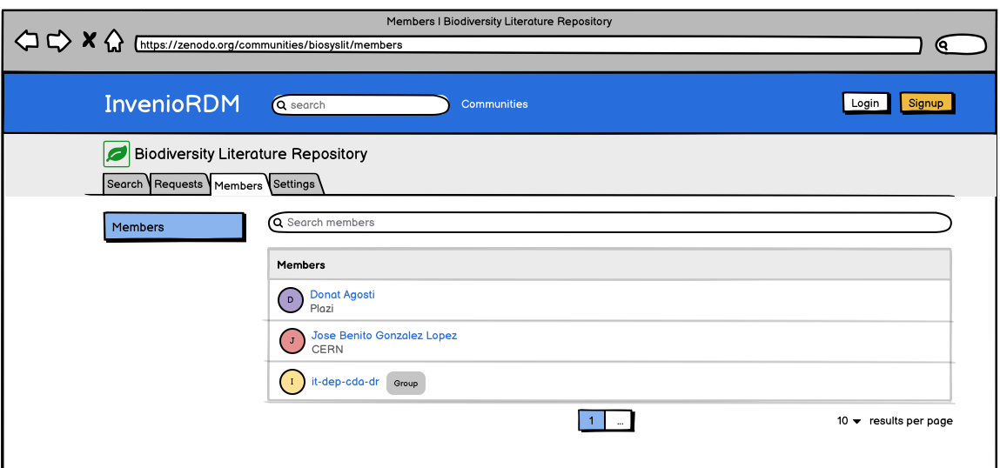

### List members: Member view

The member view is accessible only for members.

The membership in addition displays:

- Creation date (as time passed since creation in the column "Member since").
- Membership visibility
- Role

A member who is logged in can:
- edit their own visibility.
- can leave the community.
- see themselves labelled on the list to easily identify their membership.

All members can:

- Search for other members
- Filter by visibility and role
- Sort the list by creation date

See section "List members: Features" for further default.

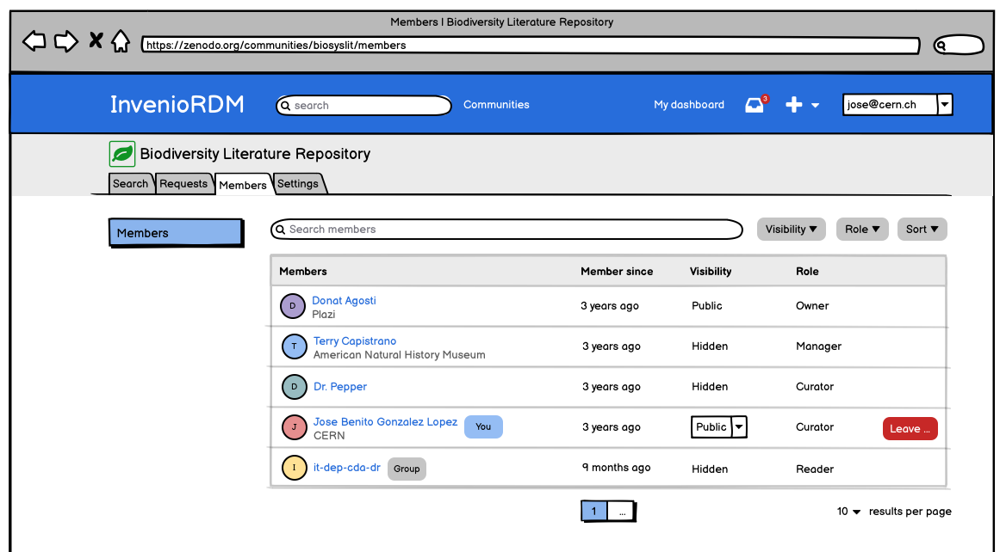

### List members: Manager view

The manager view adds the following features on top of the member view:

- Invitation button
- Bulk selection and action menu.
- Invitations menu item is now displayed in the left-hand menu.

For each membership:

- Roles can be edited
- Visibility can be edited for:
    - The manager/owner themselves.
    - Members with public visibility.

In particular, an owner/manager cannot change visibility from hidden to public for a user (only the user themselves can do that).

Role change:
- An owner can change roles of everyone except themselves
- An owner can change roles of other owners, but there must always be one owner.
- A manager cannot change a role to an owner.
- A manager can change their own role to a curator or reader resulting in they loose access to manage members.

:::info
TODO: Should we prevent a manager to change their own role?
:::

Membership removal:
- Owners can leave if there is more than one owner.
- Owners can remove other owners.
- Managers can leave and remove other members except owners.

The "Remove"-button needs to display a confirmation dialog similar to the bulk action.

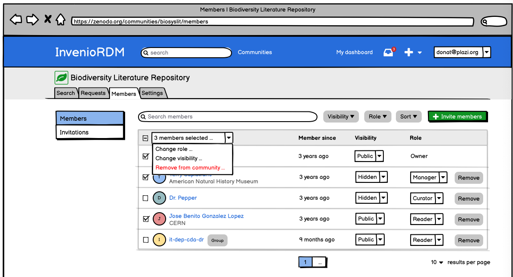

**Bulk action menu**

The bulk action menu shows the number of selected members and has three actions:

- Change role
- Change visibility
- Remove from community

Ideally it should be possible to have an option to select not only the visible list, but everyone. For the members this is not a must have.

It's important that the bulk actions respects the rules outlined above for editing roles and visiblity.

Each bulk action will show a modal dialog to confirm action:

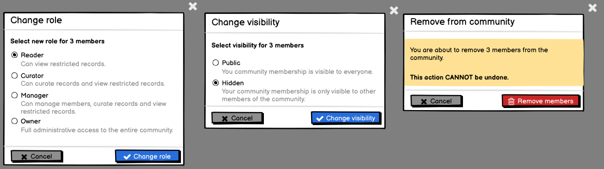

### List members: Features

**Role dropdown menu**

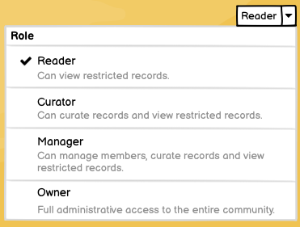

**Visibility dropdown menu**

The member visibility dropdown will show two available options like below:

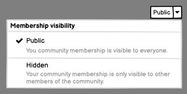

**Leave modal dialog**

When a member click's the leave button, they will be presented with the following modal dialog to confirm they want to leave.

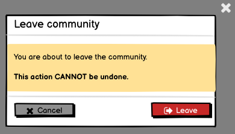

**Search filters**

Views that support search and filtering have a UX like below:

- Search field supports the standard query syntax.
- Filters are displayed below the search box.
- All filters can be removed, or only an individual filter.

  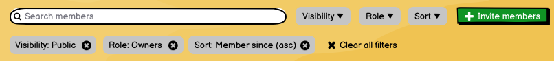

The sort is NOT added in the table column headers in order to:
1. Have all filtering, sorting in the same place.
2. Match the sorting supported by the REST API as well as multi-column sorting.

Each filter button when clicked will show a menu with title, list of options, including an ``All`` option to have no filtering.

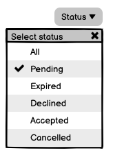

### List members: Invite dialog

Owners and managers can invite other members by clicking the green invite button. This will popup a dialog

The dialog features two tabs:

- People: For inviting one or more users/guest.
- Groups: For adding a group.

Note, that people are invited, while groups are added because groups may not have any way to confirm an invitation.

The dialog further provides:

- A search field
- A role selection
- A message (only visible for people, not groups).
- A button saying "Invite" for people and "Add" for groups.

The role selection has extra logic:

- Only an owner can invite other owners.

:::info
:question: Can groups be owners? should there always be one person owning a group?
:::

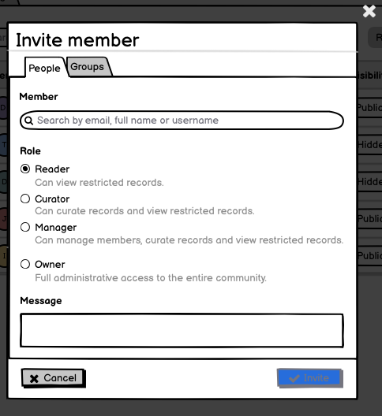

**Search by user**

The search for users will look for users known by the system. Only users not already a member can be invited.

The search field is a combined search field that will look in all possible information available on a user so you can e.g. search "Jose CERN" (i.e. both name and affiliation).

- The search field will display user profiles with an avatar, name, username and affiliation. Possibly the user profile display must be customizeable (to be seen).
- The user profile display must not display any email addresses.
- Multiple uses can be added in the dialog, but will all be invited with the same role.

:::info
Multiple users - the general idea is to provide support for inviting a smaller number of users (10-20) via the dialog. Larger groups would be invited via the groups feature.
:::

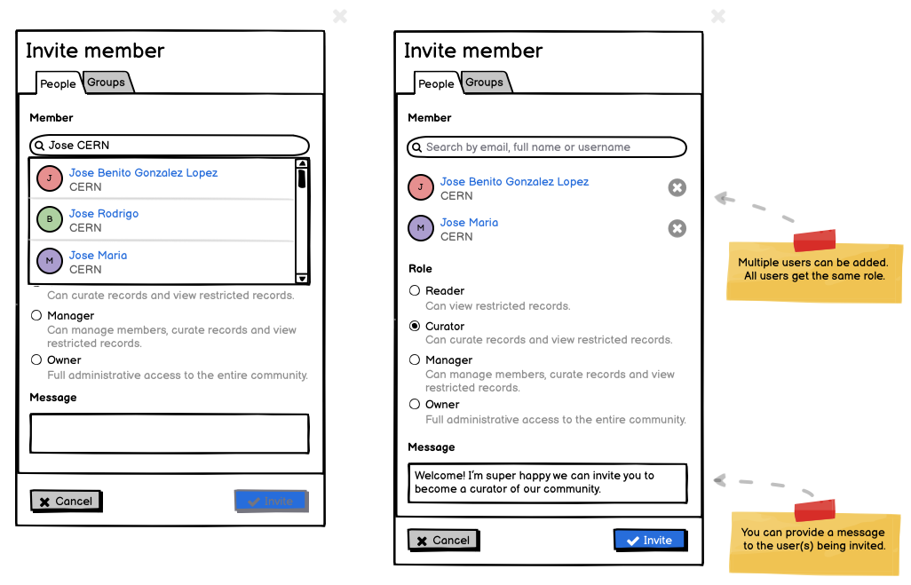

**Search by email**

In case no users is found, and the search string is an email, an option to invite the email should be provided.

:::info
:warning: **Backend** -- Special attention should be paid to no leak information that is private to users. E.g. search for information and getting a search hit even when the information is not displayed.
:::

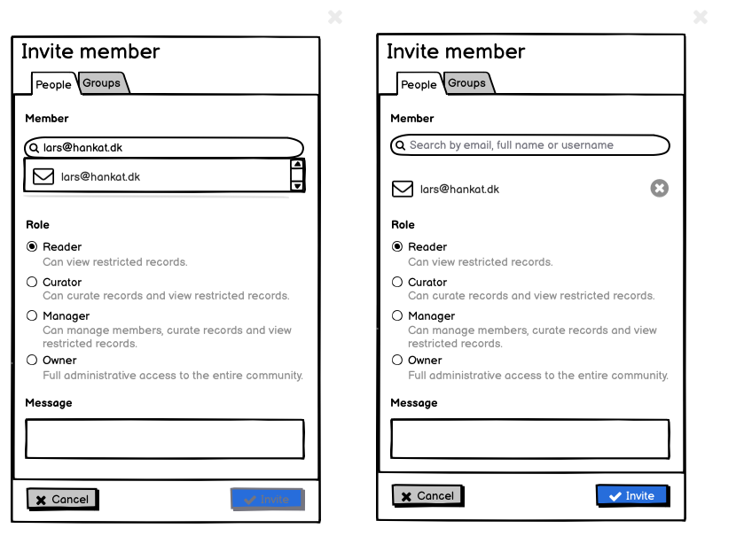

**Search by group**

The search for groups is an optinal feature that can be disabled.

If the group tab is selected, the dialog will search for groups instead. Groups are anything that be represented as a set of user. Examples:

- LDAP groups
- Authenticated users
- IP Networks

Note that, you cannot provide a message for a group since groups may not have any means of being contacted (e.g. IP networks)

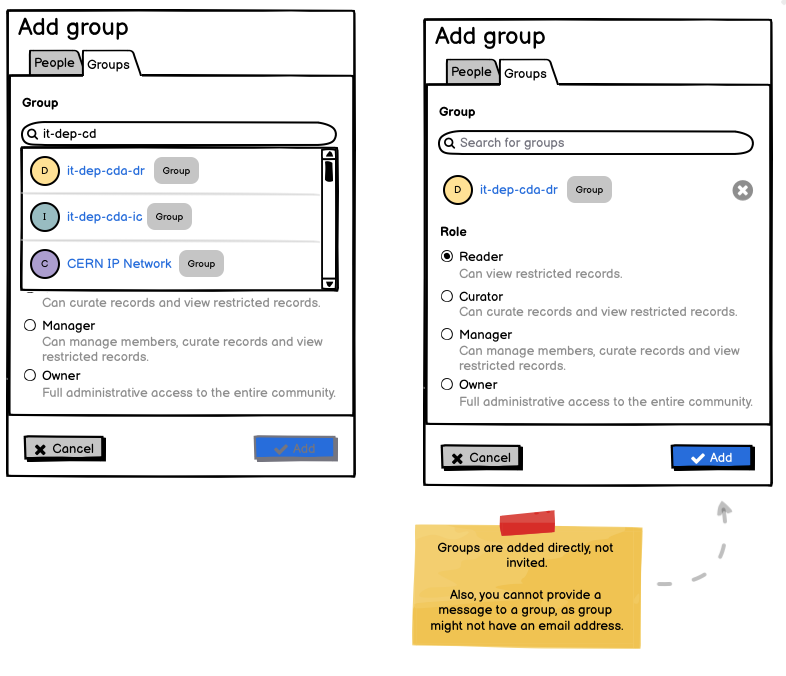

### List invitations

The list invitations view is only accessible to owners and managers.

An invitation can be on one of the following states:

- Pending - sent to the user
- Accepted - accepted by the user
- Declined - declined by the user
- Cancelled - cancelled by a community manager/community
- Expired - no action where taken in X number of days.

The sort has the following options:

- Expiration
- Best match (when a search query is applied)
- Role
- Status

The list view defaults to only showing pending invitations (i.e. pending status filter applied).

The list invitations view show the following columns:

:::info
TODO - how to deail with an email address being invited.
:::

- User (groups not possible because they can't be invited only added)
- Status
- Expires - note values in this column will be named in terms of time until/from the invitation expire - e.g. ``in 1 day`` or ``1 day ago``.
- Role - the role can changed as long as the invitation is pending.
- View button: will take the person to the view the request
- Cancel button: will cancel the invitation - only shown for pending invitations
- Reinvite button: will reinvite the user - only show for expired invitations.

:::info
:question: Should it default to both pending AND expired? or nothing at all.
:::

   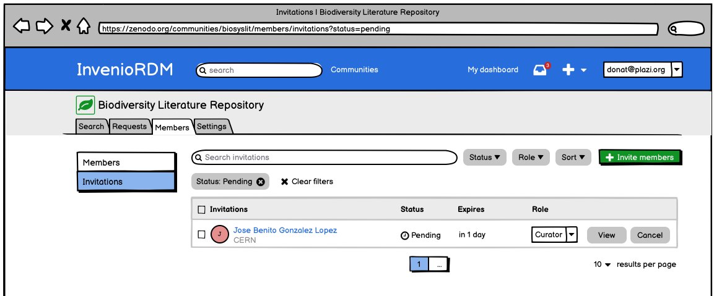

**Bulk action menu**

Like the list members (manager view), this view also has bulk action menu.

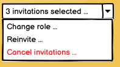

**Modal dialogs**

Simiarly, each action menu has a modal dialog:

Note, that only owners can change role to owners. Only owners can reinvite when the role is an owner.

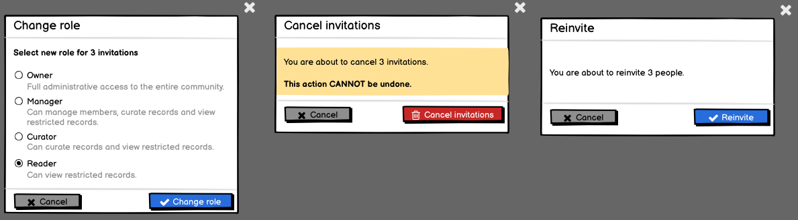

### List invitations : View an invitation

The view invitation comes in different variations depending on the status of the invitation

- Pending
- Accepted
- Declined
- Cancelled
- Expired

Examples of each one is displayed below. Common to all of them:

- Back button: allows going back to the list of invitations (previous filters should be kept).
- Action buttons (like cancel, accept, reject, reinvte).
- Title: Displaying the user being invited and the role.
- Timeline: showing comments and events
- Timeline comments: Allows the comment submitter to edit their own
- Detail column showing: Creator, request type, status and expires (if in pending or expired state)

#### Pending invitation

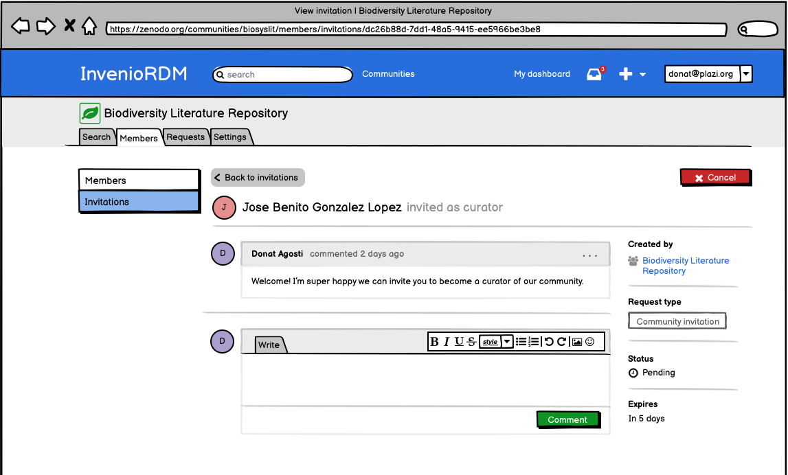

#### Accepted invitation

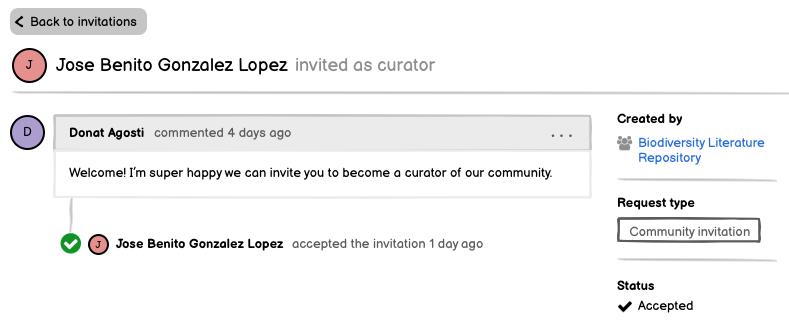

#### Cancelled invitation

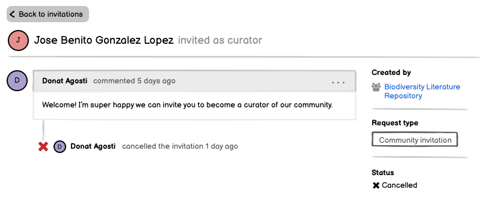

#### Declined invitation

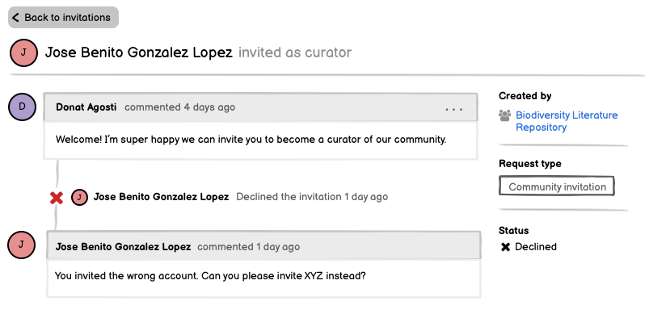

#### Expired invitation

- Allows reinviting the person.

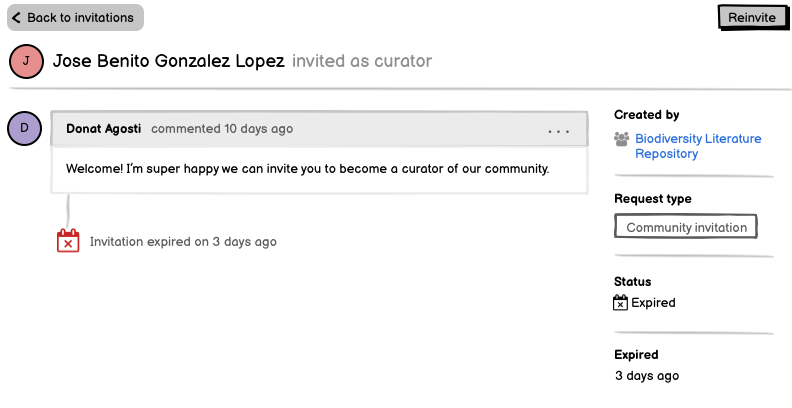

#### Timeline: Editing of existing comments

- Timeline comments allow for editing via a "..." menu.
- The text should show that the comment was edited.

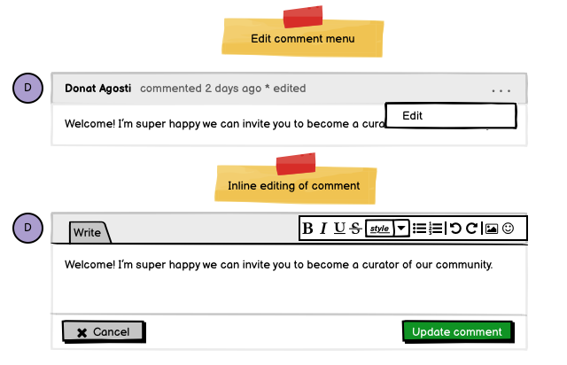

#### Timline: Adding comments

Adding comments looks much like editing comments, except the buttons are slightly different.

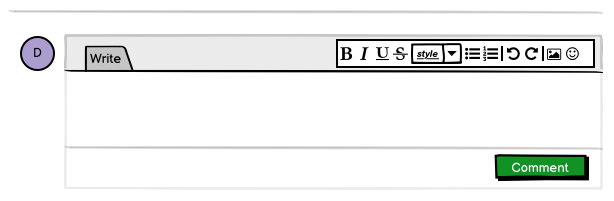

### Timline visual connections

The entries of the timeline whether comments or events, are visually conenctted with a line. See Example below.

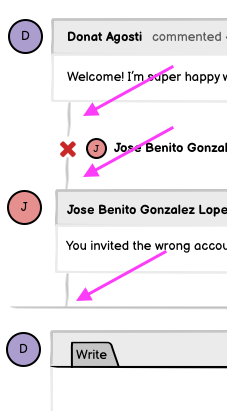

#### Avatars

Avatars exists for people, communities and groups and in different variations:

- Small icon and text
- Normal icon-only
- Normal single-line text-only
- Normal icon and single-line text with optional label
- Normal icon and double-line text with optional label
- Big icon and single-line text with optional extra text
- Big icon and double-line text

### My dashboard : List requests

The request user dashboard has the following components:

- Facets: Type and Status (pending not being shown)
- Filter: Open vs Closed
- A search field.
- A results list view (i.e not a table view with column headers).
- Bulk action menu and selection of entries.
- Sorting

The requests displayued on the dashboard are either:

- Current user is the creator
- Current user is the receiver

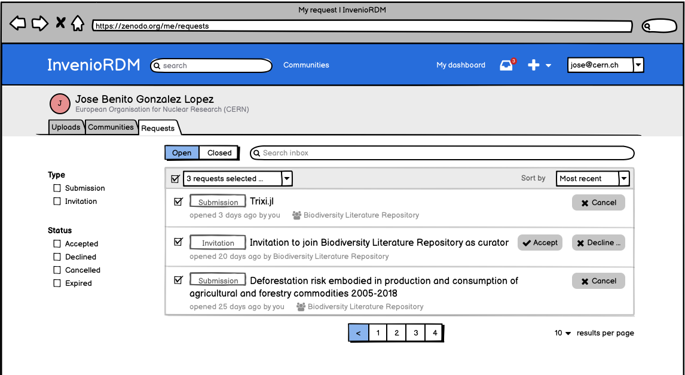

#### Item result

Below is an annotated view of the different parts of a result item view.

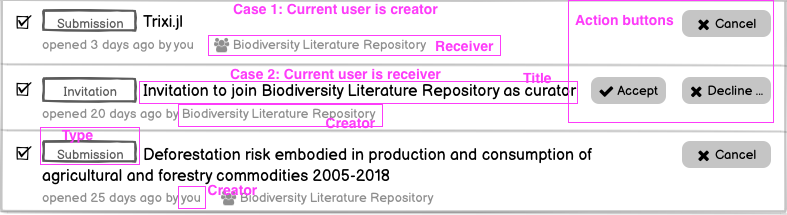

#### No results

In case the my dashboard has no requests the following rules applies:

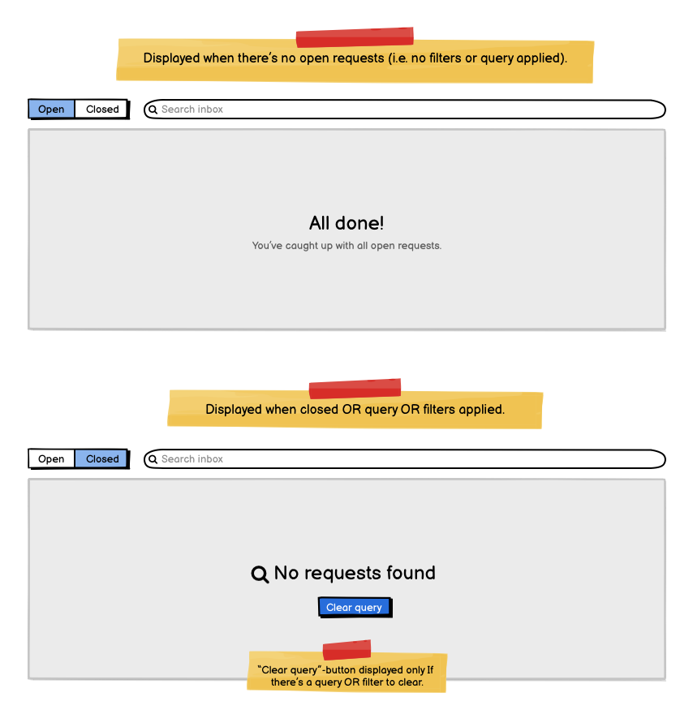

### My dashboard : View request

An invitation request seen from the current user looks almost identical to the ones presented earlier. Main differences:

- Back button takes you back to requests
- Title is now the exact title.

:::info
TODO - How to get the community icon included.
:::

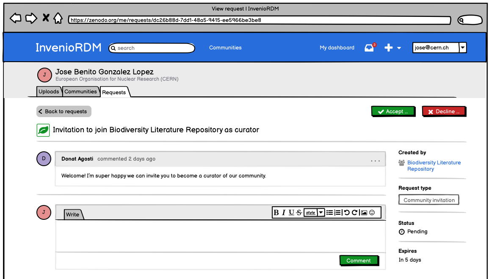
