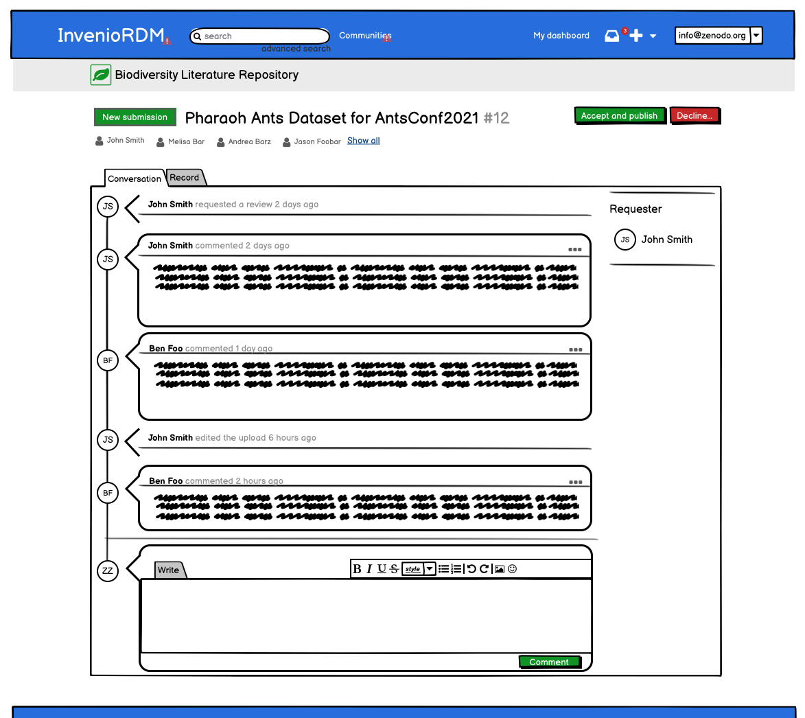
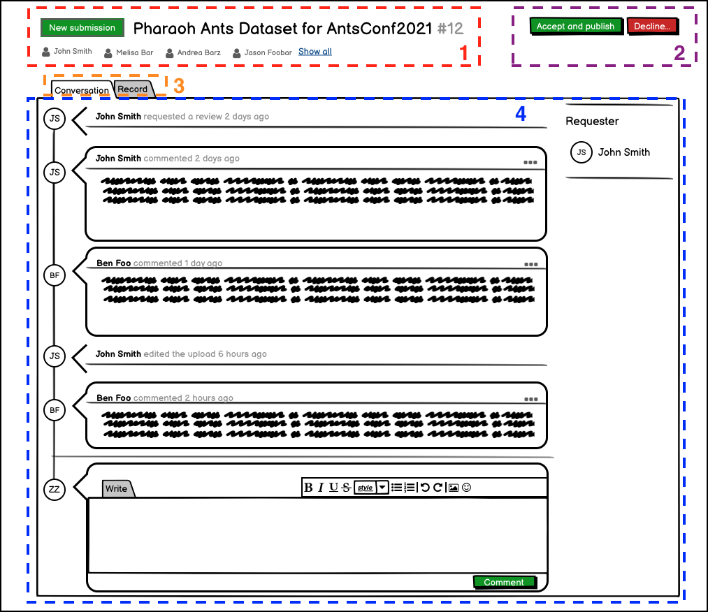

- Start Date: 2022-02-17
- RFC PR: [#<PR>](https://github.com/inveniosoftware/rfcs/pull/59)
- Authors: Karolina Przerwa
- State: DRAFT

# Request details page

## Summary

This RFC documents the technical solution of the `invenio-request` details page. Since the `Request` data model is quite generic to allow high customizability, the UI should take this into account and be flexible.

Request details mockup:
    

## Motivation
    
1. As a developer I want to easily add and render new request types, without changing too much of existing code.
2. As a developer I want to be able to customize the action buttons and the available tabs per request type.

## Detailed design

In a nutshell, the solution chosen for the UI is a mix of client-side React components and server-side rendered Jinja elements.
   
The first type of request, created in the InvenioRDM context, is the inclusion of a draft to a community. This request will display, as second tab, the draft preview so that the user validating the request can immediately identify it. 
    
Since the draft preview page is already implemented with the `invenio_app_rdm/records/details.html` Jinja template, the main objetive is to reuse it as-is for the `Record` tab. That's why the solution of implementing a new React application for the entire page was discarded.
    
To better understand the solution, below the request's details page with the main sections highlighted:
1. Header with topic, title and contributors.
2. Actions buttons, which will perform AJAX request when clicked and update the timeline.
3. Tabs section, which might vary depending on the request type. The  Record tab includes the template `invenio_app_rdm/records/details.html` 
4. Conversation timeline, highly interactive (add/edit comments, automatic refresh).
   

The chosen solution takes into account pros and cons comparing other evaluated solutions, in particular when overriding part of this UI page.

The entire page is a new Jinja template. The various sections are implemented in the following way:
* the header and the tabs, section 1 and section 3, are part of the Jinja template and uses classic HTML and Semantic UI CSS classes. This allows a developer to easily override the Jinja template to add/edit/remove tabs.
* the converstation timeline, section 4, is the main React application, so that the user interaction can be easily modeled and implemented. The React app can reused in other pages.
* the record tab, the second tab of the section 3, is implemented simply with `include invenio_app_rdm/records/details.html`. The only extra implementation needed there is to hide the header and footer of that page, to be embeddable.
* the action buttons, section 2, need to be connected with the main React app. Each button will perform an AJAX request (to avoid a page reload) and the response will contain the new version of the request record, which needs to be injected in the main React app and trigger a re-render. The implementation takes advantage of [React Portals](https://reactjs.org/docs/portals.html), a technique to create and use React cmp outside the main app.

Changes to header or existing tabs per request type can be easily achieved simply overriding the Jinja template, or selected `blocks`.
The React app can be also included and it can be customized via `props`.

## How we teach this

The understanding of this solution requires a good understanding of Jinja templates and extension mechanism, React applications and React Portals.
    
This is a rather new solution and not following common patterns used in Invenio.
    
This solution is meant for experienced developers, seeking to understand why this solution was chosen. It is not really needed to develop with it.

## Drawbacks

* The solution relies on React Portals, which is not clear if it is considered a core features by the React developers. However, this technique has been also used with the search bar in the header of InvenioRDM.
* The solution is a mix of server-side and client-side components, which adds complexity when understanding the implemetation.    

## Alternatives

Other alternatives have been considered for the record preview tab:
    
1. The record preview tab could have been replaced with a link/button to redirect the user to the draft preview page. This is not an ideal user experience given that the user would leave the request details page.

2. The record preview tab could have been re-implemented in React and be part of the main React app. This solution was immediately discarded because of the needed effort, lack of reusability and potential issues. On top of that, adding/changing tabs is not an easy task.

3. The record preview tab could have been implemented using an `iframe`, that would load the deposit draft preview page. This solution was quite simple to implement, but it has clear limitations on what can be customized in the draft preview page, not having direct access to its implementation: the only way to customize it is to use URL arguments in the iframe URL.

## Resources/Timeline

Implemented.

