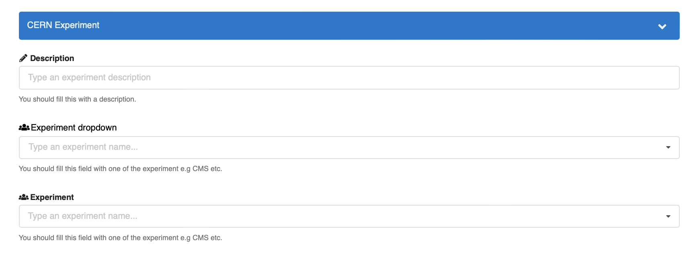

- Start Date: 2022-06-13
- RFC PR: [#64](https://github.com/inveniosoftware/rfcs/pull/64)
- Authors: Zacharias Zacharodimos, Pablo Panero

# Custom fields

## Summary

InvenioRDM's record and community data models might not contain all the fields needed to fit some cases. However, they can be extended using _custom fields_. This RFC outlines the implementation details.

## Motivation

Different instances of InvenioRDM are setup to fit different use cases. In order to fulfil those, these instances will need to enrich the base data model with domain specific fields. Thus, the need for a mechanism to add/support these custom fields in all levels of the existing data models (jsonschema, marshmallow, Elasticsearch mappings) and make them available to the end user in the upload and community creation/settings forms. These forms would look similar to the following images (for records and communities respectively):

**Upload form (DRAFT MOCKUP)**


**Community creation form (DRAFT MOCKUP)**


### Use Cases

The following use cases will be marked at the beginning of the sentence to clarify if it is supported or not. If it is not, or not completely, it might be coming in future releases. Check the [future work](#future-work) section.

- :white_check_mark: It is available in InvenioRDM v10
- :x: It is **not** available in InvenioRDM v10
- :grey_question: It is available in InvenioRDM v10, but with some limitations.

**As an instance administrator...**

- :white_check_mark: I want to add a custom fields to the record's data model, and/or the community's data model.
- :white_check_mark: I want users to be able to input values for those custom fields via the upload and community creation forms.
- :grey_question: I want to add custom fields for internal use only (i.e. not visible to the users, nor available in the forms).
- :x: I want to be able to hide some fields in some communities. While the fields might still be present in the data model, they won't be shown/available for input. Alternatively, I want to be able to configure custom fields per community.

**The following use cases apply to all the above points**, and focus on the how fields are defined and used.

- :grey_question: I want to be able to define the type: primitive (string, number, boolean, date), complex (list, dictionary), and vocabularies (both generic and specific).
- :white_check_mark: I want to be able to define required fields.
- :white_check_mark: I want to be able to customize the validation of these fields.
- :white_check_mark: I want to be able to overwrite the error messages of the custom fields' validation.

**When displaying the custom fields in the forms...**

- :white_check_mark: I want to define groups for my new fields.
- :white_check_mark: I want to define in which order they will display inside those groups.
- :x: I want to add fields to already existing groups (e.g. Basic information).
- :white_check_mark: I want to support translations (i18n) of the fields' label and description.

**When displaying the custom fields of records...**

- :white_check_mark: I want to define where and how the field will be shown in the landing/community page.
- :white_check_mark: I want to define how the values will be serialized into different formats (e.g. Dublin Core, Darwin Core, DataCite).
- :white_check_mark: I want to be able to filter my search results based on my new field.
- :white_check_mark: I want to support translations (i18n) for the values of the custom fields, when using vocabularies.

### Future work

This RFC targets the implementation of two field types, allowing to add primitive type custom fields (e.g. free text, boolean, number) and also based on generic vocabularies (e.g. defining a new "cern experiments" vocabulary). This will enable the implementation of the mechanisms to support custom fields, and allow developers to impelement new types of fields (e.g. date ranges).

Functionalities that might come in the future:

- Configuration of custom fields per community. Meaning, each community would have its own specific custom fields.
- Internal use fields, that will not be visible by end users in the UI nor in the REST API.
- Applying permissions per-field.
- Configuring custom fields using the UI, for example the _Backoffice_.
- Compatibility with OpenSearch.
- Add custom fields to existing sections, for example _Basic Information_.

## Detailed design

The topics covered by this RFC are the following:

- [Defining custom fields for an instance](#defining-custom-fields-for-an-instance)
- [Building new custom field types](#building-new-custom-field-types)
- [Storing and indexing values for custom fields](#storing-and-indexing-values-for-custom-fields)
- [Linking custom fields to vocabularies](#linking-custom-fields-to-vocabularies)
- [Rendering widgets for custom fields in a form](#rendering-widgets-for-custom-fields-in-a-form)
- [Building new custom widgets](#building-new-custom-widgets)
- [Rendering custom fields values in the record landing page](#rendering-custom-fields-values-in-the-record-landing-page)
- [Adding a custom field as facet in the search page](#adding-a-custom-field-as-facet-in-the-search-page)

Along the RFC the following example use case will be used to exaplain the corresponding topic:

_At CERN, I want to choose the experiment to which the record belong to, assuming experiments come from a controlled vocabulary. In addition, I want to be able to filter the record search by experiment._

> Note: Along this RFC configuration variables are prefixed with `RDM_`, this means that custom fields are being added to _records_. However, the same configuration variables will be available in communities and will be used then adding custom fields to them. Namely, `COMMUNITIES_CUSTOM_FIELDS` and `COMMUNITIES_CUSTOM_FIELDS_UI`.

### Defining custom fields for an instance

The first step to add custom fields is to define/configure them. The instance administrator will change the configuraiton variables `RDM_CUSTOM_FIELDS` and `RDM_CUSTOM_FIELDS_UI` in the `invenio.cfg` configuration file. The following example shows only the configuration needed to **enable the custom field** in the data model not how to display them. This second part will be explained in the [Rendering widgets for custom fields in a form](#rendering-widgets-for-custom-fields-in-a-form) section.

```python
NAMESPACES = {
    "cern": "https://cern.ch/terms",
    "dwc": "http://rs.tdwg.org/dwc/terms/"
}

RDM_CUSTOM_FIELDS = {
    "experiment": VocabularyCF(
        vocabulary_id="cernexperiments",  # see namespacing in the unresolved questions section
        name="experiment",
        namespace="cern", # or other, for example, dwc for Darwin Core
        required=True,
        validation=custom_validate_func(),
        error_messages={"required": "custom message"},
    ),
}
```

The last three attributes, namely `required`, `validation_func` and `error_messages`, are passed to the Marshmallow field. This allows the instance administrator to configure custom behaviour, both in validation and error messages returned.

**Namespacing**

In the above configuration, a `NAMESPACES` variable can be seen. This will allow fields to be uniquely identified and avoid collisions between vocabularies (e.g. Darwin Core, Dublin Core, etc.). This will also enable the expansion of the fields with an URI, which will be necessary in the serialization step.

In the data model, the namespace will be prepended to the field name. For example, the above field would be reference as `cern:experiment` in the record content.

### Building new custom field types

All the available custom field types will be implemented in `<Type>CF` classes. These will be in charge of defining the properties that reflect the data model, such as Marshmallow schema and Elasticsearch mapping. In the previous example `VocabularyCF`.

```python
class BaseCF(ABC):
"""Base Custom Field class."""

    def __init__(self, name, required=False, validation_func=None, error_messages=None):
        """Constructor."""
        super().__init__()
        self.name = name
        self.field_args = {
            "required": required,
            "validation_func": validation_func,
            "error_messages": error_messages,
        }

    @property
    @abstractmethod
    def mapping(self):
        """Return the mapping."""
        pass

    @property
    @abstractmethod
    def field(self):
        """Marshmallow field for custom fields.

        The field_args will be injected in the corresponding field.
        """
        pass

    @property
    def ui_field(self):
        """Marshmallow UI field for custom fields.

        Controls how the field will be serialized in the UI when using the
        `UIJSONSerializer`. If not overriden, the default implementation will use
        the `BaseCF.field` property.
        """
        return self.field

class TextCF(BaseCF):
"""Text custom field."""

    @property
    def mapping(self):
        return {"type": "text"}

    @property
    def schema(self):
        return SanitizedUnicode()
```

### Storing and indexing values for custom fields

All custom fields will be added inside the `custom_fields` parent field, at the same level than `metadata`. The jsonschema will not validate the inner fields, leaving that task up to Marshmallow. This behaviour is consistent with the rest of the fields in the data model.

> Note, that the name of this parent field is still to be agreed upon (e.g. _custom_, _custom_fields_ or _ext_)

```json
{
   "metadata": {
        ...
    },
    "custom_fields": {
        "cern:experiment": ...
    }
}
```

#### Updating the Elasticsearch mapping

Once the custom fields are configured in the `invenio.cfg` file, they need to be added to the record's mapping, so their values are properly indexed in Elasticsearch. That can be done using the CLI. Under the hood, the CLI will be using the `mapping` property defined in the `<TypeCF>` class. For example the `TextCF` will be indexed as `text`.

**CLI**

On an existing instance, the Elasticsearch mapping has already been created when the `invenio-cli services setup` command was run. If the custom fields were defined after that, the mappings need to be updated, meaning __adding a custom field__. __Updating and deleting a custom field is not possible__. This constraint is imposed to avoid data migration and potential inconsistencies.

You can add fields to the records and community data models using the following command. You can pass any number of configured fields.

```shell
invenio-cli custom-fields create [-f <fieldname>] [-f <fieldname>]
```

In order to create _all_ configured values, just ignore the `-f` option. For example, on the first time an instance is set up.

```shell
invenio-cli custom-fields create
```

Note that this command is idempotent, and it suffices with being run once. All posterior executions will not have effect (the field was already created).

#### Custom field type / Marshmallow / Elasticsearch chart

The following table represents the type conversion/relation between custom field type, Marshmallow fields and Elasticsearch mapping.

| Custom Field type | Marshmallow field | Elasticsearch mapping |
| :---------------: | :---------------: | :-------------------: |
|      string       | SanitizedUnicode  |         text          |
|      keyword      | SanitizedUnicode  |        keyword        |
|       date        |     DateField     |    isoformat date     |
|     edtf date     |   EDTFDateString  |  multi isoformat date |
|      integer      |      Integer      |        integer        |
|      double       |      Number       |        double         |
|      boolean      |      Boolean      |        boolean        |
|       list        |       List        |   inner value type    |
|       dict        |       Dict        |        object         |

Note the date range is handled as other date ranges using the elasticsearch dumper (`EDTFListDumperExt`) to extract the gte (lower) and lte (upper) date limits.

#### Data validation

Custom fields data values are validated using Marshmallow. A `custom_fields` field is added to the `RecordsService`'s schema:

```python
class RecordSchema:
     metadata = ...
     custom_fields = fields.Nested(CustomFieldsSchema)
```

It will load from configuration all custom fields an generate a Marshmallow schema. The resulting schema will have as fields the values returned by the `<Type>CF.field` function. For example `SanitizedUnicode` in the `TextCF` presented above.

```python
class CustomFieldsSchema(Schema):
     """Marshmallow schema for custom fields.

     Loads all schemas from the configured fields.
     Uses the singleton pattern to avoid loading multiple times.
     """

     def __init__(self, *args, **kwargs):
         """constructor."""
         super().__init__(*args, **kwargs)
         config = current_app.config.get("RDM_CUSTOM_FIELDS", {})
         self.fields = {
             field_key: getattr(field, "field")()
             for field_key, field in config.items()
         }
         self._schema = Schema.from_dict(self.fields)()

     def _serialize(self, obj, **kwargs):
         """Dumps the custom fields values."""
         return self._schema.dump(obj)

     def _deserialize(self, data, **kwargs):
         """Loads the custom fields values."""
         return self._schema.load(data=data)
```

### Linking custom fields to vocabularies

> Note: in this sub section the term _record_ is treated as a generic term, namely a document. It will refer to bibliographic and community records as _records_.

Simple custom fields types are added to the record's data model and dumped in its json blob. However, the vocabulary type works differently as it is a relation to another record, and it needs to be linked. Meaning, the selected value need to be checked for existence when a record is created and dereferenced when it is read.

The programmatic API to access records' relations is kept intact. For example, a field named `myrelationfield` would be accessed as `record.relations.myrelationfield`. However, a new class `MultiRelationsField` has been implemented to accept not only implementations of `RelationBase` but also `RelationsField`.

`CustomFieldsRelation` is an implementation of `RelationsField` that injects vocabulary custom fields in the record's relations attribute. In addition, to avoid name collisions these new fields are prefixed with `custom_`.

For example, the previously configured `experiments` custom field is accessed as `record.relations.custom_experiments`, while `record.relations.custom_fields` would give an attribute error.

```python
class Record:
    relations = MultiRelationsField(
        custom_fields=CustomFieldsRelation(),
    )
```

The dereferencing part is transparent, i.e. no code needs to be altered since the API is still the same. It is carried out by the `RelationsComponent` which will dereference the relations.

### Rendering widgets for custom fields in a form

The previously mentioned `RDM_CUSTOM_FIELDS_UI` variable holds the information about how the custom fields will be displayed in the different UI pages.

As it was mentioned earlier, the structure of the config variable is as follows:

```python
RDM_CUSTOM_FIELDS_UI = [{
    "section": _("CERN Fields"),
    "fields": [{
        "field": "cern:experiment",  # this should be validated against the defined fields in `RDM_CUSTOM_FIELDS`
        "ui_widget": "MyCustomField",  # custom widget defined in the instance assets
        "props": {
            "label": _('CERN Experiment'),
            "placeholder": "Type an experiment...",
            "icon": "pencil",
            "description": _(
                "You should fill this field with one of the experiments e.g LHC, ATLAS etc.",
            )
        },
    }]
}]
```

The instance administrator is defining a list of sections, with each section defining its own fields respectively. By using these sections, they can semantically group together different fields. The order in which sections and fields are configured is respected in the UI. All the sections and fields will be appended in the end of the configured form i.e upload form and community profile page. The following image shows the `CERN Experiment` section, with three widgets: free text, vocabulary search with autocomplete and vocabularies with a dropdown:



**Free text**

There will be other widgets such as text area. Other primitive types such as numbers will have similar widgets.


**Vocabulary dropdown**


**Vocabulary with autocomplete**

Useful for large vocabularies.


Coming back to the attributes configured in `RDM_CUSTOM_FIELDS_UI`, each field can be configured with following parameters:

| Config property |  Type  |                    Description                     |
| :-------------: | :----: | :------------------------------------------------: |
|      field      | string | Should be set to one of the defined custom fields. |
|    ui_widget    | string |           Name of the UI widget to use.            |
|      props      |  dict  |   Object of properties passed to the `ui_widget`   |

An example of `props` passed in the example configuration above is analyzed below:

| Widget property |  Type  |                          Description                          |
| :-------------: | :----: | :-----------------------------------------------------------: |
|      label      | string |              UI label to display for the field.               |
|   placeholder   | string |                  Placeholder for user input.                  |
|      icon       | string |                    Semantic UI icon name.                     |
|   description   | string | Description to be used as helptext for the new defined field. |

Moreover, any other property can be passed in the respective UI widget via the `props` key.

### Building new custom widgets

> This section focuses on adding/overriding widgets for the records upload or communities settings form. How to display them on existing records is explained in the following section.

In the previous section, the `ui_widget` field was mentioned. Several of them
are already available with InvenioRDM, however, in some cases it might be
desired to change their behaviour (override) or use a totally new widget.

UI Widget are discovered and imported in the following way:

1. Try to import the widget from the `my-site` instance, looking in the `/assets/templates` folder (that folder is copied/symlinked when the assets are built).
2. If the widget is not found, then it tries to import it from the local module's path, e.g. `invenio-communities`.
3. If the widget is still not found, then it raises an error.

With the above mechanism, instance administrators can add new files/UI widgets that can then be referenced in the config. For example, if an instance administrator wants to add a new UI widget called `MyCustomWidget`, then they need to:

1. Go to `/path/to/my-site/assets/templates/custom_fields/` folder
2. Create a new file called `MyCustomWidget.js`
3. Use a `default` export, to export the widget

```javascript
/my-site/assets/templates/custom_fields/MyCustomWidget.js

import React, { Component } from "react";
import PropTypes from "prop-types";

import { FieldLabel, TextAreaField } from "react-invenio-forms";

export default class MyCustomField extends Component {
  render() {
    const { fieldPath, label, icon, placeholder, description } = this.props;

    return (
      <>
        <TextAreaField
          fieldPath={fieldPath}
          label={<FieldLabel htmlFor={fieldPath} icon={icon} label={label} />}
          placeholder={placeholder}
        />
        {description && <label className="helptext">{description}</label>}
      </>
    );
  }
}
```

4. Then the instance administrator can reference that widget in the config:

```python
RDM_CUSTOM_FIELDS_UI = [{
    "section": _("CERN Fields"),
    "fields": [{
        ...
        "ui_widget": "MyCustomField",
        ...
    }]
}]
```

In a similar manner, instance administrators can redefine in their RDM instance an existing UI widget and override completely its behaviour. For this they would need to create a file with the same name as the component they want to override.

### Rendering custom fields values in the record landing page

The custom fields will be displayed in the _additional details_ section. Each custom fields section will be one different tab, containing all the corresponding fields. Note that required fields will be displayed in this section. However, every institution has their own UI design and it is already possible to override the default display by overriding the Jinja templates of these pages.

**DRAFT MOCKUP** of the _additional details__ section:


It would be situated at the bottom of it:


### Adding a custom field as facet in the search page

Search filtering or facetting is configured as it was before, using the and `RDM_FACETS` variable. The `CFTermsFacet` facet class would abstract all the namespacing. Therefore, only the field name is needed (i.e. experiment).

```python
RDM_FACETS = {  # To add search filtering
    "experiment": CFTermsFacet()
}
```

Then the facet will be displayed in the search page:


## Example

The full configuration for the example use case presented at the beggining is:

_At CERN, I want to choose the experiment to which the record belong to, assuming experiments come from a controlled vocabulary. In addition, I want to be able to filter the record search by experiment._

```python
RDM_CUSTOM_FIELDS = {
    "experiment": VocabularyCF(
        name="experiment",
        vocabulary_id="cernexperiments",
        ...
    ),
}

RDM_CUSTOM_FIELDS_UI = [{
    "section": _("CERN Fields"),
    "fields": [{
        "field": "cern:experiment",  # this should be validated against the defined fields in `RDM_CUSTOM_FIELDS`
        "ui_widget": "MyCustomField",
        "props": {
            "label": _('CERN Experiment'),
            "placeholder": "Type an experiment...",
            "icon": "pencil",
            "description": _(
                "You should fill this field with one of the experiments e.g LHC, ATLAS etc.",
            )
        },
    }]
}]

RDM_FACETS = {  # To add search filtering
    "experiment": CFTermsFacet()
}
```

Most of the configuration above is self describing. The first variable (`RDM_CUSTOM_FIELDS`) defines which fields are available in the record data model, while the second (`RDM_CUSTOM_FIELDS_UI`) defines which ones are displayed and how (allowing to "hide" some of them).

Before being able to use the field, it has to be created. This command only needs to be run in the first time before its usage.

```shell
invenio-cli custom-fields create -f experiments
```

Now, the field is fully available in the records data model under `custom_fields.experiments` and the users will see it in the upload form.

## How we teach this

This feature will be documented in the `customization` section of the InvenioRDM documentation. The following content should be added to the `customize` and `develop` sections:

**Customize**

- Defining a custom field
    - What types of fields are available
    - Updating the data model (ES mapping), and point to the updated CLI reference
- Adding a custom field to a form
    - Which widgets are available

**Develop**

- Implementing a custom CF type
- Implementing a custom UI widget

## Drawbacks

- Editing the custom fields is not possible, since it would require data migration. However, this is the same case as for any existing field.

## Alternatives

### Database vs Static file configuration

The different options between having a runtime configuration stored in the DB and defining everything as a static python configuration were analyzed and below the resuls are presented.

**DB configuration**

Storing the configuration options in the database would enable instance administrators to dynamically select and add new custom fields available globally in the system. That said, adding a new custom field can have a big impact on the system in terms of e.g how to index, serialize in different formats etc. Moreover, the use case of configuring the system's custom fields is considered a task that most probably is executed during the first steps of an instance's deployment meaning that the impact from adding them after the first launch is not high.

**Static file configuration**

The preferred way to store the configuration regarding custom fields is in a python configuration file. With that approach the configuration is:

- Consistent along invenio ecosystem, following the same patterns all the other configuration is loaded when the application is loaded.
- Provides flexibility in what a system admin can configure e.g use programmatic API.

**Conclusion**

Configuration will be done in cfg/python files as is the pattern in Invenio. However, the advantages of DB configuration have been noted and a wider task to implement it might be carried out in the future.

### Nested vs Object as Elasticsearch mapping

The question is about storing the custom fields as `object` or `nested`. The difference between them is the search behaviour and performance on objects with lists. Imagine there is the need to add an object `measures` which contain `width` and `heigth`. In the mapping it is represented as follows:

```json
{
  "measures": [
    {
      "heigth": 100,
      "width": 100
    },
    {
      "heigth": 50,
      "width": 50
    }
  ]
}
```

Using `nested` field each measure is stored separately. However, `object` would flatten the values to:

```
{
    "measures.heigth": [100, 50],
    "measures.width": [100, 50]
}
```

As a consequence, querying for "height=100 AND width=50" would produce a match, when in reality there is no measure that matches it.

**Consequences**

While using `nested` fields improves the quality of search, it can have a big impact in performance. Some cases where queries slow down from 5ms to 240ms [have been reported](https://discuss.elastic.co/t/performance-on-query-with-nested-objects/181792). Moreover, the current query parser does not support nested queries. While code can be ported from Zenodo, it will have added costs in people resources.

Using `object` fields introduces the search results problem mentioned above. However, the problem is that there will be results that are false positives, but there will never be a false negative (i.e. not return a record that should be a hit). In addition, this problem is already present in many places in the InvenioRDM data model (e.g. creators, contributors, funders, and any other complex list of objects).

**Conclusion**

Evaluation the consequences and taking as an example Zenodo, where most of the custom fields are simple (strings, numbers, dates), it has been decided to use `objects`. In the future, if this is proven to be a problem it should be tackled for all occurrences (creators, contributors, funders, etc.).

## Unresolved questions

Per community fields (both data model and settings form), and more flexible UI customizations might be implemented in the future. However, a clear path to implementation could not be identified due to their complexity.

### Export formats

While export formats will be supported in InvenioRDM v10, it is unclear how it will be implemented. There are two options,
and in both of them the export formats will be specified in the `<Type>CF` class when configured.

**Per field**

Using this approach the configuration of the field would be simpler (i.e. `exporter: RandomFieldExporter`).
However, then inside it should implement a function per export type.

```python
class RandomFieldExporter:

    def marc_xml():
        ...

    def datacitev43():
        ...


RDM_CUSTOM_FIELDS = {
    "experiment": VocabularyCF(
        ...
        export=RandomFieldExporter()
    ),
}
```

**Per export format**

An exporter class will be implemented per record, and then a function for each field will be called.
Although it might be cleaner exporter implementaiton, it might generate a lot of repeated code and become hard to mantain.
For example, if an instance has 10 formats, each custom field will have 10 lines configured.
With the per field approach, it would only be one line (if required).

```python

class MARCXmlExporter:

    def experiments():
        ...

class DublinCoreExporter:

    def experiments():
        ...


RDM_CUSTOM_FIELDS = {
    "experiment": VocabularyCF(
        ...
        export=dict(
            marc=MARCXmlExporter(),
            dublin_core=DublinCoreExporter()
        )
    ),
}
```
## Resources/Timeline

This feature will be available in InvenioRDM v10, whose tentative release date is by the end of September 2022.
