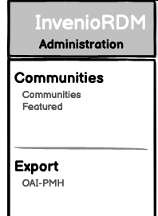
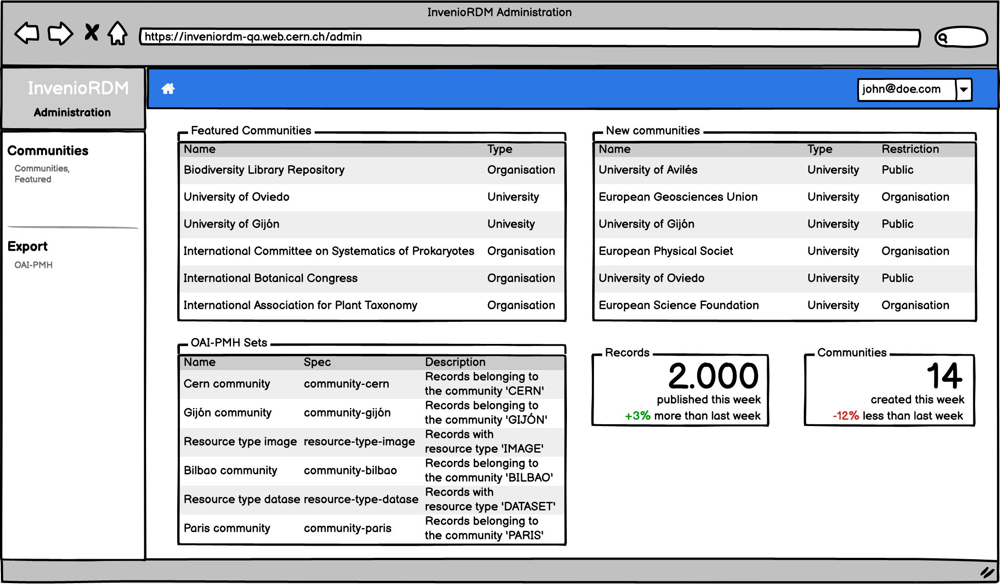
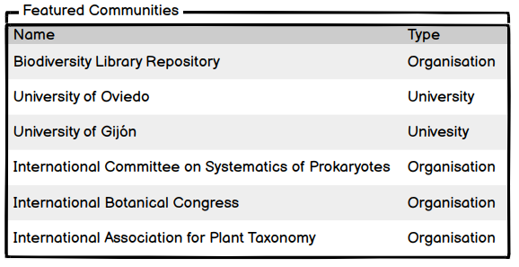
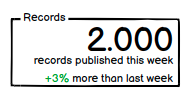
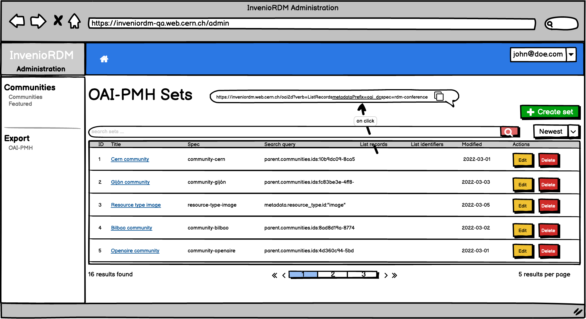
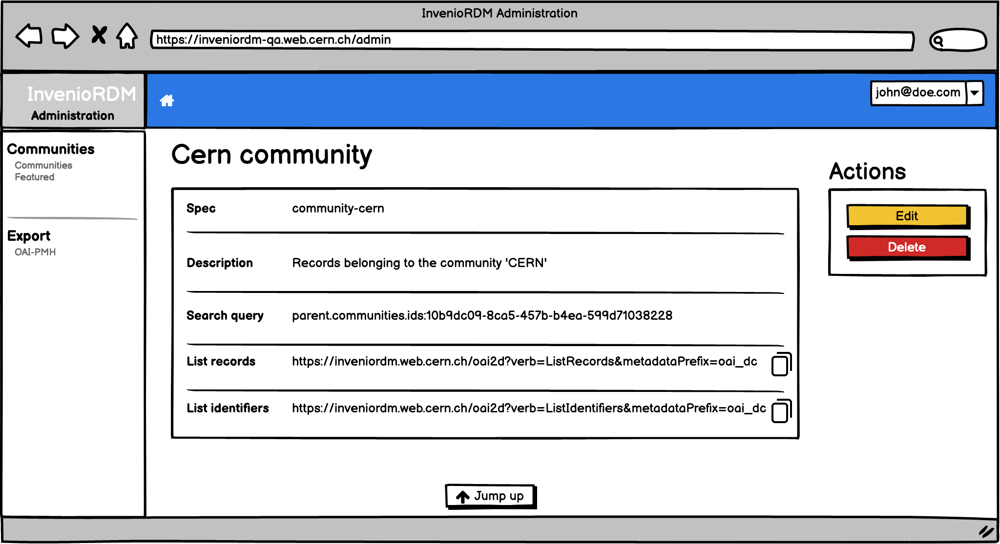
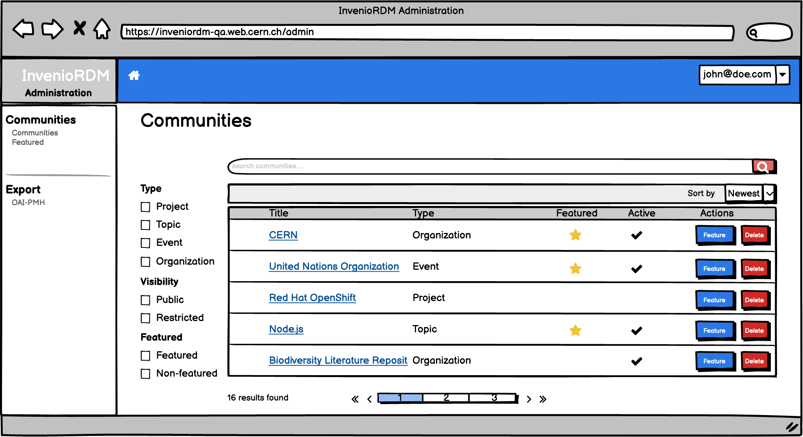
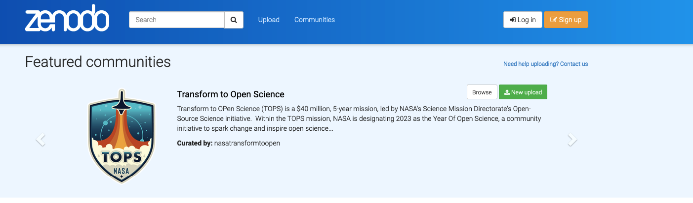
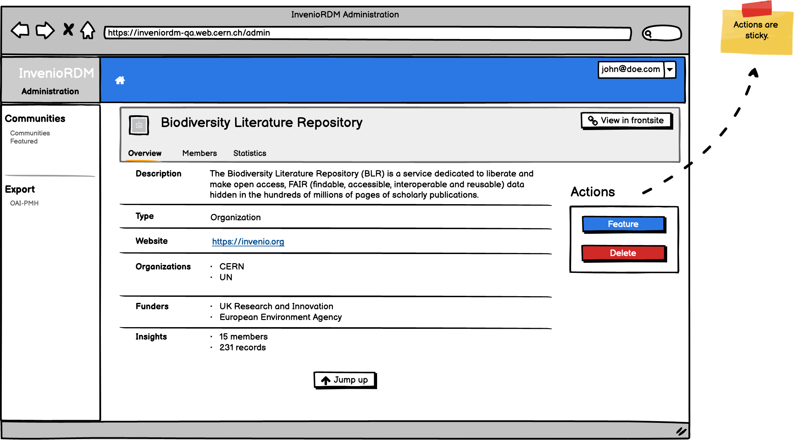
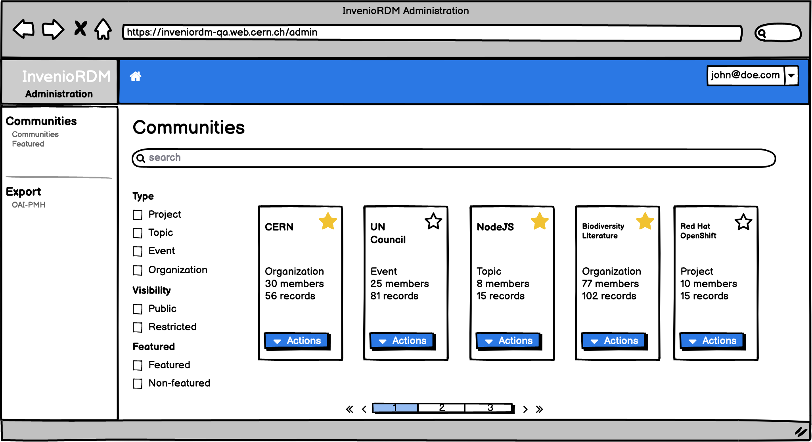

# RDM Administration panel UX

- Start Date: 2022-07-21
- Authors:
    - Karolina PRZERWA
    - Manuel Alejandro DE OLIVEIRA DA COSTA
    - Jenny Mathilde BONSAK
    - Javier ROMERO CASTRO
    - Pablo GARCIA MARCOS
    - Sergio Nicolas RODRIGUEZ CUELLAR

## Summary

This RFC describes proposed technical implementation of the core Invenio RDM administration and selected examples of its usage.
    
### Domain dictionary
    
The following terms are introduced to facilitate defining the problem

- `administration panel` - the interface panel enabling a `manager` to administrate the instance of InvenioRDM in a developer-independent way.
- `administrator` - a person with domain knowledge, with a special set of permissions, able to manage an InvenioRDM instance, not necessarily having developer skills.
- `frontsite` `end user interface` - currently known InvenioRDM interface, accessible by anonymous and logged in users, without administrator role.

## Motivation

Instance administration is a fundamental activity for repositories management. This administration will be facilitated by a tool introduced in this document.

### The problem
    
Currently, InvenioRDM provides a solution based on Flask-Admin library, which does not suit the modernised framework architecture (resource/REST API based approach) and has a poor performance.  In addition, most of the administration tasks are only performed via command line interface (CLI), which needs technical knowledge and therefore increases demand for development resources. 

In order to tackle the problem described above and to meet the demand for a robust administration tool, an implementation of a modernised administration interface is proposed below.

### Proposed solution

The solution will be introduced as a new invenio module : `invenio-administration`. It will provide a modernised, clean and easy to use interface, which will fulfil the following users' needs:
    
- a graphical, user friendly interface (UI) to efficiently perform daily operations,
- a simple way of managing a repository which does not require technical knowledge.
- easy to extend/customise interface

### Design decisions
    
During the design phase, decisions were taken based on the following invenio framework principles:

#### Consistent UI / intuitive UX
    
The administration panel will:
    
- provide as a dedicated interface (not integrated with the one provided to the end user)
- focus on needs/workflows of an instance administrator 
- having a separate access URL (`/administration`)
- not duplicate actions/elements available in the common user interface
- provide visually consistent experience
    
Dedicated (not mixed with the frontsite interface) workspace will visually alert the administrator about the higher significance (and possible consequences) of the actions they perform, decreasing the risk of unwanted modifications.
    
The detailed descriptions and mockups are described below.

#### Highly scalable
    
The administration panel will:
    
- rely on the powerful search abilities of the InvenioRDM
    
The improvement of the admin panel will include working on eliminating it's reliance on querying the database, and shifting it to Elasticsearch based queries - therefore the administration panel will be resilient to growth of the repository instance, as the rest of the framework.

#### Customizable

The administration panel will:

- facilitate the process of adding custom admin pages
- be easily overridable

#### REST first

The administration panel will:
    
- rely on the existing resource/REST API architecture

#### Security
    
The administration panel will:
    
- rely on the REST API to validate permissions
- follow the state-of-art security mechanism: i.e CSRF token protected forms, CSP (TODO)
    
#### Accessible

The administration panel will:

- follow the accesibility guidelines for the UI elements
- provide the translations and localisation in its UI elements 

## Use cases
    
- As an administrator, I want to feature a community.
- As an administrator, I want to remove a featured a community.
- As an administrator, I want to delete a community.
- As an administrator, I want to list all OAI-PMH sets.
- As an administrator, I want to create a new OAI-PMH set.
- As an administrator, I want to update a new OAI-PMH set.
- As an administrator, I want to delete an OAI-PMH set.

## Detailed design

Invenio administration interface is designed taking into account following elements:

- Menu interface
- Integration with frontsite application.
- Dashboard
- OAI-PMH sets
- Featured Communities

### Wireframes

On the proposed wireframe for the main interface we can differenciate the following sections:
- Menu
- Panel
- Navbar

An instance developer can register new entries in the menu. A menu entry will display the associated views in the panel section. The navbar menu layouts are customizable to meet the needs of the InvenioRDM instance.

### Integration with frontpage application
To access the invenio admin from the main application, the dropdown from the top right corner will be extended to display an option to access the backoffice. Alternatively, it can be directly accessed via URL.

In the invenio admin view, the logo of the instance is clickable and will redirect to the instance home page(e.g. https://inveniordm.web.cern.ch/). Moreover, a "Home" button is provided to return to the administration's home page (e.g. Dashboard).

### Dashboard
The first entry of the invenio admin menu will be the Dashboard, a customizable view that is meant to display useful content or any custom UI widget.

#### UI widget example: Currently featured communities

This UI widget will display the desired information (which can be customised by a developer) in a table view.

#### UI widget example: Basic statistic

Small UI widget that will display chosen statistics (which can be customized by a developer) for selected record types (f.e communities).

### OAI-PMH Sets
The OAI-PMH sets are managed from invenio admin due to the fact that the average instance user have no knowledge about the domain - the sets should be managed by specialized "curators" such as an instance manager.

The OAI-PMH set was selected as one of the first use cases since the resource REST API is completed in the backend.

#### List view
The list view displays all the relevant information of the OAI sets.

#### Sort options

The sort dropdown will show three available options:

#### Actions options

The actions menu shows the actions allowed to perform over a OAI set and has 2 configured actions:
- Edit
- Delete

#### Create OAI set

To create a new OAI set, a form will be displayed in a modal.

#### Edit OAI set

When editing an OAI set the `Spec` field is not editable due to limitations of the OAI protocol: the `spec` is used as unique ID.

#### Remove OAI set
When a administrator click’s the delete button, they will be presented with the following modal dialog to confirm the deletion.

#### Details view

This view displays detailed information on each set, including the respective links for each verb.

### Featured communities

The featured communities are managed from invenio admin - the set of featured communities should be curated by the instance manager to keep the featured communities well organised.

Featured communities were selected as one of the first use cases since the resource REST API is completed in the backend.

#### List view

The list view will allow to search for all the communities. 

The table displays the communities attributes organised in a table view, with selected (by the developer who configures the view) columns, and chosen actions (individually per row or in bulk). 

The search list view is equipped with a customizable set of filters to facilitate the management workflows.

##### Individual row actions menu

The actions' menu shows the actions allowed to perform over a community and has 3 possible actions: 
- Feature
- Delete

##### Actions menu: Feature community

A modal showing the planned (ahead of the time, if any) featuring for the community will be displayed. 
The start date will be pre-filled with the current date - ready to be added as a new feature for the chosen community.
When a community is featured using this modal, the page is redirected to the "Featured" menu.

After featuring a community in the administration panel, the community will be highlighted in the main page alongside other featured communities. This will be similar to what is currently displayed on [Zenodo](https://www.zenodo.org).

##### Actions menu: delete community

A simple confirmation modal will be displayed.

#### Details view

The details view display the metadata of a specific community along with some actions, previously configured on the admin core. 

The field and field value pairs are displayed in a standard "definition - description" way.

The top right actions (*Feature* and *Delete*) will open the previously described modals to feature or delete a community.

### Custom view

A custom view can be used as a replacement for the provided default views (List, Details). 

### Generic views - modeling the customizable interface.

This section describes more abstract approach to the backoffice views, which has to do with the underlying planned implementation of the extendable Invenio RDM backoffice. To see more details about the planned implementation, check [backend RFC](https://codimd.web.cern.ch/9BXwD597Q_ufUwxvCGF4CQ).

### Limitations - early development stages
- bulk actions will not be added in the first iteration due to missing service layer 
- the dashboard UI widgets will not be individually customizable - they cannot be registered to the dashboard - customized dashboards will need to be created from scratch (after the first iteration) - including the example statistic UI widget in the dashboard mockup
- customisable icons for each action are not going to be implemented in the first iteration. To do so, the view's configuration should provide the icon's name and that would create a junction point to a specific technology. Moreover, ideally backend should not be tied to any frontend's technologies.

---
# Feedback

(Northwestern University)
**Use cases**
- "As an administrator, I want to delete a community." is opposing the design principle listed above: "not duplicate actions/elements available in the common user interface". So deleting should not be part of the admin panel or is the design principle wrong? The detailed view of the community can also be skipped by the same logic which would save us work too. The backend RFC uses records with actions as an example which also counters this design decision though... Which is it?

- The _most_ demanded use cases for the backoffice from our librarians is batch operations and reporting, none of which appear here. Batch operations is marked as coming in future versions and if backend RFC is understood, reporting could be implemented ourselves. Is that right and is there a sense for timeline batch operations? I know it's an annoying question, but I get it asked at literally every meeting where this comes up. (If you have a go-to diplomatic answer in these cases let me know!)

**Communities**
(In no specific order)
- "Search for all communities": this has never worked for us for admins, so it will be fixed or maybe I am missing something. See https://github.com/inveniosoftware/invenio-app-rdm/issues/1792
- Community features should have an optional end date.
- What does the Menu link "Featured" (under Communities) link to? I am assuming a ListView of Features entities that can be edited, deleted, and filtered by community and start/end date... but want to check rather than assume. (A)
*Feature Modal*
- Title: "Feature community" -> "Feature <name of the community>"
- "Already planned for this community" -> "This community is planned to feature from:", then list timespans succinctly.
- "Select the date from which you would like to feature the community" is a mouthful. Alternative:
  "Feature <name of the community> starting and optionally ending on the following dates". Then have the datetime selections.
- "Show all on the details page" links to (A) filtered for this community only, right?

    
**Feature suggestions**
- Import/export data in JSON/XML format  with some user filtred fields (I know that the REST/API allow the import/export in JSON format but it will be useful to develop more user friendly interface to cover this feature),
    
- Manage record : Gobal modify/add/delete record ( I know that this an ILS feature but until we have the integration between the RDM and the ILS it will be useful in my opinion),
Manage Users Roles including   custom roles acess (I see in the document that  the users management is mentioned but not the management of  roles)
    
** further feedback**    
- distinguish between ui and backend is a good idea, but also on the backend RFC there are a lot of screenshots which i don't expect to be there
- the backend RFC should only list what rest endpoints are provided
- the UX RFC should also concentrate more on how the whole architecture would be to make it clearer how that would then be used and how to use the endpoints
- maybe split into three RFC's where the third is the RFC with the features and there should then be placed the oai-pmh sets widgets examples
- would it be possible to separat completely the frontend and the backend? in the sense that the python package (invenio-administration as library) is providing the rest endpoints and a react package (react-invenio-admin as library) is then providing react components for the UX
- does the widgets for the dashboard are then implemented in the invenio-administrator package or in there specific packages? in the sense where is the widget for the oai-pmh implemented? my thinking  is, every feature (widget) should be implemented in the specific invenio package. also the already provided one. as an example. the oai-pmh sets widgets could then be implemented in the invenio-oaiserver package
- in my opinion the configure by code is not a good compromise, it has to be done that way, because doing with the admin-view itself would be out of scope! i just stumbled over that wording and want to comment on it.
- i like that you plane to make it extensible!!!!
- i also think it is a good idea to have a from the whole rest different path with "/administrator"

