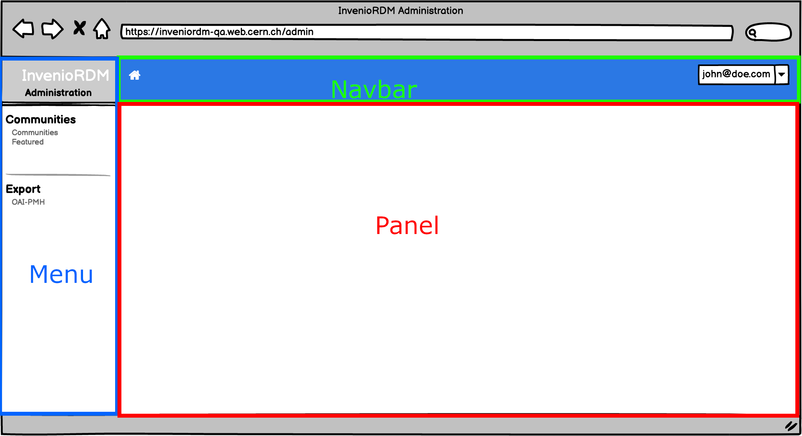
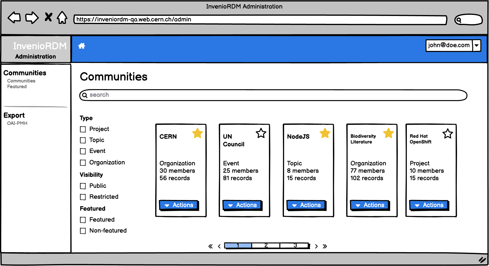

# RFC: RDM Administration panel

- Start Date: 2022-06-22
- Authors:
    - Karolina PRZERWA, 
    - Manuel Alejandro DE OLIVEIRA DA COSTA
    - Jenny Mathilde BONSAK
    - Javier ROMERO CASTRO
    - Pablo GARCIA MARCOS
    - Sergio Nicolas RODRIGUEZ CUELLAR

# Invenio Administration

## Summary

This RFC describes proposed technical implementation of the core Invenio RDM administration and selected examples of its usage.
    
### Domain dictionary
    
The following terms are introduced to facilitate defining the problem

- `administration panel` - the interface panel enabling a `manager` to administrate the instance of InvenioRDM in a developer-independent way.
- `administrator` - a person with domain knowledge, with a special set of permissions, able to manage an InvenioRDM instance, not necessarily having developer skills.
- `developer` - a person skilled in technical maintenance/development of the instance, such as a system administrator.
- `frontsite` `end user interface` - currently known InvenioRDM interface, accessible by anonymous and logged in users, without administrator role.

## Motivation

Instance administration is a fundamental activity for repositories management. This administration will be facilitated by a tool introduced in this document.

### The problem
    
Currently, InvenioRDM provides a solution based on Flask-Admin library, which does not suit the modernised framework architecture (resource/REST API based approach) and has a poor performance.  In addition, most of the administration tasks are only performed via command line interface (CLI), which needs technical knowledge and therefore increases demand for development resources. 

In order to tackle the problem described above and to meet the demand for a robust administration tool, an implementation of a modernised administration interface is proposed below.

### Proposed solution

The solution will be introduced as a new invenio module : `invenio-administration`. It will provide a modernised, clean and easy to use interface, which will fulfil the following users' needs:
    
- a graphical, user friendly interface (UI) to efficiently perform daily operations,
- a simple way of managing a repository which does not require technical knowledge.
- easy to extend/customise interface

### Design decisions
    
During the design phase, decisions were taken based on the following invenio framework principles:

#### Consistent UI / intuitive UX
    
The administration panel will:
    
- provide as a dedicated interface with a separate URL (not integrated with the one provided to the end user)
- focus on needs/workflows of an instance administrator 
- not duplicate actions/elements available in the common user interface
- provide visually consistent experience
    
Dedicated (not mixed with the frontsite interface) workspace will visually alert the administrator about the higher significance (and possible consequences) of the actions they perform, decreasing the risk of unwanted modifications.
    
The detailed descriptions and mockups are available in UX RFC.

#### Highly scalable
    
The administration panel will:
    
- rely on the powerful search abilities of the InvenioRDM
    
The improvement of the admin panel will include working on eliminating it's reliance on querying the database, and shifting it to Elasticsearch based queries - therefore the administration panel will be resilient to growth of the repository instance, as the rest of the framework.

#### Customizable

The administration panel will:

- facilitate the process of adding custom admin pages by a developer
- be easily overridable
    
The customisation and extending of the administration panel will be performed by an invenio developer. The decision was taken to keep the configuration at the code level due to high complexity of providing extensibility feature from the UI (and storing the configuration in the DB). The code based configuration is a good compromise which enables the team to provide basic solution without an added layer or complexity which slows down the process. 

#### REST first

The administration panel will:
    
- rely on the existing resource/REST API architecture

#### Security
    
The administration panel will:
    
- rely on the REST API to validate permissions
- follow the state-of-art security mechanism: i.e CSRF token protected forms, CSP (TODO)
    
#### Accessibility

The administration panel will:

- follow the accesibility guidelines for the UI elements
- provide the translations and localisation in its UI elements 
    
## Use Cases

### Core use cases

- As a developer, I want to add views to the invenio administration so that I provide custom tools to manage my RDM instance.
- As a developer, I want to easily add a invenio administration view from an invenio module, so that the module's functionalities can be handled by an instance manager.
- As a developer, I want to register a widget to be displayed on the dashboard, so that more information is provided for the instance manager.

### Specific use cases

- As a manager, I want to delete a user, so that I can remove unwanted accounts from my instance
- As a manager, I want to deactivate a user, so that I can block an account which violated the rules of instance usage.
- As a manager, I want to display a warning message on my website, so that I can announce planned instance intervention to my users.
- As a manager, I want to see the list of all the records submitted by one user, so that I have an overview on specific user's activity.
- As a manager, I want to feature a community, so that I can highlight important content on my instance.
- As a manager, I want to create a new OAI-PMH set, so that I can enable others to import content from my instance.

## Detailed design
    
### Scaffold
    


On the proposed wireframe we can differenciate following sections:
- Menu 
- Main panel
- Top navbar


    

#### Entry point from the frontsite
    


    
### Core 

Invenio administration core's design has:
- Resource centric approach.
    - Actions based on resources.
    - Security based on already existing invenio permissions policy.
- Default view to present table contained data.
- Customizable and extensible views. 
    
Invenio administration communicates solely with invenio's resources REST-APIs, using well defined contracts to do so. By being resource centric, it acts as an interface to the backend and benefits from the already existing invenio's permissions policy.
    
Invenio administration provides two default views that can be used out of the box to display data produced by resources: details view and list view. These categories were defined as the most commonly used across average administration interface. Nevertheless, it also allows these views to be extended or completely replaced by custom ones.
    
    
### Access
    
The access to admin panel will be implemented by assigning an `administration` role to specific users, who will be able to manage the instance.
    
#### Administration views
    
A view should be considered as an administration view, if it enables an administrator and only the administrator (person holding an administrator role) to perform a specific set of actions - i.e. managing specific content, managing users. The action usually requires some domain knowledge to be handled correctly, but not technical knowledge.

A generic administration view:
    
- requires an entry in the side menu
- requires to be placed in a specific category
    
Example:

- displaying an information banner on the site about planned intervention
    
#### Administration actions

The actions can be defined as administration action when:

- they fall into categories: "create", "edit", "delete", "read"
- to perform them a special (administrator) permission is needed
- they modify one of the resources supplied by the RDM application or invenio module
    
#### List view

An administration view can be defined as a resource list view when:

- an administrator should be able to display a list of records and perform searches on them
- the records have provided a resource layer
    
Invenio administration list view:

- retrieves data from a resource endpoints (list and details). 
- generates and renders a table with configurable columns per view. 
- provides search and filtering based on React Search Kit (RSK) and React Components (implied by React Search Kit)
- allows to configure which filters are visible in the view
- allows to configure which columns should be displayed on the list
- allows to override its components from RSK, a strategy well tested in invenio and proven to work well.
- provides a bulk action interface (not part of the scope of the first iterations)
- provides a button to create a new resource (record)
    


#### Details view
    
An administration view can be defined as a resource details view view when:

- an administrator needs a preview of a single resource
- an administrator needs to perform actions on the single resource (modify it, delete it, etc.)
    
Invenio administration details view:
    
- allows to configure which fields are displayed for the single resource
- allows to configure which actions are available to the administrator
- allows to customize the view's template or atomic UI components f.e. buttons.


In case of errors, a message will be shown in the modal:


#### Fully custom view

Administration views will be fully customizable by using the parent base class, and defining custom jinja template. The view will still be automatically registered under the administration menu.


### Configuration
    
```python
    
class AdministrationBaseView():
    """Base administration view configuration."""
    
    name = ""         # defines entry's name in menu
    category = ""     # defines category in menu
    template = "invenio_administration/index.html"
    title = "Administration view" # defines view title display
    category = "Views" # defines the menu category to which the view belongs to
    
   
# Base resource view   
class AdministrationResourceBaseView(AdministrationBaseView):
    """Abstract administration module configuration."""
    
    resource = "resource_config" # defines the name of the resource registered under extension
    # available actions
    
    display_edit = False   # shows/hides update action
    display_delete = False # shows/hides deletion action
    actions = {}
    pid_path = "pid"       # defines the unique identifier field within the resource
    api_endpoint = "/resource"  # defines the api enspoint of the resource
    
# Detail view
class AdministrationResourceDetailView(AdministrationResourceBaseView):
    """Generates a details view page."""
    
    item_field_exclude_list = [ ]
    item_field_list = [ ]

# List view
class AdministrationResourceListView(AdministrationResourceBaseView):
    """Generates a list view page."""
    
    display_create = False   # shows/hides create action
    display_read = True      # shows/hides detail view for a record 
    sort_options = ()
    available_filters = []
    item_field_exclude_list = [ ]
    item_field_list = []

# Custom view
class MyCustomAdministrationView(AdministrationBaseView):
    """Allows to fully customise your own view, 
       without relying on a resource."""
    
    
    name = "my_custom_view"
    template = "my_module/index.html"
```

This configuration is based on the class based views. This approach enables the possibility of easily adding new views with specific category (list, details, custom). The example of using this structure is provided in the [examples section](#Example).
    
`Api_endpoint` attribute is needed due to the dual nature of the invenio applications (we can have both api and ui aplications running together or separately, in the latter case we cannot assume or calculate the api_endpoint)

#### Dashboard view
    
The dashboard view will be provided in the first iteration as-is with a possibility of overriding the underlying template.
    
#### How to set up actions

We identify two types of actions which can be performed on a resource. Each action is associated with a schema which acts as the contract to perform an action.

1. CRUD (Create, Read, Update, Delete)

    CRUD actions are the most common type of action that can be performed on records. The permission policy is based on the resource and each action can be shown or hidden per view category.
    
    ```python
        display_edit = True   # displays/hides update action button
        display_delete = True # displays/hides deletion action
    ```

2. Resource specific actions available in `links.actions`

    Specific actions are already provided by invenio's resources, therefore benefits from the permission policy that is already computed by the service.
    
    ```python
        actions = {
            # action_key matches `links.actions.action_key`
            "action_key": {
                "text": "",             # translates to UI button label
                "schema": ActionSchema  # specifies payload to execute API request
                "order": 1
            }
        }
    ```


#### Forms to provide the action payload

The easiest would be using RJSF (React json schema forms) - since we will have the schema provided
   
    
##### React-searchkit app: list(table) view

```javascript
<ReactSearchkit>
    <TableView fields={config.column_fields}></TableView>
</ReactSearchkit>
```

config.fields example contract
    
```json
    
config = {
    column_list: [field1, field2,]  # needed later on for any UI widgets
    actions: ...
    }
```
    
Representation of the action configuration: 
    
schema - describes the payload which must be sent with the POST action, and how the UI form should be rendered.
    
```json
    actions: {
        "action_key": {
                        "schema": 
                             {"field1": {"required": False, "type":"string"}, 
                              "field2": {"required": False, "type":"date"}
                             },
                        "text": "My action"
                       }
    }
```

#### Details view: configuration payload
    
```javascript
<DetailsPage config={config}/>
```

Configuration object    
    
```json
    config = {"schema": {...resourceJsonSchema},
              "item_field_list": [
                        {"field1": {"title": "My field1"}}, 
                        {"field2": {"title": "My field2"}}, ...]
             }
```
    

## Example - how to implement an administration view

### OAI-PMH sets management view


#### Configuration of the view

```python
    
    from invenio_rdm_records.oaiserver.resources.resources import OAIPMHServerResource
    
    # List view
    class OAIAdministrationListView(AdministrationResourceListView):
    
        name = "OAI-PMH"     # defines entry's name in menu
        category = "Export"  # defines category in menu
        resource = OAIPMHServerResource
        display_edit = True
        display_delete = True
        item_field_list = [{"name": {"title": "Name"}},
                       {"spec": {"title": "Spec"}}, 
                       {"search_pattern": {"title": "Search query"}}]
    
    # Detail view
    class OAIAdministrationResourceDetailView(AdministrationResourceBaseView):

        resource = OAIPMHServerResource
        display_edit = True
        display_delete = True
        item_field_exclude_list = [ ]
        item_field_list = [{"name": {"title": "Name"}},
                       {"spec": {"title": "Spec"}}, 
                       {"search_pattern": {"title": "Search query"}}
                       {"description": {"title": "Description"}}
                     ]
```
    
### Featured communities 

    
#### List view
    


```python
    from invenio_communities.communities import CommunityResource
    
    # List view
    class FeaturedCommunitiesAdministrationListView(AdministrationResourceListView):
    
        name = "communities"
        category = "communities"
        resource = CommunityResource
    
        display_read = True
    
        actions = {
                    "featured_create": {
                                 "text": "Feature", 
                                 "schema": CommunityFeaturedSchema,
                                 "order": 1
                               }
                  }
        
```
    

#### Details view - custom template example
    


As shown in the mockup the details view includes a list of features added to the community. Therefore a custom template is needed, to add the `Featured entries` section.
    
```python
    from invenio_communities.communities import CommunityResource
    
    # Details view
    class FeaturedCommunitiesAdministrationDetailsView(AdministrationResourceListView):
    
        name = "communities"
        category = "communities"
        resource = CommunityResource
        template = "invenio_administration/communities/details.html"
    
        display_read = True
    
        actions = {"featured_create": {
                              "text": "Feature", 
                              "schema": CommunityFeaturedSchema,
                              "order": 1
                       }
                  }
        
```    
    

#### Customizing a single React component   

Example use case: a developer would like to display a list item as a card
    

    
The customisation of single UI elements is handled by react-overridable package, and can be implemented as follows:

    
```javascript
    
class MyCardComponent extends Component { 
    ...
}
    
```

`mySearch.js`
    
```JSX
    <Overridable.Context map={{"AdminListViewItem.layout": MyCardComponent}} />
       <AdminListView/>
    </Overridable.Context>
```
    


## How we teach this

The new solution will be described in details in the main InvenioRDM documentation, adding a new dedicated section.

The administration solution fits the current architecture, therefore it is consistent with what the developers' community already knows from previous implementations.

## Alternatives
    
The following solutions were analysed as alternatives:

- full SPA admin application - using existing resources to perform actions 
    PROs: each RDM instance has fully "free" hand
    CONs: not extendable, code duplication, big work overhead for any new page
- implementing admin pages separately as a mix of Jinja and react (similar to the current UI)
    PROs: no added workload due to introducing new mechanisms
    CONs: code duplication, not easily extendable
- placing some "admin" actions inside of the existing frontsite UI
    PROs: no additional "core" to be developed, only few elements
    CONs: 
          * not so easily extendable (requires custom development, and possibly a lot of configuration to disable certain features per instance)
          * no separation between site curation and actual user-facing interface (fe. OAI-PMH sets management would not easily fit into this solution, for the feature communities admin would not see easily which one will be featured in the future)
    
## Limitations
    
1. Dashboard extensibility will not be completed in the first iterations: dashboard UI widgets are not a part of this RFC.
    
    
2. The core will support only resource based views, which means that we use already existing resources (REST views) to perform administration operations
    
3. only a few basic elements will be implemented, use cases which are not covered by the resource based scenario and the "standard" table view will need to wait/be customly implemented.
    
---
# Feedback

(Northwestern University)

- "A view should be considered as an administration view, if it enables an administrator and only the administrator (person holding an administrator role) to perform a specific set of actions - i.e. managing specific content, managing users" is confusing me. Why is administration view a thing? My take:
    - Access to see an admin view (even just the admin frontpage) is determined in those "View" classes by way of the `resource` which itself will have a config which will have the permissions. So the admin frontpage could have an associated resource of sorts for re-using this pattern.
    - Any other action permission is just the action permission already defined on the resource providing this action
    - This touches on something related for us at NU. A hierarchy of roles/access levels is preferred for us because having access to the admin shouldn't translate into being able to do anything in the admin panel. At NU, the backoffice in our legacy system, could be accessed by library assistants and librarians, but only librarians could do certain things like delete a user.
- Should the code example be "OAIAdministrationListView" and "OAIAdministrationDetailsView" and basically have all "Views" follow this pattern (`<Bla>DetailsView` / `<Bla>ListView`)?
- How are the admin views linked to the application? Via entry_points I assume... but want to check rather than assume.
- Overall: smells a lot like https://docs.djangoproject.com/en/4.1/ref/contrib/admin/
