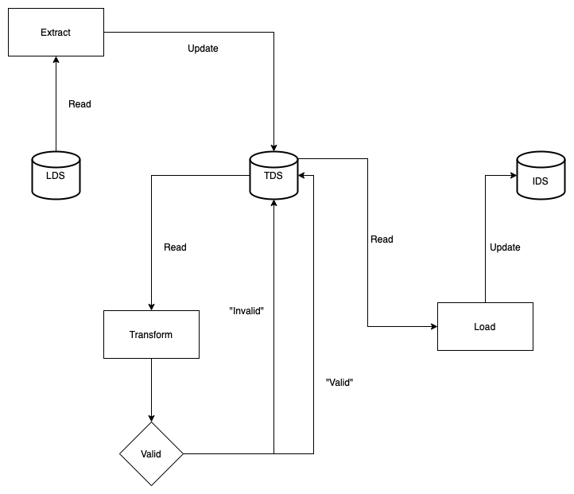

- Start Date: 2022-11-01
- RFC PR: [#68](https://github.com/inveniosoftware/rfcs/pull/68)
- Authors: Alex Ioannidis, Pablo Panero, Zacharias Zacharodimos

# RDM Migration module

## Summary

This RFC defines the business logic needed to migrate data to an InvenioRDM
instance.

## Motivation

There are many existing repositories, which already contain data. In order to
replace those by an InvenioRDM instance, their data (metadata, files, etc.)
needs to me migrated, which in most of the cases also implies modifying the
metadata to comply with InvenioRDM's schema. The higher level use case would be
something like _As a repository owner, I want the data from my old repository_
_in the new InvenioRDM instance_. However, focusing on the technical part:

- **Observability**: I want to be able to see the progress at any point in time,
  and potentially a time estimation of what is left.
- **Incremental loading**: I want to be able to run the migration process in
  stages.
- **Status management**: I want to be able to check what is the status of each
  item (e.g. record) of the migration. For example, which ones failed and why, how
  many are in progress, etc.
- **Checkpointing**: I want to be able to recover an item's migration from the
  point where it failed, without needing to re-process it from scratch.
- **Data lineage**: I want to be able to know what is the result of each step
  (e.g. each transformer), to help visualize and troubleshoot errors.
- **Data mapping**: I want to be able to define how the old repository's
  metadata maps/relates to the InvenioRDM schema.
- **Zero down-time**: I want to be able to migrate my instance without affecting
  end users usage. If downtime was needed, it must be lower than 2h.

## Detailed design

As a result, the [Invenio-RDM-Migrator](https://github.com/inveniosoftware/invenio-rdm-migrator)
module has been created. This RFC describes in detail the classes and their
responsibilities. More specific implementation details and how to extend it can
be found in the module's _README_ file.

Migrating data requires processing it, for which the ETL
(_Extract-Transform-Load_) paradigm has been proven successful in real life use
cases. In order to apply this approach to InvenioRDM, three main classes have
been created: `Extract`, `Transform`, `Load`. These are encapsulated in
`Streams`, which represent the data processing flow for a semantically
meaningful entity. For example, the migration of the _records_ entity would be
done by the _records_ stream, since its data is extracted from the origin
databases until it is loaded into the new one.

### General architecture

In the following diagram the architecture and flow of a stream is shown.

1. In the first step the `Extract` would get the data from the previous system
2. Then, enters the staging area, where it would pass one or more iterations
   over `Transform`.
3. Once the data has been processed fully, it is ready to be added to the new
   InvenioRDM instance, which will be carried out by the `Load`.



Note that in the previous diagram there are 3 datastores:

- Legacy data store (LDS), namely the source containing the data that needs to
  be migrated.
- Transformation data store (TDS) i.e staging. The data is stored here while it
  is being processed and validated. Note that it could be something simple like
  _in memory_.
- Instance data store (IDS), namely the target store of the new InvenioRDM instance.

Note that stores can be anything from json files to databases. The architecture allows
this flexibility through the extension of the 3 steps so that the user can customize
the implementation according to their needs.

#### Streams

Streams define a semantically meaningful entity or group of entities to be
processed. It can be understood as a pipe glueing together an `Extract`,
`Transform` and `Load` component.

```python
class Stream:
    """ETL stream."""

    def __init__(self, name, extract, transform, load):
        """Constructor."""
        self.name = name
        self.extract = extract
        self.transform = transform
        self.load = load

    def run(self):
        """Run ETL stream."""
        extract_gen = self.extract.run()
        transform_gen = self.transform.run(extract_gen)
        self.load.run(transform_gen)
```

The data is being piped from one component to the next as generators, to avoid
running into memory problems. Note that this also means that it is up to the
actual components to define the assumptions of the incoming/outgoing data. This
means that there is a certain implicit level of coupling between them.

#### Extract

The extract is the first part of the data processing stream. Its functionality
is quite simple: return an iterator (e.g. of records), where each yielded value
is a dictionary. Note that the data in this step is _transformed_, but only in
format (e.g. JSON, XML), not in content. For example, a `XMLExtract` class:

```python
class Extract(ABC):
    """Base class for data extraction."""

    @abstractmethod
    def run(self):
        """Yield one element at a time."""
        pass

class XMLExtract(Extract):
    """XML data extraction."""
    def run(self):
        with open("file.xml") as file:
            for entry in file:
                yield xml.loads(entry)
```

#### Transform

The transformer is in charge of modifying the content to suit the InvenioRDM
data model so it can be imported in the DB (i.e by the loader step). It will loop through
the items of the iterator returned by the extract class, transform them and yield the
resulting values.

The concept of _entry_ helps encapsulate a set of values. For example, the
`RDMRecordTransform` used to migrate from Invenio v3 to InvenioRDM not only
contains the record metadata, but also its parent, drafts, files, and so on,
since all that information was encapsulated in the same "entry" in Invenio v3.

```python
class Entry(ABC):
    """Base entry class."""

    @abstractmethod
    def transform(self, entry):
        """Transform entry."""
        pass

class Transform(ABC):
    """Base class for data transformation."""

    @abstractmethod
    def _transform(self, entry):
        """Transform entry."""
        yield Entry().transform(entry)

    def run(self, entries):
        """Transform and yield one element at a time."""
        for entry in entries:
            yield self._transform(entry)
```

Using entries allows the definition of interfaces for the resulting data, thus
making sure it is structurally valid. For example, the resulting RDM record
dictionary must contain the created and updated date, the access, the metadata,
etc. Therefore, to migrate to InvenioRDM one would only need to implement a
subclass of the corresponding `Entry`, mapping the incoming data to each field
(i.e. abstract function).

```python
class RDMRecordEntry(Entry):
    """Transform a single record entry."""

    @abstractmethod
    def _created(self, entry):
        """Returns the creation date of the record."""
        pass

    @abstractmethod
    def _updated(self, entry):
        """Returns the update date of the record."""
        pass

    # all functions used in the transform method are defined
    # as abstract methods, they have been removed from simplicity.

    def transform(self, entry):
        """Transform a record single entry."""
        return {
            "created": self._created(entry),
            "updated": self._updated(entry),
            "version_id": self._version_id(entry),
            "index": self._index(entry),
            "json": {
                "id": self._recid(entry),
                "pids": self._pids(entry),
                "files": self._files(entry),
                "metadata": self._metadata(entry),
                "access": self._access(entry),
            },
        }
```

At this point, the million dollar question, is _Why not Marshmallow?_. On the
first place, Marshmallow is slow in processing, and performance is one of the
key aspects to optimize in the migration. Then, most of the data transformation
is custom, so the resulting Marshmallow schemas would end up being purely
`Method` fields. Finally, validating (mostly referential, like vocabularies)
can only be done on/after loading the data to the new instance where there is
access to the database and application context.

#### Load

Loading the data into the new InvenioRDM instance is the last step of the
stream. The input of this step is is bounded to the programmatic API of the transform
step.
As long as the output of the transformation step is respected, then the loading mechanism
comes out of the box. That said, data needs to be validated, prepared and inserted into
the corresponding tables. The preparation step, enables optimizations such as bulk inserts or
loading from files.

```python
class Load(ABC):
    """Base class for data loading."""

    @abstractmethod
    def _validate(self):
        """Validate data before loading."""
        pass

    @abstractmethod
    def _prepare(self):
        """Prepare data for loading."""
        pass

    @abstractmethod
    def _load(self):
        """load data."""
        pass

    def run(self, entries):
        """Load entries."""
        for entry in entries:
            if self._validate(entry):
                self._prepare(entry)
                self._load(entry)
```

The current implementation of `PostgreSQLCopyLoad` makes use of one or more
`TableGenerator`. These generators create a csv file per table (they can output
more than one table, e.g. records and drafts), which then will be used to `COPY`
in bulk in the `_load` call being hundreds of times more performant than
executing one `INSERT` per row.

#### Shared Cache

Streams might have interdependencies. Therefore during a migration run, there is
a need to pass information from one stream to another. For example, the records
stream needs information about the community ids and slugs, which comes from the
communities stream.

A similar case can happen between `TableGenerators`. For example, the records
stream must keep track of the parent ids. Record's versions are migrated
independently but share the parent id, therefore, these ids need to be kept in
the shared cache and update its information (e.g. which is the latest version
of the record).

## Future work / Unresolved Questions

### State handling

The current implementation has no state handling. Data is piped through the
stream and will either succeed or fail, but there is no observability or
checkpointing. This is also due to the fact that the staging store is
_memory_.

Below is defined a potential set of states that would solve this problem:

- Default
  - status: `TRANSFORMATION_INIT`.
- Transform:
  - initial: `TRANSFORMATION_INIT`.
  - if fails, `TRANSFORMATION_FAILED`.
  - if succeed, `TRANSFORMATION_SUCCEEDED`.
- Load:
  - initial: `VALIDATION_INIT`.
  - if validation fails, `VALIDATION_FAILED`. Once the validation error is
    identified (manual intervention), for example wrong transformation, status
    `TRANSFORMATION_INIT`.
  - if validation succeeds, `LOAD_INIT`, the record is valid and can be loaded
    in the new InvenioRDM database.
  - if loading fails, `LOAD_FAIL`, after identifying the issue if it needs
    re-processing then `TRANSFORMATION_INIT`.
  - if loading succeds, `LOAD_SUCCEED`. Records will be marched as loaded.

| layer     | status                | original record | transformed record | valid |
| :-------- | :-------------------- | :-------------- | ------------------ | ----- |
| Transform | `TRANSFORMATION_INIT` | original        | null               | no    |
| Transform | `TRANSFORMATION_FAIL` | original        | null               | no    |
| Load      | `VALIDATION_INIT`     | original        | transformed record | no    |
| Load      | `VALIDATION_FAIL`     | original        | transformed record | no    |
| Load      | `LOAD_INIT`           | original        | transformed record | yes   |
| Load      | `LOAD_FAIL`           | original        | transformed record | yes   |
| Load      | `LOAD_SUCCEED`        | original        | transformed record | yes   |

Note that all states will contain the original and current state of the record,
this data lineage gives the needed flexibility to re-process when needed and the
observability to know what failed.

### Monitoring

Monitoring is needed at task level, meaning how many items are being process
at the moment, how many are left, etc. and also at application level, to have
details in case of failures (e.g. transformer). The second one could be achieved
by connecting a Sentry instance and configuring the Python logger.

### Persistance

Using _memory_ as a staging store means that any intermediate state is lost
in case of errors.

### Checkpointing

Tasks cannot be resumed from where they failed since no state is saved.

### Dependencies between streams

Streams are run sequentially, therefore the order can be enforced when
configured.

#### Referential validation

The validation step on `Load` would ideally be run on the destination InvenioRDM
instance, by reading data from the staging store. At this step data could be
validated, e.g. do all the vocabularies, the communities to which the record
belongs, etc. already exist?.

## Literature review and Other technologies

Since the ETL paradigm is a popular one, there are many existing tools and
libraries. The following table shows the tools that were researched, and why
they were discarded. The _needed connectors_ refers to out-of-the-box support
for PosgreSQL, Elasticsearch/OpenSearch and running Python scripts (needed for
the transformation part).

| Tool                                                        | Open Source | Needed Connectors | Comment                                                                                    |     |     |     |     |
| :---------------------------------------------------------- | :---------: | :---------------: | :----------------------------------------------------------------------------------------- | :-- | --- | --- | --- |
| [Hevo Data](http://hevodata.com)                            |     No      |         -         | Commercial                                                                                 |     |     |     |     |
| [PowerBI](https://powerbi.microsoft.com/en-au/)             |     No      |         -         | Commercial                                                                                 |     |     |     |     |
| [CloverDX](http://Cloverdx.com)                             |     No      |         -         | Commercial                                                                                 |     |     |     |     |
| [Visual Flow](https://visual-flow.com)                      |     Yes     |        Yes        | Cannot find the docs                                                                       |     |     |     |     |
| [KETL](https://www.linuxlinks.com/ketl/)                    |     Yes     |         ?         | Cannot find the docs                                                                       |     |     |     |     |
| [Singer](https://www.singer.io/)                            |     Yes     | No Elasticsearch  | Lightweight message passing, CLI based (No UI), poor monitoring/state management           |     |     |     |     |
| [Pentaho Kettle](https://github.com/pentaho/pentaho-kettle) |     Yes     |        Yes        | Oriented towards Hadoop/YARN ETL Processes                                                 |     |     |     |     |
| [Mara Pipelines](https://github.com/mara/mara-pipelines)    |     Yes     |        No         | Code-cenetered pipelines definition, no enforcing of framework/concept, poor documentation |     |     |     |     |
| [Airbyte](https://airbyte.com/)                             |     Yes     |      Unclear      | Focused on EL(T), Transformations via SQL queries (after loading)                          |
| [Apeche NiFi](https://nifi.apache.org)                      |     Yes     |  No, only Jython  | No support for python scripts, script calls proof sub-performant.                          |

### Performance

Performance tests were carried out. The chose unit of measurement is 3M
records, taking into account data transformation and insertion, without
files migration nor data validation. Note that the tests were not carried on the same hardware
so they might be slightly skewed, however, the difference is still
significative enough to justify the choice of implementation of
Invenio-RDM-Migrator.

|           Method            | Time 3M |
| :-------------------------: | :-----: |
|         Apache NiFi         |  2.5d   |
|     InvenioRDM services     |  7h30   |
| RDM-Migrator implementation |  4h30   |
