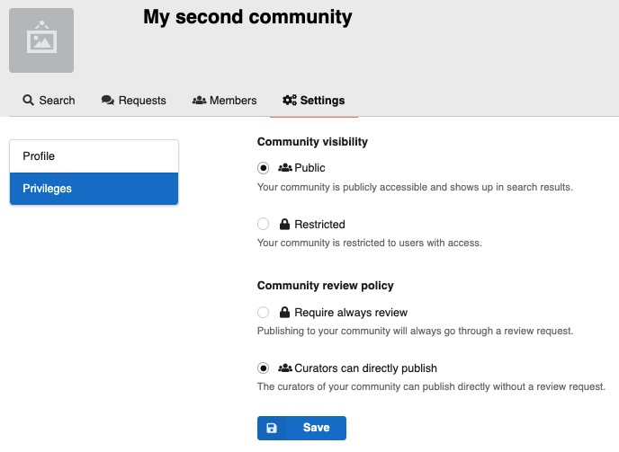
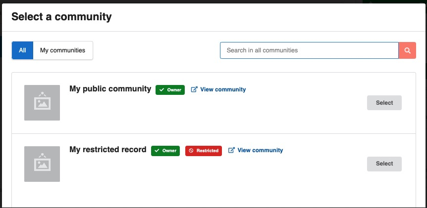
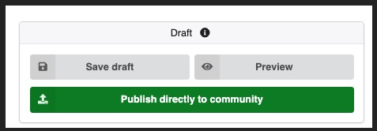
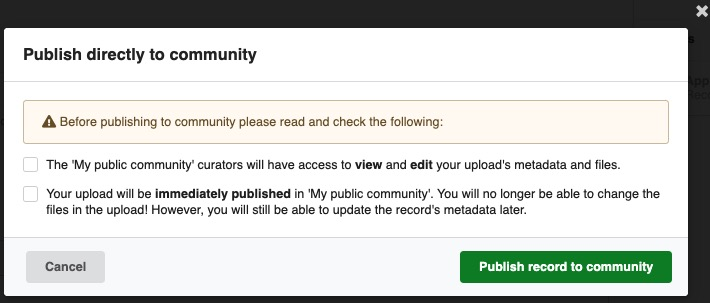
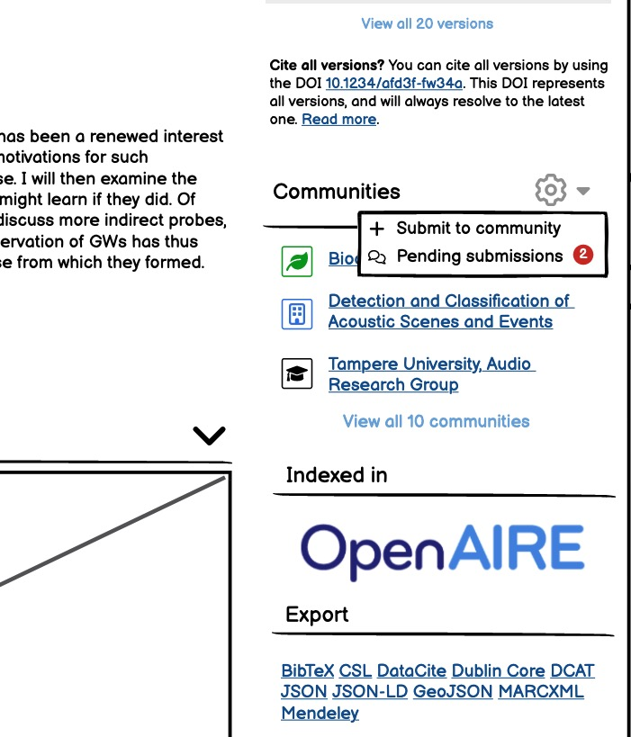
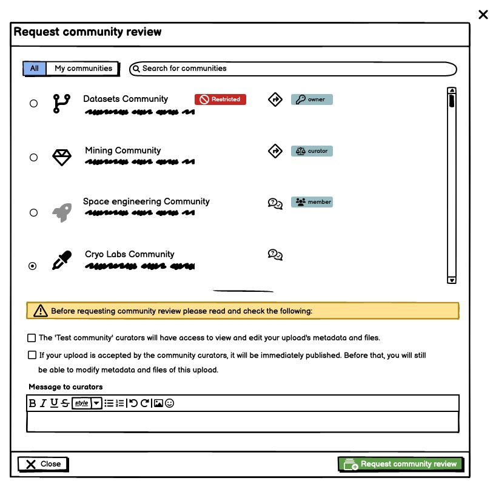
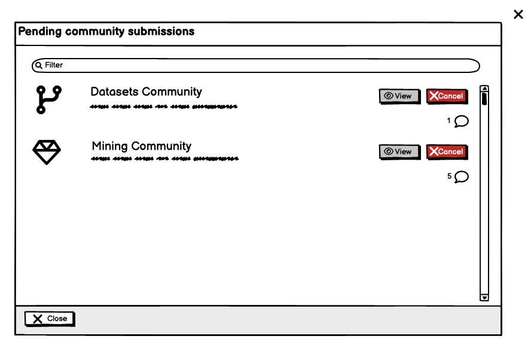
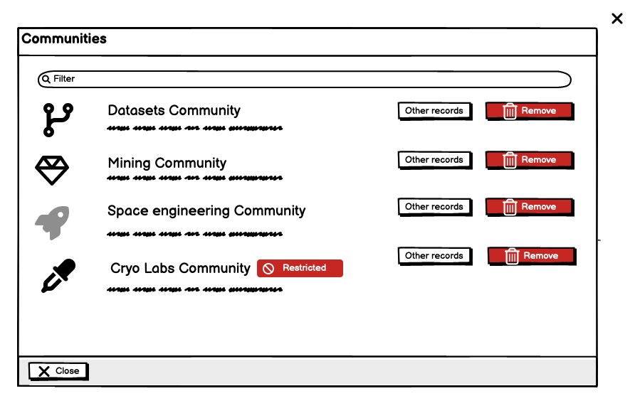

- Start Date: 2023-01-30
- RFC PR: [#70](https://github.com/inveniosoftware/rfcs/pull/70)
- Authors: Nicola Tarocco, Zacharias Zacharodimos, Pablo Panero
- State: DRAFT

###### tags: `RDM` `RFC`

# Advanced community submissions

## Summary

This RFC covers:
- submit an already published record to multiple communities
- remove a record from a community
- auto-submit to a community, without a review process

## Motivation

- As an uploader, I want to publish the record in multiple communities relevant to my research.
- As an uploader, I want to change the community where my record is published: I will remove it and add to another one.
- As a curator, I want to remove a record that should not belong to my community.
- As a curator, I want to directly upload a new record to my community, without going through a request process that I will have to accept.

## Detailed design

### Preconditions and constraints

- Community owners can set if a curator can direct publish to the community, without a request, or if a request should be always be created.
- A newly uploaded record can be published only in **one** community or in **no** community. Uploader cannot select multiple communities before the first publish.
- After the record is published, the uploader can add it to multiple communities.
- The uploader can remove the record from any community.
- A community's curator can remove the record only from the community (s)he curates, and not from other communities.
- A public record cannot be submitted to restricted communities.
- A restricted record can be submitted to a public community.
- A restricted record can be submitted to multiple restricted communities, not public ones.

### Direct publish

- A new setting in each community allows owners to define if submission should always go through the review process, or curators (or managers and owners) can "direct-publish", meaning that a request is created by immediately automatically accepted.
- The setting corresponds to a specific new permission.
- Defaults: everyone is required to go through an inclusion request, `closed` setting.



#### Data model changes

- Add a new field `community.access.review_policy`:
    - `open`: specific users can direct publish, if the permission policy allows
    - `closed`: no user can direct publish, every submission goes through a review request
- Add the field to the `community.access` system field

#### Implementation changes

- The new permission `can_direct_publish` is added in `CommunityPermissionPolicy`. The permission allows only community curators to direct publish when the `community.access.review_policy` is `open`. Otherwise, none is allowed.

    ```python
    class CommunityPermissionPolicy(BasePermissionPolicy):
        ...
        can_direct_publish = [
            IfPolicyClosed(
                "review_policy",
                then_=[Disable()],
                else_=[CommunityCurators()],
            ),
        ]
    ```

- The UI will need to retrieve if the current logged-in user can direct publish or not, so that a message can be displayed to the user when selecting the community, for example in the upload form or when submitting to multiple communities.

    When retrieving a community via REST APIs, the new field `can_direct_publish` will indicate if the current user can direct publish or not:

    ```python
    def get_permissions(self, obj):
        ...
        can_direct_publish = permission_check(
            "direct_publish",
            community=obj,
        )
        return {
            "can_direct_publish": can_direct_publish,
        }
    ```

    ```json
    ...
        ui: {
          permissions: {
            can_direct_publish: false,
          },
        },
    ...
    ```

- When retrieving a draft record via REST APIs, the new field above will also be added to `parent.review.receiver` when it is a community:

    ```python
    ...
    def add_communities_permissions_and_roles(self, obj, **kwargs):
        """Inject current user's permission to community receiver."""
        receiver = (
            obj.get("expanded", {}).get("parent", {}).get("review", {}).get("receiver")
        )
        if receiver:
            can_direct_publish = _community_permission_check(
                "direct_publish", community=receiver, identity=g.identity
            )

            receiver.setdefault("ui", {})["permissions"] = {
                "can_direct_publish": can_direct_publish
            }
        return obj
    ...
    ```

- The implementation `review` service that `submit` a review will change and it will:
    - check if the `receiver` community allows direct publish
    - if the submitted `can_direct_publish`, the submitted request will be automatically accepted.
- UI - Upload form - In the community's selection modal, the community's role of the current user will be visible in each list item:
    

- UI - Upload form - Once the user selects a community for which (s)he allowed to directly publish, the Submit button of the form will change to "Publish without review" and the confirmation modal will describe what will happen:
    
    

### Remove community/communities from record

The same REST API endpoint `/api/records/<pid_value>/communities` used for submissions to multiple communities will enable the removal of the record’s communities. Only record owners and community curators can remove the community from the record.

The permission will check that, for each provided community id, only the uploader and the curator of that community only can perform this action. A curator of community A cannot remove the community B from the record.

Example request:

`DELETE /api/records/<pid_value>/communities`

```json
{
    communities: [
        {id: <id1>},
        {id: <id2>},
        ...
    ]
}
```

The implementation will simply call the system field `remove` API method `record.parent.communities.remove(community_id)`.

Given that this is a bulk operation, the system will try to perform the removal of each community. The response code of the operation will always be 200. A list of errors will be returned in this form:

```json
{
    errors: [
        {
            "community": community_id,
            "message": _("The record does not belong to the community.")
        }
    ]
}
```

A new dedicate service will implement the `remove` operation.

See UI mockups below.

### Remove record(s) from community

A new REST API endpoint `/api/communities/<pid_value>/records` will enable the removal of the records that belong to a community.

Example request:

`DELETE /api/communities/<pid_value>/records`

```json
{
    records: [
        {id: <id1>},
        {id: <id2>},
        ...
    ]
}
```

The request will be handled by the already existing `community records` service, in a new `delete` method.
The implementation will call the service to remove a community from a record for each of the provided records. The response will be similar to the above.

### Submission to multiple communities

The submission to multiple communities will be enabled after the first publish. Therefore, there is no need to go through a `review` process. However, depending on each community policy, records might be  directly published (with au auto-accepted inclusion request) or an inclusion request will be created for the community's curators.

A new REST API endpoint `/api/records/<pid_value>/communities` will enable operations on the record's communities.

`POST /api/records/<pid_value>/communities`

```json
{
    communities: [
        {id: <id1>},
        {id: <id2>},
        ...
    ]
}
```

The implementation will partially use the feature to submit a review, refactoring the submission and the optionally accept operations to make them re-usable.
This will allow to isolate the permission and community's policy check in one re-usable place, to avoid duplications and errors.

As for the removal, this will be a bulk operation and the system will try to perform the addition of each community. The response code of the operation will always be 200. A list of errors will be returned in this form:

```json
{
    errors: [
        {
            "community": community_id,
            "message": _("The record is already included in this community.")
        }
    ]
}
```

- UI - Landing page - List of communities where the record is included and manage buttons:
    

- UI - Landing page - Add the record to a community:
    

- UI - Landing page - Manage pending inclusions:
    

- UI - Landing page - Remove record from community:
    

## How we teach this

The technical names of these features in the documentation should be:
- Include a record to multiple communities.
- Depending on the settings of each community, the record might be published directly or a review request will be created.

The reference architecture in the InvenioRDM documentation will be updated with:
- A description of all the business logic rules and constraints related to all the features above.
- The REST APIs reference will be updated with the new endpoints, success and error responses.

## Alternatives

The submission to multiple communities *before* the first publishing was evaluated but discarded for the following reasons:
- On submission for review, a new request per community will be created. The user or the community's owner will not know which one is the first community that will publish the record, where it will be published, and it cannot be controlled.
- Multiple communities might curate the record differently before publishing.

The feature of having read-only/listing communities, where the community owners cannot curate the record, has been discarded: the primary purpose of a community is curation and it would be hard to make it clear to users when/why a record can be curated or not.

A feature to group records with the purpose of simply listing them, read-only, might be discussed in the future: it is clear that it should not be designed around communities.

## Unresolved questions

- When a request is automatically accepted, thanks to direct publish policy of the community, do we want to add a comment/event in the request to state this? e.g. `Request automatically accepted by the system because...`. If yes, translation should be supported.

## Out of scope

- The change of branding of a record, when submitted to new communities, will not be addressed in this RFC and set of features.
- The deletion of a community will be addressed in another RFC.
