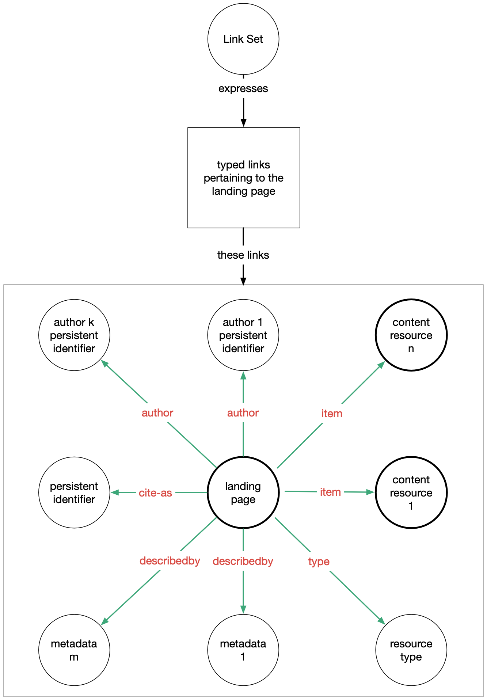
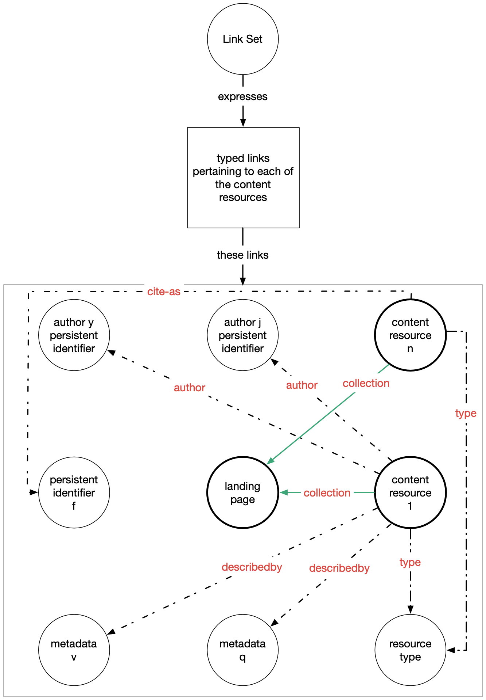
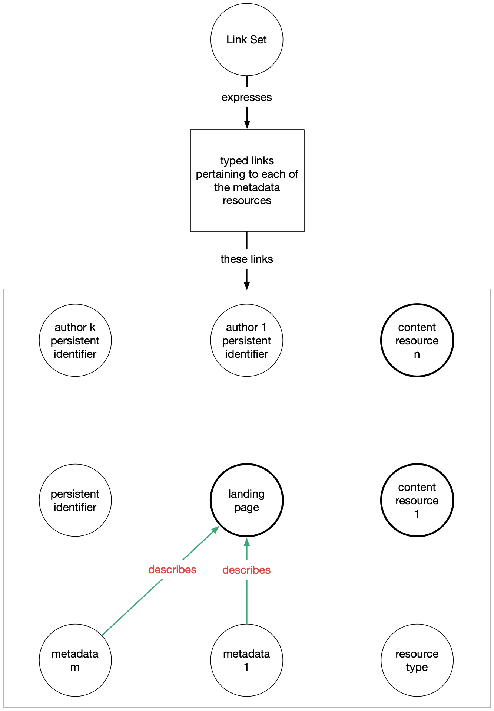

- Start Date: 2023-08-01
- RFC PR: [#XXX]()
- Authors: Guillaume Viger

# Signposting in InvenioRDM


## Summary

Signposting is an interoperable means to structure discovery of scholarly web resources for machine agents. Under its FAIR Signposting Profile Level 2 implementation, it consists of providing a Link Set link in the headers of specific HTTP responses on InvenioRDM, and providing an associated endpoint for that Link Set link. The Link Set endpoint returns a mapping of source-target links with some additional information that outline the web geography of the scholarly resources.

Signposting is a nascent standard described here: https://signposting.org/FAIR/#level2 and recommended as a next-generation repository feature by COAR here: https://ngr.coar-repositories.org/technology/signposting/ . We encourage visiting the former link as it presents a complete picture of Signposting which this RFC will not repeat.


## Motivation

Signposting is an interoperable means to structure discovery of scholarly web resources for machine agents. It is straightforward for humans to visit an InvenioRDM record landing page and discover links to DOIs, ORCIDs, content files, metadata formats, and so on. For a machine agent, the meaning behind the myriad of links is not self-evident and establishing a scraping logic for every different platform is not a scalable solution for client discovery tools. Signposting provides a Link Set for machine agents to navigate each resource in an InvenioRDM instance.

*Use cases*

- As a machine agent, I want to clearly identify the scholarly links associated with a resource.
- As the developer of a scholarly discovery tool, I wan to rely on a standardized, universal format for link crawling.
- [Other scholarly repositories](https://signposting.org/adopters/) such as DSpace, Dataverse, OJS have implemented it in their recent releases.


## Detailed Design

### Add a Link Set link to the header of

*the landing page response*:

```
> curl --head /records/<pid_value>
Content-Type: text/html; charset=utf-8
Content-Length: 7082
...
Link: <https://inveniordm.example.org/api/records/<pid_value> ; rel="linkset" ; type="application/linkset+json"
```

*the content resource response (download)*:

```
> curl --head /records/<pid_value>/files/<filename>
Content-Type: text/html; charset=utf-8
Content-Length: 7082
...
Link: <https://inveniordm.example.org/api/records/<pid_value> ; rel="linkset" ; type="application/linkset+json"
```

This applies to all files of a record. This is optional according to the FAIR Signposting Level 2 specification as it may not always be the case that the instance has control over the headers of the download response since that resource may be hosted elsewhere. In so far as InvenioRDM serves the download, we should add the header link, but we make no guarantee when file serving is done through a third-party.

*the metadata resource response (content-negotiated representations)*

```
> curl --head /api/records/<pid_value> --header 'Accept-Content: <supported mimetype>'
Content-Type: <supported mimetype>; charset=utf-8
Content-Length: 7082
...
Link: <https://inveniordm.example.org/api/records/<pid_value> ; rel="linkset" ; type="application/linkset+json"
```

### Provide an application/linkset+json endpoint

Provide a `application/linkset+json` serializer for the RDM record. The output of that serializer is of the form:

```json
{
  "linkset": [
    // Landing page Link Set Object
    {
      "anchor": <url>,
      "author": <value>,
      "cite-as": <value>,
      "describedby": <value>,
      "item": <value>,
      "license": <value>,
      "type": <value>,
    },
    // Content resource Link Set Object(s)
    {
      "anchor": <url>,
      "collection": <value>
    },
    ...,
    // Metadata resource Link Set Object(s)
    {
      "anchor": <url>,
      "describes": <value>,
      "type": <value>,
    },
    ...
  ]
}
```

Each object in `linkset` (referred as Link Set Object or LSO for short) has an `anchor` identifying the source of the link. Other keys in each LSO are either targets from that link or additional metadata. Each LSO provides a description of the web geography of the resources from the point of view of each different related resource. Repeated information is omitted as per indicated in the tables below.

Each target's (e.g., `"cite-as"`, `"author"`, ...) format is defined in the original spec. We follow those descriptions, but adapt their cardinality and mapping for InvenioRDM:

#### Typed links pertaining to the Landing Page (record detail page)


*(from https://signposting.org/FAIR/)*


| key         | cardinality | InvenioRDM            |
|-------------|-------------|-----------------------|
| author      | 0..*        | First identifier link for each `metadata.creators` |
| cite-as     | 0..1        | DOI link if it exists                         |
| describedby | 0..*        | Links for each mimetype serizalization |
| item        | 0..*        | Links for each `files.entries` with `"type"` provided by `mimetype` |
| license     | 0..*        | Link to license |
| type        | 2           | First link to schema.org resource type, second link to `"https://schema.org/AboutPage"` |

If there are 0 occurences for a key, the key will be absent from the object altogether.

#### Typed links pertaining to Content Resources (files)


*(from https://signposting.org/FAIR/)*


| key         | cardinality | InvenioRDM            |
|-------------|-------------|-----------------------|
| author      | 0        | Authorship is defined at a record level in InvenioRDM i.e., it is not distinct from the one defined in typed links for landing page, so per the spec, this field is skipped. |
| cite-as     | 0        | The PID is defined at a record level in InvenioRDM i.e., it is not distinct from the one defined in typed links for landing page, so per the spec, this field is skipped. |
| collection  | 1        | Link from the download url back to the landing page with `"text/html"` as the `"type"` of the landing page  |
| describedby | 0        | The metadata formats are defined at a record level in InvenioRDM i.e., they are not distinct from the ones defined in typed links for landing page, so per the spec, this field is skipped. |
| license     | 0        | Licensing is defined at a record level in InvenioRDM i.e., it is not distinct from the one defined in typed links for landing page, so per the spec, this field is skipped. |
| type        | 0        | The resource type is defined at a record level in InvenioRDM i.e., it is not distinct from the one defined in typed links for landing page, so per the spec, this field is skipped.                                              |

There is one such entry for each files of a record. Per above, in practice, only the `collection` link will be present in each entry.

If there are 0 occurences for a key, the key will be absent from the object altogether.


#### Typed links pertaining to Metadata Resources (mimetype format representation)


*(from https://signposting.org/FAIR/)*


| key         | cardinality | InvenioRDM            |
|-------------|-------------|-----------------------|
| describes   | 1           | Link to the landing page. |
| type        | 1           | The mimetype of the metadata resource (added to spec) |

There is one such entry for each of the `describedby` metadata serialization in *Typed links pertaining to the Landing Page (record detail page)* above.

Because the `anchor`s for these LSOs would be the same without mimetype specification, we add a `type` field to specify each. This is an addition to the original specification.


## Example

An example Link Set response:

```console
> curl /api/records/<pid_value> --header 'Accept-Content: application/linkset+json'
```

body:

```json
{
  "linkset": [
    // Landing page Link Set Object
    {
      "anchor": "https://127.0.0.1:5000/records/12345-abcde",
      "author": [{"href": "https://orcid.org/0000-0001-8135-3489"}],
      "cite-as": [{"href": "https://doi.org/10.5281/inveniordm.1234"}],
      "describedby": [
        {
          "href": "https://127.0.0.1:5000/api/records/12345-abcde",
          "type": "application/json",
        },
        {
          "href": "https://127.0.0.1:5000/api/records/12345-abcde",
          "type": "application/marcxml+xml",
        },
        {
          "href": "https://127.0.0.1:5000/api/records/12345-abcde",
          "type": "application/vnd.citationstyles.csl+json",
        },
        {
          "href": "https://127.0.0.1:5000/api/records/12345-abcde",
          "type": "application/vnd.datacite.datacite+json",
        },
        {
          "href": "https://127.0.0.1:5000/api/records/12345-abcde",
          "type": "application/vnd.geo+json",
        },
        {
          "href": "https://127.0.0.1:5000/api/records/12345-abcde",
          "type": "application/vnd.datacite.datacite+xml",
        },
        {
          "href": "https://127.0.0.1:5000/api/records/12345-abcde",
          "type": "application/x-dc+xml",
        },
        {
          "href": "https://127.0.0.1:5000/api/records/12345-abcde",
          "type": "text/x-bibliography",
        },
        {
          "href": "https://127.0.0.1:5000/api/records/12345-abcde",
          "type": "application/dcat+xml",
        },
      ],
      "item": [
        {
          "href": "https://127.0.0.1:5000/records/12345-abcde/files/big-dataset.zip",
          "type": "application/zip",
        }
      ],
      "license": [{"href": "https://customlicense.org/licenses/by/4.0/"}],
      "type": [
        {"href": "https://schema.org/Photograph"},
        {"href": "https://schema.org/AboutPage"},
      ],
    },
    // Content Resource (file) Link Set Object
    {
      "anchor": "https://127.0.0.1:5000/records/12345-abcde/files/big-dataset.zip",
      "collection": [
        {
          "href": "https://127.0.0.1:5000/records/12345-abcde",
          "type": "text/html",
        }
      ],
    },
    // Metadata Resource (mimetype format representation) Link Set Object
    {
      "anchor": "https://127.0.0.1:5000/api/records/12345-abcde",
      "describes": [
        {
          "href": "https://127.0.0.1:5000/records/12345-abcde",
          "type": "text/html",
        }
      ],
      "type": "application/json",
    },
    {
      "anchor": "https://127.0.0.1:5000/api/records/12345-abcde",
      "describes": [
        {
          "href": "https://127.0.0.1:5000/records/12345-abcde",
          "type": "text/html",
        }
      ],
      "type": "application/marcxml+xml",
    },
    {
      "anchor": "https://127.0.0.1:5000/api/records/12345-abcde",
      "describes": [
        {
          "href": "https://127.0.0.1:5000/records/12345-abcde",
          "type": "text/html",
        }
      ],
      "type": "application/vnd.citationstyles.csl+json",
    },
    {
      "anchor": "https://127.0.0.1:5000/api/records/12345-abcde",
      "describes": [
        {
          "href": "https://127.0.0.1:5000/records/12345-abcde",
          "type": "text/html",
        }
      ],
      "type": "application/vnd.datacite.datacite+json",
    },
    {
      "anchor": "https://127.0.0.1:5000/api/records/12345-abcde",
      "describes": [
        {
          "href": "https://127.0.0.1:5000/records/12345-abcde",
          "type": "text/html",
        }
      ],
      "type": "application/vnd.geo+json",
    },
    {
      "anchor": "https://127.0.0.1:5000/api/records/12345-abcde",
      "describes": [
        {
          "href": "https://127.0.0.1:5000/records/12345-abcde",
          "type": "text/html",
        }
      ],
      "type": "application/vnd.datacite.datacite+xml",
    },
    {
      "anchor": "https://127.0.0.1:5000/api/records/12345-abcde",
      "describes": [
        {
          "href": "https://127.0.0.1:5000/records/12345-abcde",
          "type": "text/html",
        }
      ],
      "type": "application/x-dc+xml",
    },
    {
      "anchor": "https://127.0.0.1:5000/api/records/12345-abcde",
      "describes": [
        {
          "href": "https://127.0.0.1:5000/records/12345-abcde",
          "type": "text/html",
        }
      ],
      "type": "text/x-bibliography",
    },
    {
      "anchor": "https://127.0.0.1:5000/api/records/12345-abcde",
      "describes": [
        {
          "href": "https://127.0.0.1:5000/records/12345-abcde",
          "type": "text/html",
        }
      ],
      "type": "application/dcat+xml",
    },
  ]
}
```


## How we teach this

The https://signposting.org/FAIR/#level2 is fairly approachable and comprehensive. It's a good recommended reading.

Marketing material can also be used to advertise our support of the standard. Our status as adopters should be added to the https://signposting.org/adopters/ page.


## Drawbacks

n/a


## Alternatives

Headers could be added via `ResponseHandler`. But this makes them available / have to account for other HTTP method then just GET. Since the Link Set link header is only required on a GET, it made more sense to override `RecordResource::read()` and add the header there only.


## Unresolved questions / caveats

Signposting should ideally be applied to the headers of the content files themselves, but this may not be possible for files hosted on third party platforms. It is a difficulty the original signposting spec recognizes and we acknowledge it here.

Describes link may have multiple same anchor pointing to same landing page when the mimetype of the anchor is what differentiates it. We've added `"type"` in those for that purpose.


## Resources/Timeline

One FTE (Guillaume) until first pass completion. Ideally it could be part of InvenioRDM v12.
