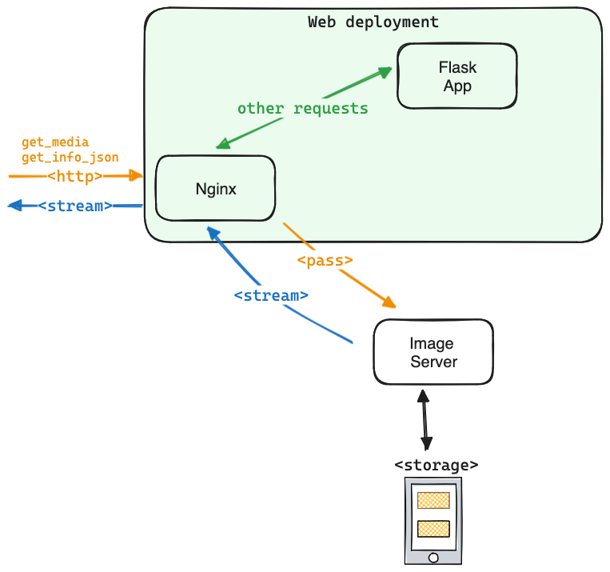

- Start Date: 2024-04-08
- RFC PR: [#<PR>](https://github.com/inveniosoftware/rfcs/pull/<PR>)
- Authors: Alex, Fatimah, Manuel, Pablo, Yash
- State: DRAFT / IMPLEMENTED

# Fast IIIF previewer

## Summary

We propose to integrate a production-scale IIIF Image Layer server in InvenioRDM and precompute tiled images for all image uploads. This will allow users to view images of any size in an advanced previewer with zoom functionality and display image thumbnails in a fast and efficient manner without overloading the main application server.

## Motivation

- As a user, I want to be able to view high-resolution images in an smooth interactive zoomable previewer, so that I can quickly assess the content of the image.
- As a user, I want to be able to view thumbnails of images in a record, so that I can quickly get an overview of the content.
- As a developer, I want to be able to serve images in a fast and efficient manner, so that I my main application server is not slowed down by IIIF image requests.


---


## Detailed design

### Image Tile Generation

#### Installation

Image tile generation will require the installation of the [`libvips`](https://github.com/libvips/libvips) C library and of the [`pyvips`](https://github.com/libvips/pyvips) Python binding library.

A check will be added in the `invenio-cli check-requirements` command.

There will be a feature flag `IIIF_GENERATE_TILES` to enable or disable the image tile generation. If the feature flag is enabled and one of the libraries is missing, an error will be raised. The check for the libraries availability will be achieved by doing the following:

```python
try:
    import pyvips
    HAS_VIPS = True
except ModuleNotFoundError:
    # Python module pyvips not installed
    HAS_VIPS = False
except OSError:
    # Underlying library libvips not installed
    HAS_VIPS = False
```

The `libvips` library is not available in AlmaLinux, nor in Fedora's EPEL (see [libvips issue with more details](https://github.com/libvips/libvips/issues/1184)), so the recommended solution is to use the repository provided by Remi Collet from Red Hat like this:
```dockerfile
# libvips is not available in EPEL
# so we install the Remi repository configuration package
# See: https://github.com/libvips/libvips/issues/1184
RUN dnf install -y http://rpms.remirepo.net/enterprise/remi-release-9.rpm

# Command to enable the repository
RUN dnf config-manager --set-enable remi # TODO: Does not seem to be needed.

# Install libvips
RUN dnf install -y vips
```

#### Generation process

The Celery tasks will use [`pyvips`](https://github.com/libvips/pyvips) for computing pyramidal TIFFs for each IIIF-compatible image in a record. The command parameters recommended to generate these files from the IIP Server docs is:

```python
try:
    source_image = pyvips.Image.new_from_file("source_image.png")
    source_image.tiffsave(
        "output_image.tif",
        tile=True,
        pyramid=True,
        compression="jpeg",
        Q=90,
        tile_width=256,
        tile_height=256,
    )
except pyvips.Error:
    current_app.logger.exception("Image processing with pyvips failed")
```

The `pyvips` library also allows to work with file streams (see the ["Custom sources and targets" documentation](https://github.com/libvips/pyvips/blob/master/doc/intro.rst#custom-sources-and-targets)):

```python
input_file = open(sys.argv[1], "rb")
source = pyvips.SourceCustom()
source.on_read(input_file.read)

output_file = open(sys.argv[2], "wb")
target = pyvips.TargetCustom()
target.on_write(output_file.write)

image = pyvips.Image.new_from_source(source, '', access='sequential')
image.write_to_target(target, '.png')
```

Image tiles will be generated when a record is published via low-priority Celery tasks.

Since Celery doesn't have a concept of priority for queues, we can change the type of queues and configure the amount of workers reading from each queue to prioritize tasks. For the implementation, we plan to run segregated workers in separate pods so we can scale the number of pods when required.


#### Image formats supported

The following table outlines the compatibility of different image formats with `pyvips`:

| Format | Pyvips → .tif |
|:------ |:------------- |
| JPEG   | Y             |
| PNG    | Y             |
| TIFF*  | Y             |
| BMP    | Y             |
| RAW    | Y             |
| PDF    | Y             |
| WEBP   | Y             |
| HEIF   | Y             |
| DCM    | N             |
| GIF    | N             |
| EPS    | N             |
| SVG    | N             |

**Testing with different parameters**

- ESO Images
Input Folder: 1.08 GB
Number of Files: 30

| Q      | Compression | tile size | Output Folder | Conversion Time   |
| ------ | ----------- | --------- | ------------- | ----------------- |
| **90** | **jpeg**    | **256**   | **2.77 GB**   | **47.34 seconds** |
| 90     | jpeg        | 512       | 2.76 GB       | 44.69 seconds     |
| 90     | lzw         | 256       | 8.25 GB       | 201.40 seconds    |
| 80     | jpeg        | 256       | ~700 MB       | 40.88 seconds     |


#### Storage

Tiles for each record's files are generated and stored in configured location, using the `IIIF_TILES_STORAGE` variable, accepting a class that implements the `TilesStorage` interface (NOTE: design not final):

```python
class TilesStorage:

    def __init__(self, *, converter: ImageConverter):
        self.converter = converter

    def save(self, record: RDMRecord, filename: str):
        pass

    def open(self, record: RDMRecord, filename: str):
        pass

    def delete(self, record: RDMRecord, filename: str):
        pass


class LocalTilesStorage(TilesStorage):

    def __init__(self, *, base_path: str, **kwargs):
        self.base_path = Path(base_path)
        super().__init__(**kwargs)

    def _get_file_path(self, record: RDMRecord, filename: str):
        # Partition record.id into 3 chunks of min. 2 characters (e.g. "12345678" -> ["12", "34", "5678"])
        # See mathcing regex at https://regex101.com/r/6B3IuT/1
        path_partitions = [...]
        return self.base_path / Path(*path_partitions) / record.id / filename

    def save(self, record, filename):
        outpath = self._get_file_path(record, filename)
        if outpath.exists():
            return

        with record.files[filename].open("rb") as fin, outpath.open("wb") as fout:
            if not self.converter.convert(fin, fout):
                # Log that conversion didn't work

    def open(self, record, filename):
        return self._get_file_path(record, filename).open("rb")

    def delete(self, record, filename):
        self._get_file_path(record, filename).unlink()
        return True


# Converters
class ImageConverter:

    def convert(self, in_stream, out_stream) -> bool:
        pass


class PyVIPSImageConverter(ImageConverter):

    def __init__(self, params=None):
        self.params = params or {
            "compression": "jpeg",
            "Q": 90,
            "tile_width": 256,
            "tile_height": 256,
        }

    def convert(self, in_stream, out_stream):
        try:
            source = pyvips.SourceCustom()
            source.on_read(in_stream.read)

            target = pyvips.TargetCustom()
            target.on_write(out_stream.write)
            image = pyvips.Image.new_from_source(source, "", access="sequential")
            image.tiffsave(target, tile=True, pyramid=True, **self.params)
            return True
        except pyvips.Error:
            current_app.logger.exception("Image processing with pyvips failed")
            return False
```

Some considerations for the storage:

- It should be able to handle a large number of files and directories.
    - Partitioning on the record ID is a good way to avoid running out of inodes.
- It should be able to handle concurrent writes and reads.
- It should optimize performance for (partial) reads of small/medium-sized files (1-100MB).

### Routing IIIF requests to an Image Server (e.g. IIPServer)

**Endpoints to be routed**

We have identified two endpoints that can be routed to the IIPServer:

- Info API: `/api/iiif/<uuid>/info.json`
- Image API: `/api/iiif/<uuid>/<region>/<size>/<rotation>/<quality>.<image_format>`

The IIPServer exposes two endpoints that can be used for both the Image and Info API.

IIPServer supports FastCGI, which can be setup to route the requests using a proxy that sits in front of the flask application, e.g. Nginx. However, such proxies are not always used in the environment where the instance is running, i.e. during local development. That being said, we need to consider two distinct solutions to route the requests if an external IIIF service is setup.

**Case 1 - no reverse proxy**

When the request does not pass through a reverse proxy, e.g. Nginx, the request will directly reach the Flask application. At this point, it can be proxied to the Image Server, if any.


In this scenario, the request is handled by the flask application which creates a request to the Image Server and streams the result back.

We have implemented a prototype in InvenioRDM which can be configured by instance, and disabled if needed. The idea is to create an interface of a IIIF image server proxy that can be reused and extended by different implementations, i.e. for a IIPServer integration:

```python
class IIIFProxy(ABC):
    """IIIF image server proxy interface.

    The purpose of this class is to provide a consistent way of proxying
    requests to an IIIF image server.

    To use this class, you should create a subclass that implements the
    required methods and use it by calling its instance.

    Example usage:

    .. code-block::python

        class MyIIIFProxy(IIIFProxy):
            def proxy_request(self):
                # Implementation specific to the IIIF server proxy

            def handle_url_rewrite(self):
                # Implementation specific to the IIIF server proxy

        # Instantiate the proxy
        proxy = MyIIIFProxy()

        # Proxy the current request if it should be proxied
        proxy()
    """

    @property
    def proxied_routes(self):
        """List of routes that should be proxied."""
        return []

    @property
    def server_url(self):
        """IIIF server URL."""
        raise NotImplementedError("IIIF server must be set.")

    @abstractmethod
    def proxy_request(self):
        """Proxy the current request to IIIF server."""

    @abstractmethod
    def handle_url_rewrite(self):
        """Handle URL rewrite."""

    def should_proxy(self):
        """Check if the curent request should be proxied."""
        return False

    def __call__(self):
        """Proxy request to IIIF server if the endpoint is configured."""
        if self.should_proxy():
            return self.proxy_request()
        return None

```

This can be then implemented as a specific `IIPServerProxy`, which can be enabled via config and then used in the desired routes. E.g.

```python
class IIPServerProxy(IIIFProxy):
    @property
    def server_url(self):
        """IIP server URL."""
        # TODO or get by config
        return "http://127.0.0.1:8080/iiif/"

    @property
    def proxied_routes(self):
        """List of routes that should be proxied."""
        return ["iiif.image_api", "iiif.info"]  # image info and base

    def handle_url_rewrite(self):
        """Handle URL rewrite.

        For IIPServer, we need to match the folder structure where the images are stored.
        I.e. /<recid>/<filename>
        """
        from urllib.parse import urljoin

        uuid = resource_requestctx.view_args["uuid"]
        recid = uuid.split(":")[1]
        file_name = uuid.split(":")[-1]
        path = request.path
        path = path.replace("/iiif/", "").replace(uuid, f"{recid}/{file_name}")
        return urljoin(
            self.server_url,
            path,
        )

    def should_proxy(self):
        """Check if request should be proxied."""
        return request.endpoint in self.proxied_routes
```

This can be integrated with the IIFResource via config and enabled in the desired endpoint(s):

```python
class IIIFResourceConfig(ResourceConfig):
    ...
    proxy_cls = FromConfig(
        "IIIF_PROXY_CLASS",
        default=None,
    )

class IIIFResource(Resource):

    @property
    def proxy_enabled(self):
        """Check if proxy is enabled."""
        return self.config.proxy_cls is not None

    @property
    def proxy_server(self):
        """Get the proxy configuration."""
        return self.config.proxy_cls() if self.proxy_enabled else None


    @proxy_if_enabled
    def image_api(self):
        ...

    @proxy_if_enabled
    def info(self):
        ...
```

And then enabled on-demand in the instance:

```cfg
# e.g. invenio.cfg

from invenio_rdm_records.resources.iiif import IIPServerProxy
IIIF_PROXY_CLASS = IIPServerProxy
```

**Case 2 - using a proxy (e.g. Nginx)**

If a L7 proxy is being used, then it is responsible to pass the request to the IIPServer and stream back the response.

This is the expected scenario of a production environment, where the request does not need to reach the flask application.



For this, Nginx must be setup in a way that the desired endpoints are routed through a different path, e.g. by configuring a `location` block that matches the desired endpoints and routes the request to the IIP server hosting the images.

### Authentication and private/restricted record images

> TLDR: We only serve public images (for now)

In order to keep authentication simple, but extensible, in this implementation we'll only focus on serving public images via the IIPImage server. The basic premise is:

- We generate pyramidal TIFF images on first publish for all records. If a record is...
    - Public: we store the generated images under a `/images/public/` directory
    - Private/restricted: we store the generated images under a `/images/private/` directory
- If the user edits the record's visibility, on publish we move the already generated image files to the appropriate directory
- The IIPImage server is configured to serve images from the `/images/public/` directory only

#### Caveats

**Delayed visibility changes**

There might be a brief moment where a private image is visible to the public via the IIIF Image APIs, even though the record is published as private. This is due to the fact that the image manipulation happens via Celery tasks, which are asynchronous and will take some time (depending on the queue load) to finish after the record is published. A mitigtation for this problem would be to exceptionally perform this operation synchronously, but this would slow down the publish process (speed depends how the underlying storage is configured).

**Access to private images**

The IIPImage server is configured to serve images from the `/images/public/` directory only. This means that private images are not accessible via the IIIF Image APIs. This is a conscious decision to keep the implementation simple and to avoid the need to implement complex authentication mechanisms.

Private images tiles are still generated though and stored in the `/images/private/` directory. This is done to avoid the need to re-generate the tiles when the record is made public, and keep things future-proof when implement authentication for private images.

Some ideas for future work on this topic:

- Auth in app and X-Accel-Redirect
    - We use the usual logic in the Flask/Invenio app to authenticate the request
    - Before actually serving the file, we use the `X-Accel-Redirect` header to redirect the request to the actual image file
    - This way we can use the same auth logic for both the app and the image server
    - This is similar to how we use `X-Accel-Redirect` for authenticating and offloading file downloads to EOS on Zenodo
    - Pros
        - Simple to implement
        - No need to implement auth in the image server
    - Cons
        - We need to go through the "slow" Flask/Invenio app for every request
            - This could be mitigated with caching the permission check

- Token based auth on `nginx`
    - In the Flask app, we generate a short-lived (30min) signed token and set it as an HTTP-only cookie on the previewer request (`/records/<id>/preview/<filename>`)
    - On nginx, we use the `access_by_lua_block` (or `auth_request`, TBD) directive to validate the token
        - If the token is valid, we successfully proxy the request to the image server
        - If the token is invalid, we return a 401
    - We should be careful not to match the `info.json` and in general IIIF presentation layer endpoints, since these have to go the Flask app
    - Pros
      - Fast, as we don't need to go through the Flask app all the time
    - Cons
      - Doesn't work for REST API usage (i.e. someone just hitting the IIIF endpoint directly, like e.g. Ocellus)
      - We need some "heavier" logic in nginx
        - Not sure what kind of default modules are available in the nginx that comes with the Docker image


Example nginx configuration:

```nginx
# NOTE: Route matching not final/correct
location /api/iiif/record: {
    # Reference the Lua script to validate the cookie
    access_by_lua_block {
        local cookie = ngx.var.cookie_iiif_auth
        if cookie then
            local hmac = require "resty.hmac"
            # Split cookie value and signature (format: "cookie.signature")
            local cookie, cookieSig = cookie:match("([^%.]+)%.(.+)")
            # Should be loaded from env (and be the same as in the Flask app)
            local hmac_sha256 = hmac:new("my-secret-key", hmac.ALGOS.SHA256)
            local isValid, sig = pcall(hmac_sha256.verify, hmac_sha256, cookieSig, "expected signature")

            if not isValid or not sig then
                ngx.exit(ngx.HTTP_UNAUTHORIZED)
            end
        else
            ngx.exit(ngx.HTTP_UNAUTHORIZED)
        end
    }
}
```

- Separate auth server
    - We could also run a separate auth server that would handle the authentication in a quick manner
    - That could be a "fast" Python or Go server that would quickly make the auth check.
        - For public records, just check if the file is in the `/images/public/` directory
        - For private records, perform the full auth check

## Example

> Show a concrete example of what the RFC implies. This will make the consequences of adopting the RFC much clearer.

> As with other sections, use it if it makes sense for your RFC.

Also see [Motivation](#Motivation).

### UX flow and transitional states

```sequence
User->Web: Create draft
User->Web: Upload image to draft
User->Web: Preview draft
Note right of Web: No pre-generated tiled pyramid TIFF for drafts
Web-->User: The live thumbnail is shown
User->Web: Publish record
Web->Worker: Trigger generation of tiled pyramid TIFF
Worker->Storage: Store "pending" status
Note right of Worker: Worker starts generating tiled pyramid TIFF...
User->Web: Display record
Web->Storage: Check status of tiled pyramid TIFF
Storage-->Web: Current status is "pending"
Web-->User: The live thumbnail is shown
Note right of Worker: Worker finshes generating tiled pyramid TIFF
Worker->Storage: Store "success" or"error" status
User->Web: Display record
Web->Storage: Check status of tiled pyramid TIFF
Storage-->Web: Current status is "success"
Web-->User: Mirador shows the pre-generated tiled pyramid TIFF
```

### Mockups

Draft preview:


Pending processing:


## How we teach this

* The documentation will be updated to describe:
    * The feature flag in the [configure](https://inveniordm.docs.cern.ch/install/configuration/) section.
    * The optional requirement for `libvips` and `pyvips` in the [system requirements](https://inveniordm.docs.cern.ch/install/requirements/) section.
* A demo of this feature will be presentated at an InvenioRDM Telecon.

## Drawbacks

> Why should we *not* do this? Please consider the impact on teaching Invenio, on the integration of this feature with other existing and planned features, on the impact of the API churn on existing apps, etc.

> There are tradeoffs to choosing any path, please attempt to identify them here.

### Routing IIIF requests to IIPServer

For IIPServer, the source images must be in a multi-resolution format. For instance, if we pass a ".tif" file, it fails and the server exits. We need to either protect the server or understand the consequences this could have in our deployed environments - particularly in OpenShift.

## Alternatives

> What other designs have been considered? What is the impact of not doing this?

> This section could also include prior art, that is, how other frameworks in the same domain have solved this problem.

### Routing IIIF requests to IIPServer

We have considered two other options to route IIIF requests to the image API through the IIPServer:

1) Using the invenio redirector feature
2) ProxyMiddleware [Werkezeug](https://werkzeug.palletsprojects.com/en/3.0.x/middleware/http_proxy/)

The redirector does not support streaming, i.e. the whole request is redirected, and the behavior on the client side is to simply follow the redirect. E.g. the browser redirects the user to `http://<iipserver_url>/iiif/...`. Moreover, the redirector is widely used in ZenodoRDM but not in InvenioRDM.

On the other hand, using `ProxyMiddleware` is possible but it does not support proxying specific routes. I.e. only `/api/iiif/*` is allowed. This can be bypassed by developing our own implementation of a `ProxyMiddleware`, overriding the endpoint match mechanism (currently this means we need to override the `__call__` method). Moreover, using this strategy requires changes in core modules of invenio (e.g. `invenio-base`), given that this is a middleware that has to wrap the flask application, something that is done when the app is created. There is a similar functionality used in invenio, to setup a `ProxyFix`.


## Unresolved questions

> Optional, but suggested for first drafts. What parts of the design are still TBD? Use it as a todo list for the RFC.

### Image Tile Generation

It is not clear yet in which module the image tile generation code should be implemented. It could be implemented in:
* `invenio-records-resources` where [the images width and height are extracted with `wand` and `ImageMagick`](https://github.com/inveniosoftware/invenio-records-resources/blob/master/invenio_records_resources/services/files/processors/image.py).
* `invenio-rdm-records` where [the IIIF server is implemented](https://github.com/search?q=repo%3Ainveniosoftware%2Finvenio-rdm-records%20iiif&type=code).
* `invenio-app-rdm` as feature.

### Image Server

IIPServer uses `lighthttpd` and it is not clear whether we can abandon it. It comes by default with the docker installation, however the server supports FastCGI.

It is not clear what kind of `pass` Nginx does (e.g. `fastcgi_pass` or `proxy_pass`) to the IIPServer.

For scaling, IIPServer mentions that multiple instances can be setup and load balanced over. However, it is not clear yet what are the implications for scaling the IIPServer in our deployed environments in OpenShift. E.g. how is the load balancing done, at which level, etc.

If IIPServer is to be used in production, the Nginx proxying could happen in the web deployment or even before (e.g. when proxying the request to the `web` deployment in OpenShift).

Moving from only `/public/` mount to supporting multiple, e.g. `/public/` and `/private/`.


### UX analysis

- In the landing page preview, the previewer should work with pyramidal tiff, or the user should be made aware that the preview of the image will not be there until the publishing of the record
- How does it behave for a user when the tiles are being generated but not there yet?
- How does it behave for a user when the file cannot be generated due to a problem?
- How does it behave for a user during the time lapse right after a visibility change?

## Resources/Timeline

There is 14 weeks of work (or about 3.5 people during 4 weeks) allocated to this feature.

The schedule is:
* W15 (2024-04-08 - 2024-04-12): Initial design
* W16 (2024-04-15 - 2024-04-19): Implementation
* W17 (2024-04-22 - 2024-04-26): Implementation
* W18 (2024-04-29 - 2024-05-03): Finalization and production deployment

---

### Publish hook and state management

- Depends on https://github.com/zenodo/zenodo-rdm/issues/777

```python
from invenio_rdm_records.proxies import current_rdm_records_service as service

class TilesProcessor(FileProcessor):

    def __init__(valid_exts=["tif", "tiff", "ptif"]):
        self.valid_exts = valid_exts

    def _can_process(...):
        if file.extension not in self.valid_exts:
            return

    def __call__(self, record, draft, filename, uow):
        mf = record.media_files.create(f"{filename}.ptif", data={
            "processor": {
                "type": "image-tiles",
                "status": "init",
                # TODO: could also be just `mf.updated`
                "updated_at": datetime.now().isoformat(),
                "props": {
                    "vips_version": "8.15.2",
                    "processing_time": 23.45,
                }
            },
            "access": {"hidden": True}
        })
        uow.register(TaskOp(generate_image_tiles, record.id, filename))


# POST /api/records/{id}/draft/actions/publish
def on_publish(self, record, uow=None, first_publish=False):
    # TODO: Take care of the first_publish case, when files have changed. Note that this
    # should be done before the MediaDraftFileComponent, since we want to be able to see if
    # any files have changed.

    # 1. Initialize the image tiles media file for each compatible file
    for file in record.files:
        for file_processor in self.files_processors:
            if file_processor.can_process(file):
                file_processor.process(file, record, uow)


@shared_task
def generate_image_tiles(record_id, filename):
    record = service.record_cls.pid.resolve(record_id)

    # TODO: 0. Check state...

    # 2. Kick-off the work
    mf = record.media_files[filename]
    mf["processor"]["status"] = "running"
    mf["processor"]["updated_at"] = datetime.now().isoformat()
    mf.commit()
    db.session.commit()

    # 3. actually do the work
    try:
        tiles_storage.save(filename, filename)
        mf["processor"]["status"] = "finished"
    except Exception:
        mf["processor"]["status"] = "failed"
        # TODO: retry logic here...
    finally:
        db.session.commit()
```