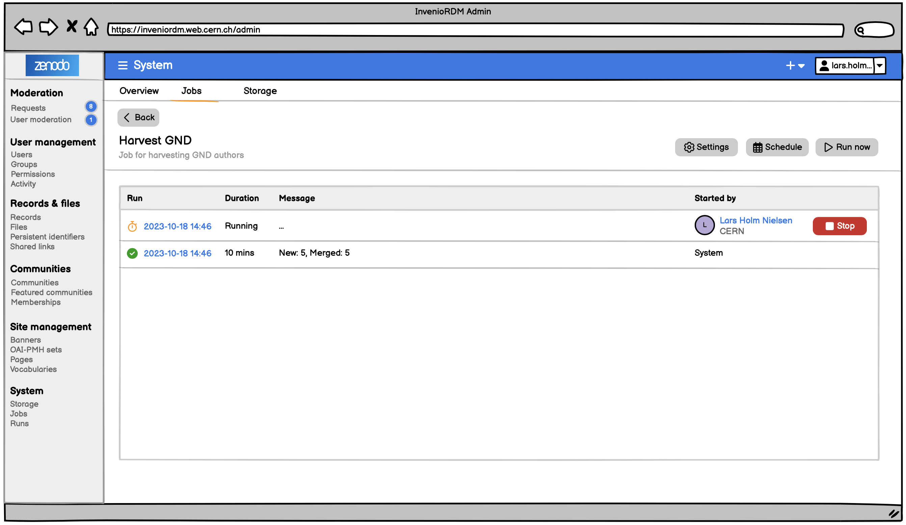

# Job system

## Motivation

- As an admin, I want to control the job schedule from the administration interace, so I can easily manage jobs
- As an admin, I want to see the status of job runs, so I can troubleshoot issues
- As an admin, I want to create new jobs


## Prior work

- Celery supports [custom schedulers](https://docs.celeryq.dev/en/latest/userguide/periodic-tasks.html#using-custom-scheduler-classes). We could look into a solution similar to [django-celery-beat](https://github.com/celery/django-celery-beat)
    - Port in a new Invenio/Flask module logic from [`schedulers.py`](https://github.com/celery/django-celery-beat/blob/main/django_celery_beat/schedulers.py) and [`models.py`](https://github.com/celery/django-celery-beat/blob/main/django_celery_beat/models.py)

## Design

### Jobs

- A **job** is a background task being executed regularly according to a defined schedule. A job can be active/inactive.
- A **job run** is the result of the execution of task.
- A **job schedule** determines the regular execution of the background task.

#### Example jobs

- Harvesting of vocabularies
- File integrity report (not the checks)
- Cleaning: IPs, Sessions, Draft resources, Caching
- Expired: Embargo, Requests
- DataCite updater (e.g. after a schema change)
- Sitemap updater
- Data life-cycle retention
- Metrics sending to OpenAIRE

#### Example of non-jobs

Following are examples of Celery tasks that are not jobs as they run with very high frequency or are one off task:

- Indexer
- File integrity checks
- DOI registration

### Administration interface

- List all jobs and see:
    - Title, last run (time, status, started_by), next run
    - Actions: Edit, Run .., Delete, Clone
    - Actions: Create
- Edit job
- List job runs
    - Start time, result, message, started_by, args, queue
    - Actions: Edit, Run, Delete, Clone





### Data model

#### Job

| Field         | Type      | Required | Description           |
|:------------- | --------- | -------- | --------------------- |
| id            | uuid (pk) | ✅       |                       |
| active        | bool      | ✅       | To pause the schedule |
| title         | text      | ✅       |                       |
| description   | text      |          |                       |
| task          | text (cv) | ✅       |                       |
| default_queue | text      | ✅       |                       |
| default_args  | json      |          |                       |
| schedule      | json      |          |                       |
| created       | datetime  | ✅       |                       |
| updated       | datetime  | ✅       |                       |
| last_run      | uuid (fk) |          | Computed/fetched      |
| run_count     | int       |          | Computed?             |
| permissions   | json      |          | E.g. to limit access  |
| auto_retry    | bool      |          | Not priority          |
| notify        | json      |          | Not priority          |

- `default_args`
  - One-time values (URL, file pathm etc.)
  - Dynamic values (ex: OAI-PMH - take timestamp from the last successful run)
- `schedule`
  - `None` (i.e. for when we only trigger a "run" from the Admin UI)
  - A dictionary with a `type` field of either:
      - `crontab`, and fields for `minute`, `hour`, `day_of_week`, `day_of_month`, `month_of_year`
      - `interval`, and fields matching the [`datetime.timedelta` kwargs](https://docs.python.org/3/library/datetime.html#datetime.timedelta), i.e. `days`, `seconds`, etc.
      - (optional) `solar`, allows specifying schedules like "At sunrise, Geneva time"

#### Runs

| Field      | Type      | Required | Description                                |
| ---------- | --------- | -------- |:------------------------------------------ |
| id         | uuid (pk) | ✅       |                                            |
| job_id     | uuid (fk) | ✅       |                                            |
| started_by | int (fk)  |          | User ID/None (None - Means the system)     |
| title      | text      |          | Optional note/title, e.g. for a manual run |
| start_time | datetime  |          |                                            |
| end_time   | datetime  |          |                                            |
| status     | enum/str  | ✅       | See below for vocabulary                   |
| task_id    | uuid      |          | Celery task id                             |
| message    | text      |          |                                            |
| args       | json      |          | snapshot of args received                  |
| queue      | text      | ✅       |                                            |

- `status`
  - Possible values: `pending`, `running`, `success`, `failure`, `warning`, `stopped`
  - Check if celery stop works reliably in a distributed worker setting

### Scheduler

- Permissions: Admin
- A Celery task that cleans up expired runs (distinguish between success/failures).
- A wrapper around celery tasks to log information
- A mechanism to update the schedule when it is edited
- Stopping a currently executing job: how does task regularly check if it's aborted
- A mechanism to initialise/update the job schedule

### Programmatic API

#### Defining a job

```python
from invenio_jobs.api import Job

job = Job.create(
    title="File integrity checks report",
    celery_task="invenio_app_rdm.tasks.file_integrity_report",
    default_args={
        "recipients": ["admin@ineniosoftware.org", "it-operations@uni.edu"],
        "include_failures": True,
    },
    # Every Monday at 09:00 UTC
    schedule=crontab(minute=0, hour=9, day_of_week=1),
)
db.session.commit()

job.next_run.isoformat()
# 2024-05-20T09:00:00+00:00

# ...1 week later, after the job has run once...
last_run = job.last_run
print(last_run)
# <Run(
#     job="File integrity checks report",
#     status=success,
#     message="Report sent",
#     started_by=system,
#     duration=1m42s
# )>
```

#### Starting a job run manually
```python
run = job.run(
    queue="low",
    start_at=(datetime.now() + timedelta(hours=2)),
    args={
        "recipients": ["alex@inveniosoftware.org"]
    },
)
print(run)
# <Run(
#     job="File integrity checks report",
#     status=pending,
#     started_by=<User(123)>,
#     start_time=datetime(2024, 5, 15, 14, 0, 0),
# )>
```

#### Checking if a job is aborted

```python
job.last_run.status
# RunStatusEnum.CANCELLED
```

#### Logging a job progress

```python
logger.info("...")
```

opensearch-logger?

#### (Optional) Restart (or clone?) a run

```python
run = job.last_run
# Creates a new run with the same parameters, so that we can keep
# the errors/logs from the old run.
new_run = run.restart()
```

### REST API

**GET /tasks** - List celery tasks

```http
GET /tasks HTTP/1.1

200 OK
{
  "hits": {
    "hits": [
      {
        "name": "invenio_vocabularies.process_datastream",
        "parameters": {
          "config": {
            "type": "object",
            "required": true,
            "properties": {
              "readers": { "type": "list", ...  },
              "transformers": { "type": "list", ...  },
              "writers": { "type": "list", ...  }
            }
          }
        }
      },
      ...
    ]
  }
}
```

#### Jobs

**GET /jobs** - List jobs

> TODO: See POST payload below

```http
GET /jobs HTTP/1.1

200 OK
{
  "hits": {
    "total": 5,
    "hits": [
      {
        "id": "<job_id>",
        "name": "Harvest GND via OAI-PMH",
        # TODO: see POST req/resp payload
        ...
      }
    ]
  },
  "links": {
    "self": "/api/jobs?size=10&page=1",
    "next": "/api/jobs?size=10&page=2"
  }
}
```

**POST /jobs** - Create a new job

```http
POST /jobs HTTP/1.1

{
  "title": "Harvest GND via OAI-PMH",
  "description": "...",
  "celery_task": "invenio_vocabularies.process_datastream",
  "default_args": {
    "config": {
      "readers": [
        {
          "type": "oai-pmh",
          "args": {
            "base_url": "https://gnd.de/oai2d/",
            "metadataPrefix": "oai_dc",
            "set": "authorities",
            "from": "{{ last_successful_run }}"
          }
        }
      ],
      "transformers": [
        {"type": "xml-to-json"},
        {"type": "gnd-authority"}
      ],
      "writers": [
        {
          "type": "names-service",
          "args": { "overwrite": true }
        }
      ]
    }
  },
  "schedule": {
    "type": "crontab",
    "args": {
      "min": 0,
      "hour": 9,
      "day_of_week": 0
    }
  }
}

201 CREATED
{
  "id": "<job_id>",
  # input from above
  ...,
  "last_run": null,
  "run_count": 0,
  "links": {
    "self": "/api/jobs/<job_id>",
    "runs": "/api/jobs/<job_id>/runs"
  }
}
```

- Payload for the `default_args` for the `process_datastream` Celery task, inspired [by awards config](https://github.com/inveniosoftware/invenio-vocabularies/blob/3a8fee8d2a12ad9993d4f38df7b3d262e3d09390/invenio_vocabularies/contrib/awards/datastreams.py#L101-L124)

**GET /jobs/:id** - Get a specific job

> TODO: similar to POST payload response

```http
GET /jobs/<job_id> HTTP/1.1

200 OK
{
  "id": "<job_id>",
  "name": "Harvest GND via OAI-PMH",
  # input from above
  ...,
  "last_run": {
    "id": "<run_id>",
    "status": "success",
    "started_by": {...},
    ...,
  },
  "run_count": 5,
  "links": {
    "self": "/api/jobs/<job_id>",
    "runs": "/api/jobs/<job_id>/runs"
  }
}


**PUT /jobs/:id** - Update a job

> TODO: similar semantics to POST req/resp payloads

**DELETE /jobs/:id** - Delete a job

```http
DELETE /jobs/<uuid:job_id> HTTP/1.1

204 NO CONTENT
```

#### Runs

**GET /jobs/:id/runs** - Runs for a specific job

```http
GET /jobs/<uuid:job_id>/runs HTTP/1.1

200 OK
{
  "hits": {
    "total": 24,
    "hits": [
      {
        "id": "<uuid:run_id>",
        "job_id": "<uuid:job_id>",
        "started_by": {
          "id": "<int:user_id>",
          "username": "lnielsen",
          "fullname": "Lars Holm Nielsen",
          "profile": {...},
          "links": {
            "self": "/api/users/<int:user_id>",
            "avatar": "/api/users/<int:user_id>/avatar"
          }
        },
        "start_time": "2024-05-08T14:39:44",
        "end_time": "2024-05-08T14:39:44",
        "status": "success",
        "task_id": "<uuid:celery_task_id>",
        "message": "New: 5, Merged: 3, Deleted: 2",
        "queue": "low-priority",
        "args": {...}, // Snapshot of `default_args` + resolved/passed values
        "links": {
          "self": "/api/jobs/<job_id>/runs/<run_id>",
          "logs": "/api/jobs/<job_id>/runs/<run_id>/logs",
          "stop": "/api/jobs/<job_id>/runs/<run_id>/actions/stop"
        }
      },
      ...
    ]
  }
}
```

**POST /jobs/:id/runs** - Run a job

- Run now/at with

```http
POST /jobs/<uuid:job_id>/runs HTTP/1.1

{
  "args": {
    "from_": "2024-05-01",
    "set": "custom-authorities"
  },
  "queue": "high-priority",
  "start_at": "2024-05-09T12:00:00"
}

201 CREATED
{
  "id": "<uuid:run_id>",
  "job_id": "<uuid:job_id>",
  ...
  "links": {

  }
}
```

**GET /jobs/:job_id/runs/:run_id** - Get a specific job run

```http
GET /jobs/<uuid:job_id>/runs/<uuid:run_id> HTTP/1.1

200 OK
{
  "id": "<uuid:run_id>",
  "job_id": "<uuid:job_id>",
  "started_by": {
    "id": "<int:user_id>",
    "username": "lnielsen",
    "fullname": "Lars Holm Nielsen",
    "profile": {...},
    "links": {
      "self": "/api/users/<int:user_id>",
      "avatar": "/api/users/<int:user_id>/avatar"
    }
  },
  "start_time": "2024-05-08T14:39:44",
  "end_time": "2024-05-08T14:39:44",
  "status": "success",
  "task_id": "<uuid:celery_task_id>",
  "message": "New: 5, Merged: 3, Deleted: 2",
  "queue": "low-priority",
  "args": {...}, // Snapshot of `default_args` + resolved/passed values
  "links": {
    "self": "/api/jobs/<job_id>/runs/<run_id>",
    "logs": "/api/jobs/<job_id>/runs/<run_id>/logs",
    "stop": "/api/jobs/<job_id>/runs/<run_id>/actions/stop"
  }
}
```

**POST /jobs/:job-id/runs/:run-id/actions/stop** - Stop/cancel a run

```http
POST /jobs/:job-id/runs/:run-id/actions/stop HTTP/1.1

202 ACCEPTED
```


**DELETE /jobs/:job-id/runs/:run-id** - Delete/purge run from the system

```http
DELETE /jobs/<job_id>/runs/<run_id> HTTP/1.1

204 NO CONTENT
```

#### Logs

**GET /jobs/:job-id/runs/:run-id/logs** - Runs for a specific job

```http
GET /jobs/<job_id>/runs/<run_id>/logs HTTP/1.1
Accept: application/json

200 OK
{
  "run": {
    "id": "<run_id>",
    # See GET /jobs/<job_id>/runs response item
    ...
  },
  "hits": {
    "total": 259,
    "hits": [
      {
        "id": "<log_id>",
        "timestamp": "2024-05-08T14:55:24",
        "level": "INFO",
        "message": "Started harvesting from http://...",
        # Possibly have some structured data
        "extra": {...}
      }
    ]
  }
}
```

```http
GET /jobs/<job_id>/runs/<run_id>/logs HTTP/1.1
Accept: application/jsonl

{...}
{...}
```

## Unresolved questions

### Detailed job status tracking

- Temporarily we could reuse the `message` field
- We could be tracking e.g. progress of a harvest or even a time estimate based on the rate of ingestion.
- This could be stored in a `Run.info` JSON column and have a standarized schema so that the Admin UI could display all these different attributes
    - Other alternatives:
        - Celery's `Task.update_state`, which accepts a `meta: dict` argument (see also [a nice example blogpost](https://celery.school/custom-celery-task-states))
        - Redis - this would also help with not having to commit to the DB all the time after updates
- A challenge would be to see how the status information would be updated from the underlying task
    - For strictly structured iterator/stream-based jobs like e.g. vocabulary harvesting, where the total number of items might be known, we could "inject" some sort of `StatusWriter` at the end, which would also update the status details
    - Otherwise we could also rely on some sort of event/signal-based API (Celery's or our own)

## References/Reading

- [Nightwatch.js](https://nightwatchjs.org/guide/overview/what-is-nightwatch.html) - ETL with similar UX for configuring steps/tasks