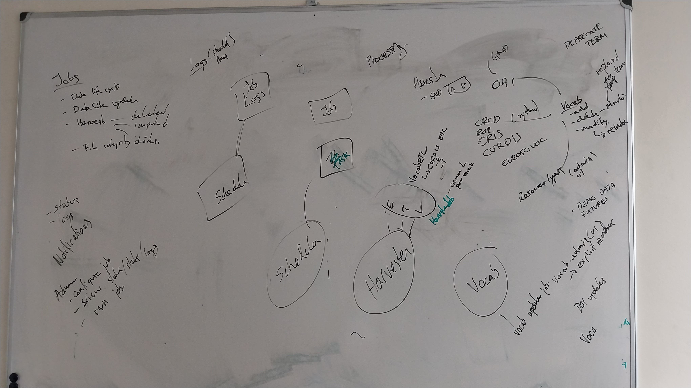
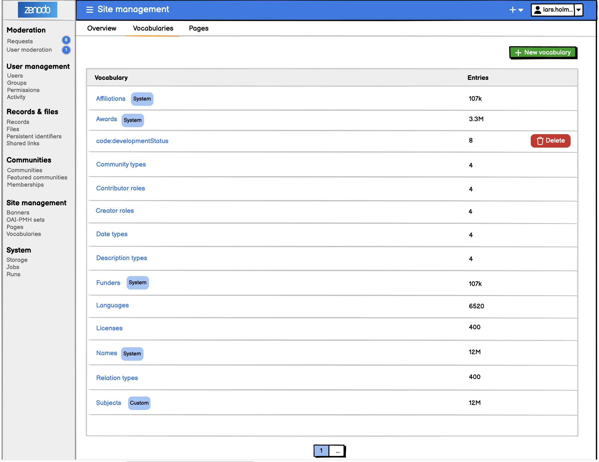
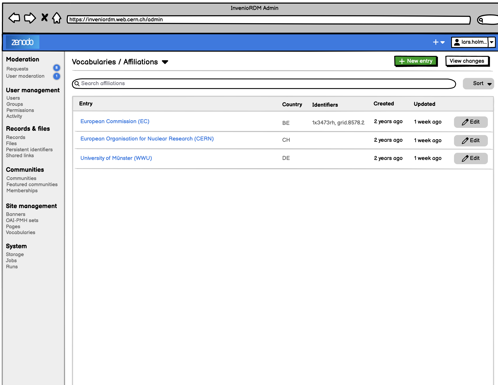
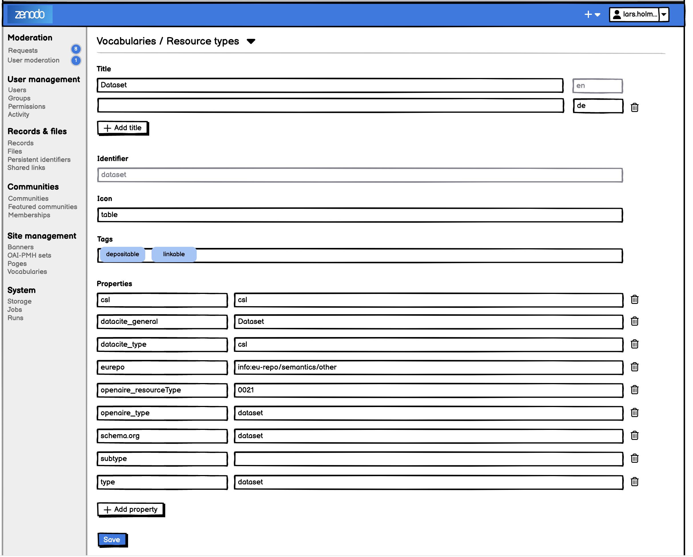
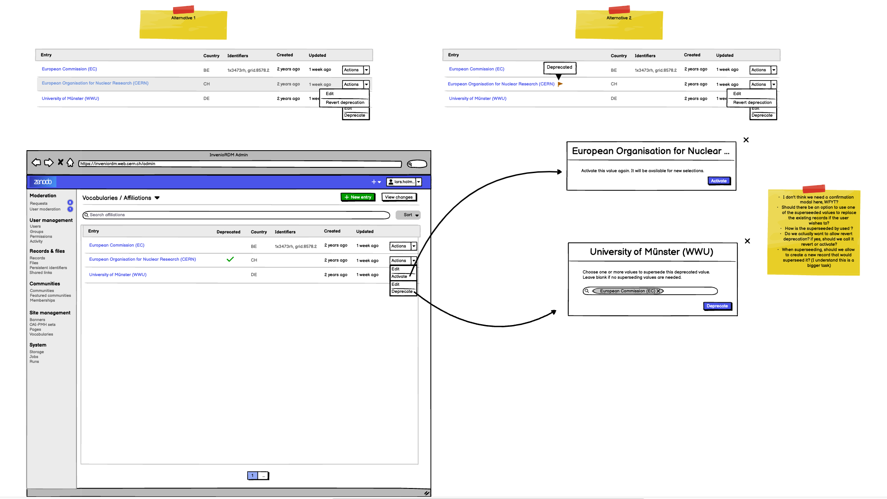
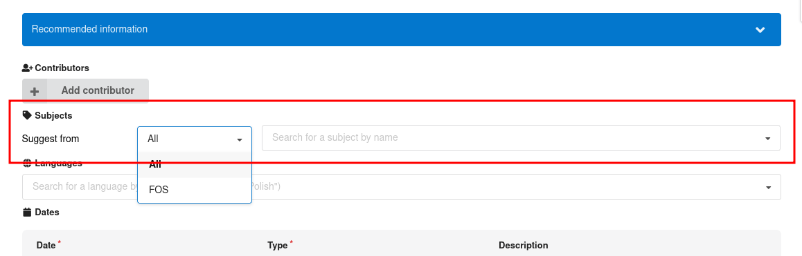

# Vocabulary harvesting



## Summary

See also [RFC Job system](./rdm-0076-job-system.md)

## Motivation

- As an admin I want to use an admin interface to edit vocabularies
- As an admin, I want to replace a vocabulary item
- As an admin I want to use an admin interface to edit a scheduler for fetching the data
- As an admin I want to control the job schedule
- As an admin I want to be able to update vocabularies from external sources
    - As an admin I want to see the state of such jobs in an administrative dashboard (see logs and general stats as well)
- As an admin I want to deprecate a vocabulary.
- As a user I want to always use the latest vocabularies
- As a librarian I want to run jobs manually
- As a librarian I want to see the status of runs


### Use cases

- Add a new custom field for a small or large vocabulary:
    - small: the widget should be able to display all possible values (optional: search bar to filter)
    - large: the widget should do a remote search, searching for possible vocabularies
- I should be able to configure the main search and each community search page with new vocabulary's facets.
    - The facet for small vocabularies should display the first top 10*, with a show all button to display all
    - The facet for large vocabularies should display the first top 10* items, and have a search bar to search for more values.
    - 10*: random number, might be more or less


#### CERN Goals

- Update ROR (funder/affiliations), ORCID, grants vocabularies, Import MeSH & CORDIS (needed for HORIZON-ZEN) - in an easily repeatale way
    - => Update a vocabulary term and have it propagate.
    - => Data model fix
- Deposit form auto-completion: Improve indexing of names, grants and affiliations, funders

#### Münster Goals


- Edit persons in the admin interface with direct cataloging to GND authorities
- Harvesting of subjects from GND authorities
- Harvesting Persons from CRIS

#### Example of harvesting sources

- ORCID (Persons)
- ROR (Organisations)
- CRIS (Persons)
- CORDIS
- OpenAIRE projects
- GND Authorities (i.e. Subject Headings, Persons), by OAI-PMH
- Geonames
- MeSH
- CERN databases:
    - List of experiments from GreyBook (https://greybook.cern.ch/) - there is a DB to query
    - Hardcoded list of departments/groups/sections: they may change over time. Old records with old values should keep the old value, even when editing.

#### Examples of admin managed vocabularies

I.e. vocabularies that would be edited by an admin

- Resource types
- Names
- Title types, Date types, Relation types

## Design

### Overview

From a high-level point of view this RFC concerns the following areas:

- **Deposit form (indexing):** Improve search capabilities of names, affiliations/funders and grants (i.e. improve the indexing)
- **Administration interface:** Support for browsing and potentially editing vocabularies
- **Harvesting (ETL)**: APIs and specific harvesting jobs for ROR, ORCID (public dump/data sync), OpenAIRE projects, CORDIS, MeSH, GND Subjecst.
- **Resource, service and data layer**: Support for deprecating/merging of terms, support for managing reindexing of related records.
- **Deployment**: Managing the data model updates for running produciton systems
- **Installation/documentation**: How do InvenioRDM instances configure and manage the harvesters.

The RFC extends the work of [RFC Vocabularies](https://codimd.web.cern.ch/I2ES9IjSRj-WFM2zUC1tKg) and [RFC Relations](https://github.com/inveniosoftware/rfcs/blob/master/rfcs/framework-0040-relations.md). In particular the previous RFC defines:

- Data model of vocabularies - in particular the fieds``identifier``, ``title``, ``description``, ``icon``, ``props``.
- Denormalization of related records - in particular injection of the ``@v`` property and ``indexed_at`` to identify out of sync relations

Priorities:
- The key priority is to ensure CERN/University of Münster is able to regularly update their required vocabularies at the end of the sprint. Thus focus should be on Harvesting and the resource/service/data layer, and the specific jobs themselves.

### Indexing of vocabularies

Current issues include:

- Search for e.g. an organisation name in english/local language does not give good results (e.g. try searching ROR vs our affiliations vocabulary).
- Ranking - often searching e.g. for a name (say Lars Holm Nielsen or Nielsen, Lars Holm) will not yield the name as the top result.
> - Search for organizations doesn't include all possible names https://github.com/inveniosoftware/invenio-rdm-records/issues/933
> - Search for organizations includes withdrawn/inactive organizations that don't show up on normal ROR search. Withdrawn RORs should never be shown, and inactive RORs at a minimum need to be labeled as such.
> - It's difficult to distunguish organizations without country labels https://github.com/inveniosoftware/invenio-rdm-records/issues/1589. Minimally fixed for funders with https://github.com/inveniosoftware/invenio-vocabularies/pull/295
>[name=Tom]

The was some attemps to improve e.g. users search in [inveniosoftware/invenio-users-resources#127](https://github.com/inveniosoftware/invenio-users-resources/pull/127)

Tasks:
- Define a couple of tests for each vocabulary.
- Test various approaches to improve results of tes - e.g. better mappings through improved analyzers as well as improved queries.

### Administration interface

- List vocabularies
- CRUD operations for a generic vocabulary
- Search a vocabulary
- CRUD an new entry in a vocabulary (note delete requires specific handling).
- Deprecate an entry
- Propagate changes to related records

#### List vocabularies



#### Search a vocabulary



#### Create a new generic vocabulary


#### Edit an entry



#### Deprecate an entry


#### Needs

- REST API for listing all vocabularies
- Extend data model to store more information.

### Harvesting jobs

The goals of the harvesting jobs are:

- having autonomous reliable harvesting jobs that can import new entries on a regular basis
- compose harvesting jobs based on ETL-paradigm - e.g. individual parts should be resuable

#### Data streams (ETL)

Describe current work.

#### Logging

The job system will define how to log information (info, warning, errors).

#### Define harvesting jobs

#### Dry-run

- Select the type of Harvester (API, OAI, Dump, ...)
- Edit the harvesters URL/upload dump
- Should we support dry run??

#### Programmatic API

#### Specific jobs

##### ROR

- Access https://zenodo.org/records/11106901
> We should switch to the v2 file and be able to import to both affiliations and funders vocabularies https://github.com/inveniosoftware/invenio-vocabularies/issues/294
>[name=Tom]

##### ORCID

Zenodo - we have requested access to public data sync (requires premium membership)

##### OpenAIRE projects

- Data https://zenodo.org/records/10948409


##### CORDIS

- Access: https://data.europa.eu/data/datasets/cordis-eu-research-projects-under-horizon-europe-2021-2027

For each project we need:
- List of organisations
- List of subjects
- Topic (i.e. funding call)
- Dates
- Legal basis
- Description


##### GND Subjects

>- Access: https://services.dnb.de/oai/repository?set=authorities:sachbegriff&verb=ListRecords&metadataPrefix=MARC21plus-1-xml&from=...&until=...

> The subject itself is available  in datafield 150$a, there are even translations (normally english and french) but as they are not marked as translations they are unusable.
> [name=Werner]

### High-level overview


#### Components

- Harvester
    - Extract (Harvest depending on data source: From API, OAI, Dump...)
    - Transform (Custom transformation Scripts to process data so that is in the right format to be consumed by the yet to be defined vocabularies API)
- Vocabulary management
    - Common loaders per vocab type

## Vocabulary management

#### Data model

```json
{
    "id": "...",
    "title": {
        "en": "...",
        "...": "...",
    },
    "system": {
        "deprecated_by": ["<id>", ... ],
        "deprecated_at": "2024-03-20T12:00:00Z"
    },
    "description": {
        "en": "...",
    },
    "tags": ["deprecated", "depositable", "linkable"],
    "icon": "",
    "type": "languages",
    "props": {
        "<key>": "<value>",
        "datacite_general": "Text",
        "datacite_type": "Article",
    },

}
```

#### Replace item/updating relations

Multi-step operation:
1. when replacing an old value, it should ask for the new value
2. the old value is marked as deprecated (cannot be used for new records)
3. a async task will update all the records that uses the old value (not always the case)
4. the old value can be deleted

#### Updating of relations

#### Deprecation Behavior

When a property is marked as deprecated, it will no longer appear in search results and cannot be selected for creating new records or modifying existing ones by regular users. The deprecated_by field is optional and can be used to indicate one or more properties that supersede the deprecated value. Importantly, the deprecated_by field is for reference purposes only and is intended for administrators. Populating the deprecated_by field does not affect records that already use the deprecated property; those records will remain unchanged.

Administrators, however, will retain the ability to view, select, and modify deprecated values when necessary. This will be managed via permissions, ensuring that only authorized users can interact with deprecated properties. A new tag, `non-searchable`, will also be introduced for vocabularies. When applied, this tag will prevent a value from appearing in general search results for regular users, but administrators will still be able to access and modify these values.

Finally, deprecated values should provide the option for reactivation. Administrators will have the ability to restore deprecated values to active status if required.

---

## Uni Münster use cases

#### Updating Subjects from GND via OAI-PMH

##### User Stories

- As a user I want to be able to use the newest subjects from GND for tagging my data
- As a systems administrator I want to provide up-to-date subjects vocabulary from the german authority data provider "GND" in the deposit form when creating a new record: 
- As an administrator I want to be able to configure a job to update this vocabulary from the XML sources which come over OAI-PMH periodically
    - As a **systems administrator** I want to be able to use the administration interface of InvenioRDM to configure these tasks (when and how often they run, other config) (add this feature in a second phase)
    - ... I want to see logs etc. (this is the same for most of these updating tasks?)

##### Already there

- OAI Harvester
- Task queue
- API?
- https://github.com/inveniosoftware/invenio-rdm-records/pull/1303
    - what about datastreams?

##### Missing

- Update mechanism for subjects

##### Dataflow


#### Updating Name Vocabulary via CRIS Graph-Ql

##### User Stories

- As a **user** I want to be able to add my co-authors when creating a new record from an up-to-date list of members of my research organisation
- As a **systems administrator** I want to provide up-to-date data about all people in my organization
    - As a **systems administrator** I want to use configured jobs to regularly "harvest" data about the people of my institution and update the names vocabulary accordingly by adding people new to my institution
    - updating people (changed names etc.)
- As a **systems administrator** I want to use my institutions CRIS system to get the information about all members of my institution
    - As a **systems administrator** I want to get this data via a GraphQL interface

##### Already there

##### Missing

##### Dataflow

##### UI
