- Start Date: 2024-06-06
- RFC PR: [#PR](https://github.com/inveniosoftware/rfcs/pull/<PR>)
- Authors: Manuel Da Costa, Pablo Tamarit, Carlin MacKenzie, Alex Ioannidis
- State: DRAFT / IMPLEMENTED

# Community Request Workflow (sub-communities)

## Summary

This RFC outlines the proposed technical implementation for a workflow that allows users to request their community to become a subcommunity of a another one.

## Motivation

Imagine the following scenario:

- John Doe is part of an institution's IT Department.
- John Doe creates a record within the IT Department's "Computer Security" community.
- Consequently, the record is also part of the IT Department's broader community.

The ability to integrate one community into another already exists in InvenioRDM but is not visible for end-users; the workflow must be done manually by an administrator.

For example, on Zenodo, the workflow was enabled for the "EU-funded research" and is as follows:

1. A user accesses the Open repository for the "EU Open Research Repository" community.
2. The user, interested in joining because they have an EU-funded project, clicks "Join with your EU project."
3. The user fills in the form to submit a support ticket providing necessary information, such as the project number and, optionally, an existing community of theirs.
4. Zenodo administrators manually validate the request, adding missing metadata from the project to the new community (e.g. affiliations, subjects).
5. If the request is valid, the administrator designates the community as a subcommunity of the "EU Open Research Repostiory" community.

The current workflow has several limitations:

- **Manual Validation**: Instance administrators (e.g., Zenodo admins) must manually validate each request, which is time-consuming due to the lack of integration with the existing system.
 - **Lack of Integration**: Users have to submit the request in an unstructured manner and without any autocomplete assistance. After submitting the support ticket via the dedicated form, all request management is conducted via email communication.

### The solution

An integrated mechanism in InvenioRDM to request a community to be included as a **subcommunity** of another.

By integrating this mechanism into InvenioRDM, the process will be streamlined, improving user experience and reducing administrative overhead for creating hierachical communities.

The feature is divided in two parts:

1. A form that the user can fill to create the request
2. A backend to process the request

## Use cases

### Core use cases for users

- As a community owner I want to find a community and make mine part of it
- As a user I want to request to create a community under another one
- As a user managing the parent community I create and manage various subcommunities

### Core use cases for curators

- As a community curator I want to review the submitted community through the request page
- As a community curator I want to act on a request (Accept and Decline)

### Other use cases

- As a community curator I want to send an automated responses on request accept / decline
- As a EU project coordinator I want to include my project in Zenodo

### Future use cases

- Automatic pre-filling of the form subjects and organizations.

## Detailed design

The subcommunity request supports two distinct workflows:

1) when a community already exists.
2) when there is no community created yet.

This feature will rely on the machinery behind invenio-requests to support the request itself. One new request type is to be created.

To create the request and support any custom logic around the request, a small interface is to be created for this feature, i.e. one new resource that handles the creation of the request.

### Front-end

Entry point:

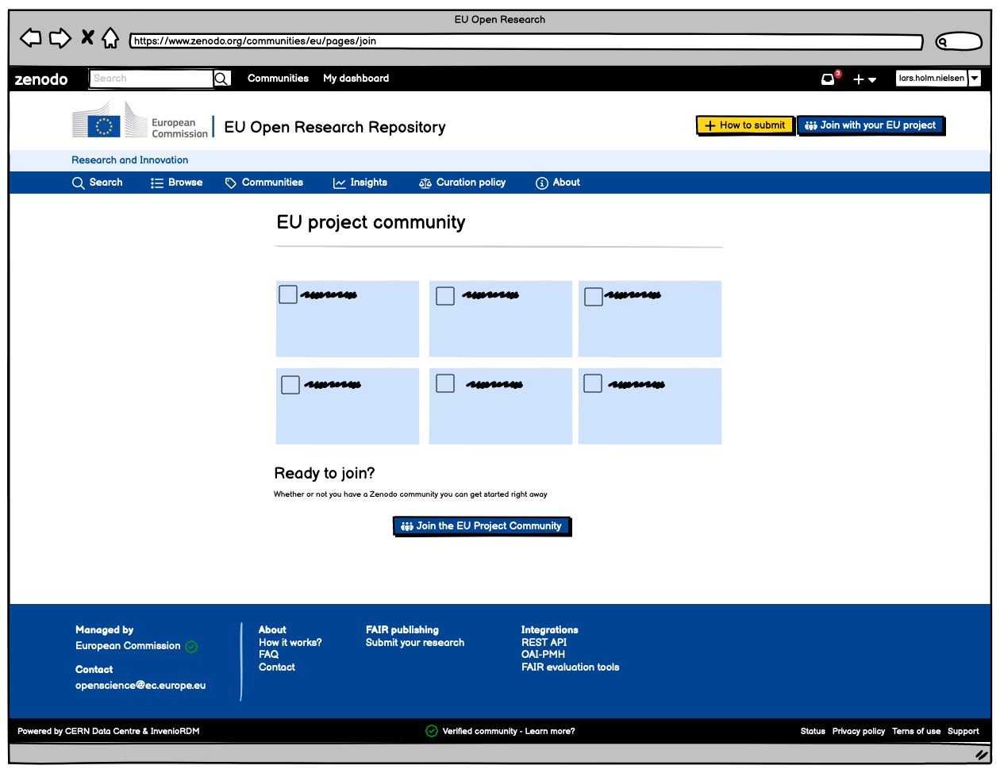

Without a community:

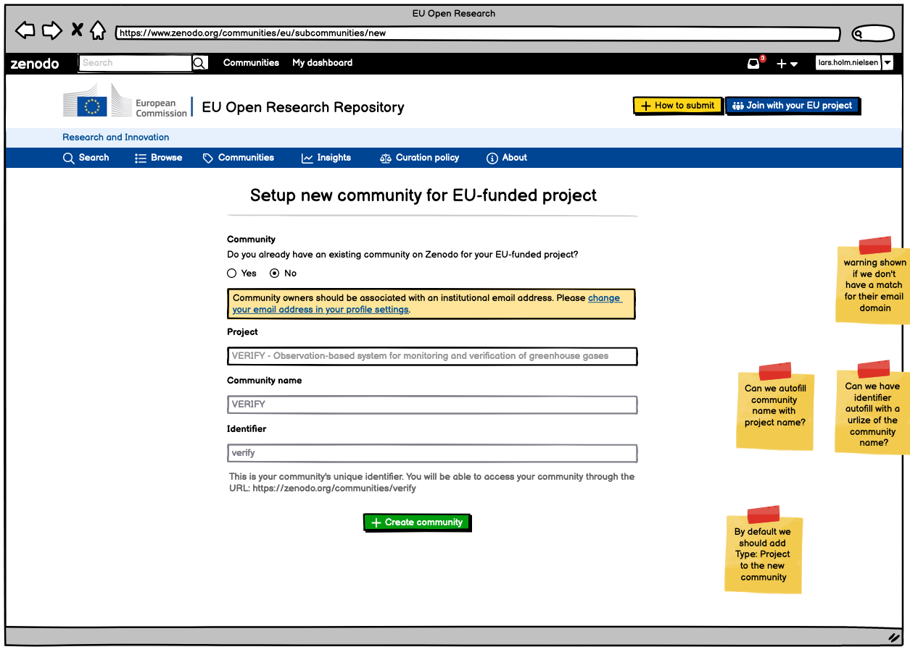

With a community:

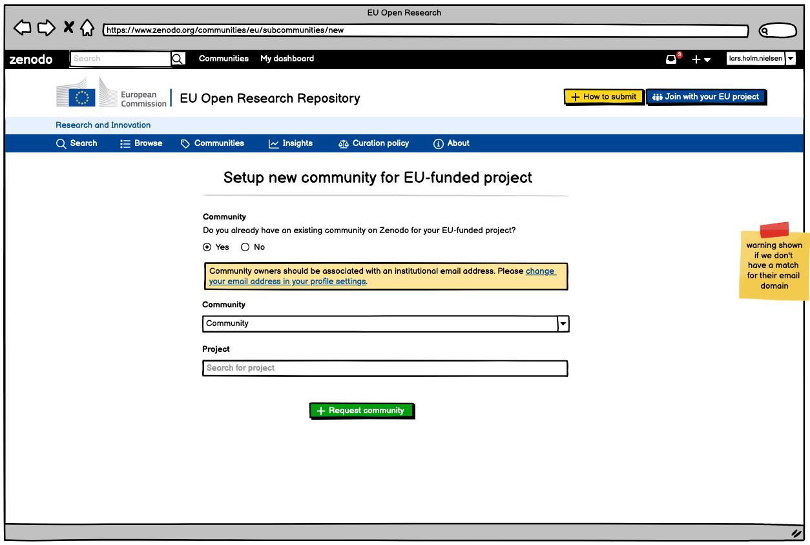

Request without a community:

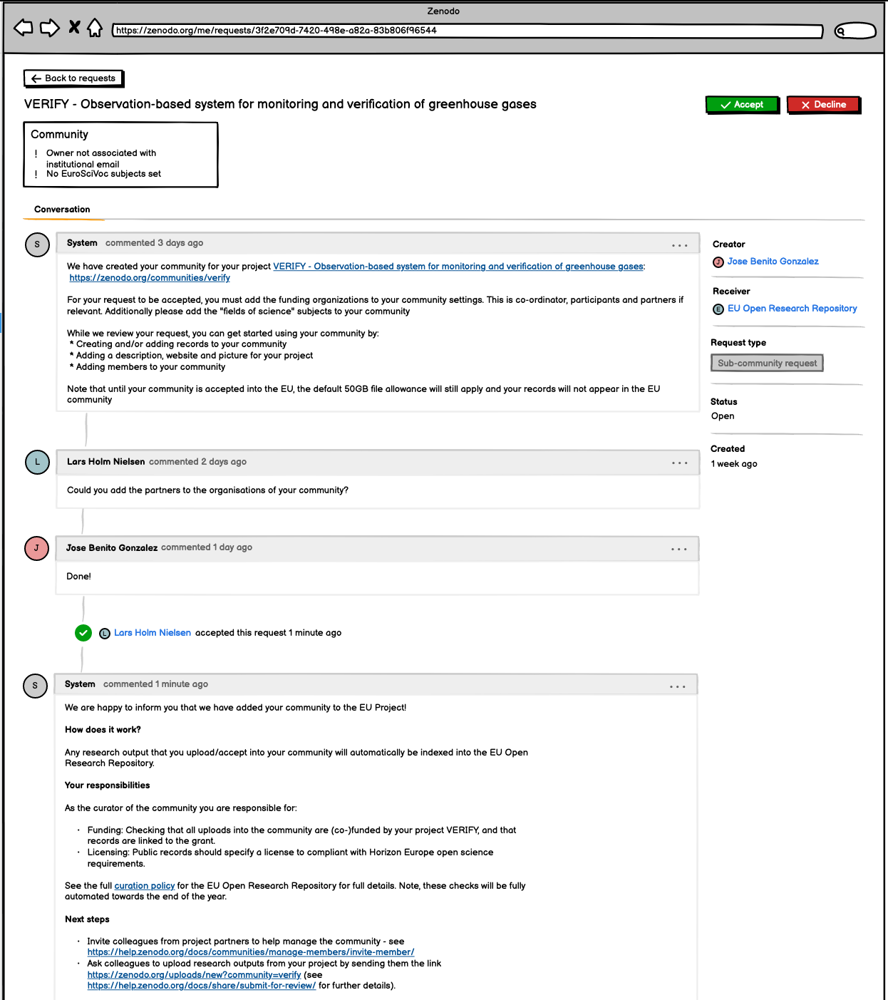

Request with a community:

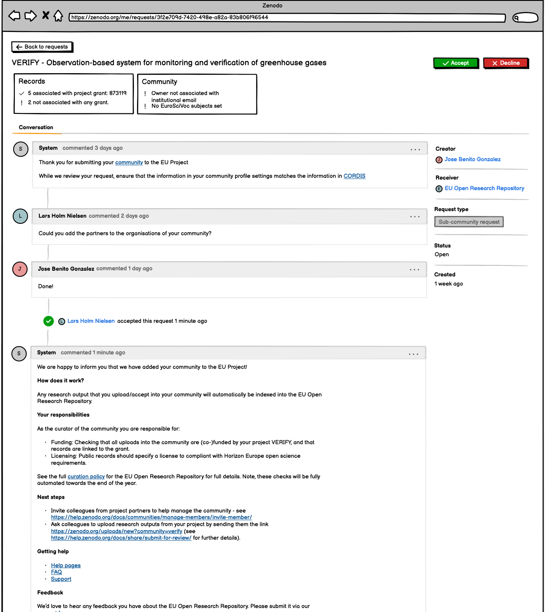

#### Invenio

Entry point:

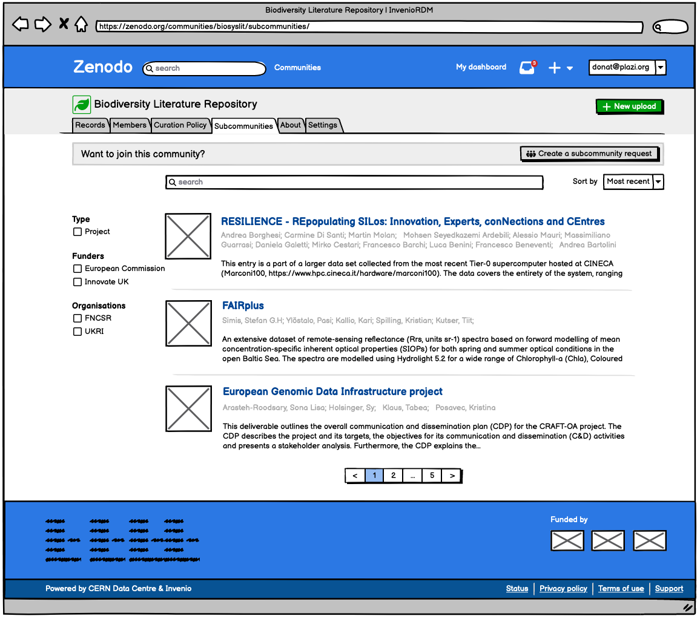

Admin settings for managing sub-communities:

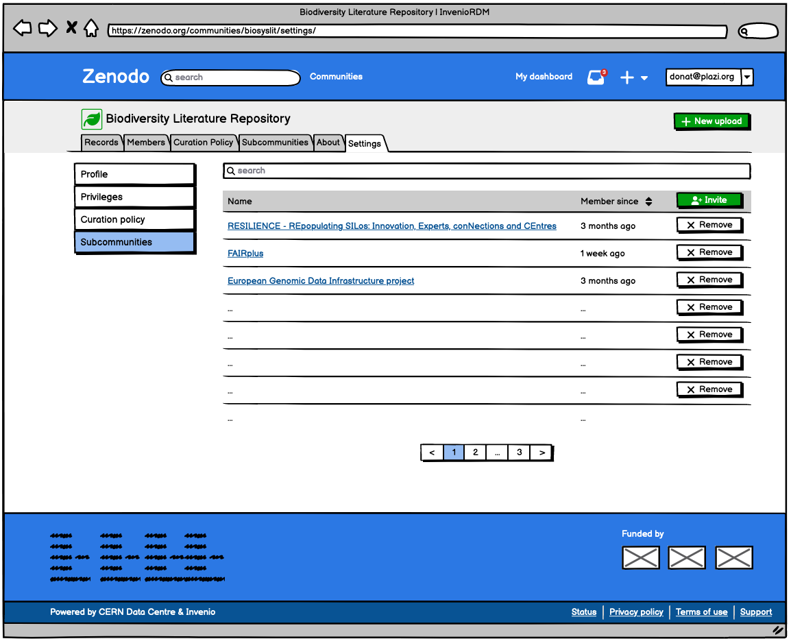

Adding a community from a child:

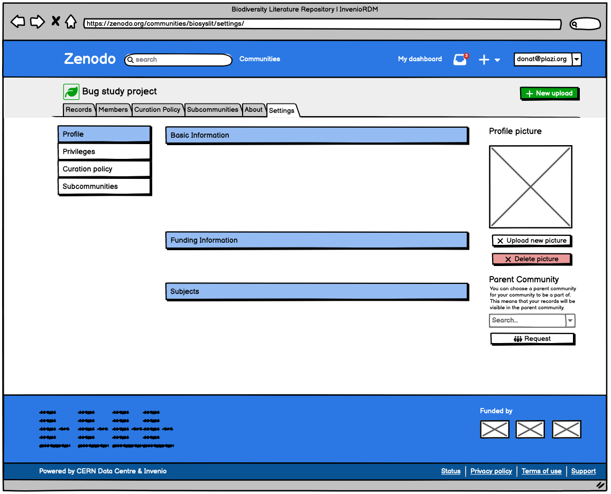

After request is accepted:

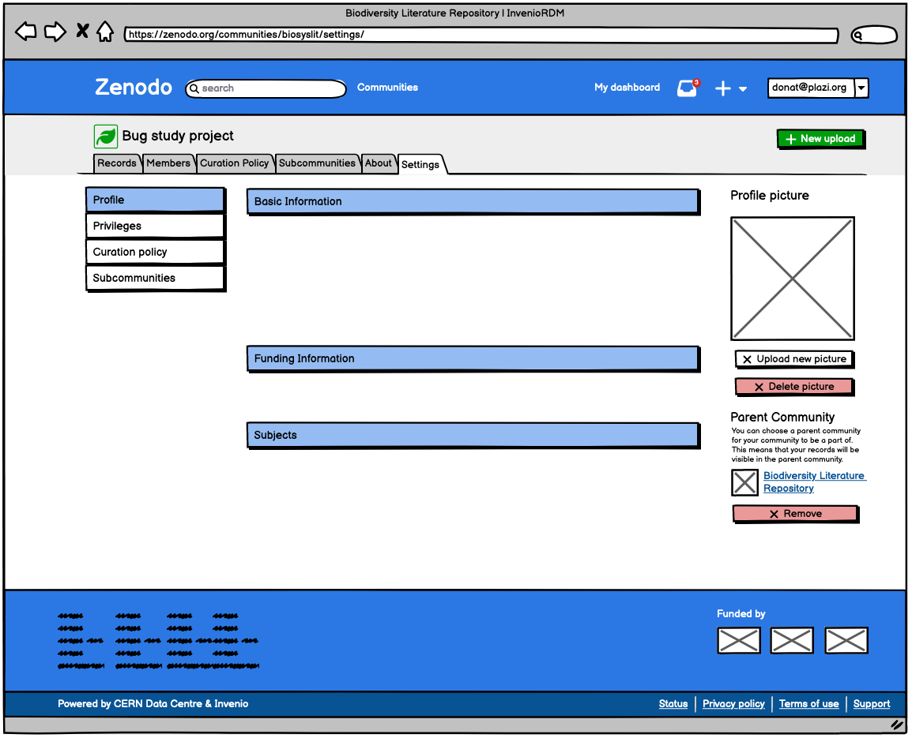

Alternate UI for adding community from a child:

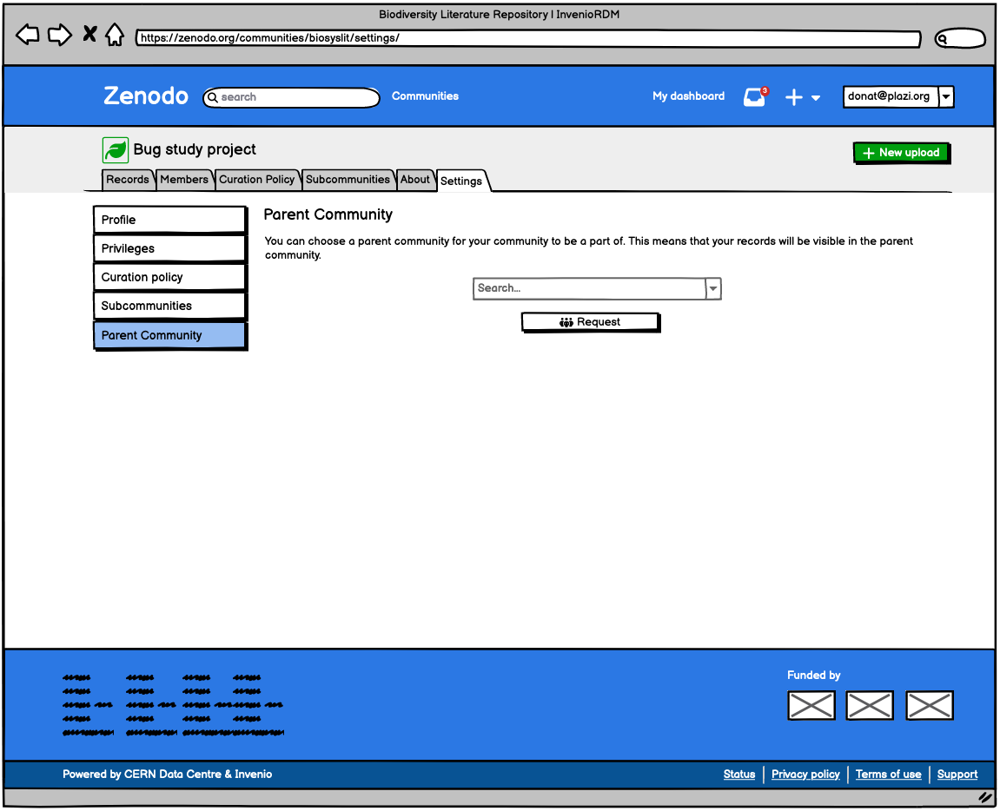

Considerations: extending the form, overriding react components
Extensibility:
- How the UI form looks like.


The request form can be extended using existing mechanisms such as react overridable components and Jinja templates

### Backend

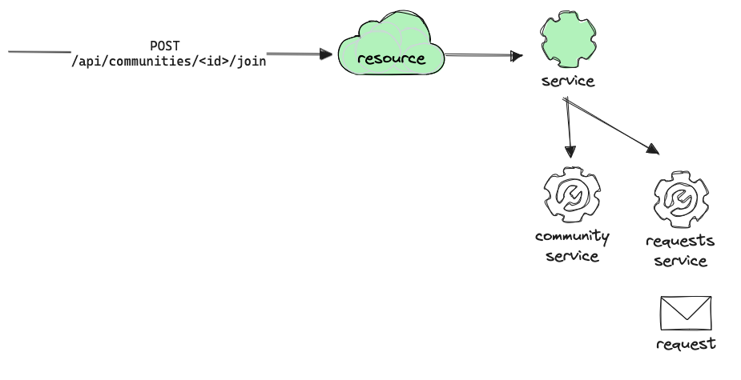

To maintain a cleaner request object, a topic community must always exist—either pre-existing or newly created based on the details provided by the user. This ensures that payload handling can be managed at the new service level. Additionally, this approach allows users to customize the community as needed while the request is under review. + permissions

Therefore, thew newly created service follows the pipeline:

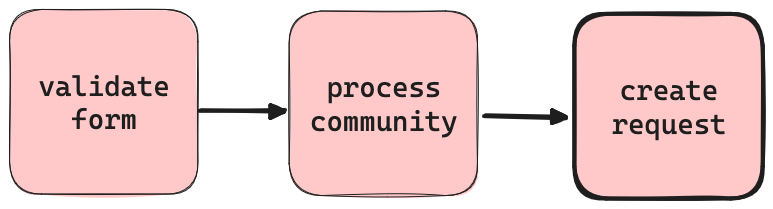


The base prototype is as follows:

```python
class SubcommunityRequestSchema(Schema):
    # Community input
    community_id = fields.String()
    community = fields.Nested(MinimalCommunitySchema)
    # Request payload
    ...


class SubCommunityRequest(RequestType):

    receiver = ["community"]
    creator = ["user"]  # could also be a community
    topic = ["community"]
    payload_schema = {}
    available_actions = {
        "accept": AcceptAction
    }

    class AcceptAction(actions.AcceptAction):
        # move community to parent

class SubCommunityService(Service):
    @property
    def schema(self):
        return app.config.get("COMMUNITIES_SUBCOMMUNITY_SERVICE_SCHEMA", DefaultSchema)

    def create(self, identity, receiver, payload):
        # Load schema
        ...
        # Process community
        ...
        # Create the request
        ...
        return request

class SubCommunityResource(Resource):
    service = SubCommunityService
    # POST /communities/{id}/actions/join-request
```


To support more complex use cases, e.g. on Zenodo the request should also contain more information about the project, the workflow can then be extended:


```python
class ZenodoSchema(Schema):
    # Community input
    community_id = fields.String()
    community = fields.Nested(
        CommunitySchema(required=("affiliations", "subjects"))
    )
    # Request payload
    award_id = fields.String(required=True)

# invenio.cfg
COMMUNITIES_TRANSFER_REQUEST_CLS = ZenodoCommunityRequest
COMMUNITIES_SUBCOMMUNITY_REQUEST_SCHEMA = ZenodoSchema
```

### REST API

#### Create a request to join a parent community

`POST /api/communities/{id}/actions/join-request`

Alternatives:
- `POST /api/communities/{id}/requests`
- `POST /api/communities/{id}/requests`

```http
POST /api/communities/{id}/actions/join-request HTTP/1.1
Content-Type: application/json

{
    # (Optional) Community ID.
    # If not provided we need minimal metadata for creating a community
    "community_id": "<community slug or UUID>",

    # (If "community_id" is not specified) Minimal community metadata
    "community": {
        "slug": "fair-impact",
        "title": "FAIR-IMPACT",
    },

    # Award ID to be connected to the community and for fetching subjects
    "award_id": "05k24322::123456",
}
```

```http
HTTP/1.1 201 CREATED
Content-Type: application/json

{
    "id": "{request_id}",
    "title": "Join 'FAIR-IMPACT' under the 'EU Open Research Repository'",

    # TODO: Should we expand them?
    "sender": {"user": "<submitter user ID>"},
    "topic": {"community": "fair-impact"},
    "receiver": {"community": "eu"},

    "links": {
        "self": "/api/requests/{request_id}",
        "self_html": "/communities/{community_id}/requests/{request_id}",
        "cancel": "/api/requests/{request_id}/actions/cancel",
        "events": "/api/requests/{request_id}/events",
    },
}
```

#### Accept/reject a request to join a parent community

`POST /api/requests/{id}/actions/{accept,reject}`

```http
POST /api/requests/{id}/actions/accept HTTP/1.1
```

```http
HTTP/1.1 200 OK
Content-Type: application/json

{
    "id": "{request_id}",
    "title": "Join 'FAIR-IMPACT' under the 'EU Open Research Repository'",

    # TODO: Should we expand them?
    "sender": {"user": "<submitter user ID>"},
    "topic": {"community": "fair-impact"},
    "receiver": {"community": "eu"},

    "links": {
        "self": "/api/requests/{request_id}",
        "self_html": "/communities/{community_id}/requests/{request_id}",
        "cancel": "/api/requests/{request_id}/actions/cancel",
        "events": "/api/requests/{request_id}/events",
    },
}
```

## Example

> Show a concrete example of what the RFC implies. This will make the consequences of adopting the RFC much clearer.

> As with other sections, use it if it makes sense for your RFC.

## How we teach this

> What names and terminology work best for these concepts and why? How is this idea best presented? As a continuation of existing Invenio patterns, or as a wholly new one?

> Would the acceptance of this proposal mean the Invenio documentation must be re-organized or altered? Does it change how Invenio is taught to new users at any level?

> How should this feature be introduced and taught to existing Invenio users?

## Drawbacks

> Why should we *not* do this? Please consider the impact on teaching Invenio, on the integration of this feature with other existing and planned features, on the impact of the API churn on existing apps, etc.

> There are tradeoffs to choosing any path, please attempt to identify them here.

## Alternatives

> What other designs have been considered? What is the impact of not doing this?

> This section could also include prior art, that is, how other frameworks in the same domain have solved this problem.

## Unresolved questions

Edit the request. This might not be needed if the community is created unconditionally and the community holds the information needed (e.g. subjects and organizations)
For now the form does not include fields that can be prefilled in the future (e.g. organizations and subjects). The users can edit it afterwards.

Create a new community: what request is created? what's the entity to be resolved?

Retraction of a community from a parent: e.g. a user wants to remove their community from the parent

Backoffice: remove a community from a parent.

Similar view to "Members" where you can manage the sub-communities (as a curator)

Checks: where do they go, how they are configured in the backend

Snippet : simple flow  (e.g. REST API)


## Resources/Timeline

The schedule is:

    W1 (2024-06-06 - 2024-06-07): Design feature: mockups and RFC
    W2 (2024-06-10 - 2024-06-14): start development and finalize RFC (present it on 12/06/2024 to IR)
    W3 (2024-06-17 - 2024-06-21): MS1 (core functionalities, request type) - MS2 (extra functionalities + UI) - integration / deploy to dev
    W4 (2024-06-24 - 2024-06-28): deploy to qa / deploy to prod


## Other

https://zenodo.org/records/8199881

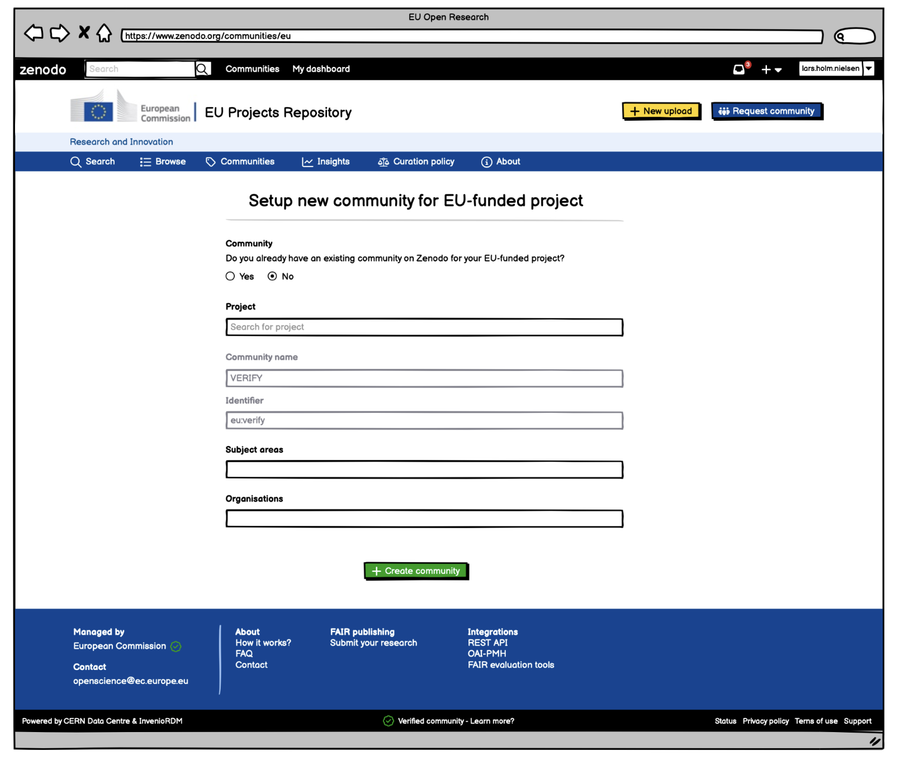

- The previous mockup is a base one, we need to expand on this and provide more (e.g. how the interaction will be, what happens when you already have a community, etc).
- The request is created to the EU community request
- Where do you have the form? How do you navigate there?
- Notification e-mail could come from the request itself
- Privacy: users must be aware that the data is shared (e.g. affiliation). E.g. having a tick button saying "I consent"
- How can we present the data to ourselves to see if it's ok (i.e. green tick if e-mail is from a valid domain)
- Vocabularies: add project info (e.g. organizations, euroscivoc, etc)
    - How to match w/ROR? E.g. maybe add the orgs as custom but store the project ID so we can disambiguate in the future
    - Job to import it?
    - Automation of orgs can be skippable for now? We could use only subjects now.
    - framework program (e.g. HORIZON 2020), subjects, start/end date. We could use grants vocab for this.
- Try to automate things to help us, curators, to identify whether the request is OK (e.g. compute number of records w/o EC funding, does the community already?)
- You need to have an account to create a request. No acount creation anymore. E.g. warn user the e-mail they're logged in is not an institutional e-mail.
- UI/UX for some basic checks
- Think generic first and implement specific after.
- Community curator enable / disable form

## Comments


> Also we should take into account the automatic addition of the community bypassing the request acceptance. Use case: someone managing the parent community creates and manages various subcommunities
> [name=José]
