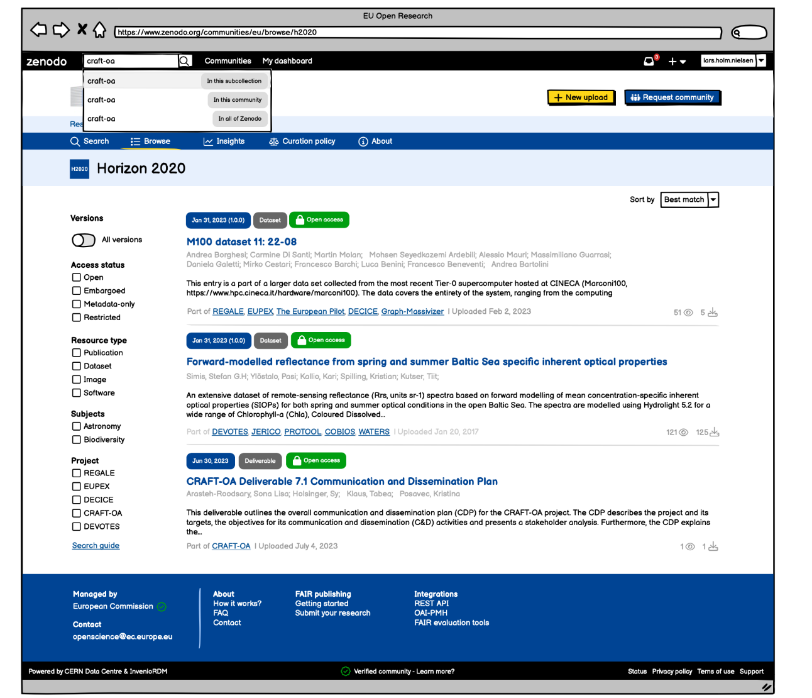
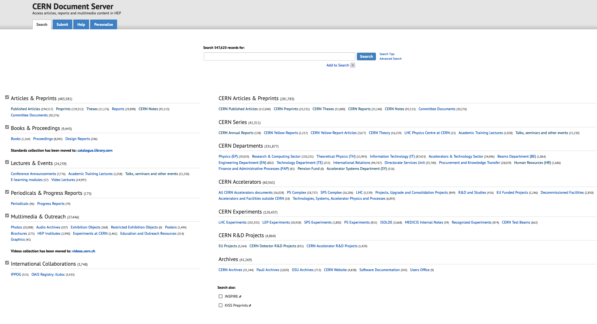
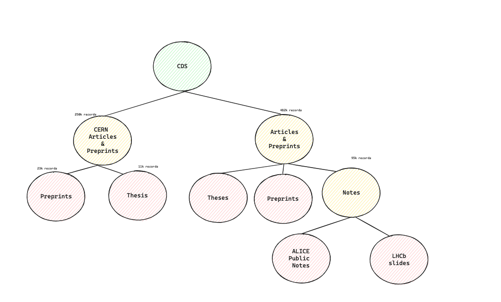
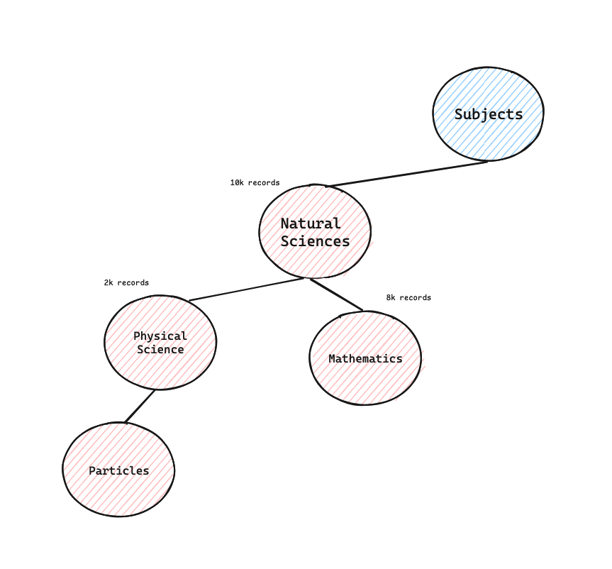
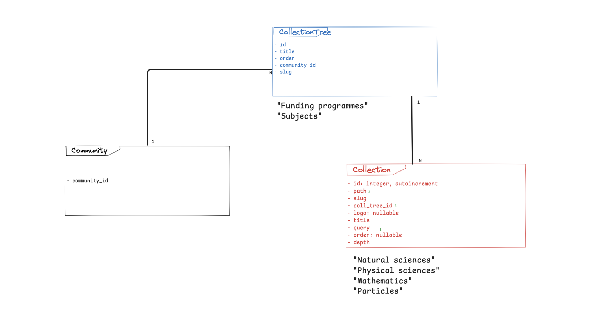
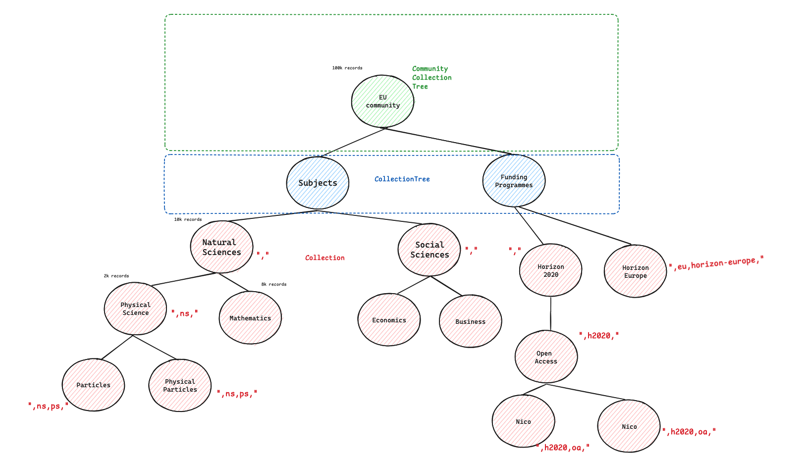
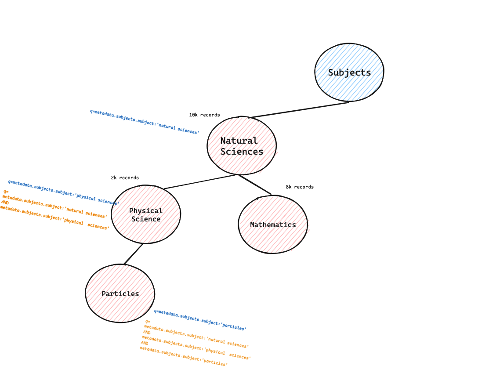

- Start Date: 2024-09-03
- RFC PR: [#87](https://github.com/inveniosoftware/rfcs/pull/87)
- Authors: Alex, Carlin, Fatimah, Manuel

# Community collections

## Summary

To describe collections, lets use the following example records:
    
```yaml
Policy Brief for iMagine        <- Record
    Subjects:
        Ecosystems
    Funding: 
        Award:
            Title: iMagine
            Program: Horizon Europe

Super-Resolved SAR Data         <- Record
    Subjects
        Artificial Intelligence
    Funding: 
        Award:
            Title: S34I
            Program: Horizon Europe
```

In *collections*, these records would be grouped (or filtered) as follows

```text
Subjects                          <- CollectionTree
    Artificial Intelligence       <- Collection
        Super-Resolved SAR Data   <- Record
    Ecosystems                    <- Collection
        Policy Brief for iMagine  <- Record

Funding Programmes                <- CollectionTree
    Horizon Europe                <- Collection
        Policy Brief for iMagine  <- Record
        Super-Resolved SAR Data   <- Record
```
                                     
For instance, collections can provide valuable insights of the contents of a community based on its records metadata, e.g. the funding metadata. This provides a more unique way of navigate through communities and analyse its records.

## Motivation

- As a community manager, I want to know how many records of my community are funded by the same grant
- As a community manager, I want a high-level view that provides insights on the community records
- As a researcher, I want to see all the records which are in a subject
- As instance manager I want to advertise records on selected field(s).

## Detailed design
                                     
### Key points 
                                     
In summary, below are the key points of this design along with the locations of the relevant discussions:

- [🔑 Database considerations](#ctrees)
- [🔑 Indices](#indices)
- [🔑 Queries composition](#queries)
                                     
### Design
    
At a glance, a collection can be thought of as a query over a set of records. To do so, we further expand the definition into:

- A filter to obtain the said records from search.
- A dedicated page that displays only the records that belong to the collection
    
Collections can be used for all records, or records in a  community, which has opted in, like the EU Open Research Repository.
    
See the example below of a collection:


    
In this example, the collection "Horizon 2020" filters the records from the community "EU" by their funding programme being "Horizon 2020", and the collection page clearly displays the results in a dedicated page inside the European Repository community.

Collections can be configured per community. I.e. for the European Repository it is interesting to have collections based on the records funded by the European Comission, while for a Biodiversity Repository it could be interesting to have these collections on different species (e.g. ants, insects, etc).

For instance, see below multiple collections that exist under the community "European Open Repository":


    
### Technical implementation

Naturally, collections are organized in tree-like structures. I.e. CERN Document Server (CDS) defines multiple top-level collections [1] that each have, potentially, other collections attached.
    

*[1] - CDS collections page, taken from https://cds.cern.ch/*
    
This can be represented in a tree (for simplicity only three levels are shown):
    
{width=1000}

Another example of collections:
    
{width=500}
*Euro Science subjects collections - http://publications.europa.eu/resource/dataset/euroscivoc*

This solution proposes collections to be modelled as generic trees, whose information is persisted in a database. 
    
That said, collections data model will be based in the "Materialized Path" pattern. Read this [documentation from MongoDB](https://www.mongodb.com/docs/manual/tutorial/model-tree-structures-with-materialized-paths/) for a good overview of this pattern. The main concept is that each node (row in the DB) stores its `path` from the root to its own node, excluding itself.

In our proposed model, a unique `id` is to be stored in the `path` so the ascendants of a node can be derived from the path and done with primary key lookups:
    
```jsonld
   { _id: 1, title: "Natural Sciences", path: "," },
   { _id: 2, title: "Physical science", path: ",1," },
   { _id: 3, title: "Mathematics", path: ",1," },
   { _id: 4, title: "Particles", path: ",1,2," },
```

**Database tables**

We identified two new tables for this design:

1) `Collection`
2) `CollectionTree`



In our previous example, this is the final model and entities with the highlighted path of some collections (in red):
                                     


                                     
### Design considerations 
                                     
The idea behind splitting `CollectionTree` from `Collection`, is to be able to define "root" collections that do not hold any query and simply group collections under a semantic umbrella. In our previous example, it would be modelled as such:
                                     
```
European Open Repository  <- Community
    Subjects                  <- CollectionTree
        Natural sciences          <- Collection
        Physical sciences         <- Collection
```

An important aspect of this design is that the `CollectionTree` allows the `community_id` to be set to `null`, indicating that the collection can be treated as a `root` collection. This enables the retrieval of all records from the repository without restricting them to a specific community.
                                     
<a name="ctrees">🔑</a> All the collections must be linked to a `CollectionTree` for organization purposes, however the display of the `CollectionTree` `title` on the UI could be optional. In a future iteration one could add a column to control the `CollectionTree` visibility.
                                     
<a name="indices">🔑</a> Apart from the usual PK, FK indices, the following indices are to be added to increase the performance of the most common used queries:
                                     
1) Index on `Collection.path`, possibly containing the `depth` column to allow matching only subcollections until a certain depth. 
    This index can initially be a B-TREE, since `LIKE` operations are also supported when they are anchored to the left (see PostgreSQL [documentation](https://www.postgresql.org/docs/current/indexes-types.html#INDEXES-TYPES-BTREE))
    There are other types of indices that can be used, but B-Trees should be enough for the foreseeable future of collections. If there is a need to perform unanchored queries, e.g. `WHERE path LIKE %foo%` then this has to be reconsidered.

**Collection queries**
                                     
Collections, as modelled here, do not store the information of the records that exist under that collection. I.e. it is not possible to know whether record X exists in a collection. Alternatively, collections store the **information on how the records can be queried**.
                                     
<a name="queries">🔑</a>  One of the key points of the design of collections, is to answer the question `"What is the query that a collection should execute?"`.
                                     
We answer this question by concatenating the ascendants queries. See the following example, where each collection query is defined in blue and the executed query in orange:
                                     
{width=700}

We have decided this way for (1) consistency and (2) performance:
                                     
1.  a record that belongs to a subcollection is guaranteed to also be included in its parent(s) collection(s).
2.  resolving the query requires `N` primary key lookups on the `collections` table, where `N` is the node depth in the tree (e.g. 2 for `Particles` in the previous example)
                           
**Collection endpoints**

We identified a new endpoint for collections:

`/<community_slug>/collections/<tree_slug>/<collection_slug>`

In our previous `Subjects` collection from the `EU` community, the endpoint would be the following: 

- `/eu/collections/eu_subjects/natural_sciences` for the `Natural Sciences` collection.
- `/eu/collections/eu_subjects/mathematics` for the `Mathematics` collection.

These endpoints imply the following:
1. Collection slugs can be reused in different trees, as they are scoped within the tree they belong to (e.g., only one `mathematics` collection can exist within the `eu_subjects` tree).
2. Retrieving a collection by its community and tree slugs is the primary access point. Therefore, database queries should be optimized for this scenario, e.g. by using appropriate indices.

The endpoint for a non-community collection is not yet defined, and will be listed as an open question in this document.

### Configuration

Initially collections entry point in the UI will be toggleable, e.g. disabled or enabled. However, this will not avoid the creation of the Database tables.


## Example
    
Programmatic API usage:
    
```python
    from .collections import Collection, CollectionTree
    
    
    community = # resolve 'eu' community
    
    subjects_ctree = CollectionTree.create(
        title = "Subjects",
        order = 10
        community=community
    )
    
    # Create collections under "Subjects"
    ns = Collecion.create(
        title="Natural Sciences",
        slug="natural-sciences",
        parent=None,
        ctree=subjects_ctree,
        order=10,
        query='metadata.subjects.subject:"Natural Sciences"'
    )
    
    maths = Collection.create(
        title="Mathematics",
        slug="maths",
        parent=ns,
        ctree=subjects_ctree,
        order=10,
        query='metadata.subjects.subject:"Mathematics"'
    )
    
    print(ns.sub_collections)
    # [Collection <2> : Mathematics]
    print(maths.ancestors):
    # [Collection <1> : Natural Sciences]
    
    print(maths.to_dict())
    """
    {
        1: {
            "title": "Natural sciences",
            "query": "...",
            "children": {
                2: {
                    "title": "Mathematics",
                    "order": 10,
                    "query": "..."
                }
            }
        }
    }
    """
```

Programmatic API definition:

```python
class Collection:
    @classmethod
    def create(cls, slug, title, query, ctree, parent=None, order=None, logo=None):
        if isinstance(ctree, CollectionTree):
            coll_tree_id = ctree.id
        else coll_tree is int:
            coll_tree_id = ctree
        
        if parent:
            # create as sub collection of collection, compute new path
            _path = parent.path
        else:
            _path = ","
        
        # INSERT INTO collection 
        ...

    @classmethod
    def get(cls, id_):
        """Primary key lookup."""
        ...
    
    @cached_property
    def sub_collections(self):
        """Fetch all the descendants."""
        return self.get_subcollections()
    
    @cached_property
    def direct_subcollections(self):
        """Fetch only direct descendants."""
        return self.get_direct_subcollections()
    
    def get_direct_subcollections(self):
        """More preformant descendants query, by path matching."""
        '''
            SELECT * 
            FROM collections
            WHERE path = self.path + self.id + ","
            ORDER BY (path, order)
        '''
        ...
    
    def get_subcollecions(self, max_depth=2):
        """Get all the subcollections using LIKE query, with the path anchored to the left."""
        '''
            SELECT * 
            FROM collections
            WHERE path like 'self.path + self.id + ',%'
            ORDER BY (path, order)
        '''
        ...
      
    
    @cached_property
    def ancestors(self):
        """
            Split path by comma (',') and lookup each part of the path individually.
        """
        if not self.model:
            return None

        cps = self.path.split(",")
        ret = []
        for cid in cps:
            if not cid:
                continue
            cl = Collection.get(cid)
            cl.community = self._community
            ret.append(cl)
        return list(sorted(ret, key=lambda x: (x.path, x.order)))
```

The main goals of the programmatic API are:
    
1. **Abstraction** - abstract the end user of terms such as "path", how the path is computed, etc, and let the end user focusing on what really matters: work with collections (e.g. render them on the UI)
2. **Encapsulation** - restrict the user of some operations, e.g. DB queries, so they can be performed in a consistent way efficiently

## Alternatives
    
**Pattern reference**
    
We have also considered using other patterns, e.g.  [pattern reference](https://www.mongodb.com/docs/manual/tutorial/model-tree-structures-with-parent-references/). 
    
In our case, pattern references could work, but the queries would be harder to understand:
    
- for example, fetching all descendants of a node (collection) would require more complex logic than a simple text match query. 
- although recursive queries can retrieve all the ancestors of a node with similar performance to a materialized path, they are more difficult to comprehend and implement.

## Unresolved questions
    
1. **Non-community collections**: the endpoint is not yet defined.

2. **Support alternative query strategies**: While we have defined query concatenation as the default approach, there may be other use cases where the query should be composed as a union of all descendant queries.​

3. **Customisable facets per collection**: in a first iteration, facets won't be configurable per collection. The reason being are multiple questions that have to be answered still
    - How to compute the collection's facets? Does every collection define its own facets or can they inherit from parent collections?
    - Storing facets in the Database could become troublesome if i.e. facets changed in the instance. In that case, a database migration would be needed to find all the collection using the modified facets and update the column in DB.

4. **Collections "without" trees**: we have identified the use case of having a collection without a `CollectionTree`. This can be achieved by extending the data model at the `CollectionTree` level by:
   1. Adding a "default" `CollectionTree` for a community
   2. Adding a flag to control whether a `CollectionTree` is `hidden` in the UI.
That way, the end user could focus exclusively on creating collections for their community.

## Resources/Timeline

> Which resources do you have available to implement this RFC and what is the overall timeline?

This is to be implemented during the week of 23/09/2024, since a functional prototype already exists that can be reused.
