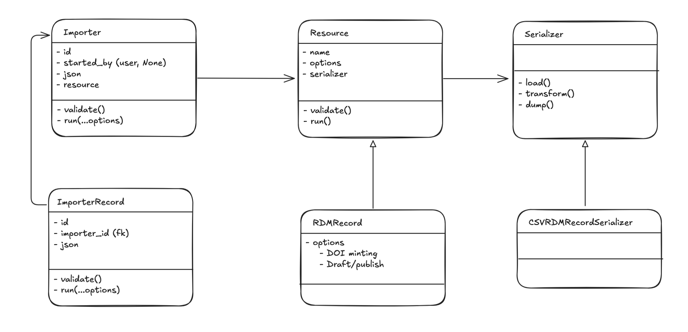
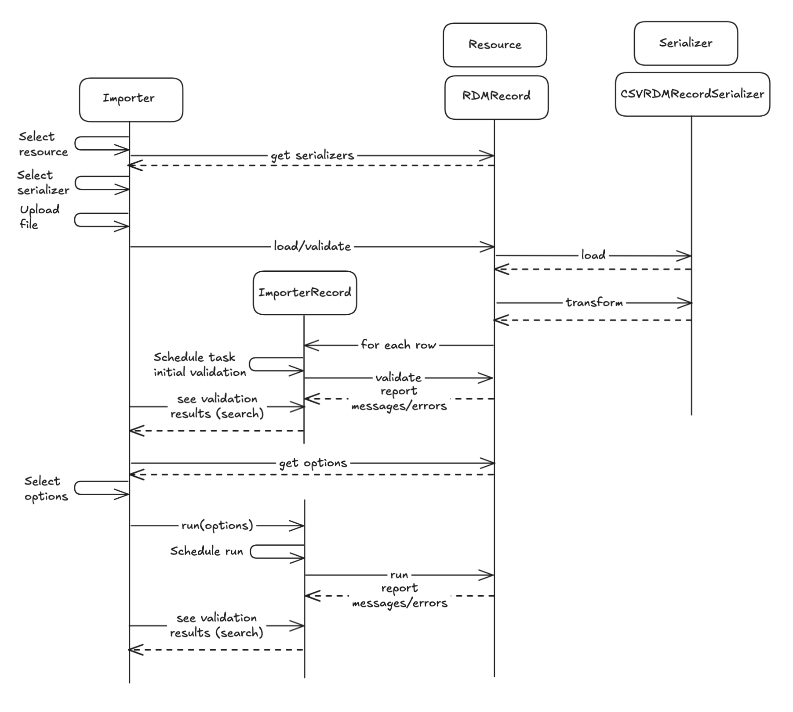
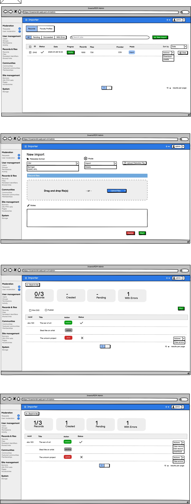

Start Date: 2025-02-01
- RFC PR: https://github.com/inveniosoftware/rfcs/pull/92
- Authors: Aaron McCollough, Esteban G. Gabancho

# Bulk importer

## Summary

Currently, InvenioRDM's only affordance for the bulk creation, import, and/or editing of records and files requires direct CLI-command-driven engagement with records and files APIs.

GUI-based bulk importing and editing of records and files is a widely desired, highly useful feature, which will help to make the platform appealing to a much broader base of institutional users.

The proposed feature is a beta version of a bulk importer for metadata (in CSV format) and associated files.

## Motivation
As an administrator user I want to ...
- Upload many records (with their files) at once into my instance.
- Select in which communities the records are publishes.
- Determine if a group of records get new DOIs (minted during the process)
- Update many records at once.
- Delete many records at once.
- See the status of past and current uploads.

##  Design

> [!info]
> Most of this content is "inspired" by [CDS ILS importer](https://github.com/CERNDocumentServer/cds-ils/tree/master/cds_ils/importer) and [lycophron](https://github.com/plazi/lycophron), kudos to both teams!



The two main object within the bulk engine will be the *Importer* and *ImporterRecord*

The **Importer** is the object that will orchestrate the bulk job, i.e. the parent object. It will contain metadata to help identify each of the job, like `title` and `description`, and also general information regarding the bulk operation: overall `status` , the `mode` of the operation, etc.
The **ImporterRecord**, on the other hand, will be object that stores information about each individual object that the bulk operation will work with (create/update/delete). This object will store the raw metadata as well as the transformed information, some information to show as columns on the user interface, like the presence of files, or the matched record in case of updates. It will also have some slots for messages/errors.

This two object won't hold any functionality regarding processing the input content and/or creating objects inside Invenio RDM. Instead, they will be responsible for orchestrating the process: 
- Create tasks for each action
- Store output messages from the tasks
- Hold log information about the actions
- ...
To enable easily search and files integration we believe these two objects should extend from records like many other modules do (collections, requests, etc). 

The other two objects involved will be the *Resources* and the *Serializers*.

The **Resource** is responsible for defining the type of object we are working with, i.e. metadata record, faculty profiles, etc. It will have a series of options that can be toggle on/off when running the bulk operation.
The resources an instance has could be extended using entrypoints.
The **Serializer** will be responsible for reading the input file and transforming each row according to a set of "embedded rules". In the future it would be nice to also have a dump option to 1) download the file that was uploaded if edit were made and 2) generate an empty file  with all the possible fields as a template.
As for the resources, these can be discovered/extended using entrypoints.

**Note on custom fields**:
Each serializer implementation is responsible for reading their particular section within `IMPORTER_CUSTOM_FIELDS`. As an initial approach it can look something like this:
```python
IMPORTER_CUSTOM_FIELDS={
	'csv_rdm_record_serializer':[
		{
			'columns': ['a', 'b', 'c'],
			'transformer': transformer_func
		}
	]
}
```
The signature of the transform function should be same of the `transform` function of the base class, i.e. taking the current row being transformed and current object where transformations are stored.
The columns function will be use to validate the input file, i.e. check that CSV headers are correct.
NOTE: No custom field would be consider mandatory, any column listed here can be missing from the input file.



### JSON Schemas
Both, the Importer and the ImporterRecord have a json field that will have a schema to enforce some kind of structure.
#### Importer
- `status`: can possibly be computed from records
- `mode`:
	- Possible values: `import`, `delete`
- `title`
- `description` / `notes`
- `resource`
- `serializer`
- `start_time`
- `end_time`
#### ImporterRecord

- `status`
	- Possible values: `pending`, `running`, `success`, `failure`, `stopped`, `archived` (`warning`?)
- `message`
- `info`: key:value array to be displayed on the UI in the form of columns.
- `src`: string/text representation of the raw data coming from the input file
- `transformed`: (dict) result of the load call from the serializer
### Administration interface



## Drawbacks
- Representing nested fields (such us author's metadata) inside a flat file, like CVS, is not optimal. 
## Alternatives
There is some work schedule to happen beginig of April to add to expand the current InvenioRDM REST APIs, to work with "arrays/streams" of "typed" actions, similar to how the [ElasticSearch Bulk API](https://www.elastic.co/guide/en/elasticsearch/reference/current/docs-bulk.html) works. There's nothing on paper yet, but it will be our opportunity to explore with a "power-user" to see if this is feasible and useful.
Maybe the importer endpoint could only deal with the load and transform part, and hand over the rest to the Bulk API.
## Unresolved questions

- Metadata file re-upload to correct errors
- How do we set a file for preview?

## Resources/Timeline

This is something Ubiquity Press needs for its MVP due the second quarter or the year. Development has already started.
