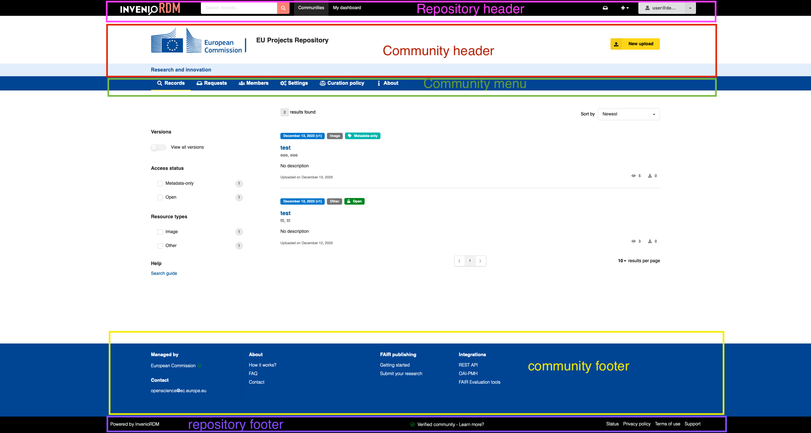
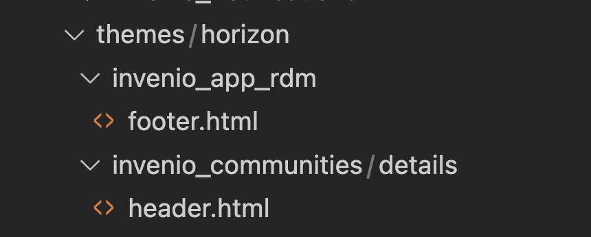

## Motivation

## Documentation

- [Branded EC Zenodo-community design](https://zenodo.org/records/8199881)
- [Content and curation policy for the Zenodo-communities](https://zenodo.org/records/8419426)

## Test communities

- EC 
- BLR

## Design

### Pages with branded design

- Community frontpage
- Community search
- Community requests + request detail
- Community members + invitations + invitation detail.
- Community about/curation policy
- Community settings (including all subpages)
- Record landing page
- New upload when access through the community
- Login???

i.e. everything below ``/communities/:id``  and some record pages

### Themes

- A community can have a specific theme applied. 
- A theme can have one or more variables defined on the community.

**Example: EC**

- Theme: Branded theme
- Config:
    - Header:
        - Main: white
        - Slogan background: light blue
        - Menu: dark blue
    - Create color: yellow
    - Primary color: dark blue
    - Link color: ...
    - Slogan: Research and Innovation
    - Footer menu: ...

**Example: BLR**

- Theme: Branded theme
- Config:
    - Header:
        - Main: white
        - Slogan background: green
        - Menu: Dark green
    - Create color: dark green
    - Primary color: blue
    - Link color: ...
    - Slogan: Liberating biodiveristy
    - Footer menu: ..


#### Styling vs templating 


**Styling**: any CSS related attribute (colors, height, etc)

**Templating** any HTML related requirement (reordering elements, changing links in the footer, adding new styling classes or HTML tag attributes)


Technical requirements

- Styling needs to be applied dynamically - per combination of view community and templating area.
- Branded templates needs to overwrite selected default templates = by default we mean
- We need to be able to have several brands that differ between each other
- Branded template should be assignable to a community without re-deployment
- Changing colours should not require re-deploying the application
- Brand colours should not have any influence over the rest of the repository look and feel (only community pages and subpages)

#### Dynamic styling - solution

Proposed solution is to use the jinja templates to generate dynamically CSS file which is then served on a dedicated endpoint.

Community theme configuration stored in community record:

```json
"theme": 
  {"brand": "horizon", 
   "enabled": true,
   "style": 
   {"font": {"size": "16px", "family": "Arial, sans-serif", "weight": 600}, 
    "primaryColor": "#004494", 
    "tertiaryColor": "#e3eefd", 
    "secondaryColor": "#FFD617",
    "primaryTextColor": "#FFFFFF", 
    "tertiaryTextColor": "#1c5694", 
    "secondaryTextColor": "#000000", 
    "mainHeaderBackgroundColor": "#FFFFFF"}
  }
```

The dedicated endpoint is:

```python
@pass_community(serialize=False)
def community_theme_css_config(pid_value, community):
    """Community brand theme view to serve css config."""

    theme_config = community.data.get("theme", {}).get("config")

    if theme_config is None:
        template = ""
    else:
        template = render_template(
            "invenio_communities/community_theme_template.css", theme=theme_config
        )

    return (
        template,
        200,
        {"Content-Type": "text/css; charset=utf-8"},
    )

```

and the generated dynamic CSS file

```css
.page-subheader-outer {
    background-color: {{ theme.headerBackgroundColor }} !important;
}

.theme-primary-menu .item.active {
  background-color: {{ theme.primaryColor }} !important;
}

.theme-primary {
  background-color: {{ theme.primaryColor }} !important;
}

.theme-primary .item, .theme-primary-menu, .page-subheader-outer{
  font-family: {{ theme.font.family }} !important;
  font-weight: {{ theme.font.weight }} !important;
  font-size: {{ theme.font.size }};
}

.theme-primary.pointing.menu .item.active {
  border-color: {{ theme.secondaryColor }} !important;
}

.theme-primary a, .theme-primary h1, .theme-primary h2 {
  color: {{ theme.primaryTextColor }} !important;
}

.invenio-accordion-field .title, .ui.primary.button{
  background-color: {{ theme.primaryColor }} !important;
  color: {{ theme.primaryTextColor }} !important;
}

.theme-secondary, .ui.secondary.button {
  background-color: {{ theme.secondaryColor }} 
  color: {{ theme.secondaryTextColor }} 
}

.invenio-page-body .ui.search.button{
  background-color: {{ theme.secondaryColor }} 
  color: {{ theme.secondaryTextColor }}
}

.theme-tertiary, .ui.tertiary.button {
  background-color: {{ theme.tertiaryColor }} !important;
  color: {{ theme.tertiaryTextColor }};
}

```

#### Usage of the styling:

```html
<link rel="stylesheet" type="text/css" href="/communities/{{community.id}}/brand_theme.css">
```


**Repository header** - consistent between branded communities, it is neutral in colours and not overridable to keep the repository branding intact between changing community identities 

**Community header** - user can change colours by changing `headerBackgroundColor`, `tertiaryColor` and `tertiaryTextColor`, previous logo upload feature stays without changes

**Community menu** - changing colors by `primaryTextColor` and `primaryColor`, changing font by `font` object

**Community footer** - changing colors by `primaryTextColor` and `primaryColor`, changing font by `font` object

**Repository footer** - consisent between branded communities, it is neutral in colours and not overridable to keep the repository branding intact between changing community identities 


Buttons and highlights are changed by `secondaryColor`.


**Naming of the branding elements variables is consistent with semantic-ui theming (primary/secondary/tertiary branding colors)**


#### Dynamic templating solution

- Use case: as a developer I would like to overwrite a community's template layout. For example, I would like to change the footer elements.


To achieve the above, the [jinja loader overlay](https://jinja.palletsprojects.com/en/3.1.x/api/#jinja2.Environment.overlay) method is utilized in combination with a new template render method. 
The new template loader is prepending in the list of template loading paths 2 new entries:
* Neutral path: This is the path that is common to all branded themes. The "neutral" theme includes common interfaces e.g repository footer (see [Usage-of-the-styling](#Usage-of-the-styling) section) that are not encouraged to be overriden by users implemented a new branded theme. 
Theme folder location per module: `semantic-ui/themes/neutral`
* Brand path: This is the path to the specific community brand that the developer is creating. Theme folder location per module: `semantic-ui/themes/<brand_name>`

The code implementing the new render method and the template loader is:

```python
from flask import current_app
from flask.templating import DispatchingJinjaLoader
from invenio_app.helpers import ThemeJinjaLoader
from jinja2 import ChoiceLoader
from werkzeug.utils import cached_property


class BrandThemeJinjaLoader(ThemeJinjaLoader):
    def __init__(self, app, loader, brand):
        self.brand = brand
        super().__init__(app, loader)

    @cached_property
    def prefixes(self):

        if isinstance(theme, str):
            # fe. semantic-ui/themes/horizon
            theme = f"themes/{self.brand}"
            theme = [theme]
        elif isinstance(theme, list):
            theme = [f"themes/{self.brand}" for item in theme]
        return theme


class BrandedThemeChoiceJinjaLoader(ChoiceLoader):
    """Prefix template loader.

    This loader acts as a wrapper for any type of Jinja loader. Before doing a
    template lookup, the loader sequentially applies prefixes to the template
    name, until a template source is found.

    The prefixes are defined via the ``APP_THEME`` configuration variable.
    """

    def __init__(self, brand):
        """Initialize loader.

        :param app: Flask application.
        :param loaders: Jinja loader to be wrapped.
        """

        self.app = current_app._get_current_object()

        branded_loader = BrandThemeJinjaLoader(
            self.app, DispatchingJinjaLoader(self.app), brand
        )
        neutral_loader = BrandThemeJinjaLoader(
            self.app, DispatchingJinjaLoader(self.app), "neutral"
        )
        super().__init__(
            loaders=[branded_loader, neutral_loader, self.app.jinja_env.loader]
        )


def render_community_theme_template(template_name_or_list, theme_brand=None, **context):
    """Render branded theme."""
    if theme_brand:
        if isinstance(template_name_or_list, str):
            loader = BrandedThemeChoiceJinjaLoader(theme_brand)

            branded_view_env = current_app.jinja_env.overlay(loader=loader)

            template = branded_view_env.get_or_select_template(template_name_or_list)
            app = current_app._get_current_object()
            # not ideal using the private flask function
            return _render(app, template, context)
        else:
            raise TemplateError("Themed template path should be of type str.")

    else:
        templates = template_name_or_list

        return render_template(templates, **context)

```

The `render_branded_template` can be used in the views that branding is needed. For example, in the community details page view:

```python
@pass_community(serialize=True)
def communities_detail(pid_value, community, community_ui):
    """Community detail page."""
    permissions = community.has_permissions_to(
        ["update", "read", "search_requests", "search_invites", "moderate"]
    )
    endpoint = "/api/communities/{pid_value}/records"

    return render_branded_template(
        "invenio_communities/details/index.html",
        theme_brand=community["theme"].get("brand"),
        community=community,
        community_ui=community_ui,
        # Pass permissions so we can disable partially UI components
        # e.g Settings tab
        permissions=permissions,
        active_community_header_menu_item="search",
        endpoint=endpoint.format(pid_value=community.to_dict()["id"]),
    )

```

#### Usage - developer POV


From the developer POV,  implementing a new theme would look like:




Then, communities that would like to use the brand "horizon", they could use it by just updating their record like follows:

```python
from invenio_communities.proxies import current_communities
from invenio_access.permissions import system_identity

service = current_communities.service
ec = service.read(system_identity, "ec")
ec_theme = {
"theme": 
    {"brand": "horizon", 
     "enabled": True,
     "style": 
         {"primaryColor": "#004494", 
           "tertiaryColor": "#e3eefd", 
           "secondaryColor": "#FFD617", 
           "primaryTextColor": "#FFFFFF", 
           "tertiaryTextColor": "#1c5694",
           "secondaryTextColor": "#000000", 
           "mainHeaderBackgroundColor": "#FFFFFF",
           "font": {"size": "16px", "family": "Arial, sans-serif", "weight": 600},
         } 
     } 
}

service.update(system_identity, "ec", {**ec.data, **ec_theme})
```

#### Static Pages

To add a static page utilising the community theme, define the configuration in the ```pages.yaml``` file under the ```app_data``` as:

```yaml
- url: /communities/ec/pages/info # The pid_value i.e. (ec) to be replaced according to the respective branded community
  title: HorizonZen - Information 
  description: Horizon
  template: "invenio_app_rdm/default_static_page.html"
  has_custom_view: True
```

> For each branded communtiy a separate static page will have to be defined, with the respective community's ```pid_value```

With the ```has_custom_view``` flag set as ``True``, a custom base default template can be defined for the static page instead of the default one.

And then run the following command to create the pages: 
```
invenio rdm pages create --force
```

The route for the community static page is as follows:
```python
RDM_COMMUNITIES_ROUTES = {
    ...
    ...
    "community-static-page": "/communities/<pid_value>/pages/<path:page_slug>",
}
```

The view function ```community_static_page``` associated with the static page renders the branded community template: 
```python
@pass_community(serialize=True)
def community_static_page(pid_value, community, community_ui, **kwargs):
    """Community static page."""
    permissions = community.has_permissions_to(
        ["update", "read", "search_requests", "search_invites", "moderate"]
        
    )

    try:
        page = current_pages_service.read_by_url(g.identity, request.path).to_dict()

    except (PageNotFoundError, NoResultFound):
        abort(404)

    return render_community_theme_template(
        page["template_name"],
        theme=community_ui.get("theme", {}),
        page=page,
        community=community_ui,
        permissions=permissions,
    )
```
This function retrieves and renders the static page content using the specified custom template and community theme.

### Performance

Important to check there's performance impact of the new theming

### Generic pages
[Scope ~]

- Which can be linked from e.g. footer

### Frontpages

[Scope B]

A community has a frontpage. The front page can have multiple sections. E.g. different types of sections

- Recent uploads
- Browse
- Announcements

Sections on the frontpage can be reordered.[Scope B]

### Announcements

[Scope ~]
Created and edited by communities

- Date + Title + Page
- Detail view
- List view
- Admin view


## Review comments

* I would use `default` instead of `neutral`: in `invenio-theme`, [we refer](https://github.com/search?q=repo%3Ainveniosoftware%2Finvenio-theme+default&type=code) to `default` for the base theme. Maybe the `default` them won't be `neutral` :')
* Is the theme name the same as the community id? Is the community owner chosing the theme (can you have multiple themes for a given community?)? In case the name of theme is input by the user, the theme should be unique: it looks like that is global, so if 2 communities use the same theme name, they will override each other. Another option is to prefix internally the name of the theme with the community id.
* The code snippets should be improved (as discussed offline), because they are not very clear
* The `font` part could be a problem: what if the font is not available and it should be imported?
* Thinking to future evolutions: should the schema of the settings of the theme somehow versioned? We are creating "a contract" between the settings and the Jinja template. We will have for sure to add/edit CSS and layout at some point. We could discuss if it makes sense to add to the config/settings an extra key with the filename of the Jinja, e.g.:
```json
    ...
    config: {
         ...
         template: "community_theme_template_v1.css"
    }
```
* take into account renaming of the theming variables
* take caching of the into account
* we can index theme as part of the community (? what if the theming grows a lot?)


# TO discuss

- [x] do we need to index the theme? do we want to differenciate the themed communities in the search view? - we do, we want to filter communities based on themed/not themed property - f.e. admin panel
- [ ] do we expose font changing setting to community managers? (see limitations)
- [ ] add a flag to turn off/on the theming per community (no need to revert to previous revision to get the previously stored theme - handy UX wise, if community manager has access to the feature)

## Limitations

* Branded templates cannot extend default ones due to the theme loader ending up in an infinite loop - same as a module/app overwriting template file of another module
* font-family can be set only for the default fonts available in the theme - 


## Versioning of the theme

Problem: if a config variable of the theme changes, we need to update all the community records to add/change/remove the key of the `theme: {}` dict

Use cases:

1. Updates of variable names (comment - Karolina: I wouldn't allow that, the theme should be strictly controlled, because it is really easy to make it too chaotic - for maintenance reasons the community theme should be as simple as possible)


### Two step upload 

1. If the community cannot be removed, then people who have the review request rejected need to discard the whole draft if they want to change community - we can keep only "remove community" button
2. for CDS-RDM it makes sense to discard the whole draft if the community is incorrect - mainly because of varying fields in the form.
3. changing community is problematic becuase the interface will be too confusing when changing the visual identity - you need to refresh 
4. alternative is to have the upload form for the community only accessible from the community view and we will discard if the community is wrong (no header in the form and no 2 steps)