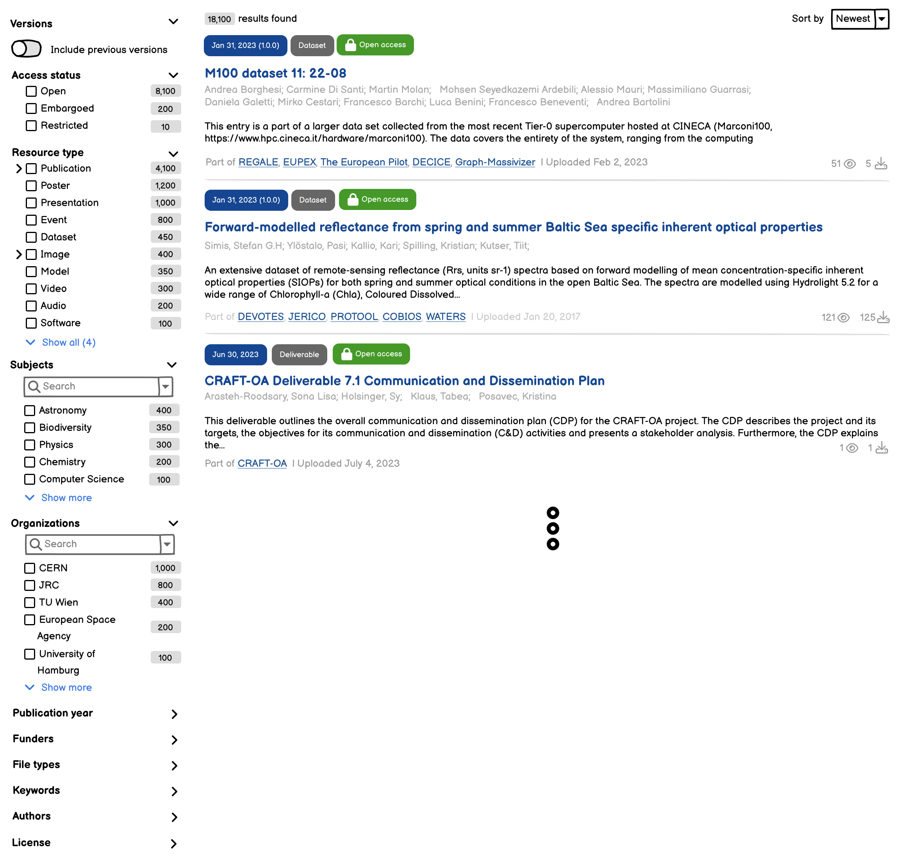

RFC: Advanced search facets
===

- Start Date: 2024-12-10
- RFC PR: https://github.com/inveniosoftware/rfcs/pull/100
- Authors: Alex Ioannidis, Carlin MacKenzie

## Summary

We will implement two new kinds of facets:

- **Vocabulary-search facets** - allow searching for facet values in a vocabulary.
- **Date facets** - filtering on dates (e.g. year ranges, specific dates).

Additionally we describe

- **Custom search configuration** - allow configuring different search aspects per
  community/collection for facets/filters, sort options, result display options
- Various improvements to the existing facets such as the ability to collapse them, exclude results and display selected facets

## Motivation

The existing search facets in Invenio are limited to a simple fixed-quantity aggregation configured and displayed in the facets sidebar. As such users are unable to make use of the facets if the number of values is large and/or the user needs to filter by a specific value that is not shown in the default list.

To facilitate this and more advanced use-cases, we want to improve the existing facets and extend the base set of facets with two new types:

- **Vocabulary search facet**: Provide a way to search for facet values relevant to the current result set and allow selecting them for filtering. This should be a generic feature that can be used with any facet type/field, and should perform well with large datasets.
- **Date facet**: Allow filtering on date values to narrow down search results based on the publication date of records for example. This should allow filtering by ranges (e.g. "2014-2020") or specific dates.

In addition, given this new set of facets and the flexibility they provide, we want to allow configuring different search aspects both per community and each collection defined within a community. This will allow communities to customize how their record search results are filtered and displayed to users, based on known metadata.

### User stories

- As a user, I want to be able to filter search results by looking up more values than the default 10/15/N that are shown on the facets sidebar.
- As a user, I want to be able to search for a specific value in the facet values, so that I can quickly narrow down results when there's a specific filter value for a metadata field.
- As a community manager, I want different facets on my community search page / collection browse pages (could be different).

### Examples

Record fields that could benefit from the new facets are:

- Vocabulary-based fields
  - **Affiliations/organizations**: to filter authors from different affiliations
  - **Subjects**: for record search results with a diverse set of subjects (e.g. MeSH terms, EuroSciVoc, etc.), looking up specific subjects for filtering allows to narrow down results more effectively.
  - **Author/names**: especially when the record metadata includes their unique identifiers (e.g. ORCiD).
- Date-based fields
  - **Publication date**: e.g. "2014-2020", "2021", etc. and to visualize the distribution of records over time.

Communities that could benefit from the new facets are:

- **Discipline-specific communities**: e.g. the Biodiversity Literature Repository which has already rich metadata for domain-specific fields
- **Funder-level communities**: e.g. the EU Open Research Repository on Zenodo, where all records contain funding information and EuroSciVoc subjects.

## Detailed design

We introduce several improvements to the existing facets. We iterate through them by feature and discuss if any backend changes are necessary.

### Excluding values

Clicking on the facet twice allows you to exclude the value. Clicking a third time unselects the facet term


#### Presentation/Service layer (REST API)

To support excluding specific values, we use a negation syntax with the `-` prefix for passed filter values:

**`GET /api/records?<filter>=-<value>`**

| Parameter  | Description                                                           | Example                   |
|------------|-----------------------------------------------------------------------|---------------------------|
| `<filter>` | Filter name with `-` prefix to exclude values (can be repeated) | `resource_type=-software` |

---

<details><summary>🔍 Example requests for excluding facet values</summary>

```json
// Exclude software resource types
GET /api/records?resource_type=-software

// Exclude multiple values from the same facet
GET /api/records?resource_type=-software&resource_type=-dataset

// Combine with other filters (exclude "economics" subject)
GET /api/records?q=machine+learning&resource_type=publication&subjects=-economics
```
</details>

---

### Displaying selected fields

We introduce a new section above the results listing all of the applied filters. Users can remove individual filters here, clear all filters and copy a link to the search. Filters which exclude results are shown in a contrasting colour. Also when terms are selected from search facets, the selected terms appear above the list of terms and collapsed facets display their selected values when collapsed.


### Accessing non-default facets

Facets can be collapsed, and the user can expand and access them. All available facets are shown to everyone and there are default facets which appear collapsed. Default open facets are defined in config in the order they should appear. Communities can choose which facets are open and their order in their community and collections. When facets are collapsed we still show the selected values


### Displaying more facet values (for small facets, <100 terms)

We introduce pagination of terms depending on their total number.

- <= 10 terms: We show all without pagination
- <= 25 terms: We show 10 results and a show all button
- \> 25 terms: We show 10 results and a show more button which shows 10 results at a time
- Note: For >100 terms, a search facet should be used instead for good UX


#### Presentation/Service layer (REST API)

For fetching additional facet values, we introduce a `facet` querystring parameter to existing search endpoints (e.g. `/api/records`, `/api/communities`), that allows specifying a facet and its size:

**`GET /api/<resource>?facet=<facet:size>&size=0`**

| Parameter     | Description                                                          | Example                                        |
|---------------|----------------------------------------------------------------------|------------------------------------------------|
| `facet`       | Facet to include (can be repeated), in the format `<facet>[:<size>]` | `facet=subjects:10`                            |
| `size`        | Number of results per page                                           | `size=0`                                       |
| Other filters | Any other search filters                                             | `q=machine+learning&resource_type=publication` |

Omitting the `facet` parameter will include the default configured facets of the resource.

---
<details><summary>🔍 Example requests for fetching more values for facets at the records endpoint</summary>

```json
// Single facet with custom size
GET /api/records?facets=subjects:30&size=0

// Response
{
  "aggregations": {
    // Only the "subjects" facet is included
    "subjects": {
      "buckets": [
        {"key": "machine learning", "doc_count": 260},
        {"key": "artificial intelligence", "doc_count": 140},
        {"key": "data science", "doc_count": 100},
        // ...rest of the 30 buckets...
      ]
    }
  },
  "hits": {
    "hits": [],  // Empty list since page size is 0
    "total": 54000  // We still see the total count of record results
  }
}

// Multiple facets with current filters applied
GET /api/records
  ?q=machine+learning
  &resource_type=publication
  &access_status=open
  &facets=resource_type:30,subjects:50
  &size=0

// Response
{
  "aggregations": {
    "resource_type": {
      "buckets": [
        {"key": "publication", "doc_count": 420},
        {"key": "dataset", "doc_count": 300},
        {"key": "software", "doc_count": 170},
        // ...rest of the 30 buckets...
      ]
    },
    "subjects": {
      "buckets": [
        {"key": "machine learning", "doc_count": 260},
        {"key": "artificial intelligence", "doc_count": 140},
        {"key": "data science", "doc_count": 100},
        // ...rest of the 50 buckets...
      ]
    }
  },
  "hits": {"hits": [], "total": 54000}
}
```
</details>

---

### Search facets (for large facets, >100 terms)

Even though the "Show more" approach works well for smaller facets with a known/limited number of terms, it becomes less practical (and performant) for larger facets. For example an "Affiliations" facet may have thousands of possible values, and a user may want to filter a specific organization that doesn't have a high document count and wouldn't appear in the top 100 terms.

Depending also on the underlying indexed data that we are working with, we have the following cases:

- **Vocabulary-based**: fields with values referencing vocabularies that get dereferenced during indexing (e.g. affiliations, funding)
- **Free-text**: fields with user-generated content (e.g. file types, journal titles, custom fields)
- **Mixed vocabulary-based and free-text**: fields that may contain both variants of values (e.g. subjects, authors)

We want to provide a unified UI/UX for all search facets, so that the implementation details are abstracted away from the user (and the UI widgets).  However, we'll address each of the above cases separately on the backend, since their technical implementation details differ.

#### Presentation layer

##### Mockups

Search facets improve on the current facets by both adding a search bar, and allowing for pagination of facet terms. Users can click show more to see more facet terms, or search directly. Selected search results appear in the list at the top of the results.


##### UI components

The UI components will be responsible for fetching the autocomplete results from the REST API and will be part of the existing `react-searchkit` package. The components will allow the user to search for facet values and select them for filtering the search results.

The components will be designed to be generic and reusable, so that they can be used with any facet field.

##### REST API

> [!NOTE]  
> The REST API endpoints that serve the autocomplete results will not be affected. This will allow the UI frontend to consume the autocomplete results and display them to the user.

The REST API will provide a new endpoint for fetching the available values for a facet field in the context of the current search results. The endpoint will accept the user's search input for the facet, and any other existing search parameters relevant to the current search results (e.g. filters, querystring input, etc.).

**`GET /api/<resource>/facet-suggest/<facet>`**

| Parameter  | Location | Description                                                                               |
|------------|----------|-------------------------------------------------------------------------------------------|
| `resource` | path     | The underlying search results resources (e.g. `records`, `communities`)                   |
| `facet`    | path     | Name of the facet/aggregation to return suggestions for (e.g. `affiliations`, `subjects`) |
| `q`        | query    | The user's input for the facet suggestion                                                 |
| `size`     | query    | The maximum number of values to return                                                    |
| `page`     | query    | Page for the facet suggestions                                                            |
| `filters`  | query    | URL-encoded current search filters for the main results                                   |

Here's an example request where the user is searching for the value "CERN" in the affiliations facet, and the current search results are already filtered by the query "open science", resource type "dataset" and all versions of the records:

```http
GET /api/records/facet-suggest/affiliations HTTP/1.1
Accept: application/vnd.inveniordm.v1+json

q=CERN
size=20
filters=URLEncode(resource_type=dataset&allversions=true&q=open+science)

HTTP/1.1 200 OK
Content-Type: application/vnd.inveniordm.v1+json

{
  "total": 23,
  "hits": [
    {
      "id": "01ggx4157",
      "title": "European Organization for Nuclear Research",
      "acronym": "CERN",
      "count": 123
    },
    {
      "id": "05dsdfef",
      "title": "Cerebral Palsy Research Network",
      "acronym": "CPRN"
      "count": 45
    },
    ...
  ],
  "links": {
    "self": "/api/records/facet-suggest/affiliations?q=CERN&size=20&filters=...",
    "next": "/api/records/facet-suggest/affiliations?q=CERN&size=20&filters=..."
  }
}
```

Here's another facet search request where user is searching for the value ["parquet"](https://en.wikipedia.org/wiki/Apache_Parquet) on the "File types" facet (which is based on a free-text field, since uploaded filenames can vary widely):

```http
GET /api/records/facet-suggest/filetypes HTTP/1.1
Accept: application/vnd.inveniordm.v1+json

q=parquet
```http
GET /api/records/facet-suggest/filetypes HTTP/1.1
Accept: application/vnd.inveniordm.v1+json

q=parquet
size=20
filters=...

HTTP/1.1 200 OK
Content-Type: application/vnd.inveniordm.v1+json

{
  "total": 1,
  "hits": [
    # Only one result, since this was an exact match
    {
      "id": "parquet",
      "title": "parquet",
      "count": 356
    }
  ],
  "links": {
    "self": "/api/records/facet-suggest/filetypes?q=parquet&size=20&filters=..."
  }
}
```

#### Service layer

We introduce a new `SearchFacet` class to allow configuring search-based facets
in a structured manner. A `SearchFacet` can be specified under the
`SearchOptions.facets` config.

---
<details><summary>🔍 Example `SearchFacet` definitions in `SearchOptions.facets`</summary>

```python
class SearchOptions:

    facets = {
        "resource_type": ...,
        # Vocabulary-based facet
        "organization": SearchFacet(
            field="metadata.creators.affiliations.id",
            # NOTE: This should also work for multiple fields, i.e.:
            # fields=[
            #     "metadata.creators.affiliations.id",
            #     "metadata.contributors.affiliations.id",
            # ],
            vocabulary="affiliations",
            label=_("Organizations"),
        ),
        # Free-text facet
        "filetypes": SearchFacet(
            field="files.types",
            label=_("File Types"),
        ),
    }
```
</details>

---


While the above declaration helps with exposing the configured facets, the implementation for actually getting facet suggestions will be in a new `RecordService.search_facets(...)` service method, which in turn delegates to the `SearchFacet.search` class for fetching the facet suggestion values. the implement

---
<details><summary>Rough implementation of `RecordService.search_facets(...) and SearchFacet.search(...)`</summary>
```python
class RecordService(Service):

    def search_facets(self, identity, facet_id, params=None):
        # 1. Lookup the facet configuration
        facet = self.config.search.facets.get(facet_id)

        # 2. Create the "main" search query (for the underlying resource, e.g. records)
        search_params = decode_search_filters(params["filters"])
        main_search = self._create_search(identity, params=search_params)[:0]
        main_search.aggregations.clear()  # We don't want the default search aggregations

        # 3. Search for the facet value (delegating to `SearchFacet.search(...)`)
        facet_results = facet.search(
            identity,
            params={"q": params["q"], "size": params["size"]},
            main_search=main_search,
        )

        return self.search_facet_result_cls(result=result, ...)


class SearchFacet:

    def search(self, identity, params, main_search):
        result = []

        # If vocabulary-based facets...
        if self.vocabulary:
            # ...search in the vocabulary service
            facet_values = self.vocabulary_service.search(identity, params=params)
            # ...fetch counts for the values in the main search results
            main_search.aggregations[self.id] = {
                "terms": {
                    "field": self.field,
                    "include": [r["id"] for r in facet_values]
                }
            }
            counts_result = main_search.execute()

            # ...combine the vocabulary results with the counts
            for r in vocabulary_results["hits"]:
                count = counts_result.aggs[self.id]["buckets"].get(r["id"], {}).get("doc_count", 0)
                result.append({
                    **facet_values.get(r["id"]),
                    "count": count,
                })
        # If free-text facets...
        else:
            # ...do a regular bucket terms aggregation on the main search
            q = params["q"]
            main_search.aggregations[self.id] = {
                "terms": {
                    "field": self.field,
                    "size": params["size"],
                    "include": [f"*{q}*"],
                }
            }
            counts_result = main_search.execute()
            for r in counts_result.aggs[self.id]["buckets"]:
                result.append({
                    "id": r["key"],
                    "label": r["key"],
                    "count": r["doc_count"],
                })

        # Sort values results by count in descending order
        result = sorted(result, key=lambda x: x["count"], reverse=True)
        return result
```
</details>

---

The `SearchFacet.search` implementation uses the following logic, depending on the underlying facet type:

**Vocabulary-based facets**

We search in the main vocabulary first with the user's input and for all returned values calculate aggregated totals on the main search results. Then we serve a response with the aggregated values for the facet sorted by their total count, including values with zero counts

- ✅ Pros
    - more expressive and accurate search/filtering of the facet values (e.g. looking up organizations using acronyms, aliases, prefix search, etc.)
  - no mapping changes required on the records index, since we'll be able to filter the values based on the exact vocabulary values
- ❌ Cons
  - the main search results might not be accurate, as the facet values are not filtered/affected by the current search results.
  - performance might be slower, since we're performing multiple search requests
  - :warning: Note that the user cannot search for non-vocabulary-based values, i.e. free-text that might have been entered by users (e.g. an organization not yet in ROR, keyword-style subjects, authors without ORCiD, etc.).

We'll be making use of the `include` parameter in the `terms` aggregation query to filter the available values based on the user's input.

---
<details><summary>🔍 Example of executing a search query for the value "CERN" in the affiliations facet</summary>
   
```json
// Step 1: Search for the value in the affiliations vocabulary
GET /affiliations/_search
{
  "query": {
    "multi_match": {
      "fields": ["..."],
      "query": "CERN"
    }
  }
}

// Response
{
  "hits": {
    "hits": [
      {
        "id": "01ggx4157",
        "name": "European Organization for Nuclear Research",
        "acronym": "CERN"
      },
      {
        "id": "05dsdfef",
        "name": "Cerebral Palsy Research Network",
        "acronym": "CPRN"
      },
      ...
    ]
  }
}

// Step 2: Fetch the available values for the affiliations facet
GET /records/_search
{
  "aggs": {
    "affiliations": {
      "terms": {
        "field": "metadata.creators.affiliations.id",
        // We include all the values that match the user's input from the previous query
        "include": ["01ggx4157", "05dsdfef", ...]
      }
    }
  },
  // We don't care about the search results, we only need the aggregations
  "size": 0,
}

// Response
{
  "aggregations": {
    "affiliations": {
      "buckets": [
        // Each key can be mapped to the affiliations vocabulary to get the name for UI
        // display purposes in the final response
        {
          "key": "01ggx4157",
          "doc_count": 123
        },
        {
          "key": "05dsdfef",
          "doc_count": 45
        },
        ...
      ]
    }
  }
}
```
</details>

---

**Free-text facets**

As long as the search mappings on the underlying resource are correctly
configured to allow existing aggregations (i.e. they have a `keyword` type or
`doc_values` enabled), we can use them to perform a terms aggregation with an
`include` regex filter to fetch the available values (and their totals) for a
facet field on the main search query.

---
<details><summary>🔍 Example of executing a search query for the value "parquet" in the filetype facet</summary>
   
```json
GET /records/_search
{
  "aggs": {
    "filetype": {
      "terms": {
        "field": "files.types",
        // Regex to include all matches that contain the term "parquet"
        "include": [".*parquet.*"]
      }
    }
  },
  // We don't care about the search results, we only need the aggregations
  "size": 0,
}

// Response
{
  "aggregations": {
    "filetype": {
      "buckets": [
        // We just got a single bucket, since the query was specific enough
        {
          "key": "parquet",
          "doc_count": 356
        }
      ]
    }
  }
}
```
</details>

---

### Date facets

#### UI

Users can hover to see "Year: Count" values, click to focus on a year, and use the handles to select a range


The custom dates button will allow users to enter two dates (full or partial)

#### Datamodel

For date-based facets, we can use the `date_histogram` aggregation to aggregate the date values on a specific interval. Here's an example query for aggregating the publication date of records based on the year interval:

```json
GET /records/_search
{
  "aggs": {
    "publication_date": {
      "date_histogram": {
        "field": "metadata.publication_date",
        "calendar_interval": "year",
        "format": "yyyy"
      }
    }
  }
}
```
<details><summary>Response</summary>
```json
{
  "aggregations": {
    "publication_date": {
      "buckets": [
        {
          "key_as_string": "2014",
          "key": 1388534400000,
          "doc_count": 12
        },
        {
          "key_as_string": "2015",
          "key": 1420070400000,
          "doc_count": 345
        },
        ...
      ]
    }
  }
}
```
</details>

#### Service layer

This type of facet can be implemented as a new `DateFacet` class that extends the base `Facet` class. The `DateFacet` class will be responsible for generating the aggregation query based on the user's input and the facet configuration.

---
<details><summary>`class SearchOptions`</summary>
   
```python
class SearchOptions:

    facets = {
        "resource_type": ...,
        "publication_date": DateFacet(
            field="metadata.publication_date",
            label=_("Publication year"),
            interval="year"
        )
    }
```
</details>

---

#### Presentation layer (REST API)

The facet aggregation values will be returned in the usual bucket-style response. What will differ is the way one can filter on these date fields based on a range or a specific date.

##### `GET /api/records/?<date-field>=<range>`

##### Range filter syntax

The REST API supports several ways to specify date ranges in the querystring:

```
# Simple range with inclusive bounds (default)
publication_date=2014..2020

# Open-ended range
publication_date=2014..  # from 2014 onwards
publication_date=..2020  # up to 2020

# Specific value
publication_date=2014

# (Optionally) explicit range with inclusive/exclusive bounds
publication_date=(2014..2020]  # exclusive start, inclusive end
```

The git-style `..` separator for representing date ranges has a few benefits:

- it's unambiguous, especially when dealing with full dates
    - `publication_date=2014-01-01..2014-12-31` is easier to parse than `publication_date=2014-01-01-2014-12-31`
- it's URL-friendly (i.e. a developer can easily construct URLs in their browser, without worrying about encoding special characters)
    - in contrast, the EDTF (Extended Date Time Format) slash `/` notation (e.g. `2024-01/2025-03` for specifying "Jan 2024 to Mar 2025"), could prove problematic in URLs
    
### Custom search configuration

A major limitation of how facets, sorting, and display options are currently
configured is that they cannot be customized per community and collection. This
means that all communities and collections share the same base set of records
search configuration, which may hinder how its content is discovered and
accessed.

For example a community that is mainly focused on journal publications doesn't
benefit from the "Resource Type" facet, but would instead benefit from a
"Journal Title" or "Author" facet and sorting options taking into account
journal issues and volumes (the same example could be made for a collection).

We want to address this, by introducing two key concepts:

- A JSON-serializable **search configuration schema**, describing facets, sorting, and display options.
- A **registry of search facet types** that can be referenced in the stored configuration.
    - Sorting and display options are simple enough, to not require type classes or registries

This is aims at formalizing the existing configuration in the `SearchOptions`
class, so that its representation can be reliably stored and retrieved e.g.
from the database.

#### Facet types registries

Similar to how we already have registries for Services, Request types, and other concepts in InvenioRDM, we will introduce a registry for facet types. These types are just classes that are associated with a unique ID, which can be used to reference them in the search configuration. For example the `TermsFacet` class would be registered as `terms`.

Additionally, we also extend these classes to include `dump`/`load` methods that can be used to serialize/deserialize their configuration from a class instance to a dictionary representation that can be stored in the database as JSON and vice-versa.

Including the implementation of the facets descrived in this RFC, we would have the following types in the registry:

- `terms` - `TermsFacet`: the existing terms-based facet
- `search` - `SearchFacet`: the new searchable facet for vocabularies and free-text fields
- `date` - `DateFacet`: the new date-based facet

Having this predefined set of facet types will also help with eventually implementing a UI for configuring the facets directly in the community settings page.

#### Search configuration schema

To allow defining facets, sorting, and display options we introduce a JSONSchema that can be reused in both communities and collections:

| Field             | Type   | Description                                                      | Example                                              |
|-------------------|--------|------------------------------------------------------------------|------------------------------------------------------|
| `facets`          | array  | List of facet configurations                                     | `[{"type": "terms", ...}, ...]`                      |
| `facets[].type`   | string | Type of facet from the registry (`terms`, `search`, `date`, ...) | `"terms"`                                            |
| `facets[].params` | object | Parameters specific to the facet type class                      | `{"field": "resource_type"}`                         |
| `sort_options`    | array  | Sorting options for the search results                           | `[{"field": "metadata.title", "order": "asc"}, ...]` |
| `display_options` | array  | Display options for the search results                           | `[{"type": "list"}, {"type": "grid"}, ...]`          |

---
<details><summary>Partial example of this config in a community</summary>

```json
{
  ...
  "search": {
    "facets": [
      {
        "type": "terms",
        "params": {
          "field": "resource_type",
          "label": {
            "en": "Resource Type",
            "fr": "Type de ressource"
          },
          "size": 10
        }
      },
      {
        "type": "search",
        "params": {
          "field": "metadata.creators.affiliations.id",
          "label": {
            "en": "Organizations",
            "fr": "Organisations"
          },
          "vocabulary": "affiliations"
        }
      },
      {
        "type": "date",
        "params": {
          "field": "metadata.publication_date",
          "label": {
            "en": "Publication Year",
            "fr": "Année de publication"
          },
          "format": "yyyy"
        }
       },
      ...
    ]
  },
  "sort_options": [
    {
      "field": "metadata.title",
      "order": "asc",
      "title": {
        "en": "Title (A-Z)",
        "fr": "Titre (A-Z)"
      }
    },
    {
      "field": "metadata.publication_date",
      "order": "desc",
      "title": {
        "en": "Publication Date (Newest)",
        "fr": "Date de publication (Plus récent)"
      }
    }
  ],
  "display_options": [
    {"type": "list"},
    {"type": "grid"}
  ]
}
```
</details>

---

##### Collections integration

For collections, we introduce a new `Collection.settings` JSON column. This column will:

- Under a `search` key allow storing search configuration as described by the above schema
- Replace the existing `Collection.query` text column (currently used for storing the search query of the collection as a plain querystring)
    - This would allow defining more efficient and complex search queries as objects (e.g. Range and Geo queries)
- Potentially be used for other collection-level settings in the future (e.g. related links, icons, etc.)

The `settings.search` object would also allow options for "inheriting" search configurations from parent collections.

---
<details><summary>Example `Collection.settings` value</summary>
   
```json
{
  "search": {
    "facets": [
      {
        "type": "terms",
        "params": {
          "field": "resource_type",
          "label": {
            "en": "Resource Type",
            "fr": "Type de ressource"
          },
          "size": 10
        }
      },
      {
        "type": "search",
        "params": {
          "field": "metadata.creators.affiliations.id",
          "label": {
            "en": "Organizations",
            "fr": "Organisations"
          },
          "vocabulary": "affiliations"
        }
      },
      ...
    ],
    "sort_options": [
      {
        "field": "metadata.version",
        "order": "desc",
        "title": {
          "en": "Version (Newest)",
          "fr": "Version (Plus récente)"
        }
      },
      ...
    ],
    // Inherit from parent collection
    "display_options": "inherit"
  },
  // Migrated "query" column
  "query": {
    "bool": {
      "must": [
        {"match": {"metadata.creators.identifiers.identifier": "0000-0002-5082-6404"}},
        {"match": {"metadata.resource_type": "software"}},
        {"range": {"metadata.publication_date": {"gte": "2020-01-01", "lte": "2020-12-31"}}}
      ]
    }
  }
}
```
</details>

---

## Example

### Before


### After



**After selections**


## Alternatives

<details><summary>Datamodel: Vocabulary-search facets, Direct aggregation search</summary>

Instead of searching in the main vocabulary first with the user’s input and for each returned value calculate aggregated totals on the main search results, we could search directly in the records index for the facet values, using the user's input to filter the available values.

- ✅ Pros
  - faster search, as we only need to fetch the search results once from a single index.
- ❌ Cons
  - less expressive search, as we can only search for the exact values that are indexed in the records index (e.g. for organizations, we can only search by name)
  - requires mapping changes on the records index to allow searching for facet values in the records index.
  - it also won't display results with zero matches
</details>

<details><summary>Support for more filters/facets than what is displayed</summary>

UI/UX for extending selection of facets (i.e. if we have 20 available facets, and by default display 5, how does a user add one of the other 15 facets to use for filtering)

- [PubMed](https://pubmed.ncbi.nlm.nih.gov/?term=carbon&filter=pubt.clinicaltrial&filter=pubt.meta-analysis&filter=lang.english&filter=years.2008-2008&timeline=expanded) has a button to show the rest of the facets
- [Ebay](https://www.ebay.com/sch/i.html?_nkw=jeans&_sop=12) has more detailed facets as a modal
- [GBIF](https://www.gbif.org/occurrence/search?q=ants) has a tabbed view with "Simple filters"/"All filters" (but no visual indicator of selected filters)

**Decision:** Collapsible facets are much easier to implement and solve the issue of displaying 10-15 facets. If we ever need more selections, we should go with a button at the bottom of the filters which either opens a modal or expands a scrollable container of availble filters
</details>

<details><summary>When do they exclude results</summary>

- [Lens.org](https://www.lens.org/lens/search/scholar/list?q=carbon) has exclude
- [NASA/ADS](https://ui.adsabs.harvard.edu/search/filter_author_facet_hier_fq_author=AND&filter_author_facet_hier_fq_author=author_facet_hier%3A%220%2FHiggs%2C%20P%22&filter_database_fq_database=OR&filter_database_fq_database=database%3A%22physics%22&filter_database_fq_database=database%3A%22astronomy%22&filter_property_fq_property=NOT&filter_property_fq_property=property%3A%22refereed%22&fq=%7B!type%3Daqp%20v%3D%24fq_author%7D&fq=%7B!type%3Daqp%20v%3D%24fq_property%7D&fq=%7B!type%3Daqp%20v%3D%24fq_database%7D&fq_author=(author_facet_hier%3A%220%2FHiggs%2C%20P%22)&fq_database=(database%3A%22physics%22%20OR%20database%3A%22astronomy%22)&fq_property=property%3A%22refereed%22&q=author%3A%22Higgs%22&sort=date%20desc%2C%20bibcode%20desc&p_=0) has two-step exclude (and the ability to do AND/OR)

Alternative designs could be:

1. When users hover over the row, the ❌ appears allowing them to exclude the facet term. We color-code with yellow/warning when selected filters exclude values from the results.
2. Having confirmation on clicking the box if you want to "limit to" or "exclude" the value.

**Decision:** Clicking twice on the checkbox
</details>

<details><summary>When do they narrow-down/expand results (i.e. AND/OR)</summary>

**Decision**

- Inside a single facet selections are OR-ed together.
- Across facets, they are AND-ed together
</details>

<details><summary>How can you search for values inside facets</summary>
   
- [DOAJ](https://doaj.org/search/journals?ref=homepage-box&source=%7B%22query%22%3A%7B%22query_string%22%3A%7B%22query%22%3A%22carbon%22%2C%22default_operator%22%3A%22AND%22%7D%7D%2C%22track_total_hits%22%3Atrue%7D) has searching inside facets
- [OSTI](https://www.osti.gov/search/semantic:carbon) doesn't show search by default (click more in authors)
- [Lens.org](https://www.lens.org/lens/search/scholar/list?q=carbon) has search
- [GBIF](https://www.gbif.org/) has search

**Decision:** It is relatively globally accepted how to do this
</details>

<details><summary>How do you see the filters you have applied (and remove them)</summary>

- [NASA/ADS](https://ui.adsabs.harvard.edu/search/filter_author_facet_hier_fq_author=AND&filter_author_facet_hier_fq_author=author_facet_hier%3A%220%2FHiggs%2C%20P%22&filter_database_fq_database=OR&filter_database_fq_database=database%3A%22physics%22&filter_database_fq_database=database%3A%22astronomy%22&filter_property_fq_property=NOT&filter_property_fq_property=property%3A%22refereed%22&fq=%7B!type%3Daqp%20v%3D%24fq_author%7D&fq=%7B!type%3Daqp%20v%3D%24fq_property%7D&fq=%7B!type%3Daqp%20v%3D%24fq_database%7D&fq_author=(author_facet_hier%3A%220%2FHiggs%2C%20P%22)&fq_database=(database%3A%22physics%22%20OR%20database%3A%22astronomy%22)&fq_property=property%3A%22refereed%22&q=author%3A%22Higgs%22&sort=date%20desc%2C%20bibcode%20desc&p_=0) displays a top bar showing the selected filters
- [HathiTrust](https://babel.hathitrust.org/cgi/ls?q1=carbon;field1=ocr;a=srchls;lmt=ft&facet=topicStr:%22United%20States%22) displays active filters in the sidebar

**Decision:**

- Search facets have selected values at the top of its box
- Collapsed facets still display their selected values
- TODO: Mockup and present the below options:
    - At the top of the facets sidepanel there is a "Selected filters" box listing all the applied filters (and allows removing them)
        - Variation: the box has a stable height, so that one can scroll through the selections. This also helps with the facets components jumping up and down as selections are added/removed
    - At the of the search results there a horizontal bar with all the selected filters

</details>

<details><summary>Can you collapse facets</summary>
   
**Decision:** Yes, this is standard behaviour across many search engines. Collapsed facets should still display their selected values

</details>

<details><summary>Can you see more results (without searching)</summary>
- [AGRIS](https://agris.fao.org/search/en?query=carbon&) allows you to see a few more results at a time rather than showing all immediately

**Decision:** Yes, we introduce pagination of terms depending on the number of them.

- <= 10 terms: We show all without pagination
- <= 25 terms: We show 10 results and a show all button
- \> 25 terms: We show 10 results and a show more button which shows 10 results at a time
- Note: For >100 terms, a search facet should be used instead

</details>

<details><summary>Ordering of terms in facets</summary>
- [DOAJ](https://doaj.org/search/journals?ref=homepage-box&source=%7B%22query%22%3A%7B%22query_string%22%3A%7B%22query%22%3A%22carbon%22%2C%22default_operator%22%3A%22AND%22%7D%7D%2C%22track_total_hits%22%3Atrue%7D) has ordering by selected then count

**Decision:** We order by count, except for search facets where the selected search results go to the top of the list

</details>

<details><summary>How do you filter dates</summary>
- [Europe PMC](https://europepmc.org/search?query=carbon%20AND%20%28FIRST_PDATE%3A%5B1992%20TO%202025%5D%29&page=1)
- [PubMed](https://pubmed.ncbi.nlm.nih.gov/?term=carbon&filter=pubt.clinicaltrial&filter=pubt.meta-analysis&filter=lang.english&filter=years.2008-2008&timeline=expanded)

**Decision:** We follow user expectations of showing an aggregated graph bucketed by year, that can be interacted with with both keyboard and mouse
</details>

## Unresolved questions

### When are the aggregated totals affected (i.e. use filter/post-filter)

Here's an example of sequentially applying facets with grand total and facet totals updating. The logic we use is:

- Each facets takes into account other facets' filtering
- So that the totals for the other values aren't "lost" (i.e., selecting "Open" shouldn't zero the values for "Closed"/"Embargo"), the selection applied inside the facet itself is not taken into account for calculating aggregated totals for its values

**0.**

```
- Total: 1,000
- Query: ...
- Access status
    - [ ] Open             (800)
    - [ ] Closed           (150)
    - [ ] Embargoed         (50)
- Resource type
    - [ ] Publication      (600)
    - [ ] Image            (200)
    - [ ] Dataset          (180)
    - [ ] Software          (20)
- Subject
    - [ ] Machine learning (300)
    - [ ] Biodiversity     (100)
    - [ ] Economics         (50)
```

**1. Add filter "Access status -> Open"**
```
- Total: 800
- Query: ...
- Access status
    - [x] Open             (800)
    - [ ] Closed           (150)
    - [ ] Embargoed         (50)
- Resource type (totals take into account `access:open` filter)
    - [ ] Publication      (400)
    - [ ] Image            (300)
    - [ ] Dataset           (90)
    - [ ] Software          (10)
- Subject (totals take into account `access:open` filter)
    - [ ] Machine learning (200)
    - [ ] Biodiversity     (100)
    - [ ] Economics          (0)
```
**2. Add filter "Resource type -> Image"**
```
- Total: 300
- Query: ...
- Access status (total take into account `type:image`)
    - [x] Open             (300)
    - [ ] Closed            (80)
    - [ ] Embargoed         (10)
- Resource type (totals take into account `access:open` filter)
    - [ ] Publication      (400)
    - [x] Image            (300)
    - [ ] Dataset           (90)
    - [ ] Software          (10)
- Subject (totals take into account `access:open` and `type:image` filter)
    - [ ] Machine learning  (50)
    - [ ] Biodiversity     (100)
    - [ ] Economics          (0)
```
**3. Add filter "Access status -> Closed"**

```
- Total: 380
- Query: ...
- Access status (total take into account `type:image`)
    - [x] Open             (300)
    - [x] Closed            (80)
    - [ ] Embargoed         (10)
- Resource type (totals take into account `access:(open OR closed)` filter)
    - [ ] Publication      (440)
    - [x] Image            (380)
    - [ ] Dataset          (110)
    - [ ] Software          (10)
- Subject (totals take into account `access:(open OR closed)`and `type:image` filter)
    - [ ] Machine learning  (50)
    - [ ] Biodiversity     (100)
    - [ ] Economics          (0)
```

**4. Add a "Query: ants" filter**

This narrows down all results, so both the grand total and all facet totals are updated:

```
- Total: 125 (significantly reduced due to query constraint)
- Query: ants
- Access status (totals take into account `type:image`, and `ants` query)
    - [x] Open              (100)
    - [x] Closed             (25)
    - [ ] Embargoed           (5)
- Resource type (totals take into account `access:(open OR closed)`, and `ants` query)
    - [ ] Publication        (45)
    - [x] Image             (125)
    - [ ] Dataset            (20)
    - [ ] Software            (2)
- Subject (totals take into account `access:(open OR closed)`, `type:image`, and `ants` query)
    - [ ] Machine learning   (15)
    - [ ] Biodiversity      (110) # higher count due to ants being related to biodiversity
    - [ ] Economics           (0)
```

## Out of scope

### How do you filter by location
- [GBIF](https://www.gbif.org/) has filtering by location
* Carlin: I think we should do the minimal Geo stuff for now, and leave the fancy polygon stuff for later. It's cool but I don't think it's a good user experience. I think country/continent level stuff is enough for 90% of use cases. For the other 10%, it's probably more useful to be able to see results on the map (a la airbnb does)
* Alex: Agree, a predefined list of regions/locations should be enough. Coming up with a design for complex polygons doesn't really add much value, and we will anyways have to look into UI libraries that deal with this (to see how they model the input)

**Decision:** We choose to not design this until we have a better understanding of the data-model and the user requirements


## Discussions

- ***Q (Lars):** Why do we need a specific `/api/<resource>/facet-suggest/<facet>` suggest end point for facets instead of just the regular vocabulary suggest endpoint?*
    - **A (Alex):** To "contextualize" the suggestions based on the current search filter of the user and add totals for how many records are matching each vocabulary term. The alternative would be to not show totals, but then after clicking a term that has no results, users would get no results, which is not good UX.
- ***Q (Lars):** How do we inject into the page which facets to render? I.e. being able to allow one set of facets on one community, and a different set on another community?*
  - **A (Alex):** `react-searchkit` already accepts passing a facets/aggs configuration (injected via Jinja in the backend), so it's a matter of handling the new advanced facet "types"
- ***Q (Lars):** Could we consider how we could show by default some facets, and how allow a user to add more facets (bit like advanced search)? E.g. an "Add filter" button somewhere.*
  - **A (Alex):** Yes, we could add an "Add filters" button that opens a modal with a list of filters (e.g. date range, advanced facets, etc.). Basically we have two sets, "available" and "default" facets.
- ***Q (Lars):** What about more advanced widgets than the list (e.g. GBIF scientific name, location, year, year with filter)*
  - **A (Alex):** Added more advanced widgets like date range, geolocation.
- ***C (Lars):** The NASA-tag I'm not sure how it would work with the checkboxes.*
  - **A (Alex):** Will remove the checkboxes from the mockup, and only show the search
    input. We still need some "default" values to show, where, clicking them will add
    them as "tags" to the filter selection.
  - **(Carlin)**: I think we should add NASA with a check box in the list as usual. I don't see why we need to introduce the new "pill" style display
      - (Alex): Agree :+1:
- ***Q (Lars):** I would add a "clear all filters"*
  - **A (Alex):** Yes, we should have a "Clear all" button that resets all the filters.
- ***Q (Lars):** What about different search views - compact, thumbnails, map, ....,*
  - **A (Alex):** Agree, these are possible in the same way as we have grid/list view.
- ***Q (Carlin)**: Is it in scope to be able to load more results in a facet? Two example use cases:*
    1. Imagine I have a community with 15 contributing authors. It would be a better user experience to be able to load the rest of the authors than having to remember who is missing
    2. I'm doing an exploratory search and I'm interested in seeing the values available. In this case I don't have a search term
    - **A (Alex)**: Yes, this is in scope (and now covered in the docuemnt :) )
- *(Carlin cont.) If not loading more, I think having "Show all X" for X < 25 would be great for even the normal facets. I'm happy for this to be out of scope, but nows the time to discuss*

- **Q (Carlin)**: Can the search facet work for non vocabulary types like file types, email domain, etc?
  - **A (Alex):** Not in the same way. In the alternatives, this was the rejected option for the vocabulary-backed facets, but it's basically the only option one has for other "free-form" facets for e.g. file types.

    For email domains, technically it's "vocabulary"-like, since it's backed by the `Domain` table (and REST API?). So with some effort we could adapt it.

- **Q (Carlin)**: Can you facet on a domain specific field? We should mention in [Custom search configuration](#Custom-search-configuration)
  - **A (Alex):** Same answer as above, since most domain-specific fields are not controlled vocabularies... I feel that since this "feature request" came up twice already from questions, it should be addressed :sweat_smile:

- **Q (Carlin)**: Can other intervals be chosen? I think we should support dates by default (unless we really are only doing a Publication Year facet)
  - **A (Alex):** Yes, the `format` parameter can be adapted e.g. to `yyyy-MM-dd`. The issue usually is the complexity on UI widget (e.g. what "bars" does one display if I select a date from "May 2016 TO Feb 2020"?). Can we check some examples in the wild to see how they deal with this?

- **Q (Carlin)**: Does the show more need a API/etc description? Also should we move the UI upwards so that people have context for show more vs search?
  - **A (Alex):** Yes, I need to add the new API endpoint for this.

- **Q (Carlin)**: Should we use a different separator? EDTF uses / for intervals, in the search guide we use TO
  - **A (Alex):** `/` might be a bit problematic with URLs... Thought it's querystring parameters (and I'm mainly concerned about being able to tweak the browser URL by hand for experiments).

      Actually, even better what about using git-like ranges, e.g.:
    - `2017..2025`
    - `2024-02-21..2025-06-13`
  - **(Carlin):** Seems great!

- **Q (Carlin)**: Is TermsFacet also a vocabulary facet? Should VocabularyFacet be SearchFacet/SearchableTermsFacet instead if they are both for vocabularies? One could imagine a VocabularyFacet with 5 values and then it displays with a search bar
  - **A (Alex):** `TermsFacet` is the current implementation which works on "free-form" values as well. The "more values" feature would be added there.

    For the `VocabularyFacet`, the distinction is on purpose, since Vocabularies is a very concrete concept in InvenioRDM... Though for the generalization over e.g. email domains (which are not vocabularies, but are backed by the `Domain` table + index), it would make sense... I'll rename this to `SearchFacet` and make its configuration something more flexible.
