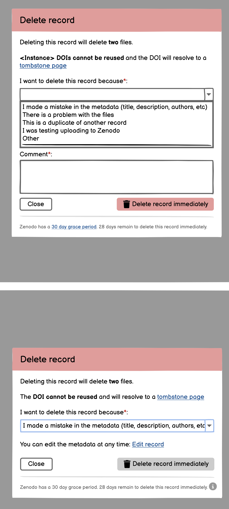
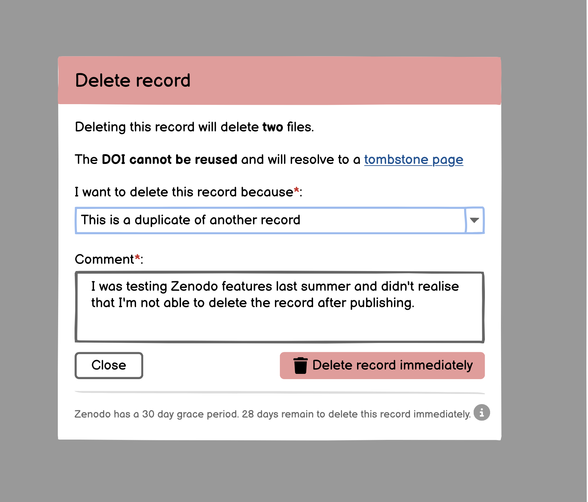
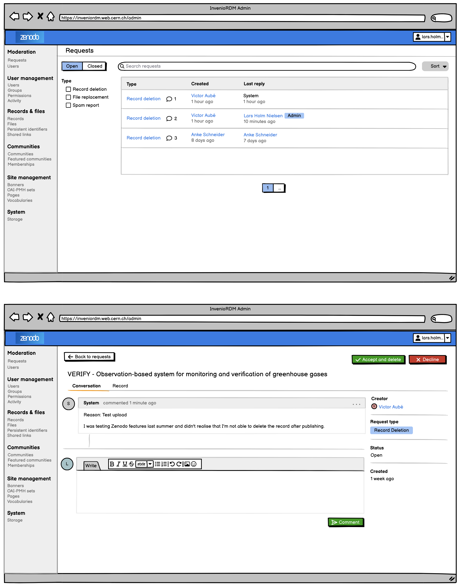
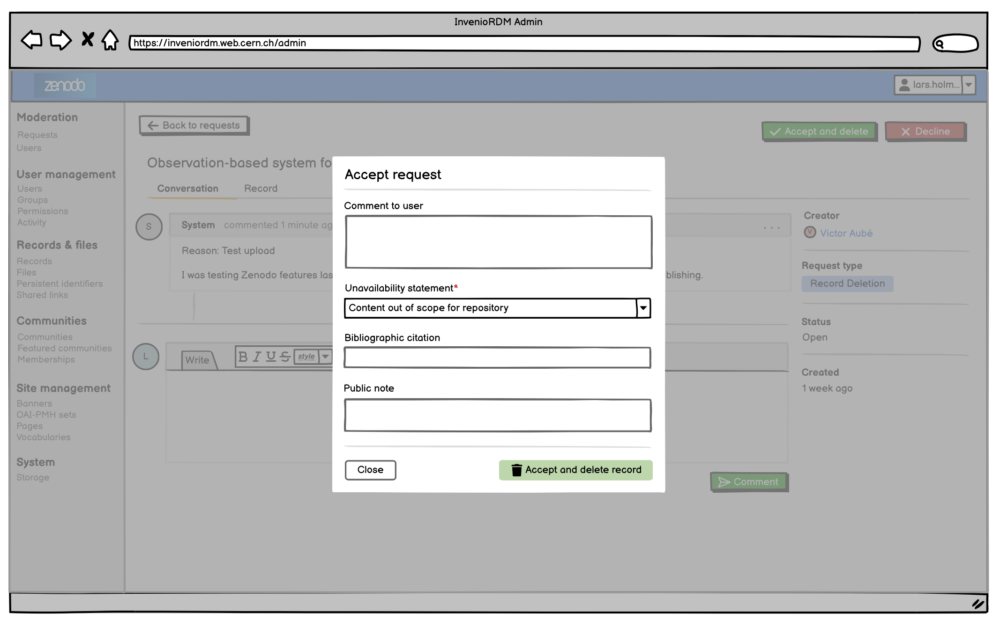

- Start Date: 2025.06.30
- RFC PR: https://github.com/inveniosoftware/rfcs/pull/103
- Authors: Carlin MacKenzie, Pablo Tamarit

# RFC: Record deletion by users

## Summary

Currently records in InvenioRDM can only be deleted by instance administrators. We propose allowing users to:

1. Request deletion of a record by giving a justification.
2. Be able to immediately delete a record which meets criteria configured by the instance manager.

## Motivation

As an instance becomes significantly large, so too does the support load required to meet user demand. There are many requests which users create which they could be able to handle themselves. We choose to focus on record deletion as it is one of the most common requests and establishes a strong base for adding other types of requests in the future, such as file replacement, ownership transfer, spam reporting, etc.

### User stories

- As a administrator of an instance, I want:
    - a1: users to be able to delete records themselves that are within policy to reduce support load
    - a2: users to be able to request deletion of records that are out of policy so I can easily review and handle requests
    - a3: an administration interface where I see a list of pending requests (i.e. requiring action from supporter), so that I can easily understand what to work on.
    - a4: users to specify the reason for the deletion so that there is an explanation for the deletion on the tombstone page
    - a5: users to confirm they cannot undo the deletion and that a tombstone page will be displayed so that they are aware of the consequences of deleting a record
    - a6: to be able to trace under which condition a record was allowed to be deleted
    - a7: to see a history of a user's requests to be able to identify cases of abuse/misuse of the feature

- As a user, who is eligible to perform record deletion, I want to be able to:
    - b1: delete my records (specific version or all versions) and know exactly what will be deleted
    - b2: give a justification for why it should be deleted if I'm not allowed to delete by myself.
    - b3: reply and give further context for the deletion.
    - b4: see the time left to delete my record, so that I'm aware how long I'm able to delete a record myself.
    - b5: see a list of all my requests

- As an instance manager, I want to be able to:
    - c1: configure the policy under which records can be deleted by users themselves (e.g. within 30 days)
    - c2: track who cancelled, declined or accepted a request

### User stories not specific to deletion requests

- As a administrator of an instance, I want:
    - d1: order pending requests based on last contact, submission date and more
    - d2: to be able to edit the tombstone page of a record
    - d3: write hidden notes on user requests
- As an instance manager, I want to be able to:
    - d4: to compute statistics such as average response time of support staff

## Detailed design

We introduce a system where users, who are eligible to perform record deletion, can immediately delete records or request deletion of them. Admins can then review deletion requests and accept or reject them.

### Record Deletion Requests

Whether the record can be deleted immediately or not, a deletion request will be created. A deletion request stores:

* The user who created the request
* Under what policy the request is allowed
* The unavailability statement for the tombstone page
* A comment from the user

If the record can be deleted immediately, upon the creation of the request it is automatically accepted and the record is deleted.

The reason that a request is always created is that:

* It is consistent for the user that pressing a delete button always creates a request
* The user can see the history of their record deletions by looking at their closed request history
* We can better communicate to the user about the deletion request, rather than redirecting to the tombstone page which may be confusing.

> I disagree with creating a request for every deletion:
> - The button has different labels ("Request record deletion" vs. "Delete record"), and the text/flow should make it clear why a request has to be opened.
> - Users shouldn't be able to see a list of their deleted records, since it hints to them that the records are not actually deleted. E.g. on GitHub I can't see my deleted repositories or issues (even though they probably do keep some trace in their database)
> - Redirecting to the tombstone page with a flashed message can be enough. The tombstone display can also make it more clear that this was a deletion requested by the user
> - Keeping around these requests grows the table and index without having any way to clean-up/delete them
> [name=Alex]

We create a new type of request `invenio_rdm_records.requests:RecordDeletionRequest`:

```python
class RecordDeletionRequest(RequestType):
    """Request to delete a record."""

    type_id = "record-deletion"
    name = _("Record deletion")

    creator_can_be_none = False
    # Alex: This should be the `system` user always
    # receiver_can_be_none = True # Test how this looks on UI
    receiver_can_be_none = False

    topic_can_be_none = False # Topic is the record
    allowed_creator_ref_types = ["user"]
    allowed_topic_ref_types = ["record"]

    comment_notification_builder = RecDelCommentNotificationBuilder

    available_actions = {
        "delete": actions.DeleteAction,
        "cancel": actions.CancelAction,
        # Custom implemented actions
        "create": CreateRecordDeletion,
        "accept": AcceptRecordDeletion,
        "decline": DeclineRecordDeletion,
    }
```

And we have a new corresponding service with a method which verifies the request and either deletes the record immediately or creates the record deletion request:

```python
    @unit_of_work()
    def create_record_deletion_request(self, identity, id_, data, expand=False, uow=None):
        """Create a deletion request for the given record."""
        record = self.record_cls.pid.resolve(id_)

        # Check user permission
        self.require_permission(identity, "request_record_deletion", record=record)
        # the immediate deletion permission is checked below. If they cannot
        # immediately delete the record then they will be left with a normal
        # deletion request instead

        existing_deletion_request = self._exists(
            created_by={"user": str(identity.id)},
            record_id=id_,
            request_type=RecordDeletionRequest.type_id,
        )

        if existing_deletion_request:
            raise DeletionRequestExistsError(existing_deletion_request["id"])

        data, __ = self.schema_delete_record.load(
            data, context={"identity": identity}, raise_errors=True
        )

        data = {"payload": data}

        request = current_requests_service.create(
            identity,
            data,
            RecordDeletionRequest,
            topic=record,
            expires_at=None,
            expand=expand,
            uow=uow,
        )

        can_delete_immediately = current_rdm_records_service.service.check_permission(
            identity, "immediate_record_deletion", record=record
        )
        if can_delete_immediately:
            record_age = (datetime.now() - datetime.from_timestamp(record.created)).days
            grace_period = current_app.config.get("RECORD_DELETION_GRACE_PERIOD_DAYS", 0)
            if record_age <= grace_period:
                request_item = current_requests_service.execute_action(
                    system_identity,
                    request.id,
                    "accept",
                    data=None,
                    uow=uow,
                    send_notification=False,
                )

                data = {
                    "payload": {
                        "content": _(
                            "This request has been automatically accepted, as the uploader can submit to "
                            "community directly without review."
                        ),
                    }
                }
                current_events_service.create(
                    system_identity,
                    request_item.id,
                    data,
                    CommentEventType,
                    uow=uow,
                    notify=False,
                )

```

#### Creation

If deleting records is too easy, then users might waste time deleting and recreating records rather than fixing them. Additionally, DOIs do cost money and so it is beneficial to only delete records when appropriate.

We therefore allow instance managers to configure questions and redirects before the user gets to the delete form.



If it is appropriate for the record to be deleted, the user chooses the unavailabilty statement, shown on the tombstone page, and provides a comment longer than 25 characters for reference by the admin



### Permissions/Eligibility

Instances can configure whether it is possible and who can:

1. Immediately delete records
2. Request deletion

They can also configure functions that dynamically evaluate eligibility based on their conditions. By default we provide a function that operates based on a grace period configuration:

```python
RECORD_DELETION_REQUEST = True
RECORD_DELETION_IMMEDIATE = is_record_within_grace_period

# Config specific to the custom immediate deletion function
RECORD_DELETION_IMMEDIATE_GRACE_PERIOD = timedelta(days=30)

def is_record_within_grace_period(identity, record):
    grace_period = app.config["RECORD_DELETION_IMMEDIATE_GRACE_PERIOD"]
    return (record.created + grace_period) >= utcnow()
```

The above configuration acts only as a "feature flag" though. Permissions are still configured on the record service, since there are a few intricate details regarding who is allowed to immediately delete or request deletion of a record. For this reason we introduce two new permission fields in the permission policy:

```python
class RDMRecordPermissionPolicy(RecordPermissionPolicy):

    can_immediate_delete = [RecordOwners()]
    can_request_deletion = [RecordOwners()]
```

> The reason this above distinction is important, is because the `can_manage` permission is not consistently defined throughout the codebase. For example:
> - A record in a community can be managed by the community curators, but they are not the owners of the record.
> - It would be confusing/strange for a user to allow any community curator to delete their record, as they are not the owner/creator of the record.

### Admin panel

We introduce a new panel in the moderation section of the admin panel called "Requests". This is a general purpose place to review requests made to the administrators of the instance. This interface is suitable for all types of requests including future extensions such as spam reporting, file replacement and ownership transfer.

It has the same facets, open/closed toggle and search bar as the usual requests interface, but it has admin panel table instead of the typical requests list view.





#### New request fields

The above search panel demonstrates some new information, that allows (both visual and programmatic) filtering and sorting requests to assist with administration. Some of these fields are not actually new fields on the request datamodel, but represent "computed" fields from the request timeline and actions.

The following fields are added to the request datamodel:

- **Last reply by** (`last_reply_by`): The user who last replied in the request. This is useful for understanding who is currently handling the request.
- **Last reply at** (`last_reply_at`): The time of the last reply in the request
- **Last creator action at** (`last_creator_action_at`): The time of the last action by the creator of the request
- **Last receiver action at** (`last_receiver_action_at`): The time of the last action by the receiver of the request
- **Number of timeline events** (`events_count`): Aggregated counts of the different types of timeline events in the request (comments, actions, etc.)

We also add the following fields which are useful for time tracking and statistics:

- **First response at** (`first_response_at`): The time of the first response to the request, useful for calculating support KPIs.
- **Submitted at** (`submitted_at`): The time when the request was submitted, useful for more precise tracking of request submission times.
- **Closed at** (`closed_at`): The time when the request was closed, which can be in various states such as expired, cancelled, accepted, or declined. This is useful for statistics and tracking the lifecycle of requests.
- **Accepted by** (`accepted_by`): The user who accepted the request
- **Declined by** (`declined_by`): The user who declined the request
- **Cancelled by** (`cancelled_by`): The user who cancelled the request
- **Duration open** (`duration_open`): Total time where the request was open, excluding time when it was pending on the creator. This is useful for understanding how long requests are open and how quickly they are handled.

The above fields can be added to the request API class as computed systemfields, and only get dumped to the search index using a custom search dumper. This will be done in a "bulk" manner, to avoid performance issues with large requests with multiple timeline events.

### [Mockups](https://balsamiq.cloud/ssg4nq2/p68p1b0/rCA8F)

<!-- ## Example -->

<!-- ## Drawbacks -->

<!-- ## Alternatives -->

## Unresolved questions

### How do we keep track of deletion policy

When we allow for immediate deletion of a record, we should keep track of the deletion policy that the record is under on the record itself. However, where is this policy stored and where can the user see the corresponding policy

**Options:**

* It could be a table in the database where you have a slug-like ID (UUID) that corresponds to a policy text.
    * Pros: easy to implement
    * Cons:
        * Not visible to the user unless we develop some custom thing to fetch the policy
        * UUIDs are meaningless and you can't compare two records and know anything about differing policies
* It could be a record on the service and the DOI is the ID used on the record
    * Pros: visible to the user, if DOI increments the ID could tell you which policy is newer
    * Cons: I'm not sure there's precedent for core instance documents to be stored on the instance itself
* It could be some solution with static pages on the instance
    * Pros:
    * Cons: Unclear how versioning or history of policies could be conveyed
* A config dictionary of `<policy_id> -> <policy_text>`
    * Pros: Simple and doesn't require any new tables.
    * Cons: Checking these in version control might be problematic in case they contain internal procedures/policies.

### Who should be identified on the tombstone page as the deleter

On a tombstone page we have a "Removed by" field ([Example](https://zenodo.org/records/15691054)). Should this now say "User" for immediate deletions? Should it say "Admin" if it's a deletion request that was accepted? Maybe it should be user in both cases as they initiated the request.

### Who should be allowed to request a record deletion

- Owner of the record
- Users with shared "Manage" rights
    - No, because e.g. a community manager could share with themselves with "Manage" rights
- Community managers?
    - Only after the grace period (or deletion policy)?

## Resources/Timeline

4 person weeks for planning, 13 person weeks for development.

## Future work

### Unpublishing records

If users publish a record by accident, it is likely that they would want to undo publishing so that they can continue working on it. This is technically quite easy, in terms of just needing to unregister the DOI, but we consider it out of scope for now.

One consideration to keep in mind is how you handle the grace period. For example, a naive implementation would allow a user to unpublish and republish a record continually so that it always remains within the grace period. As such you probably would also like to communicate to the user how much longer the grace period is for their record

Also, if the user is ready to publish the record this could be handled by performing a file modification instead.

### Undoing deletion

Once a deletion request is accepted the user might realise that they made a mistake. Perhaps it would be nice for them to be able to undelete it themself or create a new request to undelete; Or maybe the administrator would be able to press a button on the request to restore the record.

At current requests can't be re-opened after an action has been taken, and introducing this functionality is likely to have many implications which we do not cover here.

Instead, the admin will have to search for the record in the records panel and restore it as usual.

### UI for configuring deletion policy

It would be nice if administrators could change the deletion policy, such as grace period, but we are implementing it via code config initially as there is not yet a UI to change instance config.

### Checks on deletion requests

We recently introduced checks on requests, however the current implementation is dependant on the record being in a community. As such the checks system would have to be extended to requests not in a community, we are not using this system to check deletion requests now but it could be useful in the future.

### Integration with AI

To reduce support load further, it would be advantageous to have an AI agent review and handle deletion requests by comparing our policy and the user request.

### Reviewers for record deletion

We may wish to get permission or inform others that the record will be deleted. In this case it would be helpful to use the reviewer feature to do this. Reviewers would be able to see the request in the "Shared with me" section of their requests dashboard.

## Discussions

### CDS Karolina 2025-06-01

* Who is eligible to delete a record? In CDS, in some cases, the owner might not be eligible, and a community manager might be eligible.
* Some communities will have specific deletion policies.
* Not sure if CDS will have a grace period for self-service deletion.
* For CDS, the team will sometimes add people to the Service Now watchlist for deletion requests so that these people are aware. -> Similar to the Peer Review feature?
* Opinion to have the delete button on the landing page and not on the draft edition page (since it's related to the record and not the draft).
* The delete button should not disappear but instead be disabled with an explanation.
    * Carlin: I don't think we'll have this on Zenodo as people can always request, but good to keep in mind for other instances. (However if this is completely disabled on the instance we should not show the button)
* In the deletion modal, there could be a list of reasons why the deletion is requested. This list should be configurable. One option needs to be selected.
    * Some options will be valid ones (e.g. test record, duplicated record), which would map to a reason on the tombstone page.
    * Some other options will be invalid ones (e.g. change of title, change of files). For these invalid options, we will instruct the user on what to do instead (e.g. edit the metadata on their own, create a support ticket asking for files change).
* Risk: we might advertise self deletion too much and have an increase of deleted records.

### CDS Nico 2025-07-10

1. Do we, or other instances, care about registering and deleting many DOIs?
    * should deleting have a lot of friction
    * how visible should the delete button be
    * should we redirect users who want to delete for things that they could fix, or let them delete the record

* Small amount of money for CDS
* I agree that it should be hidden
* We should redirect people who have simple requests
* It should be extremely easy for a dev to add this button somewhere obvious
* Could be similar to the Transfer issue button on Github
* it could be multistep to check that they can't be redirected
* the dropdown list could be added to over time to reduce support requests

2. Should immediate deletions create requests that are auto accepted, or is this something that could be handled by audit logs

* From the users perspective they can only see their history if there is a request, they can't see audit log
* Comments on closed requests will probably not be seen
* Let's not create a request
* Easiest in code is to automatically accept the request
* It would be good if we can prevent comments on closed requests
* We could delete the requests if we have the audit logs
* For consistency, lets create the request

3. Should we allow users to select the tombstone message or should it be chosen by an admin

* The user can select the reason
* We could fix editing tombstones
* I would trust the user
* We should haev a short list of values and maybe explain to user which they should select
* Some users probably don't care about the reason and will pick randomly
* Maybe it should be a two step thing, the first step checking whether they do really want to delete the record. Explore this

4. Karolina mentioned that CDS might have complex criteria for what can be deleted. Do you have an idea about whether this should be an invenio role or community role or something else

* It depends on the DOI in CDS. CERN becomes the owner of records in CDS
* It should support rules such as "if resource type is thesis and community is 'summer student' then the managers can delete records"
* On CDS more requests are just for duplicated records

### Added by Lars 2025-07-14

**Requests time tracking (user story d4)**

- ``first_response_at``:
    - Needed to calculate how long time it for a user to get the first reply (Support KPI).
- ``submitted_at``:
    - Currently we only have ``created`` which is not the time the user actually submitted the request (e.g. draft review is created in advance)
    - Needed to be more preceise
- ``closed_at`` (expired, cancelled, accepted, declined):
    - Could be deduced from the timeline, but need it on the request model to be able to do statistics easily.
- ``duration_open``:
    - A duration counter which is incremented when a receiver replies (i.e. should not include the time it's pending on the creator)

**Requests activity (user story a3)**

- ``pending_until``
    - so we can postpone tickets so they don’t show up.
- ``num_timeline_events/comments``:
  - So we can easily see in request overviews how many comments there is on a given request.
- ``last_contact_creator_at``:
  - So we can order by latest activity
- ``last_contact_receiver_at``:
  - So we can order by latest activity and check

**Request models (user story c2)**

- ``accepted_by``
  - denormalised from timeline (so we can run stats on it more easily)
- ``declined_by``
  - denormalised from timeline
- ``cancelled_by``
  - denormalised from timeline
- ``pending_until``

**Timeline model**

- Hidden notes: Can receivers add hidden notes which creators cannot see? Zammad uses that some messages can be fully hidden.

### Record Deletion RFC presentation (2025-07-25)

- Karolina
    - fields are important for the sorting
- Zach
    - Expanding context of actors
    - Modal
        - modal needs a header for the questions/quiz
        - form should be hidden until you fill in all the yes/no buttons
- Nico
    - Form should take into account records w/o DOIs
- Carlin
    - It should be an array of actions


### Config discussion

```python
# Config
RDM_REQUEST_RECORD_DELETION_ENABLED = True
RDM_IMMEDIATE_RECORD_DELETION_ENABLED = True

RDM_RECORD_DELETION_POLICY = RDMRecordDeletionPolicy
RDM_IMMEDIATE_RECORD_DELETION_GRACE_PERIOD = timedelta(days=30)

RDM_RECORD_DELETION_CHECKLIST = [
    {
        "label": "I want to change the metadata (title, description, etc)",
        "message": "You can edit the record <a href='/'>here</a>",
    },
    {
        "label": "I forgot to submit to a community",
        "message": "You can submit a published record to a community <a href='/'>here</a>",
    },
    {
        "label": "I want to get a Zenodo DOI for this record",
        "message": "Contact us on support",
    },
]


RDM_IMMEDIATE_RECORD_DELETION_POLICIES = {
    "record-with-external-doi-v0": "Records with external DOIs can be deleted",
    "grace-period-v0": "Records can be deleted by their owners within 30 days",
}


#
# Option A
#
class BaseRecordDeletionPolicy:
    def __init__(self, identity, record): ...
    @property
    def immediate_deletion(self):
        raise NotImplementedError

    @property
    def request_deletion(self):
        raise NotImplementedError

    def evaluate(self):
        raise NotImplementedError


class RDMRecordDeletionPolicy(BasePolicy):
    class Result:
        allowed: bool
        enabled: bool
        context: dict
        policy_id: str | None

    @property
    def immediate_deletion(self):
        result = {"enabled": config.RDM_IMMEDIATE_RECORD_DELETION_ENABLED}
        if not result["enabled"]:
            return result

        if (
            "summer-student-thesis" in self.record.communities
            and self.record.metadata.resource_type.id == "publication-thesis"
            and self.identity.in_community("summer-student-thesis", "manager")
        ):
            result["allowed"] = True
            result["policy_id"] = "summer-student-thesis-managers"
            return result

        is_record_owner = self.identity.owns(self.record)
        if not is_record_owner:
            result["allowed"] = False
            result["policy_id"] = "record-owners"
            return result

        if record.pids.doi.external:
            result["allowed"] = is_record_owner
            result["policy_id"] = "record-with-external-doi-v0"
            return result

        expiration_time = (
            self.record.created + config.RDM_IMMEDIATE_RECORD_DELETION_GRACE_PERIOD
        )
        is_record_within_grace_period = expiration_time >= datetime.now(timezone.utc)
        remaining = expiration_time - datetime.now(timezone.utc)
        grace_period_days_remaining = max(remaining.days, 0)

        result["allowed"] = is_record_within_grace_period and is_record_owner
        result["policy_id"] = (
            "record-owners-within-grace-period"
            if is_record_within_grace_period
            else "outside-grace-period"
        )
        result["context"] = {
            "grace_period_days_remaining": grace_period_days_remaining,
        }
        return result

    @property
    def request_deletion(self):
        return {
            "enabled": config.RDM_REQUEST_RECORD_DELETION_ENABLED,
            "allowed": self.identity.owns(self.record),
            "policy_id": "record-owners",
        }

    def evaluate(self):
        return {
            "request_deletion": self.request_deletion,
            "immediate_deletion": self.immediate_deletion,
        }


#
# Option B
#
class RDMRecordPermissionPolicy(RecordPermissionPolicy):
    ...
    can_immediate_deletion = RecordDeletionPolicy.immediate_deletion_generators
    can_request_deletion = RecordDeletionPolicy.request_deletion_generators


class RecordDeletionPolicy:
    @dataclass
    class Result:
        policy_id: str
        context: dict
        request: bool = False
        needs: list[Need] = field(default_factory=list)

    def immediate_deletion(self, record=None, **kwargs):
        if (
            "summer-student-thesis" in record.parent.communities
            and record.metadata["resource_type"]["id"] == "publication-thesis"
        ):
            return Result(
                policy_id="summer-student-thesis-managers",
                needs=[CommunityRoleNeed("summer-student-thesis", "manager")],
            )

        days_remaining = (
            record.created + timedelta(days=30) - datetime.now(timezone.utc)
        ).days
        if days_remaining >= 0:
            return Result(
                policy_id="record-owners-within-grace-period",
                context={"grace_period_days_remaining": days_remaining},
                needs=[RecordOwnersNeed(record.id)],
            )

        return Result(policy_id="outside-grace-period")

    def request_deletion(self, record=None, **kwargs):
        return Result(
            policy_id="record-owners",
            request=True,
            needs=[RecordOwnersNeed(record.id)],
        )

    @classproperty
    def immediate_deletion_generators(cls):
        class ImmediateDeletionGenerator:
            @property
            def needs(self, *args, **kwargs):
                return self.immediate_deletion(*args, **kwargs).needs

        return [ImmediateDeletionGenerator()]

    @classproperty
    def request_deletion_generators(cls):
        class RequestDeletionGenerator:
            @property
            def needs(self, *args, **kwargs):
                return self.request_deletion(*args, **kwargs).needs

        return [RequestDeletionGenerator()]


#
# Option C
#
RDM_IMMEDIATE_RECORD_DELETION_PERMISSION = [
    IfInCommunity(
        "summer-student-thesis",
        then_=[
            IfResourceType(
                "publication-thesis",
                then_=[CommunityRoleNeed("summer-student-thesis", "manager")],
            )
        ],
    ),
    IfCreated(
        before=-timedelta(days=30),
        then_=[RecordOwners()],
    ),
]

RDM_REQUEST_RECORD_DELETION_PERMISSION = [
    RecordOwners(),
]
```

`invenio_rdm_records/config.py`
```python
# Config
RDM_REQUEST_RECORD_DELETION_ENABLED = False
RDM_IMMEDIATE_RECORD_DELETION_ENABLED = False

RDM_RECORD_DELETION_POLICY = RDMRecordDeletionPolicy
RDM_IMMEDIATE_RECORD_DELETION_GRACE_PERIOD = timedelta(days=30)

RDM_RECORD_DELETION_CHECKLIST = [
    {
        "label": "I want to change the metadata (title, description, etc)",
        "message": "You can edit the record <a href='/'>here</a>",
    },
    {
        "label": "I forgot to submit to a community",
        "message": "You can submit a published record to a community <a href='/'>here</a>",
    },
]


RDM_IMMEDIATE_RECORD_DELETION_POLICIES = {
    "grace-period-v1": "Records can be deleted by their owners within 30 days",
}
```

`invenio.cfg`
```python
# Config
RDM_REQUEST_RECORD_DELETION_ENABLED = True
RDM_IMMEDIATE_RECORD_DELETION_ENABLED = True

RDM_RECORD_DELETION_CHECKLIST = [
    {
        "label": "I want to change the metadata (title, description, etc)",
        "message": "You can edit the record <a href='/'>here</a>",
    },
    {
        "label": "I forgot to submit to a community",
        "message": "You can submit a published record to a community <a href='/'>here</a>",
    },
    {
        "label": "I want to get a Zenodo DOI for this record",
        "message": "Contact us on support",
    },
]


RDM_IMMEDIATE_RECORD_DELETION_POLICIES = {
    "record-with-external-doi-v1": "Records with external DOIs can be deleted",
    "grace-period-v1": "Records can be deleted by their owners within 30 days",
}
```
