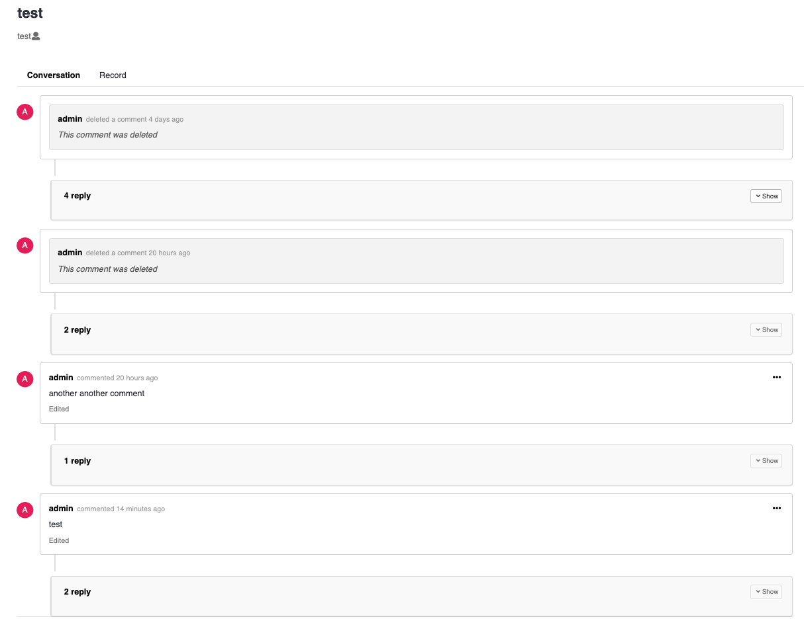
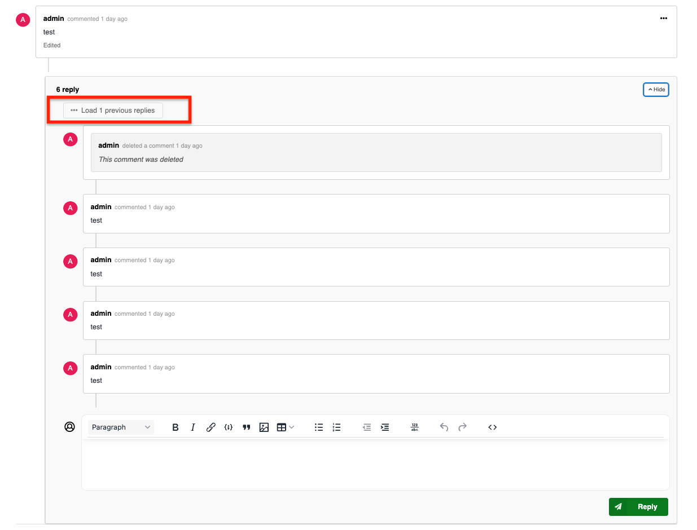

- Start Date: 2025-10-23
- RFC PR: [#108](https://github.com/inveniosoftware/rfcs/pull/108/)
- Authors: Zacharias Zacharodimos

# Threaded comments for requests

## Summary

This RFC describes the implementation of **1-level threaded comments** (replies) in the Invenio-Requests module. The feature allows users to reply to top-level comments, creating parent-child relationships between request events. **Nested threading (replies to replies) is explicitly not allowed** to keep discussions simple and readable.

Example of threaded comments (1-level only):

```text
Request #123: Access Request
  Comment 1 (by Alice)                    <- Parent comment
    ├─ Comment 2 (by Bob)                 <- Reply to Comment 1 ✓
    ├─ Comment 3 (by Charlie)             <- Reply to Comment 1 ✓
    └─ Comment 4 (by David)               <- Reply to Comment 1 ✓
  Comment 5 (by Eve)                      <- Parent comment
    └─ Comment 6 (by Frank)               <- Reply to Comment 5 ✓

NOT ALLOWED (reply to reply):
  Comment 1 (by Alice)
    └─ Comment 2 (by Bob)
       └─ Comment 3 (by Charlie)          <- ✗ REJECTED - Cannot reply to a reply
```

## Motivation

- As a request participant, I want to reply to specific comments to maintain context in discussions
- As a community manager, I want to see threaded conversations to better understand the discussion flow
- As a user, I want to follow conversation threads without getting lost in a flat list of comments
- As a system administrator, I want to limit threading to 1 level to keep discussions manageable and avoid deeply nested conversations that are hard to read


## Detailed design

### Key points

In summary, below are the key points of this design along with the locations of the relevant discussions:

- [Database model and relationships](#database-model)
- [Event type threading support](#event-type-threading)
- [Dedicated reply endpoint](#reply-endpoint)
- [1-level threading validation](#threading-validation)
- [Search index design](#search-index-design) - Hybrid approach with limited preview
- [Pagination for large reply threads](#pagination-for-large-reply-threads) - Loading older replies on-demand
- [Deletion strategy](#deletion-strategy) - Non-cascading approach
- [Configuration](#configuration) - Preview limit tuning
- [UI rendering approach](#ui-rendering-approach)


Threaded comments introduce **1-level** parent-child relationships between request events. A comment can have:

- A `parent_id` pointing to another **top-level** event in the same request (or `null` for top-level comments)
- Multiple `children` (replies) - but those children **cannot have children** themselves
- A computed `children` field that includes full metadata of all child events

**Threading depth is limited to exactly 1 level** to keep discussions simple and readable. Attempting to reply to a reply results in a validation error.

Only certain event types support threading (e.g., comments and logs), controlled by an `allow_children` flag on the event type class.


## **Database model**

The `RequestEventModel` database schema remains **completely unchanged** - no new columns are added:

```python
class RequestEventModel(db.Model, RecordMetadataBase):
    """Request Events model."""

    __tablename__ = "request_events"

    type = db.Column(db.String(1), nullable=False)
    request_id = db.Column(
        UUIDType, db.ForeignKey(RequestMetadata.id, ondelete="CASCADE"), index=True
    )
    request = db.relationship(RequestMetadata)
    # Note: No parent_id column - stored in JSON instead!
```

### **Storage approach: JSON data field**

The `parent_id` is stored in the JSON `data` field rather than as a database column:

```python
class RequestEvent(Record):
    parent_id = DictField("parent_id")
    """The parent event ID for parent-child relationships (stored in JSON data field)."""
```

**Rationale for JSON storage:**

1. **No database migration required**
   - Existing deployments can adopt threading without `ALTER TABLE` statements
   - No downtime or migration scripts needed
   - Critical for production systems with large existing datasets

2. **Backward compatibility**
   - Existing records automatically work (implicit `parent_id = null` in JSON)
   - Old code continues to function without modification
   - Gradual rollout possible

3. **Simpler deployment**
   - No foreign key constraints to manage
   - No index maintenance overhead
   - Relationships managed at application layer with clear validation

**Trade-offs accepted:**
- No database-level referential integrity (handled by application validation)
- Parent existence validated at service layer before creating reply
- Orphaned children possible if parent deleted outside service layer (but this is already prevented by service permissions)

## **Event type threading support**</a>

Not all event types should support threading. The `EventType` base class is extended with:

```python
class EventType:
    allow_children = False
    """Allow this event type to have parent-child relationships.

    If True, events of this type can have a parent_id and children.
    If False, attempting to set a parent_id will raise an error.
    """
```

Event types that support children:

- `CommentEventType`: Users can reply to comments
- `LogEventType`: Preserves threading structure when comments are deleted (set to allow_children=True to maintain parent-child structure)

A validator enforces this at record commit time:

```python
def validate_children_allowed(event):
    """Validate that an event type allows children before setting parent_id."""
    if event.parent_id is not None:
        if not getattr(event.type, "allow_children", False):
            raise ChildrenNotSupportedError(
                event.type.type_id,
                f"Event type '{event.type.type_id}' does not support children."
            )
```

## **Dedicated reply endpoint**

Threading is implemented via a **dedicated REST API endpoint** rather than accepting `parent_id` in the request body. This design:
- Makes the API more explicit and RESTful
- Prevents users from manipulating `parent_id` in request bodies
- Clearly separates top-level comments from replies

### **Data storage**

The reply functionality stores `parent_id` in the JSON data field:

```python
# From RequestEvent API
class RequestEvent(Record):
    parent_id = DictField("parent_id")
    """The parent event ID for parent-child relationships (stored in JSON)."""
```

**Key aspects:**
- When creating a reply, `parent_id` is set in the JSON data to the UUID of the parent comment
- Top-level comments have `parent_id = None`
- OpenSearch indexes this field and provides join relationship functionality
- Validation ensures parent exists in same request (application layer)

### **Programmatic API layer**

The `parent_id` field is **dump_only** (read-only in API responses):

```python
class RequestEventSchema(BaseRecordSchema):
    parent_id = fields.String(allow_none=True, dump_only=True)  # Cannot be set via API
    children = fields.List(fields.Dict(), dump_only=True)
```

This ensures `parent_id` **cannot be provided in the request body** - it's always extracted from the URL.

### **Resource layer (REST API)**

Routes configuration:

```python
# Resource configuration
routes = {
    ...
    "reply": "/<request_id>/comments/<comment_id>/reply",  # POST: Create reply
    ...
}
```

The resource extracts `parent_id` from the URL path:

```python
@item_view_args_parser
@data_parser
@response_handler()
def reply(self):
    """Create a reply to a comment."""
    data = deepcopy(resource_requestctx.data) if resource_requestctx.data else {}
    # Extract parent_id from the route (comment_id in the URL)
    parent_id = resource_requestctx.view_args["comment_id"]

    item = self.service.create(
        identity=g.identity,
        request_id=resource_requestctx.view_args["request_id"],
        parent_id=parent_id,  # From URL, not body!
        data=data,
        event_type=CommentEventType,
        ...
    )
    return item.to_dict(), 201
```

### **Service layer**

The service layer has been refactored to eliminate code duplication:

**Unified creation method:**

```python
def create(
    self, identity, request_id, data, event_type,
    uow=None, expand=False, notify=True, parent_id=None
):
    """Create a request event (top-level or reply).

    :param parent_id: Optional parent event ID for replies.
    """
    request = self._get_request(request_id)

    # Check permission based on whether this is a reply or top-level comment
    permission = "reply_comment" if parent_id else "create_comment"
    self.require_permission(identity, permission, request=request)

    # Validate that nested children (reply to reply) are not allowed
    if parent_id is not None:
        parent_event = self._get_event(parent_id)
        if parent_event.parent_id is not None:
            raise NestedChildrenNotAllowedError()

    event = self.record_cls.create({}, request=request.model, ...)
    event.update(data)
    event.created_by = self._get_creator(identity, request=request)

    # Set parent_id for replies
    if parent_id is not None:
        event.parent_id = parent_id

    # Commit with routing for OpenSearch join relationships
    uow.register(ParentChildRecordCommitOp(event, indexer=self.indexer))
    uow.register(RecordIndexOp(request, indexer=requests_service.indexer))

    return self.result_item(...)
```

**Validation and error handling:**

The `create()` method validates that a parent event doesn't already have a parent before allowing a reply (enforces 1-level threading). A custom exception `NestedChildrenNotAllowedError` is raised when attempting to create a reply to a reply:

```python
class NestedChildrenNotAllowedError(Exception):
    """Exception raised when attempting to create nested children (reply to a reply)."""

    def __init__(self, message=None):
        self.message = message or (
            "Nested children are not allowed. "
            "You cannot reply to a comment that is already a reply. "
            "Only one level of threading is supported."
        )
        super().__init__(self.message)
```

The error is handled at the REST API layer and returns a 400 Bad Request response:

```python
# In resources/events/config.py
events_error_handlers = {
    NestedChildrenNotAllowedError: create_error_handler(
        lambda e: HTTPJSONException(
            code=400,
            description=str(e),
        )
    ),
}
```

**Entity reference expansion:**

The result classes handle expanding entity references for both parent and child comments by leveraging parent class functionality:

**RequestEventItem** - Expands single item with children:
```python
class RequestEventItem(RecordItem):
    """RequestEvent result item."""

    @property
    def id(self):
        """Id property."""
        return self._record.id

    @property
    def data(self):
        """Property to get the record with expanded children fields."""
        # Get standard data from parent (includes standard field expansion)
        if self._data:
            return self._data

        self._data = super().data

        # Additionally expand children fields if present
        if self._expand and self._fields_resolver and "children" in self._data:
            children = self._data.get("children", [])
            if children:
                # Batch resolve all children
                self._fields_resolver.resolve(self._identity, children)
                # Expand each child
                for child in children:
                    fields = self._fields_resolver.expand(self._identity, child)
                    child["expanded"] = fields

        return self._data
```

**RequestEventList** - Expands list items with children:
```python
class RequestEventList(RecordList):
    """RequestEvent result list."""

    def to_dict(self):
        """Return result as a dictionary with expanded fields for parents and children."""
        # Call parent to handle standard expansion (aggregations, links, parent field expansion)
        res = super().to_dict()

        # Additionally expand children fields if present
        if self._expand and self._fields_resolver:
            self._expand_children_fields(res["hits"]["hits"])

        return res

    def _expand_children_fields(self, hits):
        """Apply field expansion to children arrays in hits."""
        # Collect all children from all hits
        all_children = []
        for hit in hits:
            if "children" in hit and hit["children"]:
                all_children.extend(hit["children"])

        if all_children:
            # Batch resolve all children at once for efficiency
            self._fields_resolver.resolve(self._identity, all_children)

            # Expand each child individually
            for child in all_children:
                fields = self._fields_resolver.expand(self._identity, child)
                child["expanded"] = fields
```

**Key design principles:**
- **Batch resolution**: Collect all children across all hits and resolve in single batch for efficiency
- **Consistent expansion**: Both parents and children get `expanded` field with resolved entity references

## **Search index design**

### **OpenSearch join relationships approach**

Instead of embedding children inline, we use **OpenSearch parent-child join relationships** with `inner_hits` for preview:

1. **Join field**: Each document has a `parent_child` join field defining its role
2. **Inner hits preview**: Query uses `inner_hits` to fetch N most recent children
3. **Total count extraction**: Extract `children_count` from `inner_hits.total.value`
4. **Routing**: Child documents are routed to same shard as parent
5. **Pagination endpoint**: Additional replies loaded on-demand

**Benefits:**
- Documents remain small (children not embedded)
- Fast join queries with proper routing
- Preview via `inner_hits` without embedding all children
- `children_count` extracted from OpenSearch metadata (no separate COUNT query)
- Scalable to thousands of replies per comment

### **Children count extraction**

The total number of children is extracted from OpenSearch `inner_hits` metadata during query processing:

```python
# In RequestEventList.hits property
# Handle inner_hits from has_child queries (join relationship approach)
# Initialize defaults for parents without children
projection["children"] = []
projection["children_count"] = 0

if (
    hasattr(hit.meta, "inner_hits")
    and "replies_preview" in hit.meta.inner_hits
):
    # Extract children from inner_hits
    inner_hits_data = hit.meta.inner_hits.replies_preview.hits
    inner_children = inner_hits_data.hits
    total_children = inner_hits_data.total.value  # ← Total count from OpenSearch

    projection["children_count"] = total_children

    for inner_hit in inner_children:
        # Load and project each child...
        projection["children"].append(child_projection)
```

**Key aspects:**
- `children_count` comes from OpenSearch's join query metadata, not from a separate database query
- All parent events have `children_count` field (defaults to 0 for parents without children)
- Frontend uses `children_count` to display reply count badges
- Frontend calculates `hasMore = children_count > children.length` to conditionally show "Load more" button

### **Search index mappings**

The search index includes a join relationship field:

```json
{
  "parent_child": {
    "type": "join",
    "relations": {
      "parent": "child"
    }
  }
}
```

**Join field values:**
- Parent events: `{"name": "parent"}`
- Child events (replies): `{"name": "child", "parent": "<parent_id>"}`

### **ParentChildDumperExt**

A dumper extension manages the join relationship:

```python
class ParentChildDumperExt(SearchDumperExt):
    """Search dumper extension for OpenSearch join relationships."""

    def dump(self, record, data):
        """Set the parent_child field based on parent_id."""
        if record.parent_id:
            # This is a child event (reply)
            data["parent_child"] = {
                "name": "child",
                "parent": str(record.parent_id)
            }
        else:
            # This is a parent event
            data["parent_child"] = {"name": "parent"}

    def load(self, data, record_cls):
        """Remove join field when loading from index."""
        data.pop("parent_child", None)
```

### **Routing for join relationships**

Child documents must be indexed on the same shard as their parent:

```python
class ParentChildRecordIndexer(RecordIndexer):
    """Parent-Child Record Indexer placeholder."""

    def _prepare_record(self, record, index, arguments=None, **kwargs):
        """Prepare request-event data for indexing.

        Pass routing information for parent-child relationships.
        """
        data = super()._prepare_record(record, index, arguments, **kwargs)
        if hasattr(record, "parent_id") and record.parent_id:
            arguments["routing"] = str(record.parent_id)
        return data


class RequestEventsServiceConfig(RecordServiceConfig, ConfiguratorMixin):
    """Config."""

    ...
    indexer_cls = ParentChildRecordIndexer
    ...

```

## **Pagination for large reply threads**

When a comment has more replies than the preview limit, users can load older replies incrementally via a dedicated pagination endpoint.

#### **API endpoint**

```http
GET /api/requests/{request_id}/comments/{comment_id}/replies?page=2&size=5
```

**Parameters:**
- `page`: Page number (1-indexed)
- `size`: Number of replies per page (default: 5)
- `expand`: Whether to expand entity references (default: 1)

**Response:**
```json
{
  "hits": {
    "hits": [
      { "id": "reply-6", "parent_id": "comment-1", ... },
      { "id": "reply-7", "parent_id": "comment-1", ... },
      { "id": "reply-8", "parent_id": "comment-1", ... },
      { "id": "reply-9", "parent_id": "comment-1", ... },
      { "id": "reply-10", "parent_id": "comment-1", ... }
    ],
    "total": 100
  }
}
```

#### **Service layer implementation**

```python
def get_comment_replies(
    self, identity, parent_id, params=None, search_preference=None, **kwargs
):
    """Get paginated replies for a specific comment.

    :param identity: Identity of user.
    :param parent_id: ID of the parent comment.
    :param params: Query parameters (page, size, sort, etc.).
    :param search_preference: Search preference.
    :returns: Paginated list of reply events.
    """
    params = params or {}
    params.setdefault("sort", "oldest")

    expand = kwargs.pop("expand", False)

    # Get the parent event to verify permissions and get request_id
    parent_event = self._get_event(parent_id)
    request = self._get_request(parent_event.request_id)

    # Permissions - guarded by the request's can_read
    self.require_permission(identity, "read", request=request)

    # Prepare and execute the search for children
    search = self._search(
        "search",
        identity,
        params,
        search_preference,
        permission_action="unused",
        extra_filter=dsl.Q("term", parent_id=str(parent_id)),
        **kwargs,
    )
    search_result = search.execute()

    return self.result_list(
        self,
        identity,
        search_result,
        params,
        links_tpl=LinksTemplate(
            self.config.links_search,
            context={"parent_id": str(parent_id), "args": params},
        ),
        links_item_tpl=self.links_item_tpl,
        expandable_fields=self.expandable_fields,
        expand=expand,
    )
```

#### **Resource layer implementation**

```python
# In resources/events/config.py
routes = {
    ...
    "replies": "/<request_id>/comments/<comment_id>/replies",
}

# In resources/events/resource.py
@item_view_args_parser
@request_extra_args
@search_args_parser
@response_handler(many=True)
def get_replies(self):
    """Get paginated replies for a specific comment."""
    hits = self.service.get_comment_replies(
        identity=g.identity,
        parent_id=resource_requestctx.view_args["comment_id"],
        params=resource_requestctx.args,
        search_preference=search_preference(),
        expand=resource_requestctx.args.get("expand", False),
    )
    return hits.to_dict(), 200
```

## **Deletion strategy**

When a comment is deleted, the system uses a **simple content update approach** with no cascading:

**Deleting any comment (child or parent):**
- The comment **remains as `CommentEventType`** (not converted to LogEvent)
- The content is updated to `"[deleted]"` or `"Comment was deleted."`
- The `parent_id` is preserved (if it exists) to maintain thread structure
- The comment is reindexed to reflect the deletion
- **Children are NEVER affected** - they remain completely unchanged

**Rationale:**
- **Simplicity**: Just update content, no type conversion
- **Preserves structure**: Type stays as CommentEventType, making permissions and UI logic simpler
- **No cascade**: Deleting a parent doesn't affect children at all
- **User contributions preserved**: All replies remain intact and visible

### **Service layer implementation**

The `delete` service method simply updates the comment content:

```python
def delete(self, identity, id_, revision_id=None, uow=None):
    """Delete a comment (only comments can be deleted)."""
    event = self._get_event(id_)
    request_id = event.request_id
    request = self._get_request(request_id)

    # Permissions
    self.require_permission(identity, "delete_comment", request=request, event=event)
    self.check_revision_id(event, revision_id)

    if event.type != CommentEventType:
        raise PermissionError("You cannot delete this event.")

    # Update the comment content to show it's deleted (keep as CommentEventType)
    event["payload"]["content"] = _("Comment was deleted.")

    # Run components
    self.run_components("delete_comment", identity, data={}, event=event, request=request, uow=uow)

    # Commit the updated comment
    uow.register(ParentChildRecordCommitOp(event, indexer=self.indexer))

    # Reindex the request to update events-related computed fields
    uow.register(RecordIndexOp(request, indexer=requests_service.indexer))

    return True
```

### **Indexing strategy**

Simple and consistent for all deletions:

**Any comment deletion:**
1. Comment is updated in database (content changed to "[deleted]")
2. Comment is reindexed with new content
3. Request is reindexed to update computed fields
4. **That's it** - no parent/child special handling needed

**Why this approach:**
- **Minimal operations**: Only the deleted comment and request are reindexed
- **Simple logic**: No conditional behavior based on parent/child status
- **Preserved relationships**: OpenSearch join relationships remain intact
- **UI simplicity**: Deleted comments still render as comments, just with different content

## **UI rendering approach**

### UI mockups

#### Inital load of comments

Initally we load the N most recent replies per comment:



#### Load more replies for a threaded comment

We load more replies on demand:



#### Reply actions


### **UI interaction pattern**

#### **Comments with no replies (`children_count = 0`)**

- **"Replies" dropdown button**: Hidden (not rendered)
- **"Load more" button**: Hidden (not rendered)
- **"Write a reply" input**: Shown with top margin
- Users can still add the first reply

#### **Comments with replies (`children_count > 0`)**

1. **Initial render**: Parent comment displays with preview of X most recent replies
2. **"Replies" dropdown button**: Shows with count badge (e.g., "Replies 5")
   - Can be expanded/collapsed
   - Defaults to expanded state
3. **"Load X previous replies" button**: Shows only if `hasMore = children_count > children.length`
4. **On click**: Fetches next page of older replies via `/replies` endpoint
5. **Merge strategy**: Prepends older replies to the beginning of the list (chronological order)
6. **Repeat**: Button updates with remaining count until all replies are loaded
```


## Example

### Programmatic API usage

```python
from invenio_requests.proxies import current_requests_service
from invenio_requests.errors import NestedThreadingNotAllowedError

# Create a top-level comment using create()
comment1 = current_requests_service.events.create(
    identity=user1_identity,
    request_id=request.id,
    data={
        "payload": {
            "content": "What are the next steps?",
            "format": "html"
        }
    },
    event_type=CommentEventType,
)

# Reply to the comment using reply() - this works! (1st level)
reply1 = current_requests_service.events.reply(
    identity=user2_identity,
    request_id=request.id,
    parent_id=comment1.id,  # ✓ Valid: replying to top-level comment
    data={
        "payload": {
            "content": "We need to review the documentation first.",
            "format": "html"
        }
    },
    event_type=CommentEventType,
)

# Another reply to the same comment using reply() - this also works!
reply2 = current_requests_service.events.reply(
    identity=user3_identity,
    request_id=request.id,
    parent_id=comment1.id,  # ✓ Valid: another reply to top-level comment
    data={
        "payload": {
            "content": "I can help with the documentation.",
            "format": "html"
        }
    },
    event_type=CommentEventType,
)

# Try to reply to a reply using reply() - this will FAIL!
try:
    reply_to_reply = current_requests_service.events.reply(
        identity=user1_identity,
        request_id=request.id,
        parent_id=reply2.id,  # ✗ INVALID: reply2 already has a parent
        data={
            "payload": {
                "content": "Thanks for offering to help!",
                "format": "html"
            }
        },
        event_type=CommentEventType,
    )
except NestedThreadingNotAllowedError as e:
    print(f"Error: {e}")
    # Output: "Nested threading is not allowed. You cannot reply to a comment
    #          that is already a reply. Only one level of threading is supported."

# Fetch the timeline - children are included automatically
timeline = current_requests_service.events.search(
    identity=user1_identity,
    request_id=request.id,
)

# The comment1 will have children array populated with TWO replies:
# comment1.children = [reply1, reply2]
# reply1.children = []  (child comments have no children)
# reply2.children = []  (child comments have no children)
```

### REST API usage

```bash
# Create a top-level comment
curl -X POST https://example.org/api/requests/REQUEST-ID/comments \
  -H "Content-Type: application/json" \
  -d '{
    "payload": {
      "content": "What are the next steps?",
      "format": "html"
    }
  }'
# Response: {"id": "comment-uuid-1", "payload": {...}, "parent_id": null, ...}

# Create a reply to the comment (using dedicated reply endpoint)
curl -X POST https://example.org/api/requests/REQUEST-ID/comments/comment-uuid-1/reply \
  -H "Content-Type: application/json" \
  -d '{
    "payload": {
      "content": "We need to review the documentation first.",
      "format": "html"
    }
  }'
# Response: {"id": "reply-uuid-1", "payload": {...}, "parent_id": "comment-uuid-1", ...}

# Create another reply to the same comment
curl -X POST https://example.org/api/requests/REQUEST-ID/comments/comment-uuid-1/reply \
  -H "Content-Type: application/json" \
  -d '{
    "payload": {
      "content": "I can help with the documentation.",
      "format": "html"
    }
  }'
# Response: {"id": "reply-uuid-2", "payload": {...}, "parent_id": "comment-uuid-1", ...}

# Try to reply to a reply - THIS FAILS with 400 Bad Request
curl -X POST https://example.org/api/requests/REQUEST-ID/comments/reply-uuid-2/reply \
  -H "Content-Type: application/json" \
  -d '{
    "payload": {
      "content": "Thanks for offering!",
      "format": "html"
    }
  }'
# Response: 400 Bad Request
# {
#   "status": 400,
#   "message": "Nested threading is not allowed. You cannot reply to a comment that is already a reply. Only one level of threading is supported."
# }

# Trying to pass parent_id in the request body is ignored (dump_only field)
curl -X POST https://example.org/api/requests/REQUEST-ID/comments \
  -H "Content-Type: application/json" \
  -d '{
    "payload": {
      "content": "Trying to set parent_id in body",
      "format": "html"
    },
    "parent_id": "comment-uuid-1"
  }'
# Response: {"id": "new-comment-uuid", "parent_id": null, ...}
# Note: parent_id is ignored - creates top-level comment instead!

# Load additional replies using pagination endpoint
curl -X GET "https://example.org/api/requests/REQUEST-ID/comments/comment-uuid-1/replies?page=2&size=5"
# Response: Paginated list of 5 older replies
# {
#   "hits": {
#     "hits": [
#       {"id": "reply-uuid-6", "parent_id": "comment-uuid-1", ...},
#       {"id": "reply-uuid-7", "parent_id": "comment-uuid-1", ...},
#       {"id": "reply-uuid-8", "parent_id": "comment-uuid-1", ...},
#       {"id": "reply-uuid-9", "parent_id": "comment-uuid-1", ...},
#       {"id": "reply-uuid-10", "parent_id": "comment-uuid-1", ...}
#     ],
#     "total": 100
#   }
# }
```

### Database representation

With 1-level threading:

```text
request_events table:
+------+------------+-----------+--------+-------------------------------+
| id   | request_id | parent_id | type   | Comment                       |
+------+------------+-----------+--------+-------------------------------+
| uuid1| req1       | NULL      | C      |  Top-level: "What next?"      |
| uuid2| req1       | uuid1     | C      |  Reply to uuid1: "Review..."  |
| uuid3| req1       | uuid1     | C      |  Reply to uuid1: "I can..."   |
| uuid4| req1       | NULL      | C      |  Top-level: "Another comment" |
+------+------------+-----------+--------+-------------------------------+

Note: uuid2 and uuid3 both reply to uuid1 (multiple children allowed)
      But neither uuid2 nor uuid3 can have children (1-level limit)
```

### Search index representation

**OpenSearch documents are stored separately** using join relationships:

**Parent document (uuid1):**
```json
{
  "id": "uuid1",
  "request_id": "req1",
  "parent_id": null,
  "type": "C",
  "payload": {"content": "What are the next steps?"},
  "created_by": {"user": "1"},
  "parent_child": {"name": "parent"}
}
```

**Child documents (uuid96-uuid100):**
```json
{
  "id": "uuid96",
  "request_id": "req1",
  "parent_id": "uuid1",
  "type": "C",
  "payload": {"content": "Reply 96"},
  "created_by": {"user": "96"},
  "parent_child": {"name": "child", "parent": "uuid1"}
}
```

### API response representation

**API timeline queries use `has_child` with `inner_hits` to fetch preview children:**

```json
{
  "hits": [
    {
      "id": "uuid1",
      "request_id": "req1",
      "parent_id": null,
      "type": "C",
      "payload": {"content": "What are the next steps?"},
      "created_by": {"user": "1"},
      "children": [
        {
          "id": "uuid96",
          "request_id": "req1",
          "parent_id": "uuid1",
          "type": "C",
          "payload": {"content": "Reply 96"},
          "created_by": {"user": "96"}
        },
        {
          "id": "uuid97",
          "request_id": "req1",
          "parent_id": "uuid1",
          "type": "C",
          "payload": {"content": "Reply 97"},
          "created_by": {"user": "97"}
        },
        ...
        {
          "id": "uuid100",
          "request_id": "req1",
          "parent_id": "uuid1",
          "type": "C",
          "payload": {"content": "Reply 100 (most recent)"},
          "created_by": {"user": "100"}
        }
      ],
      "children_count": 100
    },
    {
      "id": "uuid4",
      "request_id": "req1",
      "parent_id": null,
      "type": "C",
      "payload": {"content": "Another top-level comment"},
      "created_by": {"user": "4"},
      "children": [],
      "children_count": 0
    }
  ]
}
```

**Key points:**
- Parent and children are **separate documents** in OpenSearch (not embedded)
- `parent_child` join field links them together
- API response builds `children` array from `inner_hits` query results
- `children_count` extracted from `inner_hits.total.value` (OpenSearch metadata)
- Only N most recent children returned in preview (default: 10)
- Remaining children loaded via `/api/requests/req1/comments/uuid1/replies` endpoint

## Alternatives

### Pattern 1: Fully inline children (all replies)

Embed all children inline with their parent in the search index:

**Pros:**
- Single API call to render a thread
- Simplest implementation
- No pagination complexity

**Cons:**
- **Massive documents** when comments have 1000+ replies
- OpenSearch document size limits (default 100MB, but performance degrades much earlier)
- **Memory issues**: Loading all 1000 children into memory during indexing
- Slow indexing and search performance
- Cannot paginate replies in UI

**Decision**: Rejected due to performance issues with large reply counts.

### Pattern 2: Separate children endpoint only (no inline preview)

Provide only a separate endpoint with no inline preview:

```
GET /api/requests/{request_id}/comments/{comment_id}/replies
```

**Pros:**
- Smallest possible documents
- Clean separation of concerns
- Supports pagination naturally

**Cons:**
- **Multiple API calls** required to render every thread
- Worse performance for typical use cases (most comments have 0-5 replies)
- More complex frontend state management
- Slower initial page load

**Decision**: Rejected in favor of hybrid approach for better typical-case performance.

### Pattern 3: OpenSearch join relationships with inner_hits (implemented)

Use parent-child join relationships with query-time preview fetching:

1. **Separate documents**: Parent and children are separate OpenSearch documents
2. **Join field**: `parent_child` field links documents via join relationships
3. **Query-time preview**: `has_child` queries with `inner_hits` fetch N most recent children
4. **Pagination endpoint**: Load remaining replies on-demand

**Pros:**
- **Smallest document size**: Parents remain small even with 1000+ replies (PRIMARY REASON)
- **Scalable indexing**: Each reply is a small, independent document
- **Good read performance**: Join queries with proper routing are still fast (close second to embedded)
- **Native OpenSearch support**: Built-in join relationships with proper routing
- **Flexible querying**: Can query children independently if needed
- **Single API call for typical case**: Preview fetched via `inner_hits` in one query

**Cons:**
- Requires routing for all child document operations
- Slightly more complex queries (`has_child` + `inner_hits`)
- Marginally slower than embedded approach (but difference is small with routing)

**Decision**: ✅ **Implemented** - Prioritized **smaller document sizes** and scalability over the slightly faster reads of embedded approach. The join relationship performance with proper routing is still fast enough (close second), and document size becomes critical with 1000+ replies per comment.


## Configuration

### **Threading depth**

The threading depth is **hardcoded to 1 level** in the service layer validation. This is intentionally not configurable.

**Rationale for no configuration:**
- **Simplicity**: A single, well-defined behavior is easier to understand and maintain
- **Consistency**: All instances behave the same way, avoiding confusion
- **No use case for configurability**: 1-level threading satisfies all identified use cases
- **Prevents complexity**: Allowing configuration would require conditional logic throughout the codebase

### **Preview limit configuration**

The number of child comments fetched in timeline queries via `inner_hits` is configurable:

```python
REQUESTS_COMMENT_PREVIEW_LIMIT = 10
"""Number of most recent child comments to fetch as preview in timeline queries.

This controls the size parameter for OpenSearch inner_hits queries when fetching
children via has_child join relationships. Limits initial data transfer and ensures
fast timeline page loads. Additional replies can be loaded via pagination endpoint.

Default: 10
"""
```

**Usage:**
- Controls the `size` parameter in `inner_hits` query for `has_child` queries
- Determines how many children are included in the API response `children` array
- Frontend uses this to show initial preview and calculate if "Load more" button is needed
- Can be overridden per-request via `preview_size` parameter

## Notification strategy

When a user replies to a specific comment, the creator of the parent comment alongside all the users already posted their replies will receive a notification. Users that have not participated to the inner discussion of that comment will be excluded from getting notified.

## Migration strategy

Before upgrading to the version supporting the threaded comments, the instance administrator must run a script to update all existing comments in the system, marking them as "parent". This is needed in order to be able to utilize the `join` searches from Opensearch. Such script is provided as part of the upgrade guide to the v14 release of InvenioRDM.
