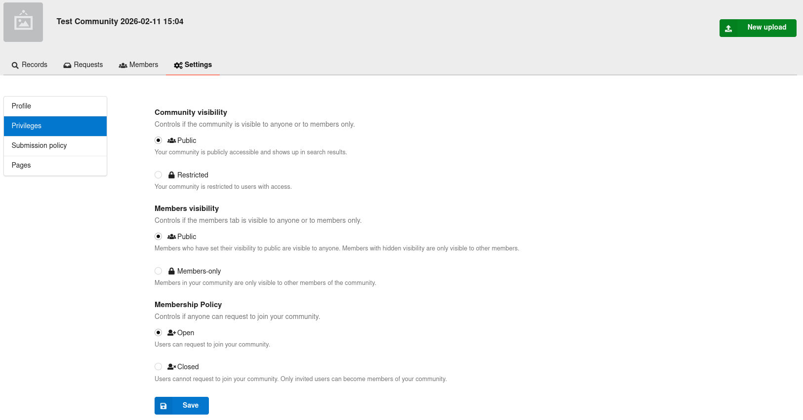
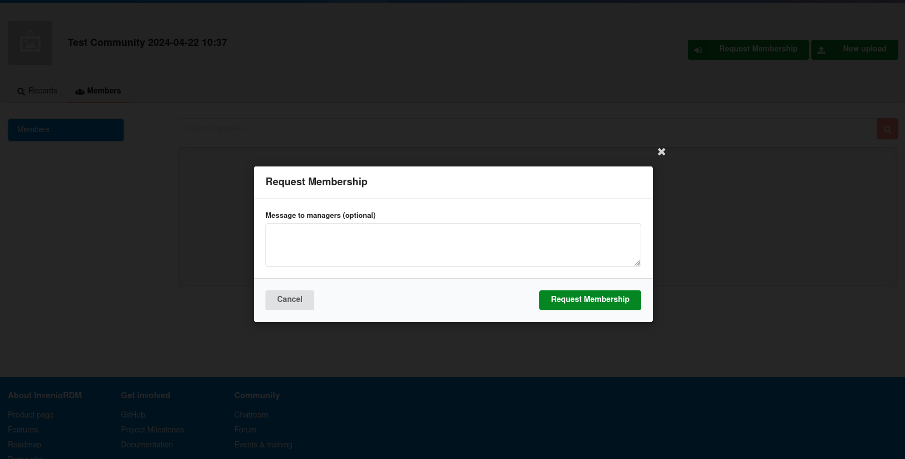
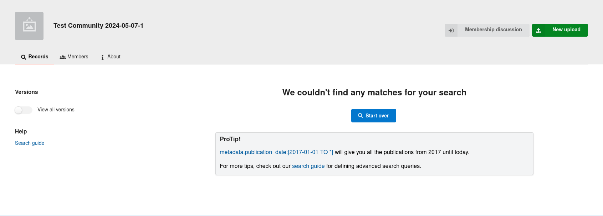
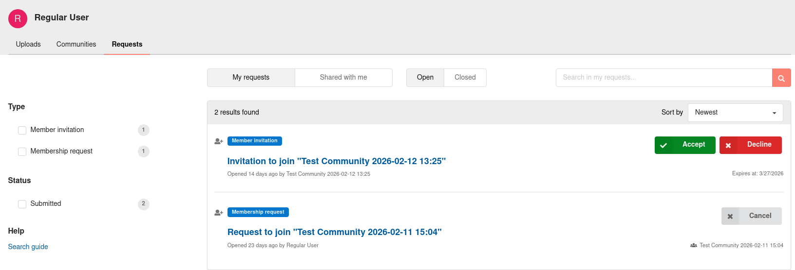
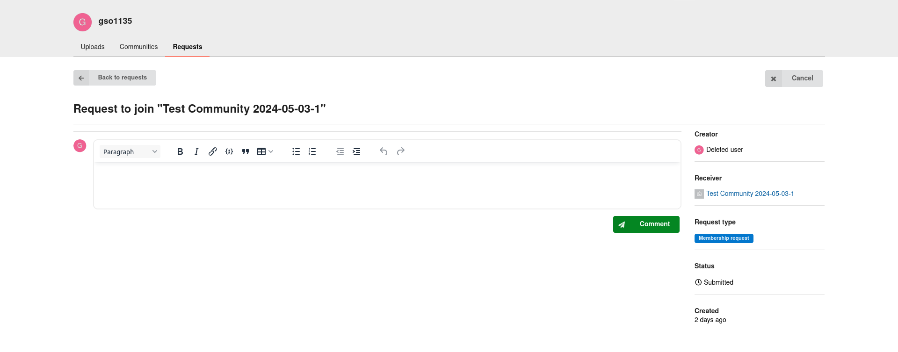

- Start Date: 2026-02-09
- RFC PR: [#109](https://github.com/inveniosoftware/rfcs/pull/109/)
- Authors: Guillaume Viger

# Membership request from users to join a community

## Summary

This RFC describes the workflow and implementation of requesting user membership to a community. It covers

- enabling the feature in an instance
- enabling the feature in a community
- requesting membership to a community
- waiting for a review (including cancelling)
- reviewing the request (accepting/declining)
- aftermath of a membership decision

## Motivation

- As a community manager, I want to control if my community can receive membership requests
- As a community manager, I want to let users take initiative in requesting adhesion rather than I pursuing them
- As a user (e.g., new lab member), I want to be able to join the communities I am interested in

## Detailed design

### Enable membership requests ...

#### ... in an instance

In your instance's `invenio.cfg`, set `COMMUNITIES_ALLOW_MEMBERSHIP_REQUESTS` to `True`:

```python
COMMUNITIES_ALLOW_MEMBERSHIP_REQUESTS = True
```

This is a feature flag to enable the feature. However, by default, communities will NOT allow membership requests unless a community manager also allows it for their community. This is done per below.

#### ... in a community

Community managers (members with the "Owner" or "Manager" roles), can change the community's membership policy to allow for other users to request to become part of the community. This setting only makes sense if the community's visibility is public, as otherwise a user wouldn't be able to find the community in the first place. It is deactivated otherwise.

The membership policy can be set in the "Privileges" section of the community's "Settings" tab. "Open" means the community is open to membership requests by users and "Closed" (the default) means it isn't. Only invited users can become part of the community in that latter scenario.




### Request membership to a community (request flow)

A user can only request membership to a community that has enabled it as per above and only if the user is not a member of the community already. The community header will have a "Request Membership" button to click to display a modal that will start the process. Further below we describe what displays instead when the current user has already submitted a request or has already been invited.


This button appears across all (public) community tabs.

That modal shows a textbox to write a message to the managers along with the button to truly create the request to join the community.



An email is sent to the community managers to alert them of the request.


### Wait for a membership review (wait flow)

The community header will show something different when waiting for a review.
If the user has already submitted a request or has already been invited, then that button will be a "Membership Discussion" link to the discussion page of the request. Note that a user that has already submitted a membership request to a community cannot be invited to that community. Only one such member request (membership request or invitation) can exist at a time.



This button appears across all (public) community tabs by passing the means to fetch any existing request (id) for a not-activated-yet member in an `app_context_processor`. This saves us from modifying the views for every single community page and especially the records tab view (community_detail view) that is NOT defined in invenio-communities but in invenio-app-rdm.

The membership request will also be accessible from a user's dashboard under the "Requests" tab/page:



On the above listing and on a request page proper, there is a "Cancel" button to display a modal to cancel the request.




### Review membership requests

For community managers, the submitted membership requests appear on the "Members" tab under the "Membership Requests" page:


They do not appear under the "Requests" tab.

The columns reprise the ones from the Invitations page. Each row includes the "Accept" and "Decline" action buttons for reviewers.
The role of the requester can also be changed from the dropdown.

The decision can be made on that listing or on the request's page. Like other requests, clicking "Accept/Decline" displays a modal to allow a message to be submitted with the decision. The decision is sent to the requester via email.

The "Membership discussion" button is then removed from the community header when the request is accepted.
If declined, the initial "Request Membership" button will show again. This follows from implementation - the Member entry in the database will have been deleted in case of decline and so no history. This is in keeping with what is done for Invitations.

## Additional resources

This issue contains much of the mockups and discussions: https://github.com/inveniosoftware/invenio-communities/issues/855 .

## How we teach this

The high-level idea of requesting to be part of a community is easily communicable. The details and InvenioRDM specificities for this kind of workflow will be documented in the main documentation.

## Alternatives

No alternatives thought.

## Unresolved questions
- Should "Request Membership" modal contain agreement checkboxes?
- Re-requests? Like Record submission
- Expiration? include or not
- Screenshot of settings to enable it on a community

## Out of scope
- This flow is only for parent communities. Sub-communities are not considered.

## Migration strategy
- To see
